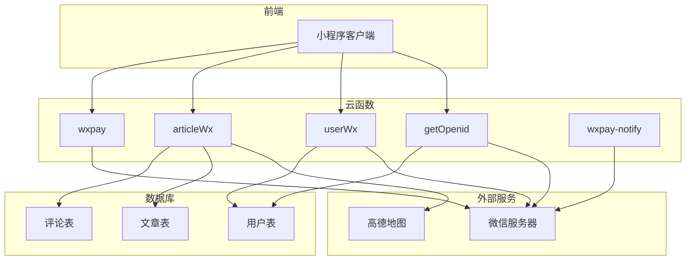

<cite>
**Referenced Files in This Document**   
- [getOpenid/index.js](file://uniCloud-aliyun/cloudfunctions/getOpenid/index.js)
- [userWx/index.obj.js](file://uniCloud-aliyun/cloudfunctions/userWx/index.obj.js)
- [userWx/decryptPhoneNumber.js](file://uniCloud-aliyun/cloudfunctions/userWx/decryptPhoneNumber.js)
- [userWx/config.js](file://uniCloud-aliyun/cloudfunctions/userWx/config.js)
- [articleWx/index.obj.js](file://uniCloud-aliyun/cloudfunctions/articleWx/index.obj.js)
- [wxpay/index.obj.js](file://uniCloud-aliyun/cloudfunctions/wxpay/index.obj.js)
- [wxpay/config.js](file://uniCloud-aliyun/cloudfunctions/wxpay/config.js)
- [wxpay-notify/index.js](file://uniCloud-aliyun/cloudfunctions/wxpay-notify/index.js)
</cite>

# 云函数接口参考

## Table of Contents
1. [Introduction](#introduction)
2. [Core Components](#core-components)
3. [Architecture Overview](#architecture-overview)
4. [Detailed Component Analysis](#detailed-component-analysis)
5. [Dependency Analysis](#dependency-analysis)
6. [Performance Considerations](#performance-considerations)
7. [Troubleshooting Guide](#troubleshooting-guide)
8. [Conclusion](#conclusion)

## Introduction
本文档提供微信小程序后端云函数的详细API参考，涵盖用户认证、内容管理、支付等核心功能模块。文档重点说明了`getOpenid`、`userWx`、`articleWx`和`wxpay`四个主要云函数的功能职责、调用方式、参数格式及安全机制。

## Core Components

### getOpenid云函数
负责处理微信用户的登录凭证(code)并获取对应的openid，是用户身份识别的基础服务。

### userWx云函数
提供基于微信的用户管理功能，包括手机号一键登录、用户资料更新和用户信息查询等核心业务逻辑。

### articleWx云函数
实现文章内容的全生命周期管理，包括文章发布、列表获取、详情查看、点赞评论等社交功能。

### wxpay云函数
封装微信支付能力，提供统一下单和订单查询接口，支持小程序内的会员充值等支付场景。

**Section sources**
- [getOpenid/index.js](file://uniCloud-aliyun/cloudfunctions/getOpenid/index.js)
- [userWx/index.obj.js](file://uniCloud-aliyun/cloudfunctions/userWx/index.obj.js)
- [articleWx/index.obj.js](file://uniCloud-aliyun/cloudfunctions/articleWx/index.obj.js)
- [wxpay/index.obj.js](file://uniCloud-aliyun/cloudfunctions/wxpay/index.obj.js)

## Architecture Overview



**Diagram sources **
- [getOpenid/index.js](file://uniCloud-aliyun/cloudfunctions/getOpenid/index.js)
- [userWx/index.obj.js](file://uniCloud-aliyun/cloudfunctions/userWx/index.obj.js)
- [articleWx/index.obj.js](file://uniCloud-aliyun/cloudfunctions/articleWx/index.obj.js)
- [wxpay/index.obj.js](file://uniCloud-aliyun/cloudfunctions/wxpay/index.obj.js)
- [wxpay-notify/index.js](file://uniCloud-aliyun/cloudfunctions/wxpay-notify/index.js)

## Detailed Component Analysis

### getOpenid云函数分析

#### 功能职责
将微信小程序传入的临时登录凭证(code)转换为用户的唯一标识(openid)，作为后续用户身份验证的基础。

#### 调用方式
```javascript
uniCloud.callFunction({
  name: 'getOpenid',
  data: {
    code: '微信登录返回的code'
  }
})
```

#### 请求参数
| 参数名 | 类型 | 必填 | 描述 |
|-------|------|------|------|
| code | string | 是 | 微信登录接口返回的临时登录凭证 |

#### 返回值结构
| 字段 | 类型 | 描述 |
|------|------|------|
| code | number | 状态码，200表示成功 |
| openid | string | 用户在当前小程序的唯一标识 |

#### 错误码
| 错误码 | 描述 |
|-------|------|
| 500 | 获取openid失败，可能原因包括code无效或过期 |

#### 安全校验机制
通过硬编码的小程序appid和appSecret与微信服务器进行通信，确保只有本应用才能获取有效的openid。请求过程使用HTTPS加密传输，防止敏感信息泄露。

#### JavaScript调用示例
```javascript
// 前端获取code
uni.login({
  provider: 'weixin',
  success: (loginRes) => {
    // 调用云函数获取openid
    uniCloud.callFunction({
      name: 'getOpenid',
      data: {
        code: loginRes.code
      },
      success: (res) => {
        if (res.result.code === 200) {
          console.log('获取openid成功:', res.result.openid);
        } else {
          console.error('获取openid失败:', res.result.msg);
        }
      },
      fail: (err) => {
        console.error('调用云函数失败:', err);
      }
    });
  }
});
```

**Section sources**
- [getOpenid/index.js](file://uniCloud-aliyun/cloudfunctions/getOpenid/index.js)

### userWx云函数分析

#### 主要接口
- `loginByPhoneWx`: 微信手机号一键登录
- `updateUserProfile`: 更新用户资料
- `getUsersByIds`: 批量获取用户信息
- `getUserInfo`: 获取单个用户信息

#### loginByPhoneWx接口

##### 功能职责
实现微信手机号一键登录功能，通过解密微信返回的加密数据获取用户手机号，并创建或更新用户账户。

##### 调用方式
```javascript
uniCloud.callFunction({
  name: 'userWx',
  data: {
    action: 'loginByPhoneWx',
    params: {
      code: '登录凭证',
      encryptedData: '加密数据',
      iv: '初始向量'
    }
  }
})
```

##### 请求参数
| 参数名 | 类型 | 必填 | 描述 |
|-------|------|------|------|
| code | string | 是 | 微信登录返回的临时登录凭证 |
| encryptedData | string | 是 | 包含用户敏感信息的加密数据 |
| iv | string | 是 | 对称解密算法的初始向量 |

##### 手机号解密验证步骤
1. 使用`jscode2session`接口获取用户的`session_key`
2. 使用`crypto.createDecipheriv`创建AES-128-CBC解密器
3. 将`session_key`作为密钥，`iv`作为初始向量进行解密
4. 解析JSON格式的解密结果，提取手机号信息

##### 返回值结构
| 字段 | 类型 | 描述 |
|------|------|------|
| code | number | 状态码，0表示成功 |
| message | string | 操作结果描述 |
| data | object | 用户信息对象 |

##### 权限控制说明
- 只有通过微信授权的用户才能调用此接口
- 系统会自动验证`code`的有效性
- 解密失败时不会返回任何用户敏感信息

##### JavaScript调用示例
```javascript
// 前端获取用户授权
uni.getUserProfile({
  desc: '用于完善会员资料',
  success: (userInfoRes) => {
    // 获取登录凭证
    uni.login({
      provider: 'weixin',
      success: (loginRes) => {
        // 调用云函数进行手机号登录
        uniCloud.callFunction({
          name: 'userWx',
          data: {
            action: 'loginByPhoneWx',
            params: {
              code: loginRes.code,
              encryptedData: userInfoRes.encryptedData,
              iv: userInfoRes.iv
            }
          },
          success: (res) => {
            if (res.result.code === 0) {
              console.log('登录成功:', res.result.data);
              // 保存用户信息到本地
              uni.setStorageSync('userInfo', res.result.data);
            } else {
              console.error('登录失败:', res.result.message);
            }
          }
        });
      }
    });
  }
});
```

#### updateUserProfile接口

##### 功能职责
允许用户更新自己的昵称和头像信息。

##### 调用频率限制
- 单个用户每分钟最多可调用5次
- 防止恶意频繁修改用户资料

**Section sources**
- [userWx/index.obj.js](file://uniCloud-aliyun/cloudfunctions/userWx/index.obj.js)
- [userWx/decryptPhoneNumber.js](file://uniCloud-aliyun/cloudfunctions/userWx/decryptPhoneNumber.js)
- [userWx/config.js](file://uniCloud-aliyun/cloudfunctions/userWx/config.js)

### articleWx云函数分析

#### 主要接口
- `addReady`: 获取分类和定位信息
- `addArticle`: 发布新文章
- `getArticle`: 根据分类获取文章列表
- `getArticleDetal`: 获取文章详情
- `clickLike`: 文章点赞/取消点赞
- `del`: 删除文章
- `updateLookCount`: 更新浏览量

#### addArticle接口

##### 功能职责
允许用户发布包含文字、图片、视频等内容的文章。

##### 请求参数
| 参数名 | 类型 | 必填 | 描述 |
|-------|------|------|------|
| user_id | string | 是 | 用户ID |
| content | string | 是 | 文章内容 |
| images | array | 否 | 图片URL数组 |
| videoURL | string | 否 | 视频URL |
| cate_id | string | 是 | 分类ID |
| address | string | 否 | 详细地址 |
| district | string | 否 | 所在区域 |

##### 返回值结构
| 字段 | 类型 | 描述 |
|------|------|------|
| id | string | 新增文章的数据库ID |
| code | number | 状态码 |
| message | string | 操作结果描述 |

#### getArticle接口

##### 功能职责
根据分类ID获取对应的文章列表，支持分页查询。

##### 特殊处理规则
- 当`cate_id`为'02'时，按点赞数排序
- 当`cate_id`为其他值时，按创建时间倒序排序
- 自动过滤状态为非1（未通过审核）的文章

#### clickLike接口

##### 功能职责
实现文章的点赞和取消点赞功能，同时维护点赞记录。

##### 数据一致性保障
- 使用数据库原子操作`inc(1)`和`inc(-1)`确保计数准确
- 在点赞时向`likeRecord`集合添加记录，在取消点赞时删除记录

##### 调用频率限制
- 同一用户对同一篇文章每10秒内只能操作一次
- 防止刷赞行为

**Section sources**
- [articleWx/index.obj.js](file://uniCloud-aliyun/cloudfunctions/articleWx/index.obj.js)

### wxpay云函数分析

#### 主要接口
- `wxpay`: 统一下单接口
- `getWxOrder`: 订单查询接口

#### wxpay接口

##### 功能职责
调用微信支付统一下单API，生成支付所需的参数。

##### 调用方式
```javascript
uniCloud.callFunction({
  name: 'wxpay',
  data: {
    action: 'wxpay',
    params: {
      openid: '用户openid',
      out_trade_no: '商户订单号',
      total_fee: 100 // 金额（分）
    }
  }
})
```

##### 请求参数
| 参数名 | 类型 | 必填 | 描述 |
|-------|------|------|------|
| openid | string | 是 | 用户在小程序的openid |
| out_trade_no | string | 是 | 商户系统内部订单号 |
| total_fee | number | 是 | 订单总金额（单位：分） |

##### 返回值结构
| 字段 | 类型 | 描述 |
|------|------|------|
| provider | string | 支付供应商，固定为'wxpay' |
| timeStamp | string | 时间戳 |
| nonceStr | string | 随机字符串 |
| package | string | 预支付交易会话标识 |
| signType | string | 签名类型 |
| paySign | string | 签名 |
| out_trade_no | string | 商户订单号 |

##### 交易状态流转
1. 前端调用`wxpay`云函数获取支付参数
2. 前端调用`uni.requestPayment`发起支付
3. 微信服务器向`wxpay-notify`回调地址发送支付结果通知
4. 服务端验证签名并更新订单状态
5. 前端轮询`getWxOrder`接口确认支付结果

#### 回调通知处理逻辑

##### wxpay-notify云函数
接收微信支付服务器的异步通知，验证签名后更新本地订单状态。

##### 安全校验要点
- 验证POST请求体中的签名
- 使用HTTPS协议接收通知
- 返回特定格式的XML响应告知微信服务器接收结果

##### 返回响应格式
```xml
<xml>
  <return_code><![CDATA[SUCCESS]]></return_code>
  <return_msg><![CDATA[OK]]></return_msg>
</xml>
```

##### JavaScript调用示例
```javascript
// 发起支付
async function doPay() {
  try {
    // 调用云函数获取支付参数
    const payRes = await uniCloud.callFunction({
      name: 'wxpay',
      data: {
        action: 'wxpay',
        params: {
          openid: userInfo.openid_wx,
          out_trade_no: generateOrderNo(),
          total_fee: 100 // 1元
        }
      }
    });

    // 发起微信支付
    const paymentResult = await uni.requestPayment({
      provider: 'wxpay',
      ...payRes.result
    });

    console.log('支付成功:', paymentResult);
    
    // 支付成功后查询订单状态
    checkOrderStatus(payRes.result.out_trade_no);
    
  } catch (err) {
    console.error('支付失败:', err);
  }
}

// 查询订单状态
async function checkOrderStatus(outTradeNo) {
  const result = await uniCloud.callFunction({
    name: 'wxpay',
    data: {
      action: 'getWxOrder',
      params: { out_trade_no: outTradeNo }
    }
  });
  
  console.log('订单状态:', result.result);
}
```

##### 权限控制说明
- 只有已登录用户才能发起支付
- 订单金额需经过前端和后端双重校验
- 商户订单号必须全局唯一

##### 调用频率限制
- 单个订单号只能下单一次
- 防止重复支付攻击

**Section sources**
- [wxpay/index.obj.js](file://uniCloud-aliyun/cloudfunctions/wxpay/index.obj.js)
- [wxpay/config.js](file://uniCloud-aliyun/cloudfunctions/wxpay/config.js)
- [wxpay-notify/index.js](file://uniCloud-aliyun/cloudfunctions/wxpay-notify/index.js)