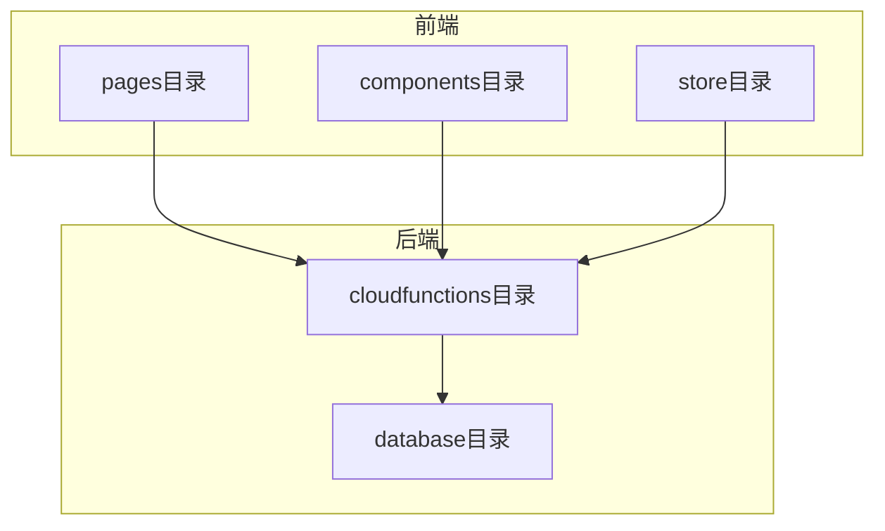
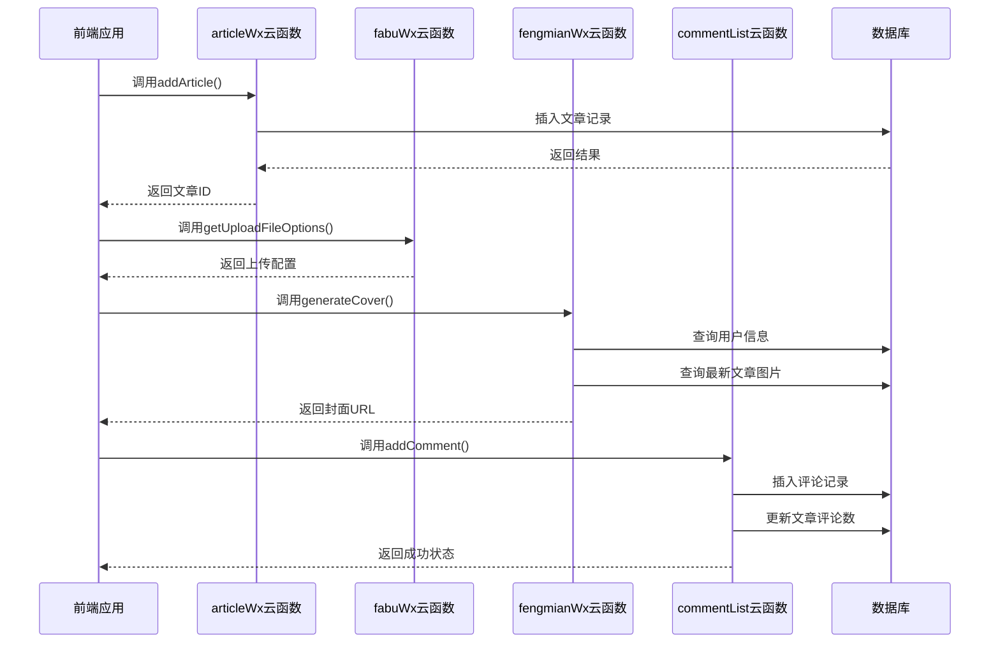
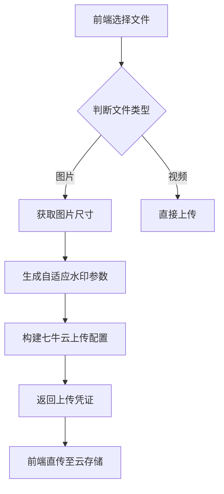
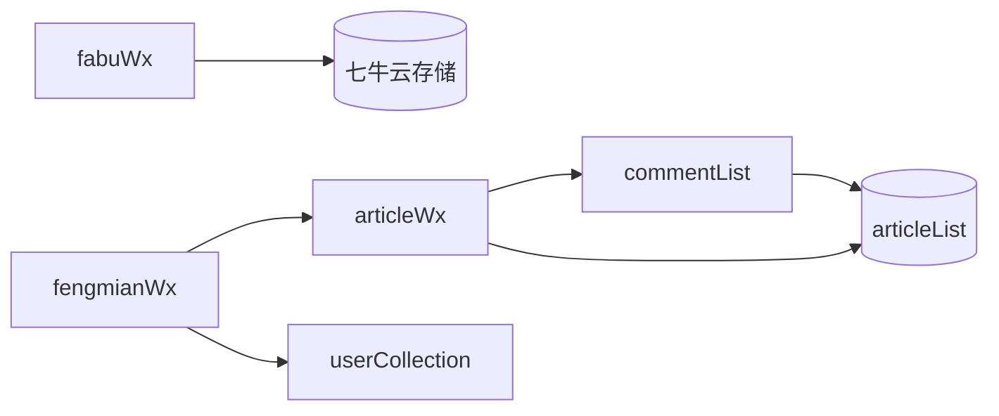

# 内容管理接口

<cite>
**本文档引用的文件**
- [articleWx/index.obj.js](file://uniCloud-aliyun/cloudfunctions/articleWx/index.obj.js)
- [fabuWx/index.obj.js](file://uniCloud-aliyun/cloudfunctions/fabuWx/index.obj.js)
- [fengmianWx/index.obj.js](file://uniCloud-aliyun/cloudfunctions/fengmianWx/index.obj.js)
- [commentList/index.obj.js](file://uniCloud-aliyun/cloudfunctions/commentList/index.obj.js)
- [articleList.schema.json](file://uniCloud-aliyun/database/articleList.schema.json)
- [commentList.schema.json](file://uniCloud-aliyun/database/commentList.schema.json)
</cite>

## 目录
1. [简介](#简介)
2. [项目结构](#项目结构)
3. [核心组件](#核心组件)
4. [架构概览](#架构概览)
5. [详细组件分析](#详细组件分析)
6. [依赖分析](#依赖分析)
7. [性能考虑](#性能考虑)
8. [故障排除指南](#故障排除指南)
9. [结论](#结论)

## 简介
本文档详细说明了内容管理类云函数的API接口，重点涵盖文章发布、查询、更新和删除功能（`articleWx`），多媒体上传与提交逻辑（`fabuWx`），封面图处理机制（`fengmianWx`）以及评论增删改查功能（`commentList`）。文档明确了每个接口的请求参数结构、返回数据格式及错误码，并提供前端调用示例。

## 项目结构
本项目采用模块化设计，主要分为前端页面、组件、状态管理和云函数后端服务。云函数部署在uniCloud阿里云环境中，负责处理业务逻辑和数据库操作。



**图表来源**
- [project_structure](file://README.md#L1-L50)

## 核心组件

本文档聚焦于四个核心云函数：`articleWx`用于文章全生命周期管理；`fabuWx`处理媒体文件上传；`fengmianWx`生成用户个性化封面；`commentList`实现评论系统功能。

**章节来源**
- [articleWx/index.obj.js](file://uniCloud-aliyun/cloudfunctions/articleWx/index.obj.js#L1-L50)
- [fabuWx/index.obj.js](file://uniCloud-aliyun/cloudfunctions/fabuWx/index.obj.js#L1-L50)
- [fengmianWx/index.obj.js](file://uniCloud-aliyun/cloudfunctions/fengmianWx/index.obj.js#L1-L50)
- [commentList/index.obj.js](file://uniCloud-aliyun/cloudfunctions/commentList/index.obj.js#L1-L50)

## 架构概览
系统采用前后端分离架构，前端通过uniCloud.callFunction调用云端逻辑，云函数访问数据库完成数据持久化。



**图表来源**
- [articleWx/index.obj.js](file://uniCloud-aliyun/cloudfunctions/articleWx/index.obj.js#L150-L200)
- [fabuWx/index.obj.js](file://uniCloud-aliyun/cloudfunctions/fabuWx/index.obj.js#L200-L250)
- [fengmianWx/index.obj.js](file://uniCloud-aliyun/cloudfunctions/fengmianWx/index.obj.js#L50-L100)
- [commentList/index.obj.js](file://uniCloud-aliyun/cloudfunctions/commentList/index.obj.js#L100-L150)

## 详细组件分析

### articleWx 文章管理接口

#### 接口列表
| 接口名称 | 功能描述 | 请求方式 |
|--------|--------|--------|
| addArticle | 发布新文章 | POST |
| getArticle | 获取文章列表 | GET |
| getArticleDetal | 获取文章详情 | GET |
| updateArticle | 更新文章 | PUT |
| del | 删除文章 | DELETE |

#### 请求参数结构（addArticle）
```json
{
  "user_id": "用户ID",
  "content": "文章内容",
  "images": ["图片URL数组"],
  "videoURL": "视频地址",
  "cate_id": "分类ID",
  "address": "发布地址",
  "district": "区县",
  "user_nickName": "昵称",
  "user_avatarUrl": "头像URL",
  "pay_amount": 0,
  "is_location_based_category": false
}
```

#### 返回数据格式
```json
{
  "code": 0,
  "message": "成功",
  "data": {
    "_id": "文章ID",
    "create_time": "创建时间戳"
  }
}
```

#### 错误码说明
| 错误码 | 含义 | 解决方案 |
|------|-----|-------|
| -1 | 参数不完整或无效 | 检查必填字段是否齐全 |
| PARAM_IS_NULL | 用户ID为空 | 确保已登录并传递正确用户ID |
| CONTENT_EMPTY | 内容不能为空 | 输入有效文章内容 |

#### 前端调用示例
```javascript
uniCloud.callFunction({
  name: 'articleWx',
  data: {
    action: 'addArticle',
    params: {
      user_id: '123',
      content: '测试内容',
      images: [],
      cate_id: '01'
    }
  }
}).then(res => {
  console.log('发布成功:', res.result);
}).catch(err => {
  console.error('发布失败:', err);
});
```

**章节来源**
- [articleWx/index.obj.js](file://uniCloud-aliyun/cloudfunctions/articleWx/index.obj.js#L150-L790)

### fabuWx 多媒体上传接口

#### 主要功能
- 支持图片和视频文件上传
- 自动生成带水印的压缩图和缩略图
- 支持按区域自动创建分类

#### 文件上传流程


#### getUploadFileOptions参数
| 参数名 | 类型 | 必填 | 说明 |
|-------|-----|-----|-----|
| cloudPath | string | 是 | 文件路径 |
| fileType | string | 否 | 文件类型(image/video) |
| imageWidth | number | 否 | 图片宽度 |
| imageHeight | number | 否 | 图片高度 |

#### 返回值包含
- uploadFileToken: 上传凭证
- fileURL: 原始文件URL
- compressedURL: 压缩图URL
- thumbnailURL: 缩略图URL

**章节来源**
- [fabuWx/index.obj.js](file://uniCloud-aliyun/cloudfunctions/fabuWx/index.obj.js#L1-L700)

### fengmianWx 封面图处理接口

#### 功能说明
根据用户信息和最新文章图片生成个性化封面。

#### 接口方法
| 方法名 | 参数 | 返回值 |
|------|-----|-------|
| generateCover | userId | 封面图片URL |
| getCoverData | userId | 生成封面所需数据 |

#### 数据获取流程
1. 验证用户ID有效性
2. 查询用户基本信息
3. 获取用户最新文章的图片
4. 组合数据生成封面或返回前端渲染

#### 响应格式
```json
{
  "errCode": 0,
  "errMsg": "封面生成成功",
  "success": true,
  "coverImageUrl": "https://example.com/cover.jpg"
}
```

**章节来源**
- [fengmianWx/index.obj.js](file://uniCloud-aliyun/cloudfunctions/fengmianWx/index.obj.js#L1-L240)

### commentList 评论管理接口

#### CRUD操作支持
| 操作 | 方法 | 权限要求 |
|-----|------|---------|
| 创建 | addComment | 登录用户 |
| 读取 | getCommentList | 公开访问 |
| 更新 | likeComment | 登录用户 |
| 删除 | delComment | 作者或管理员 |

#### 分页查询实现
通过skip和limit实现分页：
```javascript
.skip((pageNo - 1) * pageSize).limit(pageSize)
```

#### 性能优化建议
- 对article_id建立索引
- 使用投影减少传输数据量
- 合理设置缓存策略

#### 前端调用示例
```javascript
uniCloud.callFunction({
  name: 'commentList',
  data: {
    action: 'addComment',
    commentData: {
      article_id: 'art_123',
      user_id: 'usr_456',
      content: '很好！',
      nickName: '张三'
    }
  }
})
```

**章节来源**
- [commentList/index.obj.js](file://uniCloud-aliyun/cloudfunctions/commentList/index.obj.js#L1-L230)

## 依赖分析
各云函数之间存在明确的职责划分，通过统一的数据结构进行交互。



**图表来源**
- [articleWx/index.obj.js](file://uniCloud-aliyun/cloudfunctions/articleWx/index.obj.js#L10-L20)
- [commentList/index.obj.js](file://uniCloud-aliyun/cloudfunctions/commentList/index.obj.js#L10-L20)

## 性能考虑
为确保系统高效运行，建议采取以下措施：

1. **数据库索引**：在常用查询字段如`article_id`、`user_id`上建立索引
2. **分页优化**：使用合理的pageSize避免一次性加载过多数据
3. **缓存策略**：对频繁访问但不常变更的数据实施缓存
4. **批量操作**：合并多个小操作为批量处理以减少网络开销
5. **资源压缩**：利用云存储的图片处理能力降低传输体积

对于高并发场景，可考虑引入redis等内存数据库做热点数据缓存。

## 故障排除指南
常见问题及其解决方案：

| 问题现象 | 可能原因 | 解决方法 |
|--------|--------|--------|
| 无法上传文件 | 文件类型不受支持 | 检查扩展名是否在允许列表中 |
| 评论提交失败 | 缺少必要参数 | 确认user_id和content已正确传递 |
| 封面生成空白 | 用户无文章数据 | 提示用户先发布内容再生成封面 |
| 文章查询缓慢 | 未使用索引 | 在数据库控制台添加相应索引 |

调试时可通过查看云函数日志定位具体错误信息。

**章节来源**
- [articleWx/index.obj.js](file://uniCloud-aliyun/cloudfunctions/articleWx/index.obj.js#L700-L790)
- [fabuWx/index.obj.js](file://uniCloud-aliyun/cloudfunctions/fabuWx/index.obj.js#L650-L700)

## 结论
本文档全面介绍了内容管理系统的核心API接口。通过合理使用这些云函数，可以快速构建功能完整的文章发布与互动平台。建议开发者遵循文档中的最佳实践，注意权限控制和性能优化，确保系统的稳定性和用户体验。