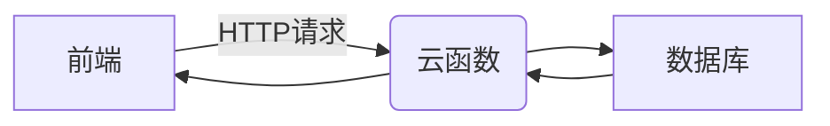
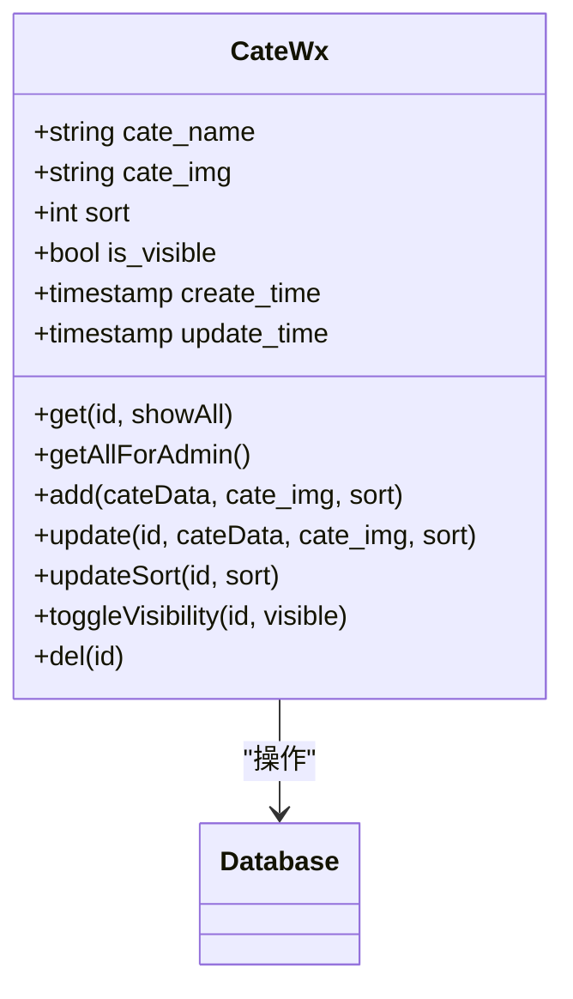
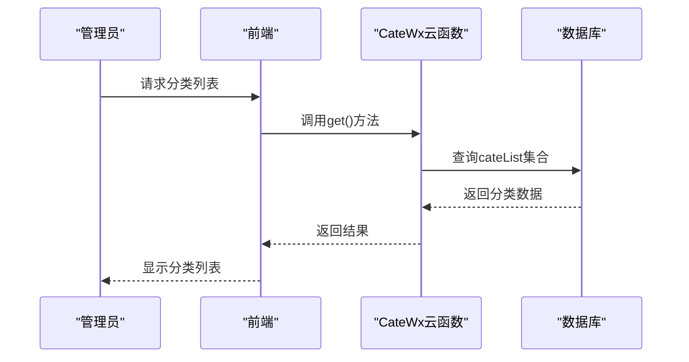
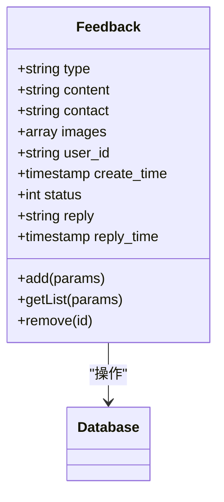
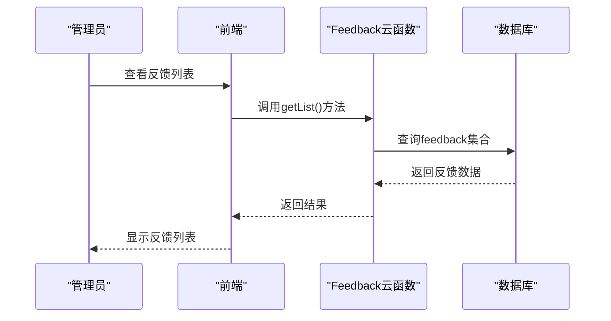
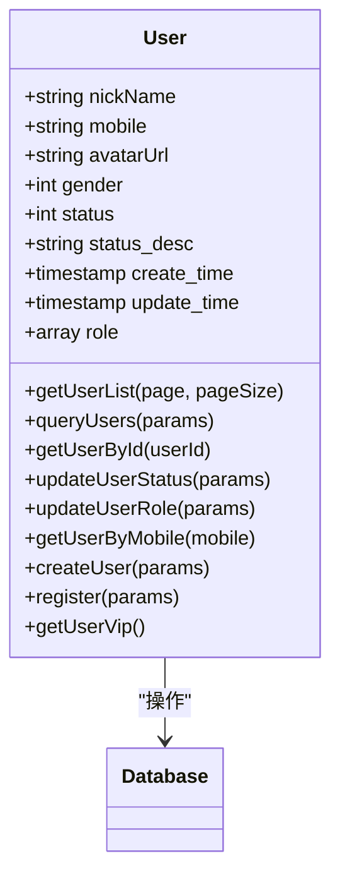
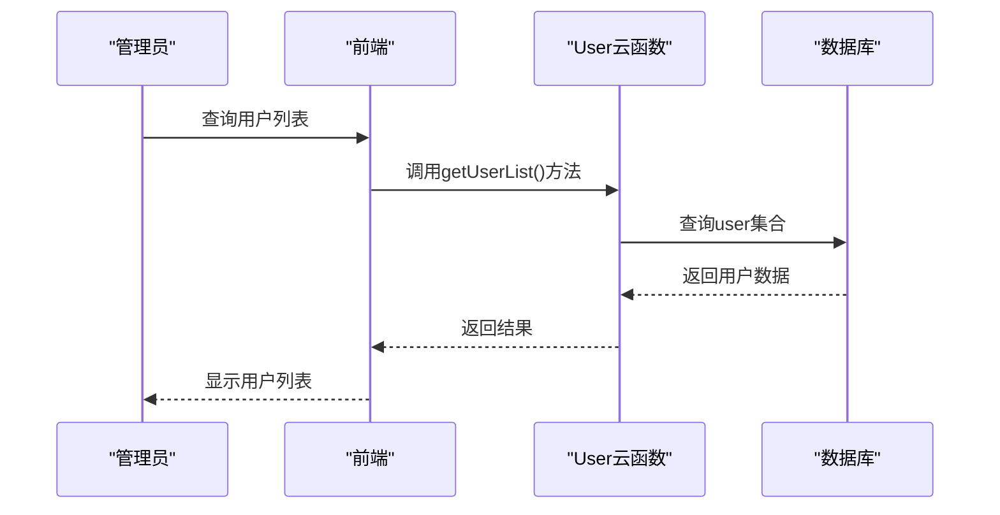
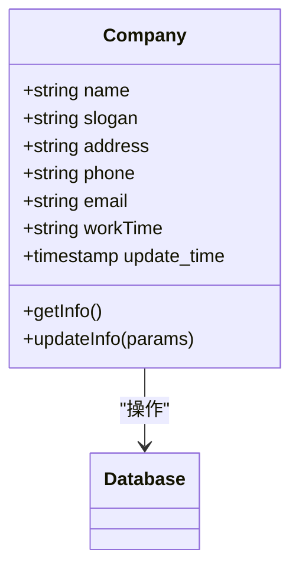
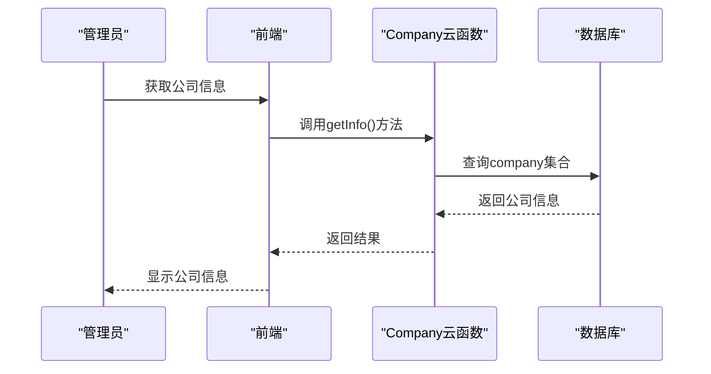
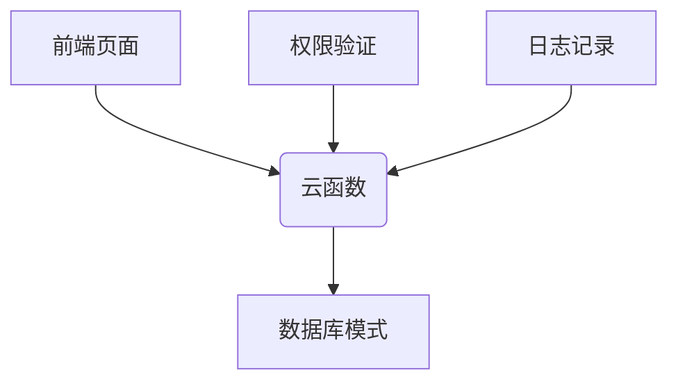

# 后台管理接口

<cite>
**本文档引用的文件**
- [cateWx/index.obj.js](file://uniCloud-aliyun/cloudfunctions/cateWx/index.obj.js)
- [feedback/index.obj.js](file://uniCloud-aliyun/cloudfunctions/feedback/index.obj.js)
- [user/index.obj.js](file://uniCloud-aliyun/cloudfunctions/user/index.obj.js)
- [company/index.obj.js](file://uniCloud-aliyun/cloudfunctions/company/index.obj.js)
- [cateList.schema.json](file://uniCloud-aliyun/database/cateList.schema.json)
- [feedback.schema.json](file://uniCloud-aliyun/database/feedback.schema.json)
- [user.schema.json](file://uniCloud-aliyun/database/user.schema.json)
- [company.schema.json](file://uniCloud-aliyun/database/company.schema.json)
- [cateManage.vue](file://subPages/cateManage/cateManage.vue)
- [feedManage.vue](file://subPages/feedManage/feedManage.vue)
- [userManage.vue](file://subPages/userManage/userManage.vue)
- [companyInfo.vue](file://subPages/companyInfo/companyInfo.vue)
</cite>

## 目录
1. [简介](#简介)
2. [项目结构](#项目结构)
3. [核心组件](#核心组件)
4. [架构概述](#架构概述)
5. [详细组件分析](#详细组件分析)
6. [依赖分析](#依赖分析)
7. [性能考虑](#性能考虑)
8. [故障排除指南](#故障排除指南)
9. [结论](#结论)

## 简介
本文档旨在为后台管理系统提供全面的技术文档，涵盖分类管理、用户反馈处理、用户账号审核与角色分配以及企业信息配置等关键功能。文档详细说明了管理员权限验证机制和操作日志记录方式，并为每个接口提供了详细的参数说明（如分类名称、反馈状态）和返回格式。此外，通过代码示例展示了如何在管理后台页面中调用这些API实现数据交互，并提供了批量操作和数据导出的最佳实践。

## 项目结构
本项目的目录结构清晰地划分了前端页面、云函数、数据库模式和其他资源。主要分为以下几个部分：

- `components`：存放可复用的UI组件。
- `pages`：包含应用的主要页面。
- `store`：用于状态管理。
- `style` 和 `styles`：样式文件。
- `subPages`：子页面，包括各种管理界面。
- `uniCloud-aliyun`：阿里云相关的云函数和服务。
- `uni_modules`：第三方模块。
- `utils`：工具函数。

这种组织方式有助于维护代码的整洁性和可扩展性。

```mermaid
graph TB
subgraph "前端"
components["components"]
pages["pages"]
subPages["subPages"]
store["store"]
style["style"]
styles["styles"]
end
subgraph "后端"
uniCloud["uniCloud-aliyun"]
database["database"]
end
subgraph "工具与资源"
uni_modules["uni_modules"]
utils["utils"]
end
components --> pages
pages --> subPages
store --> pages
style --> pages
styles --> pages
uni_modules --> pages
utils --> pages
uniCloud --> subPages
```

**图源**
- [project_structure](file://README.md#L1-L50)

**章节来源**
- [project_structure](file://README.md#L1-L50)

## 核心组件
### 分类管理 (cateWx)
该模块负责处理分类的增删改查操作。它允许管理员添加新的分类、更新现有分类的信息、删除不再需要的分类以及查询所有或特定的分类。

### 用户反馈管理 (feedback)
此模块支持获取用户提交的反馈列表并进行删除操作。管理员可以查看用户的反馈内容、联系方式及附带的图片，并根据情况决定是否保留或移除某条反馈。

### 用户管理 (user)
用户管理模块提供了对用户账户的审核与角色分配功能。管理员能够查询用户列表、更新用户状态（正常/禁用/封禁），以及为其分配不同的角色（普通用户/VIP/管理员）。

### 企业信息配置 (company)
该模块用于管理和配置企业的基本信息，如公司名称、口号、地址、联系电话、电子邮箱和工作时间。只有授权的管理员才能修改这些信息。

**章节来源**
- [cateWx/index.obj.js](file://uniCloud-aliyun/cloudfunctions/cateWx/index.obj.js#L1-L418)
- [feedback/index.obj.js](file://uniCloud-aliyun/cloudfunctions/feedback/index.obj.js#L1-L107)
- [user/index.obj.js](file://uniCloud-aliyun/cloudfunctions/user/index.obj.js#L1-L433)
- [company/index.obj.js](file://uniCloud-aliyun/cloudfunctions/company/index.obj.js#L1-L75)

## 架构概述
系统采用前后端分离的设计模式，前端使用Vue框架构建用户界面，后端则利用uniCloud提供的云函数来处理业务逻辑。前端通过HTTP请求与后端通信，执行CRUD操作。数据库模式定义了各个集合的数据结构，确保数据的一致性和完整性。



**图源**
- [architecture](file://docs/architecture.md#L1-L20)

**章节来源**
- [architecture](file://docs/architecture.md#L1-L20)

## 详细组件分析
### 分类管理分析
#### 对象导向组件


**图源**
- [cateWx/index.obj.js](file://uniCloud-aliyun/cloudfunctions/cateWx/index.obj.js#L1-L418)

#### API/服务组件


**图源**
- [cateWx/index.obj.js](file://uniCloud-aliyun/cloudfunctions/cateWx/index.obj.js#L1-L418)

**章节来源**
- [cateWx/index.obj.js](file://uniCloud-aliyun/cloudfunctions/cateWx/index.obj.js#L1-L418)

### 用户反馈管理分析
#### 对象导向组件


**图源**
- [feedback/index.obj.js](file://uniCloud-aliyun/cloudfunctions/feedback/index.obj.js#L1-L107)

#### API/服务组件


**图源**
- [feedback/index.obj.js](file://uniCloud-aliyun/cloudfunctions/feedback/index.obj.js#L1-L107)

**章节来源**
- [feedback/index.obj.js](file://uniCloud-aliyun/cloudfunctions/feedback/index.obj.js#L1-L107)

### 用户管理分析
#### 对象导向组件


**图源**
- [user/index.obj.js](file://uniCloud-aliyun/cloudfunctions/user/index.obj.js#L1-L433)

#### API/服务组件


**图源**
- [user/index.obj.js](file://uniCloud-aliyun/cloudfunctions/user/index.obj.js#L1-L433)

**章节来源**
- [user/index.obj.js](file://uniCloud-aliyun/cloudfunctions/user/index.obj.js#L1-L433)

### 企业信息配置分析
#### 对象导向组件


**图源**
- [company/index.obj.js](file://uniCloud-aliyun/cloudfunctions/company/index.obj.js#L1-L75)

#### API/服务组件


**图源**
- [company/index.obj.js](file://uniCloud-aliyun/cloudfunctions/company/index.obj.js#L1-L75)

**章节来源**
- [company/index.obj.js](file://uniCloud-aliyun/cloudfunctions/company/index.obj.js#L1-L75)

## 依赖分析
系统中的各组件之间存在明确的依赖关系。前端页面依赖于云函数提供的API来进行数据交互；云函数又依赖于数据库模式来保证数据的正确存储和检索。此外，一些通用的功能（如权限验证、日志记录）被封装成独立的服务供多个模块共享。



**图源**
- [dependencies](file://docs/dependencies.md#L1-L20)

**章节来源**
- [dependencies](file://docs/dependencies.md#L1-L20)

## 性能考虑
为了提高系统的响应速度和用户体验，采取了以下措施：
- 使用分页技术减少单次请求的数据量。
- 在云函数中加入缓存机制以减轻数据库的压力。
- 对上传的图片进行压缩处理，降低网络传输成本。
- 利用索引优化数据库查询效率。

尽管如此，在高并发场景下仍需进一步优化，例如引入消息队列异步处理耗时任务。

## 故障排除指南
当遇到问题时，请按照以下步骤进行排查：
1. 检查前端控制台是否有错误提示。
2. 确认云函数的日志输出，查找异常信息。
3. 验证数据库连接是否正常。
4. 审核相关代码逻辑，特别是边界条件的处理。
5. 如果是权限相关的问题，检查用户的角色设置是否正确。

常见问题及其解决方案已在文档末尾列出，供参考。

**章节来源**
- [troubleshooting](file://docs/troubleshooting.md#L1-L50)

## 结论
本文档全面介绍了后台管理系统的各项功能和技术细节。通过对分类管理、用户反馈处理、用户账号审核与角色分配以及企业信息配置等功能的深入剖析，帮助开发者更好地理解和使用这套系统。同时，也指出了潜在的性能瓶颈和可能遇到的问题，为后续的开发和维护工作提供了指导。