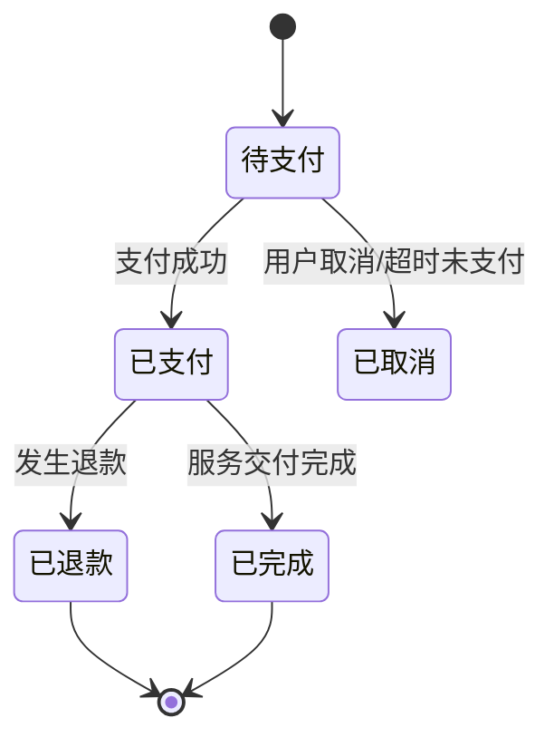
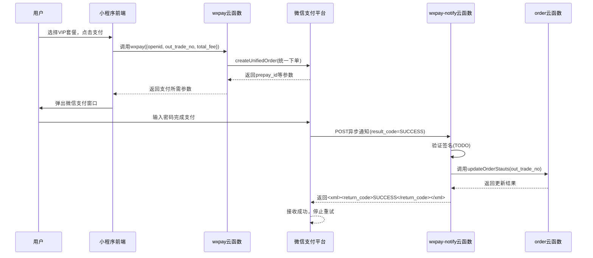

# 支付系统接口

<cite>
**Referenced Files in This Document **   
- [index.obj.js](file://uniCloud-aliyun/cloudfunctions/wxpay/index.obj.js)
- [config.js](file://uniCloud-aliyun/cloudfunctions/wxpay/config.js)
- [index.obj.js](file://uniCloud-aliyun/cloudfunctions/rechargeVip/index.obj.js)
- [index.obj.js](file://uniCloud-aliyun/cloudfunctions/order/index.obj.js)
- [order.schema.json](file://uniCloud-aliyun/database/order.schema.json)
- [vipRechargePro.schema.json](file://uniCloud-aliyun/database/vipRechargePro.schema.json)
- [index.js](file://uniCloud-aliyun/cloudfunctions/wxpay-notify/index.js)
</cite>

## 目录
1. [简介](#简介)
2. [核心云函数功能](#核心云函数功能)
3. [交易状态机](#交易状态机)
4. [支付安全措施](#支付安全措施)
5. [完整支付流程示例](#完整支付流程示例)
6. [运维与异常处理](#运维与异常处理)

## 简介

本文档旨在为本项目中的支付系统提供一份权威的技术参考。该系统基于微信支付（wxpay）构建，通过一系列云函数实现了完整的支付闭环，包括统一下单、订单管理、VIP套餐购买和支付结果异步通知等功能。文档将详细阐述各核心接口的实现逻辑、数据结构、安全机制及调用流程，为开发者提供从前端集成到后端运维的全面指导。

## 核心云函数功能

### wxpay 云函数：统一下单与订单查询

`wxpay` 云函数是整个支付流程的核心入口，主要负责与微信支付平台进行交互，完成支付参数的生成和订单状态的查询。

#### 统一下单 (wxpay 方法)

此方法用于创建微信支付的预支付会话。前端在用户确认支付后，应调用此云函数以获取必要的支付参数。

**请求参数:**
- `openid`: 用户的微信OpenID。
- `out_trade_no`: 商户系统内部的订单号，必须唯一。
- `total_fee`: 订单总金额，单位为分。

**响应示例:**
```json
{
  "provider": "wxpay",
  "timeStamp": "1700000000",
  "nonceStr": "5K8264ILTKCH16CQ2502SI8ZNMTM67VS",
  "package": "prepay_id=wx201710101339503a8a9ef2ec095983277f",
  "signType": "MD5",
  "paySign": "D5F8E3B4A1C2...",
  "out_trade_no": "ORDER_20231115"
}
```
前端收到此响应后，可使用其中的参数调用微信小程序的 `requestPayment` API 发起支付。

**Section sources**
- [index.obj.js](file://uniCloud-aliyun/cloudfunctions/wxpay/index.obj.js#L20-L85)

#### 支付状态查询 (getWxOrder 方法)

此方法允许商户主动查询指定订单在微信支付平台的状态。

**请求参数:**
- `out_trade_no`: 需要查询的商户订单号。

**响应:** 返回一个包含订单详细信息的对象，其内容由微信支付API直接返回，通常包括交易状态（如`SUCCESS`, `REFUND`, `NOTPAY`等）、交易时间、支付方式等。

**Section sources**
- [index.obj.js](file://uniCloud-aliyun/cloudfunctions/wxpay/index.obj.js#L87-L116)

### rechargeVip 云函数：VIP套餐购买逻辑

`rechargeVip` 云函数提供了获取所有可用VIP充值套餐列表的功能，为前端展示商品选项提供数据支持。

#### 获取充值套餐列表 (getRechargeList 方法)

此方法从数据库中读取所有配置好的VIP充值产品。

**请求:** 无参数。

**响应示例:**
```json
{
  "data": [
    {
      "_id": "prod_001",
      "price": 3000,
      "label": "月度会员",
      "dec": "享受30天高级功能",
      "selected": false
    },
    {
      "_id": "prod_002",
      "price": 6800,
      "label": "季度会员",
      "dec": "享受90天高级功能",
      "selected": true
    }
  ]
}
```

**Section sources**
- [index.obj.js](file://uniCloud-aliyun/cloudfunctions/rechargeVip/index.obj.js#L7-L12)

### order 云函数：订单管理功能

`order` 云函数负责管理本地数据库中的订单记录，实现订单的创建、状态更新和查询。

#### 创建订单 (addOrder 方法)

此方法在用户选择商品并准备支付时，于本地数据库中创建一条新的订单记录。

**请求参数:**
- `param`: 包含订单信息的对象，至少应包含 `out_trade_no`, `user_id`, `total_fee` 等字段。

**响应:** 返回包含新创建订单 `_id` 的对象。

**Section sources**
- [index.obj.js](file://uniCloud-aliyun/cloudfunctions/order/index.obj.js#L14-L32)

#### 更新订单状态 (updateOrderStauts 方法)

此方法用于将订单状态从“待支付”更新为“已支付”。它通常在接收到微信支付成功的异步通知后被调用。

**请求参数:**
- `order_id`: 需要更新状态的商户订单号 (`out_trade_no`)。

**响应:** 返回数据库更新操作的结果。

**Section sources**
- [index.obj.js](file://uniCloud-aliyun/cloudfunctions/order/index.obj.js#L34-L43)

#### 获取单个订单 (getOrderOne 方法)

此方法根据用户ID查询其最新的有效订单。

**请求参数:**
- `user_id`: 用户的ID。

**响应:** 返回符合条件的订单对象。

**Section sources**
- [index.obj.js](file://uniCloud-aliyun/cloudfunctions/order/index.obj.js#L62-L68)

### wxpay-notify 云函数：支付结果异步通知

`wxpay-notify` 云函数是一个HTTP服务端点，专门用于接收来自微信支付服务器的异步支付结果通知。这是确保支付状态最终一致性的关键环节。

#### 处理机制

1.  **接收通知**: 微信支付服务器在用户支付成功或失败后，会向 `config.js` 中配置的 `notifyUrl` 发送一个POST请求，其body为XML格式的数据。
2.  **解析与验证**: 云函数首先解析请求体，并**必须**对通知的签名进行验证，以确保消息来源的真实性，防止伪造通知。
3.  **业务处理**: 如果支付结果为成功（`result_code === 'SUCCESS'`），则执行核心业务逻辑，例如调用 `order` 云函数的 `updateOrderStauts` 方法来更新订单状态。
4.  **返回响应**: 无论处理成功与否，都必须立即向微信服务器返回特定格式的XML响应。返回 `SUCCESS` 表示已成功接收并处理通知，否则微信服务器会按一定策略重试发送通知。

**重要提示**: 当前代码中的 `TODO` 注释明确指出，签名验证和订单更新逻辑需要开发者自行实现。

**Section sources**
- [index.js](file://uniCloud-aliyun/cloudfunctions/wxpay-notify/index.js#L1-L31)

## 交易状态机

系统的订单状态由 `order` 数据库集合中的 `status` 字段定义，形成了一个清晰的状态流转。



**状态码说明:**
- `0`: 待支付 - 订单已创建，等待用户完成支付。
- `1`: 已支付 - 收到微信支付的成功通知，订单已付款。
- `2`: 已取消 - 用户主动取消订单或支付超时。
- `3`: 已完成 - 相关的服务或商品已成功交付给用户。

**Diagram sources **
- [order.schema.json](file://uniCloud-aliyun/database/order.schema.json#L37-L43)

## 支付安全措施

为保障支付过程的安全性，系统需实施以下关键措施：

### 签名验证
在 `wxpay-notify` 函数中，必须对接收到的异步通知进行签名验证。这涉及到使用商户密钥（`partner_key`）对通知中的关键参数重新计算签名，并与通知附带的签名进行比对。只有验证通过，才能认为通知是可信的，进而执行后续的订单更新操作。

### 敏感信息加密传输
- **商户密钥**: `wxpay` 模块的 `partner_key` 和证书文件 `apiclient_cert.p12` 是最高级别的敏感信息，必须妥善保管，严禁泄露。
- **通信协议**: 所有与微信支付平台的通信都应通过HTTPS进行，确保数据在传输过程中的机密性和完整性。
- **环境隔离**: 建议在开发、测试和生产环境中使用不同的微信支付商户账号和密钥，避免敏感信息混用。

## 完整支付流程示例

以下是用户从发起支付到完成的完整流程图：



**Diagram sources **
- [index.obj.js](file://uniCloud-aliyun/cloudfunctions/wxpay/index.obj.js#L20-L85)
- [index.js](file://uniCloud-aliyun/cloudfunctions/wxpay-notify/index.js#L1-L31)
- [index.obj.js](file://uniCloud-aliyun/cloudfunctions/order/index.obj.js#L34-L43)

## 运维与异常处理

### 对账
定期将本地 `order` 表中状态为“已支付”的订单，与通过 `getWxOrder` 方法查询到的微信支付平台上的订单状态进行核对，确保两者一致。对于长时间处于“待支付”状态的订单，应设置自动过期机制。

### 异常订单处理
- **通知丢失**: 由于网络问题，`wxpay-notify` 可能无法及时收到通知。因此，对于长时间未更新状态的“待支付”订单，应提供手动查询按钮，调用 `getWxOrder` 来同步状态。
- **重复通知**: 微信支付可能因未收到成功响应而重复发送通知。`updateOrderStauts` 方法在更新状态前，应先检查订单当前状态，避免重复处理。
- **签名验证失败**: 若发现签名验证失败，应立即告警，这可能是潜在的安全攻击。

**Section sources**
- [index.obj.js](file://uniCloud-aliyun/cloudfunctions/wxpay/index.obj.js#L87-L116)
- [index.js](file://uniCloud-aliyun/cloudfunctions/wxpay-notify/index.js#L1-L31)