# 用户服务接口

<cite>
**Referenced Files in This Document**   
- [index.obj.js](file://uniCloud-aliyun/cloudfunctions/userWx/index.obj.js)
- [decryptPhoneNumber.js](file://uniCloud-aliyun/cloudfunctions/userWx/decryptPhoneNumber.js)
- [createToken.js](file://uniCloud-aliyun/cloudfunctions/userWx/createToken.js)
- [index.js](file://uniCloud-aliyun/cloudfunctions/getOpenid/index.js)
- [user.schema.json](file://uniCloud-aliyun/database/user.schema.json)
- [config.js](file://uniCloud-aliyun/cloudfunctions/userWx/config.js)
- [generateRandomName.js](file://uniCloud-aliyun/cloudfunctions/userWx/generateRandomName.js)
- [uni-open-bridge-common/index.js](file://uni_modules/uni-open-bridge-common/uniCloud/cloudfunctions/common/uni-open-bridge-common/index.js)
</cite>

## 目录
1. [简介](#简介)
2. [核心功能组件](#核心功能组件)
3. [用户身份验证机制](#用户身份验证机制)
4. [会话管理与权限控制](#会话管理与权限控制)
5. [微信数据解密实现](#微信数据解密实现)
6. [API调用示例](#api调用示例)
7. [异常处理指南](#异常处理指南)
8. [数据隐私保护实践](#数据隐私保护实践)
9. [数据库设计](#数据库设计)

## 简介

本文档详细描述了基于云函数的用户服务系统，重点介绍`userWx`云函数的用户信息获取、更新和管理功能，`getOpenid`云函数的安全认证流程，以及`decryptPhoneNumber`解密微信加密数据的具体实现。文档涵盖了用户身份验证机制、会话管理策略和敏感操作的权限控制，并提供JavaScript调用示例，展示从微信登录到获取用户手机号的完整链路。

**Section sources**
- [index.obj.js](file://uniCloud-aliyun/cloudfunctions/userWx/index.obj.js#L1-L232)
- [index.js](file://uniCloud-aliyun/cloudfunctions/getOpenid/index.js#L1-L36)

## 核心功能组件

### userWx云函数功能分析

`userWx`云函数提供了完整的用户管理功能，包括微信手机号登录、用户资料更新、批量获取用户信息等核心功能。

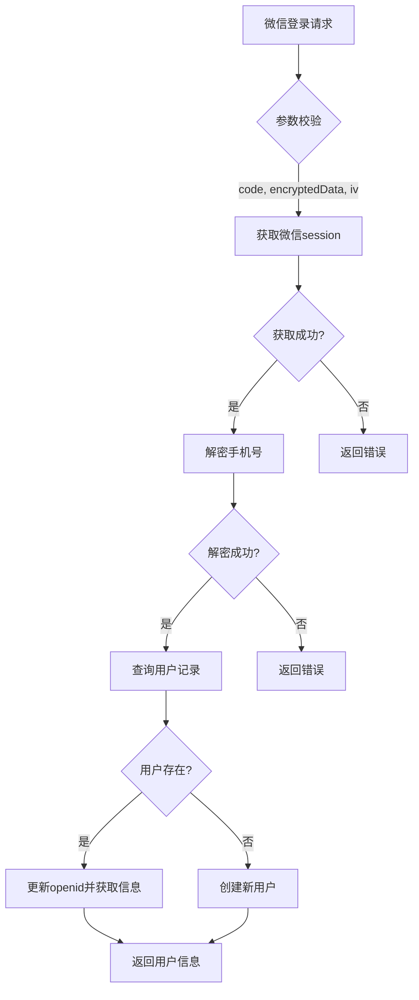

**Diagram sources**
- [index.obj.js](file://uniCloud-aliyun/cloudfunctions/userWx/index.obj.js#L20-L150)

#### 主要功能方法

- `loginByPhoneWx`: 微信手机号一键登录，集成openid获取、手机号解密和用户注册/登录全流程
- `updateUserProfile`: 更新用户个人资料，支持昵称和头像URL的修改
- `getUsersByIds`: 批量获取多个用户的基本信息，用于列表展示场景
- `getUserInfo`: 获取单个用户的详细信息

**Section sources**
- [index.obj.js](file://uniCloud-aliyun/cloudfunctions/userWx/index.obj.js#L20-L232)

### getOpenid安全认证流程

`getOpenid`云函数实现了标准的微信小程序登录认证流程，通过微信官方API获取用户的唯一标识。

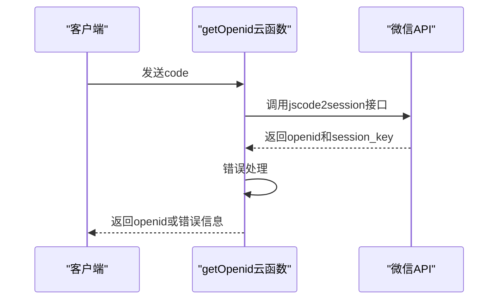

**Diagram sources**
- [index.js](file://uniCloud-aliyun/cloudfunctions/getOpenid/index.js#L1-L36)

该流程严格遵循微信官方的安全规范，确保用户身份验证的安全性。

**Section sources**
- [index.js](file://uniCloud-aliyun/cloudfunctions/getOpenid/index.js#L1-L36)

## 用户身份验证机制

### 微信登录认证流程

系统采用标准的微信小程序登录认证流程，确保用户身份的真实性和安全性。

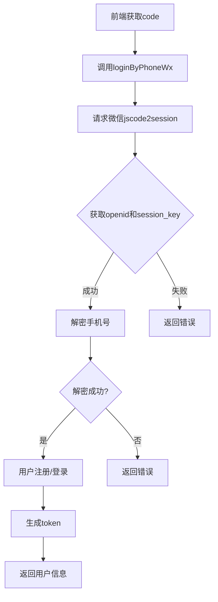

**Diagram sources**
- [index.obj.js](file://uniCloud-aliyun/cloudfunctions/userWx/index.obj.js#L20-L80)

### Token生成与验证

系统使用MD5哈希算法生成用户token，确保每个用户的会话唯一性。

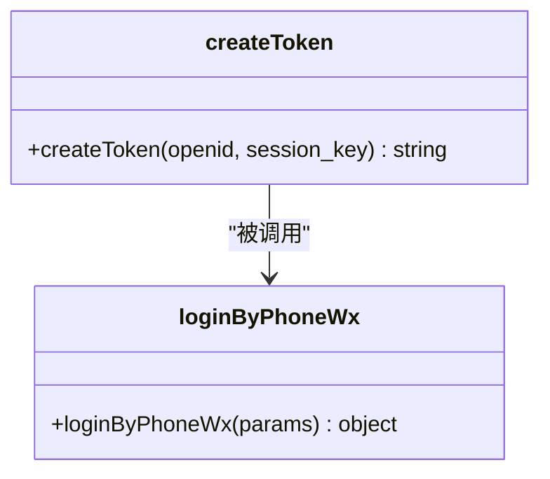

**Diagram sources**
- [createToken.js](file://uniCloud-aliyun/cloudfunctions/userWx/createToken.js#L1-L8)
- [index.obj.js](file://uniCloud-aliyun/cloudfunctions/userWx/index.obj.js#L60-L65)

token由用户openid、session_key和时间戳组合后进行MD5加密生成，有效防止token猜测攻击。

**Section sources**
- [createToken.js](file://uniCloud-aliyun/cloudfunctions/userWx/createToken.js#L1-L8)

## 会话管理与权限控制

### 会话状态管理

系统通过`uni-open-bridge-common`模块提供的存储机制管理用户会话状态。

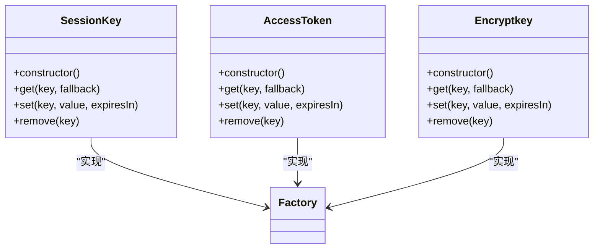

**Diagram sources**
- [uni-open-bridge-common/index.js](file://uni_modules/uni-open-bridge-common/uniCloud/cloudfunctions/common/uni-open-bridge-common/index.js#L56-L119)

### 权限控制策略

系统在数据库层面和业务逻辑层面实施双重权限控制。

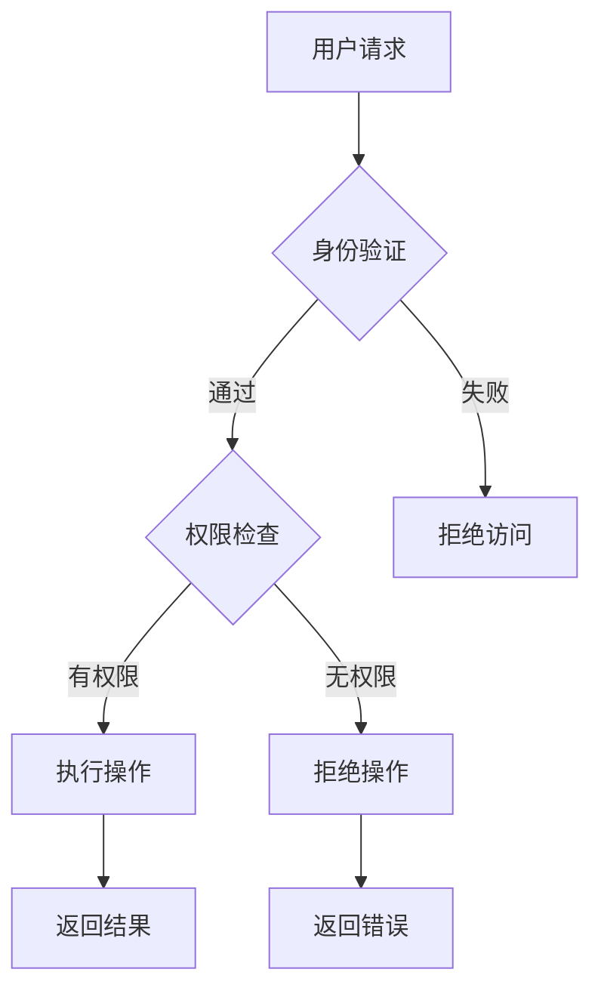

数据库schema中定义了明确的读写权限：
- 读取：所有用户可读
- 创建：所有用户可创建
- 更新：所有用户可更新
- 删除：禁止删除

**Section sources**
- [user.schema.json](file://uniCloud-aliyun/database/user.schema.json#L1-L107)
- [uni-open-bridge-common/index.js](file://uni_modules/uni-open-bridge-common/uniCloud/cloudfunctions/common/uni-open-bridge-common/index.js#L168-L280)

## 微信数据解密实现

### 手机号解密算法

`decryptPhoneNumber`模块实现了微信加密数据的标准解密流程。

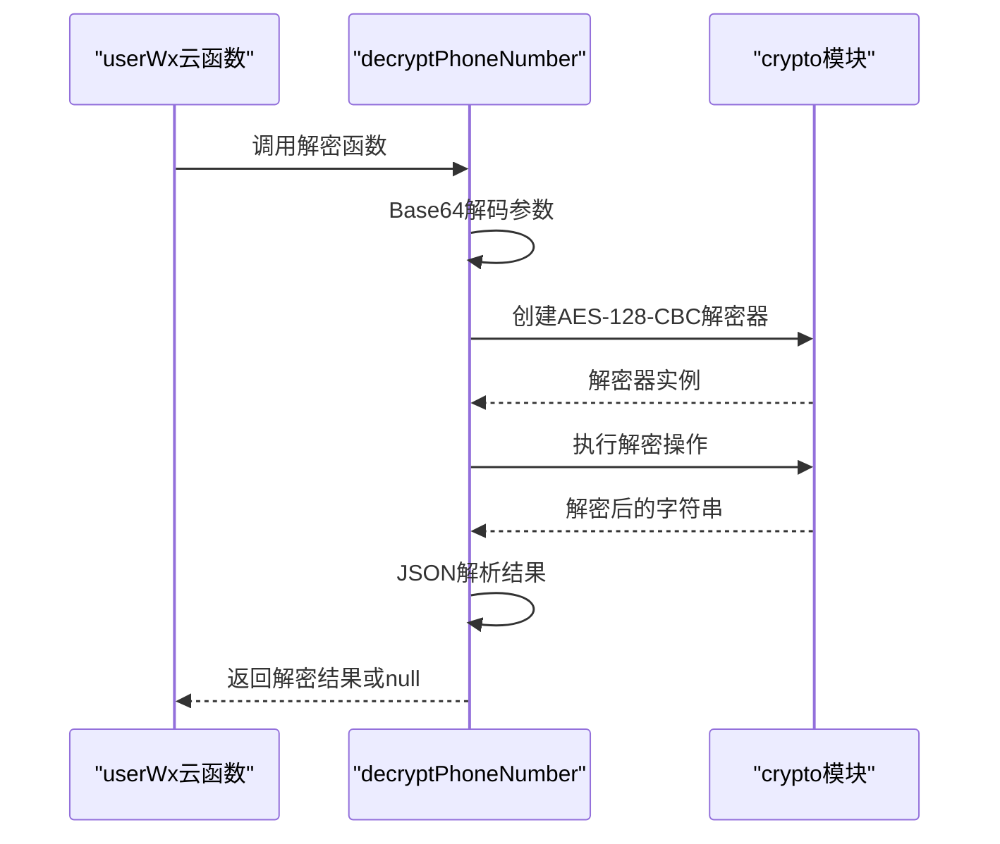

**Diagram sources**
- [decryptPhoneNumber.js](file://uniCloud-aliyun/cloudfunctions/userWx/decryptPhoneNumber.js#L1-L32)
- [index.obj.js](file://uniCloud-aliyun/cloudfunctions/userWx/index.obj.js#L4-L5)

### 解密流程详解

1. **参数准备**：接收session_key、encryptedData和iv三个必要参数
2. **Base64解码**：将三个参数从Base64格式转换为二进制数据
3. **AES解密**：使用AES-128-CBC算法进行解密
4. **JSON解析**：将解密后的字符串解析为JSON对象
5. **错误处理**：捕获并记录解密过程中的任何异常

**Section sources**
- [decryptPhoneNumber.js](file://uniCloud-aliyun/cloudfunctions/userWx/decryptPhoneNumber.js#L1-L32)

## API调用示例

### 完整登录链路示例

以下JavaScript代码展示了从微信登录到获取用户手机号的完整链路：

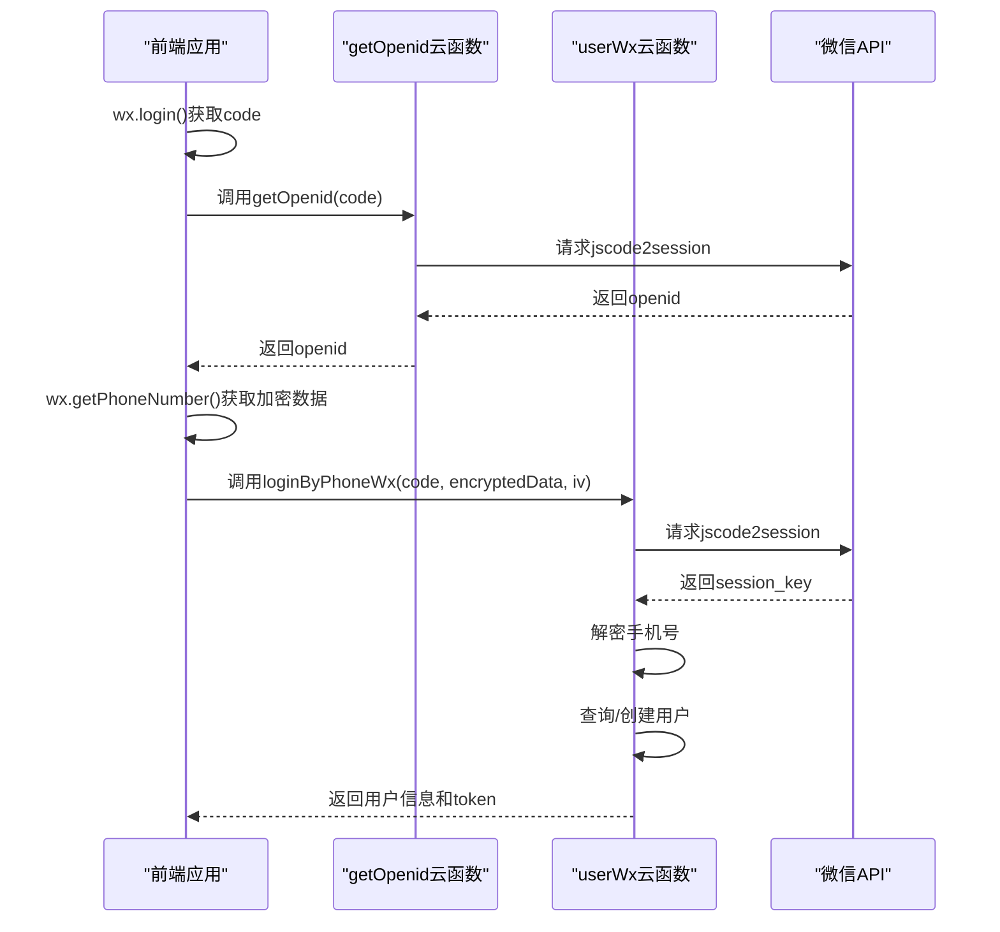

**Diagram sources**
- [index.obj.js](file://uniCloud-aliyun/cloudfunctions/userWx/index.obj.js#L20-L150)
- [index.js](file://uniCloud-aliyun/cloudfunctions/getOpenid/index.js#L1-L36)

### 前端调用代码

```javascript
// 1. 获取登录code
wx.login({
  success: (res) => {
    const code = res.code;
    
    // 2. 获取openid（可选）
    uniCloud.callFunction({
      name: 'getOpenid',
      data: { code },
      success: (openidRes) => {
        console.log('OpenID:', openidRes.result.openid);
      }
    });
    
    // 3. 获取手机号
    // 在button组件中设置open-type="getPhoneNumber"
    // 用户点击后触发
    const getPhoneNumber = (e) => {
      if (e.detail.encryptedData && e.detail.iv) {
        uniCloud.callFunction({
          name: 'userWx',
          data: {
            action: 'loginByPhoneWx',
            params: {
              code,
              encryptedData: e.detail.encryptedData,
              iv: e.detail.iv
            }
          },
          success: (loginRes) => {
            console.log('登录成功:', loginRes.result);
            // 存储token用于后续请求
            uni.setStorageSync('token', loginRes.result.data.token);
          },
          fail: (err) => {
            console.error('登录失败:', err);
          }
        });
      }
    };
  }
});
```

**Section sources**
- [index.obj.js](file://uniCloud-aliyun/cloudfunctions/userWx/index.obj.js#L20-L150)

## 异常处理指南

### 常见异常场景

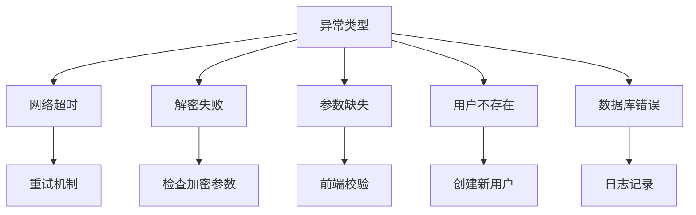

### 具体应对方案

| 异常类型 | 错误码 | 应对方案 |
|---------|-------|---------|
| 获取用户信息失败 | -1 | 检查code有效性，重新发起登录请求 |
| 手机号解密失败 | -1 | 验证encryptedData和iv参数完整性 |
| 用户ID不能为空 | -1 | 前端确保传递有效的用户ID |
| 没有指定要更新的字段 | -1 | 检查更新参数是否为空 |
| 获取用户信息失败 | -1 | 检查数据库连接状态 |

**Section sources**
- [index.obj.js](file://uniCloud-aliyun/cloudfunctions/userWx/index.obj.js#L100-L232)
- [decryptPhoneNumber.js](file://uniCloud-aliyun/cloudfunctions/userWx/decryptPhoneNumber.js#L25-L32)

## 数据隐私保护实践

### 数据安全措施

系统实施了多层次的数据安全保护措施：

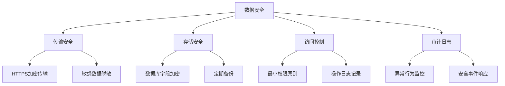

### 隐私保护政策

根据项目中的隐私协议文件，系统遵循以下隐私保护原则：

1. **数据最小化**：仅收集实现服务所必需的个人信息
2. **明确同意**：在收集敏感信息前获得用户明确同意
3. **数据本地化**：用户数据存储于中华人民共和国境内
4. **安全防护**：采用SSL加密、访问控制等安全措施保护数据
5. **权利保障**：用户享有访问、更正、删除个人信息的权利

**Section sources**
- [1.html](file://pages/login/1.html#L49-L98)
- [2.html](file://pages/login/2.html#L94-L124)

## 数据库设计

### 用户表结构

用户数据存储在`user`集合中，具有完整的字段定义和约束。

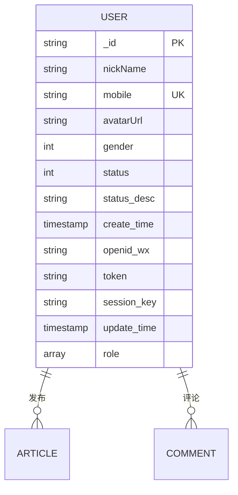

**Diagram sources**
- [user.schema.json](file://uniCloud-aliyun/database/user.schema.json#L1-L107)

### 字段说明

| 字段名 | 类型 | 描述 | 约束 |
|-------|------|------|------|
| _id | string | 文档ID | 主键，系统自动生成 |
| nickName | string | 用户昵称 | 可选，允许为空 |
| mobile | string | 手机号 | 必填，唯一，符合手机号格式 |
| avatarUrl | string | 头像地址 | 可选 |
| gender | int | 性别 | 0-未知，1-男，2-女，默认0 |
| status | int | 账号状态 | 0-正常，1-禁用，2-封禁，默认0 |
| openid_wx | string | 微信openid | 可选 |
| token | string | 用户token | 可选 |
| session_key | string | 会话密钥 | 可选 |
| role | array | 用户角色 | 默认["user"]，可包含"user","vip","admin" |

**Section sources**
- [user.schema.json](file://uniCloud-aliyun/database/user.schema.json#L1-L107)