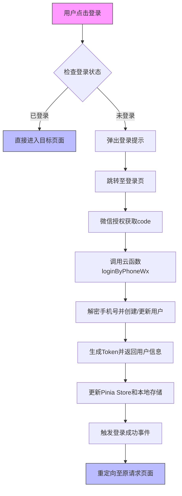
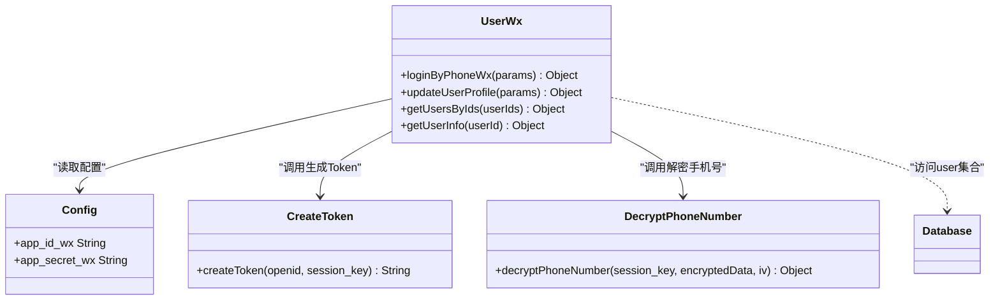
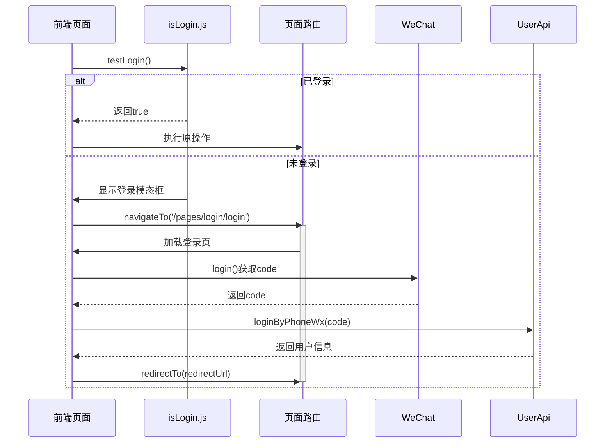
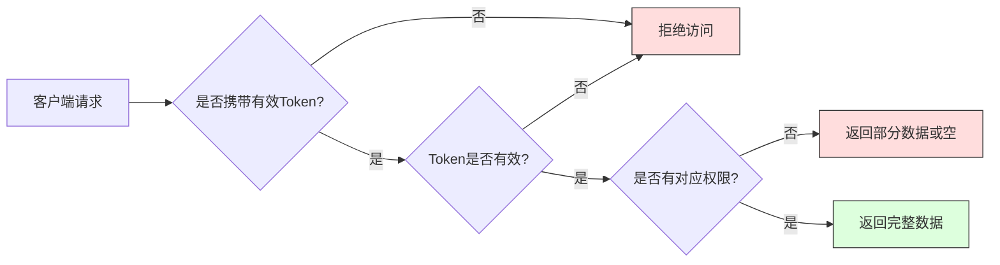

<cite>
**Referenced Files in This Document**
- [user.js](file://store/user.js)
- [isLogin.js](file://utils/isLogin.js)
- [login.vue](file://pages/login/login.vue)
- [index.obj.js](file://uniCloud-aliyun/cloudfunctions/userWx/index.obj.js)
- [createToken.js](file://uniCloud-aliyun/cloudfunctions/userWx/createToken.js)
- [config.js](file://uniCloud-aliyun/cloudfunctions/userWx/config.js)
- [main.js](file://main.js)
</cite>

# 常见问题与调试技巧

## 目录
1. [登录态管理](#登录态管理)
2. [云函数调试](#云函数调试)
3. [页面跳转异常](#页面跳转异常)
4. [数据库权限错误](#数据库权限错误)
5. [高效调试工具](#高效调试工具)
6. [标准错误报告模板](#标准错误报告模板)

## 登录态管理

本项目采用基于Pinia的状态管理和本地存储相结合的登录态管理机制。用户登录信息通过`useUserInfoStore`进行集中管理，并在本地持久化存储。



**诊断流程：**

1. **检查控制台日志**：查看是否有"检查登录状态"相关的日志输出，确认是从Store还是本地存储获取的用户信息。
2. **验证用户信息完整性**：确保`userInfo`对象包含`uid`、`token`等关键字段。
3. **检查本地存储**：使用开发者工具的应用数据面板，查看`userInfo`是否正确写入`uni.setStorageSync`。

**常见问题及解决策略：**

- **问题：登录后刷新页面，登录态丢失**
  - **原因**：Store初始化时未从本地存储恢复数据
  - **解决方案**：确保`testLogin`函数在检查Store前先检查本地存储，并调用`setUserInfo`同步数据

- **问题：Token失效导致接口401错误**
  - **原因**：Token生成逻辑或校验机制存在问题
  - **解决方案**：检查`createToken.js`中的MD5哈希生成逻辑，确保`openid`和`session_key`正确传递

**Section sources**
- [user.js](file://store/user.js#L3-L89)
- [isLogin.js](file://utils/isLogin.js#L3-L63)
- [main.js](file://main.js#L50-L70)

## 云函数调试

云函数是处理业务逻辑的核心组件，主要位于`uniCloud-aliyun/cloudfunctions`目录下。关键的用户相关操作由`userWx`云对象提供。

### 核心云函数分析



**调试难题及解决方法：**

- **日志查看**：
  - 在云函数中使用`console.log()`输出关键变量
  - 通过HBuilderX的"云开发控制台"查看实时日志
  - 使用`try-catch`捕获异常并记录详细错误信息

- **断点调试**：
  - 在HBuilderX中设置断点
  - 启动"云函数本地调试"模式
  - 通过前端调用触发断点，逐行调试执行流程

**典型问题排查：**

- **问题：loginByPhoneWx返回"获取用户信息失败"**
  - **诊断步骤**：
    1. 检查`config.js`中的`app_id_wx`和`app_secret_wx`是否正确
    2. 验证微信服务器返回的`openid`和`session_key`是否存在
    3. 确认网络请求是否成功到达微信API

- **问题：手机号解密失败**
  - **解决方案**：
    - 确保`encryptedData`和`iv`参数完整传递
    - 检查`session_key`是否过期（有效期5分钟）
    - 验证解密算法实现是否与微信官方文档一致

**Diagram sources**
- [index.obj.js](file://uniCloud-aliyun/cloudfunctions/userWx/index.obj.js#L1-L233)
- [config.js](file://uniCloud-aliyun/cloudfunctions/userWx/config.js#L1-L5)
- [createToken.js](file://uniCloud-aliyun/cloudfunctions/userWx/createToken.js#L1-L9)

**Section sources**
- [index.obj.js](file://uniCloud-aliyun/cloudfunctions/userWx/index.obj.js#L1-L233)
- [config.js](file://uniCloud-aliyun/cloudfunctions/userWx/config.js#L1-L5)

## 页面跳转异常

页面跳转异常通常表现为`navigateTo`失败或重定向不正确。本项目的登录流程涉及复杂的页面跳转逻辑。

### 跳转流程分析



**常见跳转问题：**

- **问题：navigateTo失败，无反应**
  - **可能原因**：
    - URL路径错误或不存在
    - 当前页面栈已满（最多10层）
    - 网络权限未开启

  - **诊断方法**：
    - 检查`pages.json`中是否注册了目标页面
    - 使用`getCurrentPages()`查看当前页面栈
    - 在`manifest.json`中确认网络权限配置

- **问题：登录后无法正确重定向到原页面**
  - **解决方案**：
    - 确保在跳转登录页时正确传递`redirect`参数
    - 使用`encodeURIComponent`对URL进行编码
    - 在登录成功回调中优先处理`redirectUrl`

**Section sources**
- [login.vue](file://pages/login/login.vue#L1-L429)
- [isLogin.js](file://utils/isLogin.js#L3-L63)

## 数据库权限错误

数据库权限错误（read unauthorized）通常发生在尝试访问受保护的数据集合时。本项目使用uniCloud的JQL数据库操作。

### 权限控制机制



**问题排查指南：**

1. **检查云函数安全规则**：
   - 确认`database`目录下的`.schema.json`文件中定义了正确的权限规则
   - 检查`read`和`write`权限配置

2. **验证Token有效性**：
   - 确保每次请求都携带最新的Token
   - 检查Token生成和校验逻辑的一致性

3. **调试建议**：
   - 在云函数中添加权限检查日志
   - 使用Postman等工具模拟请求，排除前端因素

**Section sources**
- [index.obj.js](file://uniCloud-aliyun/cloudfunctions/userWx/index.obj.js#L1-L233)
- [user.schema.json](file://uniCloud-aliyun/database/user.schema.json)

## 高效调试工具

### uniCloud本地调试模式

启用本地调试可以大幅提升开发效率：

1. 在HBuilderX中右键点击云函数目录
2. 选择"运行" -> "云函数本地调试"
3. 前端调用将直接指向本地运行的云函数实例

**优势**：
- 实时代码修改，无需上传部署
- 完整的断点调试支持
- 更详细的错误堆栈信息

### Chrome DevTools调试H5端

对于H5端调试：

1. 在浏览器中打开应用
2. 按F12打开开发者工具
3. 使用Console面板查看日志
4. 使用Network面板监控API请求

**技巧**：
- 使用`debugger`语句设置断点
- 监控`localStorage`变化
- 分析性能瓶颈

### vConsole调试真机环境

在真机环境中集成vConsole：

```javascript
// main.js中引入
if (process.env.NODE_ENV === 'development') {
    const VConsole = require('vconsole');
    new VConsole();
}
```

**功能**：
- 实时查看Console日志
- 监控Network请求
- 查看Element结构
- 查看Storage数据

**Section sources**
- [main.js](file://main.js#L1-L70)

## 标准错误报告模板

为提升问题定位效率，请遵循以下标准错误报告模板提交issue：

```markdown
### 问题描述
[简要描述遇到的问题]

### 复现步骤
1. 
2. 
3. 

### 预期结果
[期望的行为]

### 实际结果
[实际发生的情况]

### 环境信息
- 平台：[如H5、微信小程序、App等]
- uni-app版本：[版本号]
- 设备型号：[如iPhone 13, 华为P40等]

### 相关代码
[相关代码片段或文件路径]

### 错误日志
[完整的控制台错误信息]
```

**注意事项**：
- 提供尽可能详细的复现步骤
- 包含完整的错误堆栈信息
- 说明问题发生的频率（必现/偶发）
- 附上相关截图或录屏

**Section sources**
- [login.vue](file://pages/login/login.vue#L1-L429)
- [isLogin.js](file://utils/isLogin.js#L3-L63)