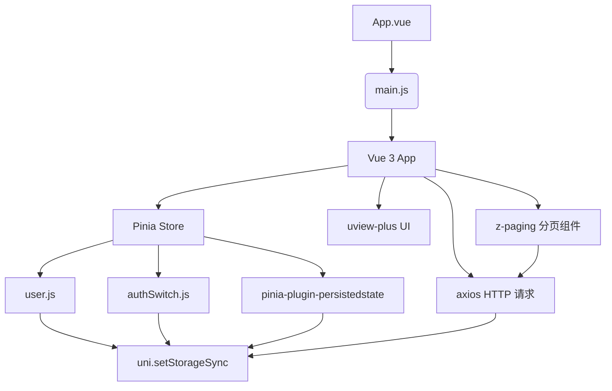

# 技术栈与依赖说明

<cite>
**本文档引用文件**  
- [main.js](file://main.js)
- [package.json](file://package.json)
- [store/user.js](file://store/user.js)
- [store/authSwitch.js](file://store/authSwitch.js)
- [uni_modules/uview-plus/index.js](file://uni_modules/uview-plus/index.js)
- [uni_modules/z-paging/readme.md](file://uni_modules/z-paging/readme.md)
- [uni_modules/z-paging-x/readme.md](file://uni_modules/z-paging-x/readme.md)
</cite>

## 目录
1. [技术选型概述](#技术选型概述)  
2. [前端框架：uni-app + Vue 3](#前端框架uni-app--vue-3)  
3. [状态管理：Pinia](#状态管理pinia)  
4. [UI组件库：uview-plus](#ui组件库uview-plus)  
5. [核心依赖详解](#核心依赖详解)  
   - [pinia-plugin-persistedstate（状态持久化）](#pinia-plugin-persistedstate状态持久化)  
   - [axios（HTTP请求）](#axioshttp请求)  
   - [z-paging（分页加载）](#z-paging分页加载)  
6. [集成示例与代码路径](#集成示例与代码路径)  
7. [系统架构关系图](#系统架构关系图)  

## 技术选型概述

本项目采用 uni-app 框架结合 Vue 3 构建跨平台应用，选用 Pinia 进行状态管理，并引入 uview-plus 作为 UI 组件库。关键依赖包括 pinia-plugin-persistedstate 实现状态本地持久化、axios 处理网络请求、z-paging 提供高性能分页加载能力。整体技术栈兼顾开发效率、性能表现与多端兼容性。

## 前端框架：uni-app + Vue 3

### 为何选择 uni-app + Vue 3

**uni-app** 是一个使用 Vue.js 开发所有前端应用的框架，支持编译到 iOS、Android、H5、小程序等多个平台，极大提升了开发效率和维护统一性。其基于 Vue 的语法体系降低了学习成本，同时具备强大的插件生态。

**Vue 3** 相较于 Vue 2 在性能、响应式机制（Proxy）、Composition API 等方面有显著提升。本项目利用 Vue 3 的组合式 API 更好地组织逻辑复用，提高代码可读性和维护性。

在 `main.js` 中通过 `createSSRApp` 初始化 Vue 3 应用实例，确保在不同运行环境中的一致性。

**Section sources**  
- [main.js](file://main.js#L15-L70)

## 状态管理：Pinia

### 为何选择 Pinia

Pinia 是 Vue 官方推荐的状态管理库，相比 Vuex 具有更简洁的 API、更好的 TypeScript 支持、模块化设计无需嵌套命名空间等优势。它天然支持 Vue 3 的 Composition API 风格，便于逻辑拆分与测试。

项目中通过 `createPinia()` 创建全局 store 实例，并在 `main.js` 中通过 `app.use(pinia)` 注册，使所有组件均可访问 `$pinia`。

#### Store 示例分析

- **user.js**: 定义用户信息 store (`useUserInfoStore`)，包含用户数据、登录状态、点赞记录等。
- **authSwitch.js**: 定义权限开关 store (`useAuthSwitchStore`)，用于控制某些功能的启用/禁用状态。

两者均使用 `defineStore` 函数定义，并通过 `ref` 响应式包装状态。

**Section sources**  
- [main.js](file://main.js#L15-L70)
- [store/user.js](file://store/user.js#L1-L90)
- [store/authSwitch.js](file://store/authSwitch.js#L1-L53)

## UI组件库：uview-plus

### 为何选择 uview-plus

**uview-plus** 是专为 uni-app 设计的高质量 UI 组件库，提供丰富的移动端组件（如按钮、表单、弹窗、导航栏等），支持 Vue 3 和 nvue 渲染模式，具有良好的性能和多端适配能力。

项目通过以下方式集成：
1. 在 `main.js` 中导入 `uviewPlus` 并调用 `app.use(uviewPlus)`
2. 调用 `mount$u()` 将 `$u` 工具挂载至 `uni` 全局对象，方便全局调用工具方法

该组件库还提供了内置工具函数（如路由跳转、防抖节流、颜色处理等），进一步提升开发效率。

**Section sources**  
- [main.js](file://main.js#L15-L70)
- [uni_modules/uview-plus/index.js](file://uni_modules/uview-plus/index.js#L1-L132)

## 核心依赖详解

### pinia-plugin-persistedstate（状态持久化）

#### 功能说明

该插件用于将 Pinia store 中的状态自动持久化到本地存储（如 `localStorage` 或 `uni.setStorageSync`），避免页面刷新后状态丢失。

#### 自定义实现分析

项目未直接使用 npm 包，而是在 `main.js` 中自定义了持久化逻辑：

```js
const createPersistedState = (options = {}) => { /* ... */ }
```

该函数接收配置项（如需持久化的 store 名称列表、存储前缀），并返回一个 Pinia 插件函数，在 store 初始化时从存储恢复数据，并监听变更实时保存。

此外，各 store 如 `user.js` 和 `authSwitch.js` 也通过 `persist` 配置项指定使用 `uni.getStorageSync` 和 `uni.setStorageSync` 进行存储操作，适配 uni-app 环境。

**Section sources**  
- [main.js](file://main.js#L15-L70)
- [store/user.js](file://store/user.js#L80-L90)
- [store/authSwitch.js](file://store/authSwitch.js#L45-L53)

### axios（HTTP请求）

#### 功能说明

`axios` 是一个基于 Promise 的 HTTP 客户端，用于浏览器和 node.js 发送异步请求。项目中用于与后端 API 通信，获取文章、用户、评论等数据。

#### 集成方式

虽然当前代码中未直接展示 axios 使用示例，但 `package.json` 明确声明了依赖 `"axios": "^1.8.3"`，表明其作为核心网络请求工具被引入。

通常会在 `utils/request.js` 或类似文件中封装 axios 实例，设置 baseURL、拦截器、错误处理等。

**Section sources**  
- [package.json](file://package.json#L2-L12)

### z-paging（分页加载）

#### 功能说明

`z-paging` 是一款专为 uni-app 设计的高性能分页组件，支持下拉刷新、上拉加载更多、虚拟列表、聊天记录模式等多种场景，具备低耦合、高灵活性的特点。

#### 集成方式

项目同时引入了 `z-paging` 和 `z-paging-x`（支持 uni-app x 版本）：

- **组件使用**：通过 `<z-paging>` 标签绑定数据列表 `v-model="dataList"`，并通过 `@query` 绑定查询方法。
- **全局配置**：可在 `config/index.js` 中进行默认 pageSize、空状态文本等配置。
- **高级特性**：支持 fixed 布局、安全区适配、吸顶、二楼效果等。

示例代码见 `z-paging-x/readme.md`，展示了如何在模板中使用组件及在脚本中处理分页逻辑。

**Section sources**  
- [uni_modules/z-paging/readme.md](file://uni_modules/z-paging/readme.md#L1-L57)
- [uni_modules/z-paging-x/readme.md](file://uni_modules/z-paging-x/readme.md#L40-L118)

## 集成示例与代码路径

### main.js 初始化流程

以下是 `main.js` 中关键技术的初始化顺序：

1. 导入 `uviewPlus` 和 `createPinia`
2. 判断 VUE3 环境，创建 SSR App
3. 创建 Pinia 实例并注册自定义持久化插件
4. 注册 uview-plus 插件并挂载 `$u` 工具
5. 返回 app 与 pinia 实例

此过程确保了状态管理、UI 库、持久化机制在应用启动时正确加载。

[SPEC SYMBOL](file://main.js#L15-L70)

### Store 定义规范

所有 store 文件位于 `/store` 目录下，遵循以下结构：

- 使用 `defineStore('storeId', () => {...})` 定义
- 使用 `ref` 包装响应式状态
- 提供 setter 方法更新状态并同步至本地存储
- 可选配置 `persist` 实现自动持久化

[SPEC SYMBOL](file://store/user.js#L1-L90)  
[SPEC SYMBOL](file://store/authSwitch.js#L1-L53)

## 系统架构关系图



**Diagram sources**  
- [main.js](file://main.js#L15-L70)
- [store/user.js](file://store/user.js#L1-L90)
- [store/authSwitch.js](file://store/authSwitch.js#L1-L53)
- [package.json](file://package.json#L2-L12)

**Section sources**  
- [main.js](file://main.js#L15-L70)
- [store/user.js](file://store/user.js#L1-L90)
- [store/authSwitch.js](file://store/authSwitch.js#L1-L53)
- [package.json](file://package.json#L2-L12)