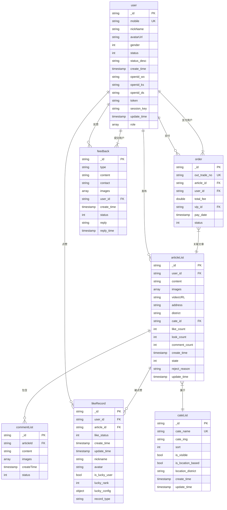

# 数据库Schema设计

<cite>
**本文档引用的文件**
- [user.schema.json](file://uniCloud-aliyun/database/user.schema.json)
- [articleList.schema.json](file://uniCloud-aliyun/database/articleList.schema.json)
- [commentList.schema.json](file://uniCloud-aliyun/database/commentList.schema.json)
- [order.schema.json](file://uniCloud-aliyun/database/order.schema.json)
- [cateList.schema.json](file://uniCloud-aliyun/database/cateList.schema.json)
- [likeRecord.schema.json](file://uniCloud-aliyun/database/likeRecord.schema.json)
- [feedback.schema.json](file://uniCloud-aliyun/database/feedback.schema.json)
- [company.schema.json](file://uniCloud-aliyun/database/company.schema.json)
- [sendOn.schema.json](file://uniCloud-aliyun/database/sendOn.schema.json)
- [vipRechargePro.schema.json](file://uniCloud-aliyun/database/vipRechargePro.schema.json)
- [lucky_config.schema.json](file://uniCloud-aliyun/database/lucky_config.schema.json)
- [navigation_settings.schema.json](file://uniCloud-aliyun/database/navigation_settings.schema.json)
- [gift_images.schema.json](file://uniCloud-aliyun/database/gift_images.schema.json)
</cite>

## 目录
1. [简介](#简介)
2. [核心集合结构分析](#核心集合结构分析)
3. [实体关系图](#实体关系图)
4. [数据生命周期管理](#数据生命周期管理)
5. [查询优化建议](#查询优化建议)
6. [常见聚合操作示例](#常见聚合操作示例)
7. [权限规则详解](#权限规则详解)
8. [结论](#结论)

## 简介
本文档详细描述了uniCloud数据库中各核心集合的结构、字段定义、索引设置及权限规则。重点解析用户、文章、评论、订单等核心数据模型，为开发者提供完整的数据架构参考。

## 核心集合结构分析

### 用户集合 (user.schema.json)
该集合存储用户基本信息与角色权限配置。

**主要字段：**
- `mobile`: 手机号，必填项，格式符合中国大陆手机号正则
- `nickName`: 用户昵称
- `avatarUrl`: 头像地址
- `gender`: 性别（0-未知，1-男，2-女）
- `status`: 账号状态（0-正常，1-禁用，2-封禁）
- `role`: 角色数组，支持多角色（user, vip, admin）

**权限规则：**
- 可读：所有人
- 可创建：所有人
- 可更新：所有人
- 可删除：禁止

**时间戳：**
- `create_time`: 创建时间，默认当前时间
- `update_time`: 更新时间，默认当前时间

**Section sources**
- [user.schema.json](file://uniCloud-aliyun/database/user.schema.json#L1-L107)

### 文章集合 (articleList.schema.json)
存储文章元数据及其作者关联信息。

**主要字段：**
- `user_id`: 发布者ID，外键关联用户表
- `content`: 文章内容，最大长度500字符
- `images`: 图片列表，包含原图、压缩图和缩略图URL
- `videoURL`: 视频地址
- `cate_id`: 分类ID，外键关联分类表
- `like_count`, `look_count`, `comment_count`: 互动统计
- `state`: 审核状态（0-待审核，1-已通过，2-已拒绝）

**权限规则：**
- 创建、更新、删除需登录用户身份验证

**Section sources**
- [articleList.schema.json](file://uniCloud-aliyun/database/articleList.schema.json#L1-L159)

### 评论集合 (commentList.schema.json)
实现评论层级结构与目标引用功能。

**主要字段：**
- `articleId`: 关联文章ID
- `content`: 评论内容，长度限制1-500字符
- `images`: 评论附带图片URL数组
- `createTime`: 创建时间戳
- `status`: 状态标识（1-正常）

**权限规则：**
所有操作均开放

**Section sources**
- [commentList.schema.json](file://uniCloud-aliyun/database/commentList.schema.json#L1-L38)

### 订单集合 (order.schema.json)
管理支付订单的状态机流转。

**主要字段：**
- `out_trade_no`: 商户订单号
- `article_id`: 关联文章ID
- `user_id`: 支付用户ID
- `total_fee`: 充值金额（double类型）
- `pay_date`: 支付日期，默认当前时间
- `status`: 支付状态（0-待支付，1-已支付，2-已取消，3-已完成）

**权限规则：**
全开放读写删权限

**Section sources**
- [order.schema.json](file://uniCloud-aliyun/database/order.schema.json#L1-L50)

### 分类集合 (cateList.schema.json)
文章分类管理，支持排序与可见性控制。

**主要字段：**
- `cate_name`: 分类名称，唯一索引
- `cate_img`: 分类图标URL
- `sort`: 排序权重，数值越大越靠前
- `is_visible`: 是否显示该分类
- `is_location_based`: 是否为基于位置自动生成的分类

**索引设置：**
- `sort_index`: 按sort降序
- `cate_name_index`: cate_name唯一索引
- `location_district_index`: 区域名称普通索引

**Section sources**
- [cateList.schema.json](file://uniCloud-aliyun/database/cateList.schema.json#L1-L108)

## 实体关系图



**Diagram sources**
- [user.schema.json](file://uniCloud-aliyun/database/user.schema.json#L1-L107)
- [articleList.schema.json](file://uniCloud-aliyun/database/articleList.schema.json#L1-L159)
- [commentList.schema.json](file://uniCloud-aliyun/database/commentList.schema.json#L1-L38)
- [order.schema.json](file://uniCloud-aliyun/database/order.schema.json#L1-L50)
- [cateList.schema.json](file://uniCloud-aliyun/database/cateList.schema.json#L1-L108)
- [likeRecord.schema.json](file://uniCloud-aliyun/database/likeRecord.schema.json#L1-L1)
- [feedback.schema.json](file://uniCloud-aliyun/database/feedback.schema.json#L1-L1)

## 数据生命周期管理

### 软删除标记
系统未采用传统软删除机制，而是通过状态字段进行逻辑控制：
- **用户表**：`status` 字段控制账号状态（正常/禁用/封禁）
- **文章表**：`state` 字段管理审核流程（待审核/已通过/已拒绝）
- **反馈表**：`status` 字段跟踪处理进度（未处理/处理中/已处理）

### 历史记录保留策略
- 所有修改操作自动记录 `update_time`
- 关键业务数据永久保留，不设自动清理机制
- 日志类数据（如点赞记录）根据业务需求定期归档

### 特殊配置表说明
- `lucky_config.schema.json`: 幸运用户配置，全局唯一设置
- `sendOn.schema.json`: 功能开关配置，控制前端组件显示状态
- `navigation_settings.schema.json`: 导航栏配置，管理员维护

**Section sources**
- [user.schema.json](file://uniCloud-aliyun/database/user.schema.json#L1-L107)
- [articleList.schema.json](file://uniCloud-aliyun/database/articleList.schema.json#L1-L159)
- [feedback.schema.json](file://uniCloud-aliyun/database/feedback.schema.json#L1-L1)
- [lucky_config.schema.json](file://uniCloud-aliyun/database/lucky_config.schema.json#L1-L1)
- [sendOn.schema.json](file://uniCloud-aliyun/database/sendOn.schema.json#L1-L45)

## 查询优化建议

### 索引使用建议
1. **用户查询**：优先使用 `mobile` 字段进行精确匹配
2. **文章检索**：结合 `cate_id` + `create_time` 进行分页查询
3. **评论获取**：按 `articleId` + `createTime` 组合查询
4. **订单查找**：使用 `out_trade_no` 唯一索引快速定位

### 避免全表扫描
- 对大文本字段（如content）避免模糊查询
- 使用投影（projection）只获取必要字段
- 分页查询时配合排序字段使用游标

### 聚合管道优化
- 尽量在早期阶段进行过滤（$match）
- 合理使用 $lookup 连表查询，避免笛卡尔积
- 复杂计算可考虑在应用层处理

**Section sources**
- [articleList.schema.json](file://uniCloud-aliyun/database/articleList.schema.json#L1-L159)
- [cateList.schema.json](file://uniCloud-aliyun/database/cateList.schema.json#L1-L108)
- [order.schema.json](file://uniCloud-aliyun/database/order.schema.json#L1-L50)

## 常见聚合操作示例

### 获取热门文章（按阅读量排序）
```javascript
db.collection('articleList')
  .where({ state: 1 })
  .orderBy('look_count', 'desc')
  .limit(10)
  .get()
```

### 查询某用户的所有文章及评论数
```javascript
db.collection('articleList')
  .aggregate()
  .match({ user_id: 'userId' })
  .lookup({
    from: 'commentList',
    localField: '_id',
    foreignField: 'articleId',
    as: 'comments'
  })
  .addFields({ comment_count: { $size: '$comments' } })
  .end()
```

### 统计各分类文章数量
```javascript
db.collection('articleList')
  .aggregate()
  .lookup({
    from: 'cateList',
    localField: 'cate_id',
    foreignField: '_id',
    as: 'category'
  })
  .unwind('$category')
  .group({
    _id: '$category.cate_name',
    count: { $sum: 1 }
  })
  .end()
```

### 获取最新评论（含用户信息）
```javascript
db.collection('commentList')
  .orderBy('createTime', 'desc')
  .limit(20)
  .get()
```

**Section sources**
- [articleList.schema.json](file://uniCloud-aliyun/database/articleList.schema.json#L1-L159)
- [commentList.schema.json](file://uniCloud-aliyun/database/commentList.schema.json#L1-L38)
- [cateList.schema.json](file://uniCloud-aliyun/database/cateList.schema.json#L1-L108)

## 权限规则详解

### 公共读取权限
绝大多数集合对所有用户开放读取权限，确保内容可访问性：
- 文章、评论、分类、公司信息等均可匿名访问

### 写入权限控制
| 集合 | 创建权限 | 更新权限 | 删除权限 |
|------|----------|----------|----------|
| 用户 | 所有人 | 所有人 | 禁止 |
| 文章 | 登录用户 | 登录用户 | 登录用户 |
| 评论 | 所有人 | 所有人 | 所有人 |
| 订单 | 所有人 | 所有人 | 所有人 |
| 分类 | 所有人 | 所有人 | 所有人 |
| 反馈 | 登录用户 | 禁止 | 禁止 |
| 导航设置 | 管理员 | 管理员 | 管理员 |
| 礼物配置 | 管理员 | 管理员 | 管理员 |

### 特殊权限说明
- **反馈系统**：仅允许创建，防止恶意篡改历史记录
- **管理配置**：严格限制为管理员角色操作
- **用户删除保护**：禁止直接删除用户记录，保障数据完整性

**Section sources**
- [user.schema.json](file://uniCloud-aliyun/database/user.schema.json#L1-L107)
- [articleList.schema.json](file://uniCloud-aliyun/database/articleList.schema.json#L1-L159)
- [commentList.schema.json](file://uniCloud-aliyun/database/commentList.schema.json#L1-L38)
- [order.schema.json](file://uniCloud-aliyun/database/order.schema.json#L1-L50)
- [navigation_settings.schema.json](file://uniCloud-aliyun/database/navigation_settings.schema.json#L1-L1)
- [gift_images.schema.json](file://uniCloud-aliyun/database/gift_images.schema.json#L1-L1)

## 结论
本系统采用规范化数据模型设计，各集合职责清晰，关系明确。通过合理的索引策略和权限控制，既保证了数据安全又提升了查询性能。建议开发者遵循本文档规范进行数据操作，充分利用现有结构优势，避免冗余查询和不当的数据修改。