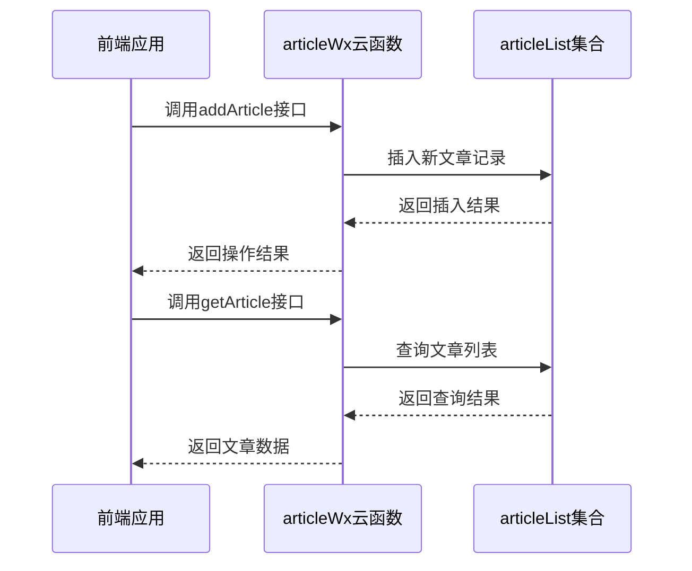
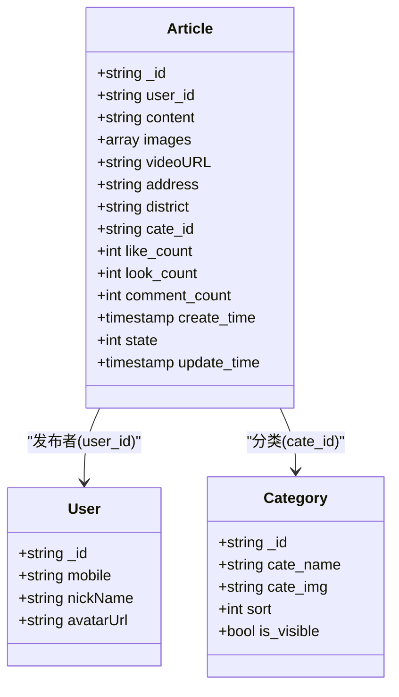
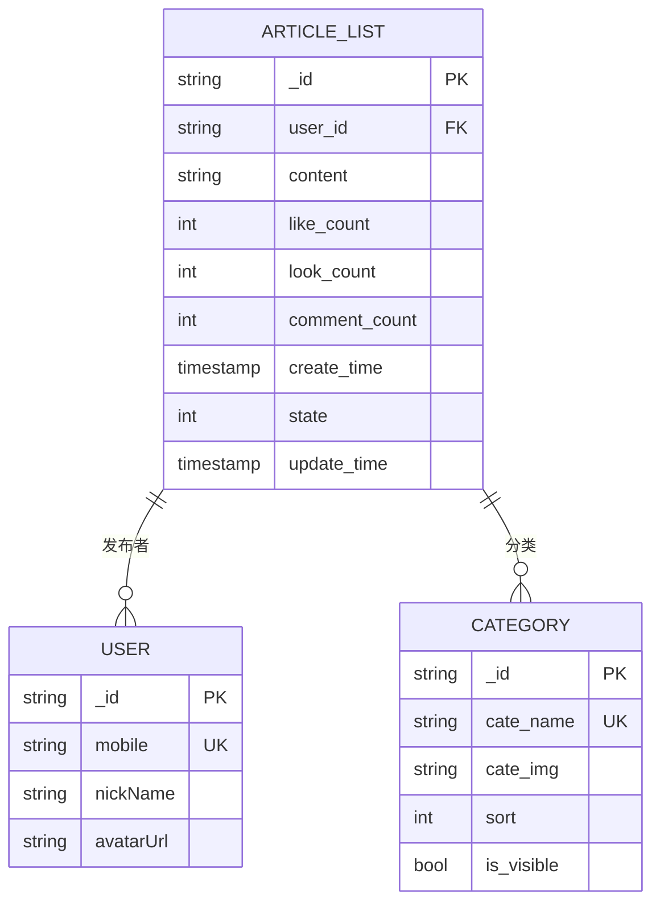
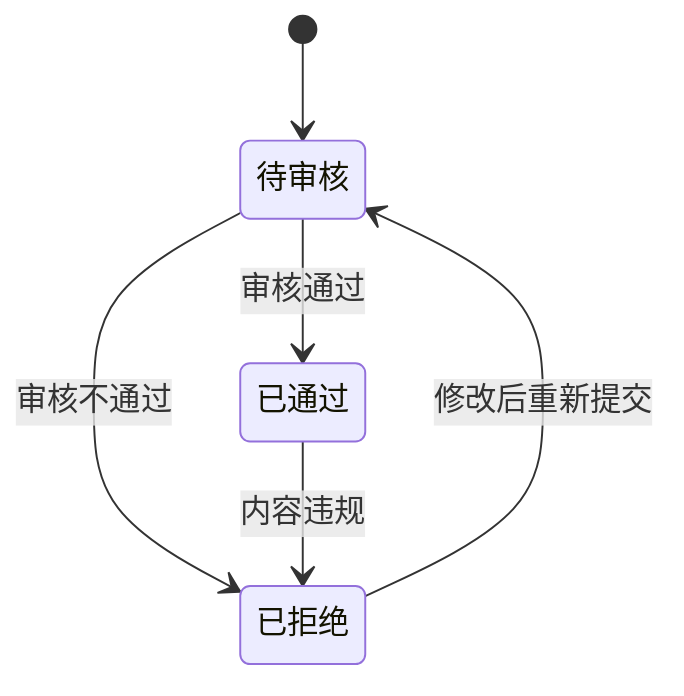
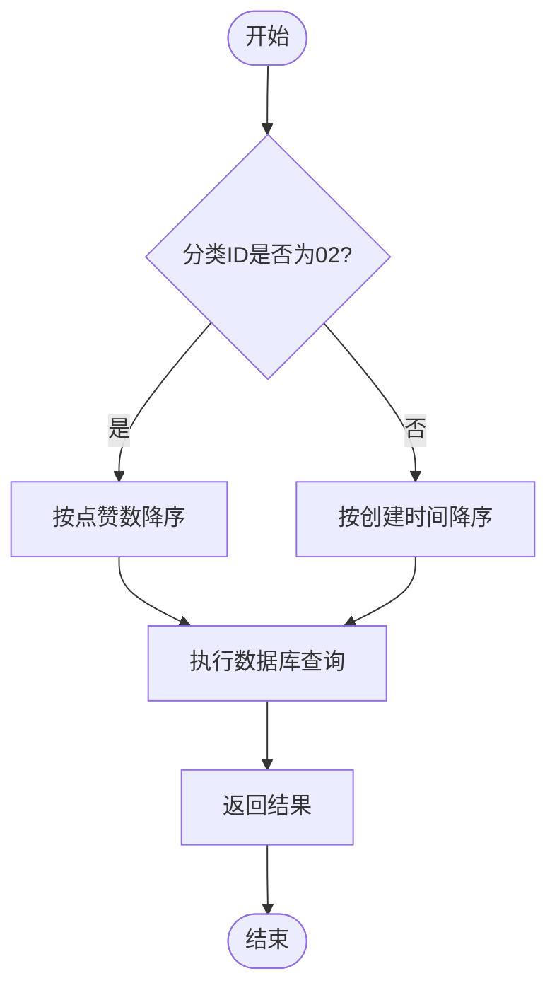
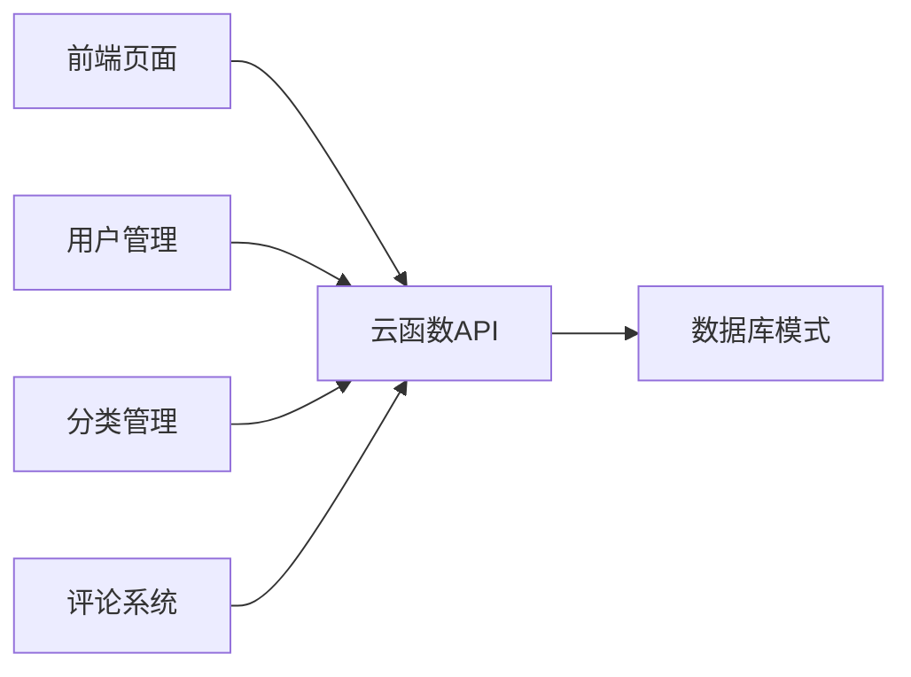

# 文章模型设计

<cite>
**本文档引用的文件**
- [articleList.schema.json](file://uniCloud-aliyun/database/articleList.schema.json)
- [user.schema.json](file://uniCloud-aliyun/database/user.schema.json)
- [cateList.schema.json](file://uniCloud-aliyun/database/cateList.schema.json)
- [articleWx/index.obj.js](file://uniCloud-aliyun/cloudfunctions/articleWx/index.obj.js)
- [userWx/index.obj.js](file://uniCloud-aliyun/cloudfunctions/userWx/index.obj.js)
- [cateWx/index.obj.js](file://uniCloud-aliyun/cloudfunctions/cateWx/index.obj.js)
</cite>

## 目录
1. [简介](#简介)
2. [项目结构](#项目结构)
3. [核心组件](#核心组件)
4. [架构概述](#架构概述)
5. [详细组件分析](#详细组件分析)
6. [依赖分析](#依赖分析)
7. [性能考虑](#性能考虑)
8. [故障排除指南](#故障排除指南)
9. [结论](#结论)

## 简介
本文档深入解析了文章数据模型的设计与实现，涵盖字段如_id、title（标题）、content（内容）、images（图片数组）、video（视频链接）、authorId（作者ID引用）、cateId（分类ID）、viewCount（浏览量）、likeCount（点赞数）、commentCount（评论数）、status（审核状态）、createTime、updateTime等的技术实现与业务逻辑。说明外键约束机制（通过authorId关联用户表）和索引策略（如按createTime倒序索引支持时间线展示）。阐述软删除设计（使用status标记而非物理删除）。提供聚合查询案例，如首页推荐流排序算法、个人作品集分页查询。讨论大数据量下的分片策略与读写性能优化方案。

## 项目结构
本项目采用前后端分离架构，前端基于uni-app框架构建，后端使用uniCloud云开发平台。主要目录包括components（组件）、pages（页面）、store（状态管理）、style（样式）、uniCloud-aliyun（云函数和数据库）等。其中，数据库模式定义位于uniCloud-aliyun/database目录下，云函数实现在uniCloud-aliyun/cloudfunctions目录中。

```mermaid
graph TB
subgraph "前端"
components[components]
pages[pages]
store[store]
style[style]
end
subgraph "后端"
cloudfunctions[cloudfunctions]
database[database]
end
components --> |调用| cloudfunctions
pages --> |调用| cloudfunctions
store --> |调用| cloudfunctions
cloudfunctions < --> database
```

**图表来源**
- [articleList.schema.json](file://uniCloud-aliyun/database/articleList.schema.json)
- [articleWx/index.obj.js](file://uniCloud-aliyun/cloudfunctions/articleWx/index.obj.js)

**章节来源**
- [articleList.schema.json](file://uniCloud-aliyun/database/articleList.schema.json)
- [project_structure](file://project_structure)

## 核心组件
文章数据模型的核心组件包括文章实体、用户实体和分类实体。文章实体包含内容、媒体资源、互动统计等信息；用户实体存储作者信息；分类实体管理文章分类。这些组件通过云函数进行交互，实现了文章的增删改查、点赞、评论等功能。

**章节来源**
- [articleList.schema.json](file://uniCloud-aliyun/database/articleList.schema.json)
- [user.schema.json](file://uniCloud-aliyun/database/user.schema.json)
- [cateList.schema.json](file://uniCloud-aliyun/database/cateList.schema.json)

## 架构概述
系统采用微服务架构，前端通过API调用后端云函数，云函数处理业务逻辑并与数据库交互。文章相关的所有操作都封装在articleWx云函数中，通过不同的action参数区分具体操作。这种设计提高了代码的可维护性和扩展性。



**图表来源**
- [articleWx/index.obj.js](file://uniCloud-aliyun/cloudfunctions/articleWx/index.obj.js)
- [articleList.schema.json](file://uniCloud-aliyun/database/articleList.schema.json)

## 详细组件分析
### 文章实体分析
文章实体是整个系统的核心，包含了丰富的属性和复杂的业务逻辑。每个文章记录都有唯一的_id标识，由系统自动生成。文章内容(content)被限制在500个字符以内，并自动去除首尾空格(trim both)。

#### 字段详解


**图表来源**
- [articleList.schema.json](file://uniCloud-aliyun/database/articleList.schema.json)
- [user.schema.json](file://uniCloud-aliyun/database/user.schema.json)
- [cateList.schema.json](file://uniCloud-aliyun/database/cateList.schema.json)

#### 外键约束机制
文章模型通过foreignKey属性实现了外键约束：
- user_id字段引用user._id，确保每篇文章都有有效的作者
- cate_id字段引用cateList._id，保证文章分类的有效性

这种设计避免了孤立的数据记录，维护了数据完整性。

**章节来源**
- [articleList.schema.json](file://uniCloud-aliyun/database/articleList.schema.json)

#### 索引策略
为了提高查询性能，系统采用了多种索引策略：
- 按createTime倒序索引，支持时间线展示
- 分类名称唯一索引，防止重复分类
- 区域名称索引，支持地理位置相关的查询



**图表来源**
- [articleList.schema.json](file://uniCloud-aliyun/database/articleList.schema.json)
- [cateList.schema.json](file://uniCloud-aliyun/database/cateList.schema.json)

### 软删除设计
系统采用软删除设计，通过state字段标记文章状态而不是物理删除：
- state=0：待审核
- state=1：已通过
- state=2：已拒绝

这种方式保留了历史数据，便于后续审计和恢复，同时减少了数据库的I/O操作。



**图表来源**
- [articleList.schema.json](file://uniCloud-aliyun/database/articleList.schema.json)
- [articleWx/index.obj.js](file://uniCloud-aliyun/cloudfunctions/articleWx/index.obj.js)

### 聚合查询案例
#### 首页推荐流排序算法
首页推荐流根据分类ID采用不同的排序策略：
- 当cate_id为'02'时，按点赞数(like_count)降序排列
- 其他分类按创建时间(create_time)降序排列



**图表来源**
- [articleWx/index.obj.js](file://uniCloud-aliyun/cloudfunctions/articleWx/index.obj.js)

#### 个人作品集分页查询
个人作品集查询支持分页功能，每次请求返回指定数量的文章记录，并包含总记录数以便前端实现分页控件。

**章节来源**
- [articleWx/index.obj.js](file://uniCloud-aliyun/cloudfunctions/articleWx/index.obj.js)

## 依赖分析
系统各组件之间存在明确的依赖关系。前端页面依赖于云函数提供的API接口，云函数依赖于数据库模式定义。通过分析package.json文件可以了解项目的外部依赖情况。



**图表来源**
- [articleWx/index.obj.js](file://uniCloud-aliyun/cloudfunctions/articleWx/index.obj.js)
- [userWx/index.obj.js](file://uniCloud-aliyun/cloudfunctions/userWx/index.obj.js)
- [cateWx/index.obj.js](file://uniCloud-aliyun/cloudfunctions/cateWx/index.obj.js)

## 性能考虑
在大数据量场景下，系统需要考虑分片策略和读写性能优化。建议根据用户ID或时间范围对文章数据进行水平分片，以分散数据库压力。同时，合理使用缓存机制可以显著提升读取性能。

## 故障排除指南
常见问题包括文章无法发布、点赞功能失效等。排查时应首先检查云函数日志，确认是否有权限错误或参数校验失败。对于数据库相关问题，需验证外键约束和索引配置是否正确。

**章节来源**
- [articleWx/index.obj.js](file://uniCloud-aliyun/cloudfunctions/articleWx/index.obj.js)
- [userWx/index.obj.js](file://uniCloud-aliyun/cloudfunctions/userWx/index.obj.js)

## 结论
本文档全面解析了文章数据模型的设计与实现，涵盖了从字段定义到业务逻辑的各个方面。通过合理的外键约束、索引策略和软删除设计，系统实现了高效、可靠的内容管理功能。未来可进一步优化分片策略和缓存机制，以应对更大的数据规模。