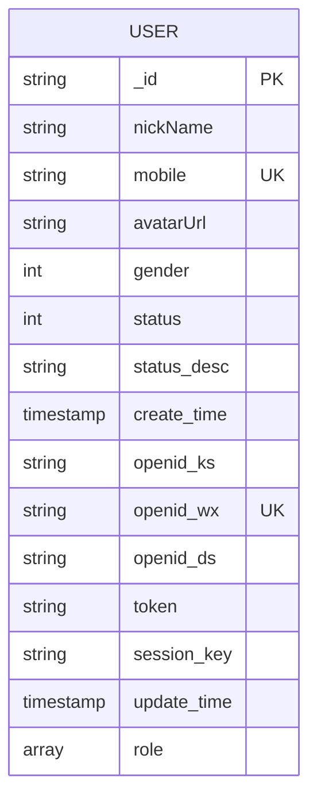
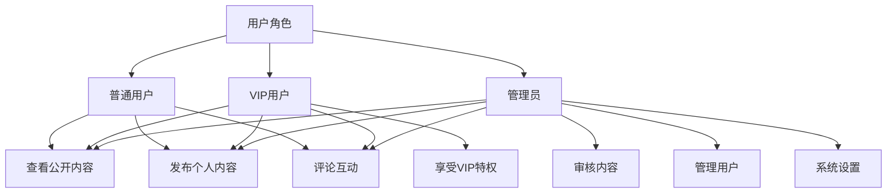
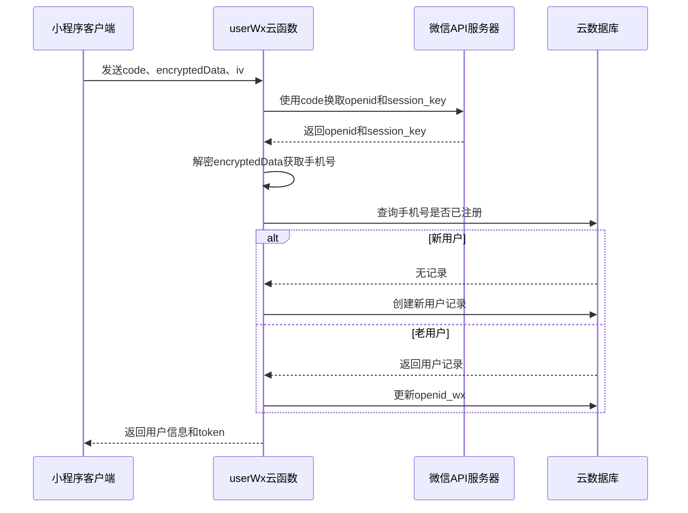
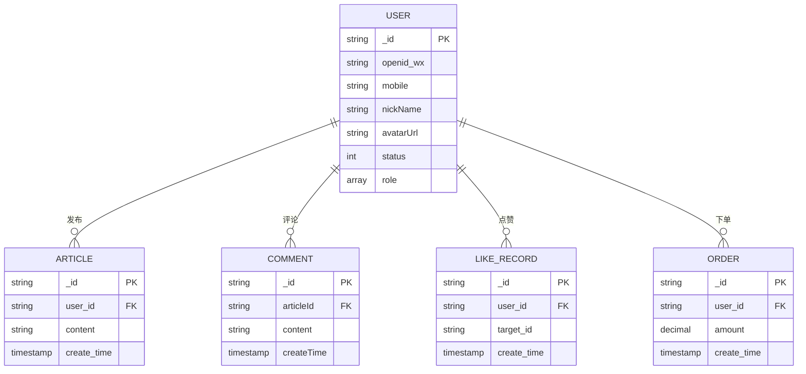

# 用户模型设计

<cite>
**Referenced Files in This Document **   
- [user.schema.json](file://uniCloud-aliyun/database/user.schema.json)
- [userWx/index.obj.js](file://uniCloud-aliyun/cloudfunctions/userWx/index.obj.js)
- [getOpenid/index.js](file://uniCloud-aliyun/cloudfunctions/getOpenid/index.js)
- [articleList.schema.json](file://uniCloud-aliyun/database/articleList.schema.json)
- [commentList.schema.json](file://uniCloud-aliyun/database/commentList.schema.json)
- [config.js](file://uniCloud-aliyun/cloudfunctions/userWx/config.js)
</cite>

## 目录
1. [用户数据模型结构](#用户数据模型结构)
2. [核心字段定义与验证规则](#核心字段定义与验证规则)
3. [索引配置与查询优化](#索引配置与查询优化)
4. [权限控制策略](#权限控制策略)
5. [典型查询示例](#典型查询示例)
6. [与其他模型的关联关系](#与其他模型的关联关系)
7. [性能优化建议](#性能优化建议)

## 用户数据模型结构

用户数据模型定义了系统中用户的核心信息结构，采用JSON Schema格式进行描述。该模型存储在云数据库中，是整个应用的身份认证和用户管理基础。



**Diagram sources **
- [user.schema.json](file://uniCloud-aliyun/database/user.schema.json)

**Section sources**
- [user.schema.json](file://uniCloud-aliyun/database/user.schema.json)

## 核心字段定义与验证规则

### 基础标识字段
- `_id`: 用户唯一标识符，由系统自动生成，作为主键使用。
- `openid_wx`: 微信开放ID，用于微信小程序用户的唯一身份识别，已建立单列索引以优化查询性能。
- `mobile`: 用户手机号，必填字段，需符合中国大陆手机号正则表达式`^1[3-9]\d{9}$`验证规则。

### 个人信息字段
- `nickName`: 用户昵称，字符串类型，用于展示用户名称。
- `avatarUrl`: 头像URL地址，存储用户头像图片的访问链接。
- `gender`: 性别字段，整数类型，0表示未知，1表示男性，2表示女性。

### 状态与权限字段
- `status`: 账户状态，整数类型，0表示正常，1表示禁用，2表示封禁。
- `status_desc`: 状态说明，用于存储账户状态的具体原因，如封禁理由等。
- `role`: 用户角色数组，包含用户的角色列表，如['user', 'vip', 'admin']，默认值为['user']，枚举值限定为'user'、'vip'、'admin'。

### 时间戳字段
- `create_time`: 创建时间，时间戳类型，系统自动填充当前时间。
- `update_time`: 更新时间，时间戳类型，记录用户信息最后更新时间。

### 认证相关字段
- `token`: 用户认证令牌，用于客户端会话保持。
- `session_key`: 会话密钥，用于加密解密用户敏感信息。

**Section sources**
- [user.schema.json](file://uniCloud-aliyun/database/user.schema.json)

## 索引配置与查询优化

用户模型建立了多个索引来优化查询性能：

1. **openid_wx单列索引**: 针对微信开放ID建立的单列索引，极大提升了通过微信openid查找用户的速度，这对于微信小程序的登录流程至关重要。

2. **mobile唯一性约束**: 手机号字段作为必填项，并通过业务逻辑确保其唯一性，支持基于手机号的快速用户查找。

这些索引配置使得以下查询操作具有优秀的性能表现：
- 通过openid_wx快速定位用户
- 基于手机号的用户身份验证
- 用户登录状态检查

索引的设计充分考虑了主要业务场景的查询需求，确保了高频操作的响应速度。

**Section sources**
- [user.schema.json](file://uniCloud-aliyun/database/user.schema.json)

## 权限控制策略

### 角色权限等级
系统采用基于角色的访问控制（RBAC）模型，定义了三种主要角色：
- **普通用户(user)**: 拥有基本的发布内容、评论互动等权限。
- **VIP用户(vip)**: 在普通用户基础上享有额外特权，如优先审核、专属标识等。
- **管理员(admin)**: 拥有内容审核、用户管理等后台管理权限。

### 数据访问边界
不同角色的数据访问权限如下：



**Diagram sources **
- [user.schema.json](file://uniCloud-aliyun/database/user.schema.json)
- [userWx/index.obj.js](file://uniCloud-aliyun/cloudfunctions/userWx/index.obj.js)

**Section sources**
- [user.schema.json](file://uniCloud-aliyun/database/user.schema.json)
- [userWx/index.obj.js](file://uniCloud-aliyun/cloudfunctions/userWx/index.obj.js)

## 典型查询示例

### 根据openid查找用户
```javascript
// 云函数中通过openid查询用户
const userRecord = await dbJQL.collection("user").where({
    openid_wx: openid
}).limit(1).get();
```
此查询利用openid_wx索引实现毫秒级响应，是用户登录流程的核心操作。

### 批量获取作者信息
```javascript
// 根据用户ID数组批量获取用户信息
async getUsersByIds(userIds) {
    const userResult = await dbJQL.collection('user').where({
        _id: db.command.in(userIds)
    }).field({
        _id: true,
        mobile: true,
        nickName: true,
        avatarUrl: true,
        role: true
    }).get();
}
```
该查询用于文章列表页批量获取作者信息，通过_id索引和投影优化减少数据传输量。

### 微信手机号登录流程


**Diagram sources **
- [userWx/index.obj.js](file://uniCloud-aliyun/cloudfunctions/userWx/index.obj.js)
- [config.js](file://uniCloud-aliyun/cloudfunctions/userWx/config.js)

**Section sources**
- [userWx/index.obj.js](file://uniCloud-aliyun/cloudfunctions/userWx/index.obj.js)
- [config.js](file://uniCloud-aliyun/cloudfunctions/userWx/config.js)

## 与其他模型的关联关系

用户模型作为核心实体，与多个业务模型存在关联关系：



**Diagram sources **
- [user.schema.json](file://uniCloud-aliyun/database/user.schema.json)
- [articleList.schema.json](file://uniCloud-aliyun/database/articleList.schema.json)
- [commentList.schema.json](file://uniCloud-aliyun/database/commentList.schema.json)

**Section sources**
- [user.schema.json](file://uniCloud-aliyun/database/user.schema.json)
- [articleList.schema.json](file://uniCloud-aliyun/database/articleList.schema.json)
- [commentList.schema.json](file://uniCloud-aliyun/database/commentList.schema.json)

具体关联包括：
1. **文章发布**: `articleList`集合中的`user_id`字段外键关联到`user`集合的`_id`，记录文章发布者信息。
2. **评论功能**: `commentList`集合直接引用用户信息，支持用户对文章进行评论互动。
3. **社交互动**: 点赞、收藏等功能均以用户为基础，构建用户间的社交关系网络。

## 性能优化建议

1. **索引优化**: 已为`openid_wx`建立单列索引，建议根据查询模式考虑为`mobile`字段也建立索引，以加速手机号相关的查询操作。

2. **查询投影**: 在不需要完整用户信息的场景下，使用`.field()`方法指定需要的字段，减少数据传输量，如仅获取昵称和头像时。

3. **