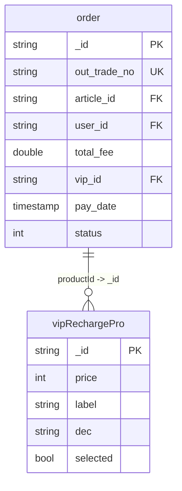
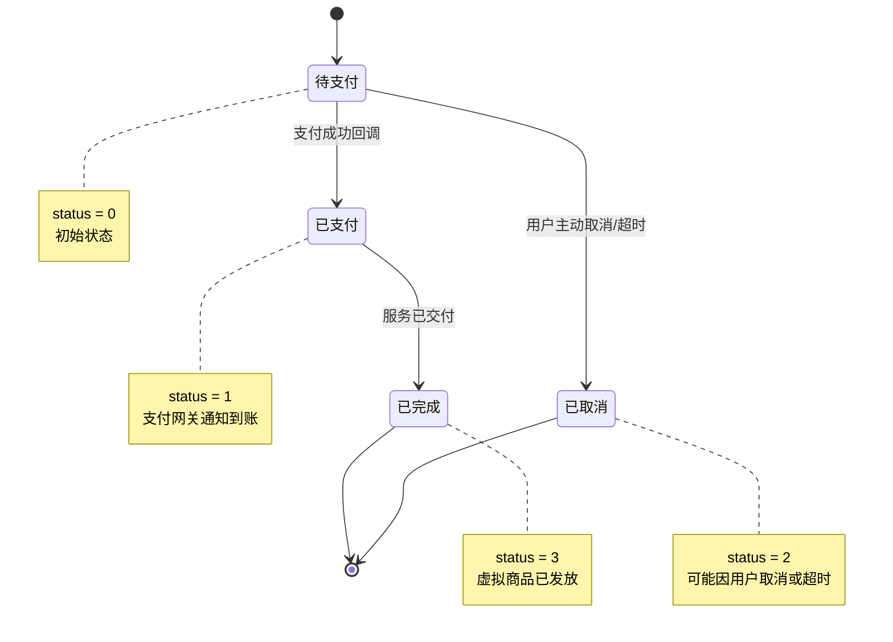
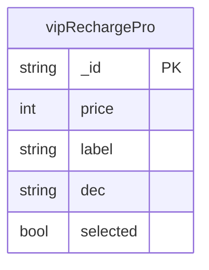

# 订单模型设计

<cite>
**Referenced Files in This Document**  
- [order.schema.json](file://uniCloud-aliyun/database/order.schema.json)
- [vipRechargePro.schema.json](file://uniCloud-aliyun/database/vipRechargePro.schema.json)
- [index.obj.js](file://uniCloud-aliyun/cloudfunctions/order/index.obj.js)
- [rechargeVip/index.obj.js](file://uniCloud-aliyun/cloudfunctions/rechargeVip/index.obj.js)
</cite>

## 目录
1. [简介](#简介)
2. [核心数据模型](#核心数据模型)
3. [订单状态机与流转逻辑](#订单状态机与流转逻辑)
4. [VIP套餐产品配置](#vip套餐产品配置)
5. [订单与VIP套餐的关联机制](#订单与vip套餐的关联机制)
6. [数据库索引设计](#数据库索引设计)
7. [交易对账查询模板](#交易对账查询模板)
8. [未支付订单定时清理逻辑](#未支付订单定时清理逻辑)
9. [数据安全与审计](#数据安全与审计)

## 简介
本文档系统化阐述了基于 `order.schema.json` 定义的支付订单数据模型，并结合 `vipRechargePro.schema.json` 说明 VIP 套餐产品的配置方式。文档详细解释了订单核心字段的业务语义、状态流转机制，以及订单与 VIP 产品之间的引用关系。同时，涵盖了数据库索引策略、运维操作指导和数据安全措施，为系统的开发、维护和审计提供全面的技术依据。

## 核心数据模型

### 支付订单模型 (order.schema.json)
该模型定义了平台内所有支付订单的核心结构与约束。



**Diagram sources**
- [order.schema.json](file://uniCloud-aliyun/database/order.schema.json)
- [vipRechargePro.schema.json](file://uniCloud-aliyun/database/vipRechargePro.schema.json)

#### 字段业务语义
| 字段名 | 类型 | 描述 | 业务语义 |
| :--- | :--- | :--- | :--- |
| `_id` | string | ID，系统自动生成 | MongoDB 文档的唯一主键 |
| `out_trade_no` | string | 订单号 | **商户订单号**，由客户端生成并保证全局唯一，用于防止重复提交和外部系统对账 |
| `article_id` | string | 当前发布人文章id | 外键关联 `articleList._id`，标识此订单关联的文章内容 |
| `user_id` | string | 当前支付用户的id | 外键关联 `user._id`，标识发起支付的用户 |
| `total_fee` | double | 当前充值金额 | 订单的实际支付金额（单位：元） |
| `vip_id` | string | 对应的渠道id | 外键关联 `user._id`，此处命名可能存在歧义，实际用于关联用户 |
| `pay_date` | timestamp | 支付日期 | 订单创建或更新的时间戳，默认值为当前时间 (`$env: now`) |
| `status` | int | 支付状态 | 订单的状态码，驱动整个支付流程 |

**Section sources**
- [order.schema.json](file://uniCloud-aliyun/database/order.schema.json#L1-L50)

## 订单状态机与流转逻辑

订单的生命周期由 `status` 字段精确控制，形成一个清晰的状态机。



**Diagram sources**
- [order.schema.json](file://uniCloud-aliyun/database/order.schema.json#L35-L40)
- [index.obj.js](file://uniCloud-aliyun/cloudfunctions/order/index.obj.js#L45-L55)

### 状态流转说明
1.  **待支付 (status = 0)**：订单创建后的初始状态。此时 `addOrder` 云函数被调用，将订单信息存入数据库。
2.  **已支付 (status = 1)**：当支付网关（如微信支付）通过异步通知确认支付成功后，后端会调用 `updateOrderStauts` 云函数，将 `status` 更新为 1。
3.  **已取消 (status = 2)**：如果用户在规定时间内未完成支付，或主动取消订单，则状态可被标记为 2。
4.  **已完成 (status = 3)**：对于购买虚拟商品（如VIP），在服务成功发放给用户后，状态最终更新为 3，表示交易闭环。

**Section sources**
- [order.schema.json](file://uniCloud-aliyun/database/order.schema.json#L35-L40)
- [index.obj.js](file://uniCloud-aliyun/cloudfunctions/order/index.obj.js#L45-L55)

## VIP套餐产品配置

### VIP套餐产品模型 (vipRechargePro.schema.json)
该模型定义了可供用户选择的VIP充值套餐。



**Diagram sources**
- [vipRechargePro.schema.json](file://uniCloud-aliyun/database/vipRechargePro.schema.json)

#### 字段业务语义
| 字段名 | 类型 | 描述 | 业务语义 |
| :--- | :--- | :--- | :--- |
| `_id` | string | ID，系统自动生成 | MongoDB 文档的唯一主键 |
| `price` | int | 充值金额 | 套餐的价格（单位：分）。例如，99元套餐对应值为 9900。 |
| `label` | string | 文本 | 套餐的显示名称，如“月度会员”、“年度尊享”。 |
| `dec` | string | 描述 | 套餐的详细描述，说明包含的服务权益。 |
| `selected` | bool | 是否选中 | 前端UI用以标识当前默认选中的套餐。 |

**Section sources**
- [vipRechargePro.schema.json](file://uniCloud-aliyun/database/vipRechargePro.schema.json#L1-L32)

## 订单与VIP套餐的关联机制

订单模型本身并未直接包含一个名为 `productId` 的字段来引用VIP套餐。然而，根据业务逻辑分析，其关联是通过以下方式实现的：

1.  **前端选择**：用户在前端界面通过 `getRechargeList` 云函数获取所有可用的VIP套餐列表 (`vipRechargePro` 集合)。
2.  **参数传递**：当用户选择某个套餐并发起支付时，前端会将该套餐的 `price` 和其他信息作为参数传递给 `addOrder` 云函数。
3.  **订单创建**：`addOrder` 函数接收这些参数，并将其组装成订单对象，其中 `total_fee` 字段的值即来源于所选套餐的 `price`。
4.  **间接关联**：虽然 `order` 集合没有直接的外键指向 `vipRechargePro._id`，但 `total_fee` 的数值与 `vipRechargePro.price` 形成了事实上的映射关系。这种设计简化了模型，但在进行精确的套餐维度统计时，需要通过金额进行匹配。

**Section sources**
- [vipRechargePro.schema.json](file://uniCloud-aliyun/database/vipRechargePro.schema.json)
- [index.obj.js](file://uniCloud-aliyun/cloudfunctions/order/index.obj.js#L15-L25)
- [rechargeVip/index.obj.js](file://uniCloud-aliyun/cloudfunctions/rechargeVip/index.obj.js#L8-L12)

## 数据库索引设计

合理的索引设计是保障系统性能和数据一致性的关键。

### 唯一索引 (防止重复提交)
*   **索引字段**: `out_trade_no`
*   **目的**: 确保每个商户订单号在系统中是唯一的。这是防止用户因网络延迟等原因重复点击支付按钮而产生多笔订单的核心保障。数据库层面的唯一性约束是最可靠的防护手段。

### 范围索引 (支持报表统计)
*   **索引字段**: `pay_date`, `status`, `user_id`
*   **目的**: 
    *   `pay_date`: 支持按天、周、月等时间维度进行交易额、订单量的统计分析。
    *   `status`: 快速筛选出特定状态的订单，如查询所有“待支付”订单以进行清理，或查询所有“已支付”订单以生成日报。
    *   `user_id`: 支持按用户查询其历史订单记录。

**Section sources**
- [order.schema.json](file://uniCloud-aliyun/database/order.schema.json)

## 交易对账查询模板

为了方便财务对账，可以使用以下数据库查询语句来获取指定时间段内的已支付订单。

```javascript
// 示例：查询2023年10月1日当天的所有已支付订单
db.collection('order')
  .where({
    status: 1, // 已支付
    pay_date: db.command.gte(new Date('2023-10-01')).and(db.command.lt(new Date('2023-10-02')))
  })
  .orderBy('pay_date', 'desc')
  .get()
```

此查询利用了 `status` 和 `pay_date` 上的索引，能够高效地返回结果，用于核对银行流水。

**Section sources**
- [index.obj.js](file://uniCloud-aliyun/cloudfunctions/order/index.obj.js)

## 未支付订单定时清理逻辑

为避免数据库中积压大量无效的“待支付”订单，应建立定时任务（Cron Job）进行清理。

### 清理逻辑
1.  **触发条件**: 每隔一段时间（如每小时）执行一次。
2.  **筛选条件**: 查询 `status` 为 0（待支付）且 `pay_date` 超过预设有效期（如30分钟）的所有订单。
3.  **处理动作**: 将这些订单的 `status` 更新为 2（已取消）。

### 伪代码实现
```javascript
// 伪代码：定时清理任务
const cutoffTime = new Date(Date.now() - 30 * 60 * 1000); // 30分钟前
await db.collection('order')
  .where({
    status: 0,
    pay_date: db.command.lt(cutoffTime)
  })
  .update({
    status: 2
  });
```

**Section sources**
- [index.obj.js](file://uniCloud-aliyun/cloudfunctions/order/index.obj.js#L45-L55)

## 数据安全与审计

### 敏感信息脱敏存储
*   本模型中不直接存储银行卡号、身份证号等极度敏感信息，符合最小化数据收集原则。
*   所有交易均通过第三方支付网关（如微信支付）完成，平台仅保存必要的订单号、金额和状态。

### 操作日志审计
*   **云函数日志**: 所有对订单状态的修改（如 `updateOrderStauts`）都会在云函数的日志中留下记录，包括调用时间、传入参数和执行结果。
*   **数据库变更追踪**: 可以启用数据库的变更流（Change Stream）功能，实时监控 `order` 集合的任何增删改操作，用于安全审计和异常行为检测。

**Section sources**
- [index.obj.js](file://uniCloud-aliyun/cloudfunctions/order/index.obj.js)