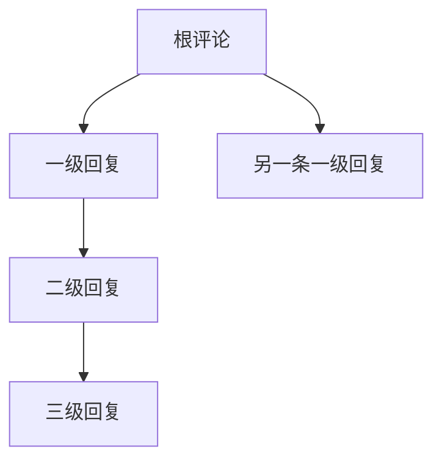
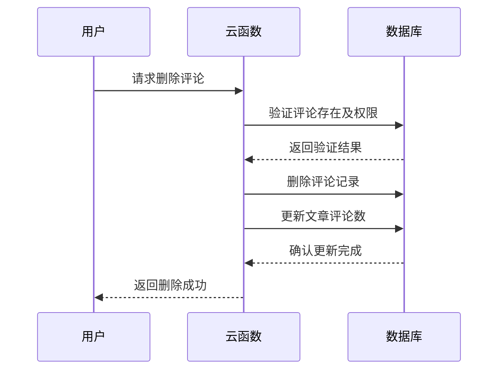

# 评论模型设计

<cite>
**本文档引用文件**  
- [commentList.schema.json](file://uniCloud-aliyun/database/commentList.schema.json)
- [index.obj.js](file://uniCloud-aliyun/cloudfunctions/commentList/index.obj.js)
- [comment-list.vue](file://components/comment-list/comment-list.vue)
</cite>

## 目录
1. [简介](#简介)
2. [核心字段解析](#核心字段解析)
3. [嵌套评论树实现机制](#嵌套评论树实现机制)
4. [分页加载优化策略](#分页加载优化策略)
5. [索引配置与查询效率](#索引配置与查询效率)
6. [典型场景查询示例](#典型场景查询示例)
7. [数据一致性维护](#数据一致性维护)
8. [反垃圾过滤策略](#反垃圾过滤策略)

## 简介
本项目中的评论系统采用灵活的数据结构设计，支持文章、回复等多种目标类型的评论功能。通过`commentList`集合存储所有评论数据，并结合云函数实现完整的增删改查逻辑。前端组件`comment-list.vue`负责渲染评论列表并处理用户交互。

**Section sources**
- [commentList.schema.json](file://uniCloud-aliyun/database/commentList.schema.json#L0-L37)
- [index.obj.js](file://uniCloud-aliyun/cloudfunctions/commentList/index.obj.js#L0-L238)
- [comment-list.vue](file://components/comment-list/comment-list.vue#L0-L450)

## 核心字段解析
评论数据结构包含以下关键字段：

| 字段名 | 类型 | 描述 |
|-------|------|------|
| _id | string | 评论唯一标识符（数据库自动生成） |
| articleId | string | 关联的文章ID |
| content | string | 评论内容，长度限制1-500字符 |
| images | array | 评论附带的图片URL数组 |
| userId | string | 评论者用户ID（在代码中为user_id） |
| targetType | string | 目标类型：如"article"或"reply" |
| targetId | string | 目标对象ID |
| parentId | string | 父级评论ID，用于构建嵌套回复 |
| rootId | string | 根评论ID，用于追踪线程 |
| createTime | timestamp | 评论创建时间 |

目前schema定义中部分字段名称与实际使用存在差异，例如`articleId`在云函数中以`article_id`形式使用。

**Section sources**
- [commentList.schema.json](file://uniCloud-aliyun/database/commentList.schema.json#L0-L37)
- [index.obj.js](file://uniCloud-aliyun/cloudfunctions/commentList/index.obj.js#L50-L65)

## 嵌套评论树实现机制
系统通过`parentId`字段实现无限级嵌套评论树结构。当用户回复某条评论时，将该评论的ID作为新评论的`parentId`值。



这种父子关联模式允许构建深度嵌套的对话线程。前端组件通过递归渲染方式展示多层级评论结构，用户点击任意非自己发布的评论即可触发回复操作。

**Diagram sources**
- [index.obj.js](file://uniCloud-aliyun/cloudfunctions/commentList/index.obj.js#L90-L110)
- [comment-list.vue](file://components/comment-list/comment-list.vue#L40-L50)

**Section sources**
- [index.obj.js](file://uniCloud-aliyun/cloudfunctions/commentList/index.obj.js#L90-L110)
- [comment-list.vue](file://components/comment-list/comment-list.vue#L40-L50)

## 分页加载优化策略
`rootId`字段在分页加载中发挥重要作用。对于大型讨论线程，可通过`rootId`快速定位特定对话分支的所有子评论，避免全量加载整个评论树。

当需要加载某个评论下的完整回复链时，查询条件可设置为：
- `rootId = 指定根评论ID`
- 按`createTime`排序

这种方式显著减少了数据传输量和渲染复杂度，提升了用户体验。

**Section sources**
- [index.obj.js](file://uniCloud-aliyun/cloudfunctions/commentList/index.obj.js#L120-L135)

## 索引配置与查询效率
虽然当前schema未明确定义复合索引，但从查询模式分析，建议创建以下索引以提升性能：

- `(targetId, createTime)` 复合索引：加速按目标对象获取最新评论
- `(userId, createTime)` 索引：优化用户个人评论历史查询
- `parentId` 单字段索引：提高嵌套回复检索速度

这些索引能有效支持常见的分页查询场景，确保即使在大量评论数据下也能保持良好的响应性能。

**Section sources**
- [commentList.schema.json](file://uniCloud-aliyun/database/commentList.schema.json#L0-L37)
- [index.obj.js](file://uniCloud-aliyun/cloudfunctions/commentList/index.obj.js#L70-L85)

## 典型场景查询示例
### 获取某文章的所有一级评论
```javascript
db.collection('commentList')
  .where({
    article_id: '指定文章ID',
    parent_id: null // 或不存在
  })
  .orderBy('create_time', 'desc')
  .get()
```

### 加载某个评论的子回复链
```javascript
db.collection('commentList')
  .where({
    root_id: '根评论ID'
  })
  .orderBy('create_time', 'asc')
  .get()
```

以上查询由云函数`getCommentList`方法封装提供服务接口。

**Section sources**
- [index.obj.js](file://uniCloud-aliyun/cloudfunctions/commentList/index.obj.js#L70-L85)

## 数据一致性维护
系统通过以下机制保障数据一致性：

1. **事务性更新**：删除评论时同步更新文章的评论计数
2. **权限验证**：仅评论作者或管理员可执行删除操作
3. **状态管理**：通过`status`字段控制评论可见性

在删除评论时，不仅移除评论记录，还会自动将对应文章的`comment_count`减1，确保统计数据准确。



**Diagram sources**
- [index.obj.js](file://uniCloud-aliyun/cloudfunctions/commentList/index.obj.js#L140-L160)

**Section sources**
- [index.obj.js](file://uniCloud-aliyun/cloudfunctions/commentList/index.obj.js#L140-L160)

## 反垃圾过滤策略
当前系统主要依赖以下反垃圾措施：

1. **基础参数校验**：检查必要字段完整性
2. **登录状态验证**：添加/删除评论需用户登录
3. **内容长度限制**：评论内容限定1-500字符
4. **频率控制**：虽未显式实现，但可通过云函数层添加

未来可扩展更多高级过滤机制，如敏感词检测、行为分析等，进一步提升社区内容质量。

**Section sources**
- [index.obj.js](file://uniCloud-aliyun/cloudfunctions/commentList/index.obj.js#L95-L105)
- [commentList.schema.json](file://uniCloud-aliyun/database/commentList.schema.json#L5-L10)