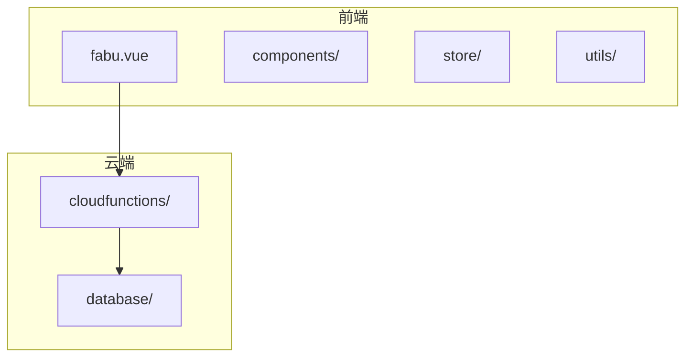
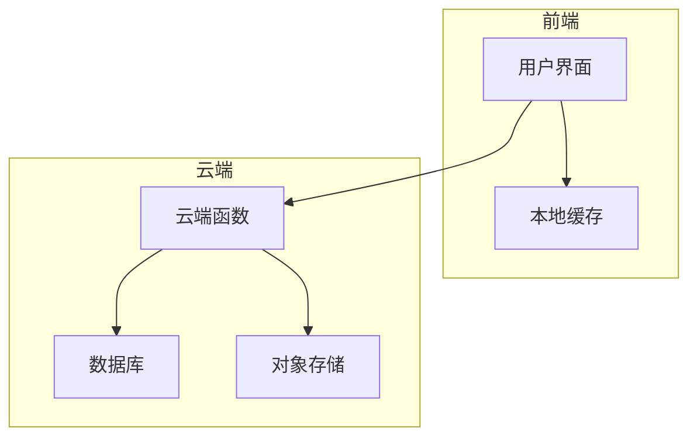
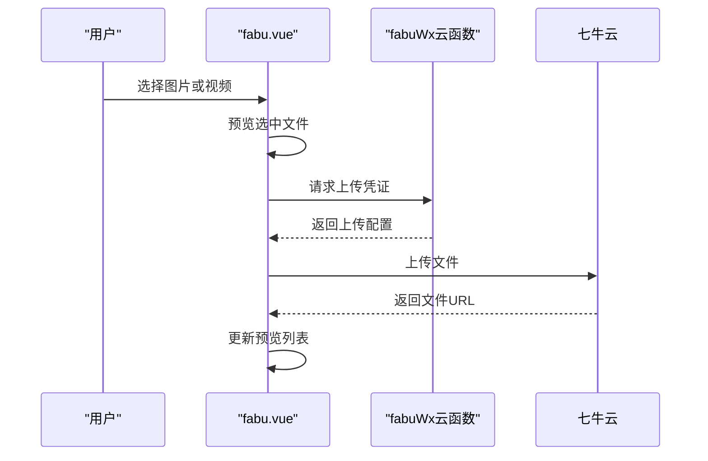
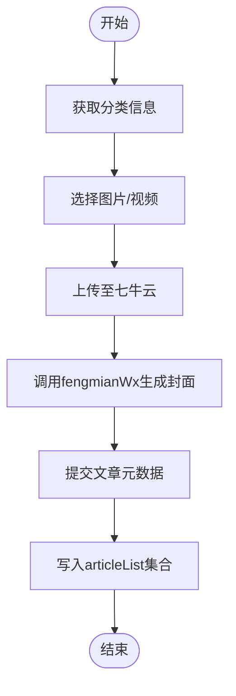
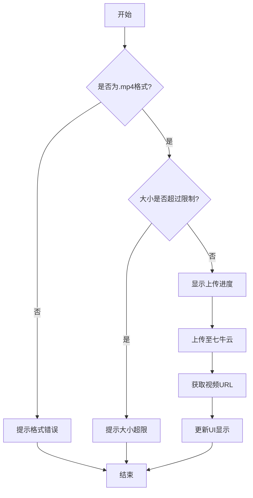
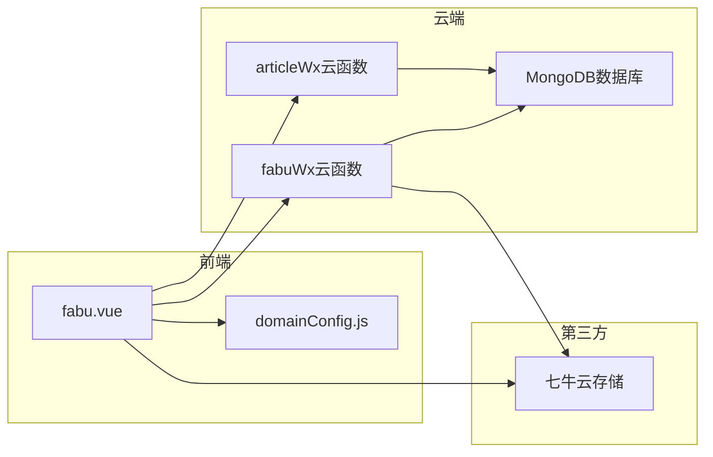

# 内容发布

<cite>
**本文档引用的文件**
- [fabu.vue](file://pages/fabu/fabu.vue)
- [articleList.schema.json](file://uniCloud-aliyun/database/articleList.schema.json)
- [domainConfig.js](file://utils/domainConfig.js)
</cite>

## 目录
1. [简介](#简介)
2. [项目结构](#项目结构)
3. [核心组件](#核心组件)
4. [架构概述](#架构概述)
5. [详细组件分析](#详细组件分析)
6. [依赖分析](#依赖分析)
7. [性能考虑](#性能考虑)
8. [故障排除指南](#故障排除指南)
9. [结论](#结论)

## 简介
本文档全面解析内容发布功能的技术实现，重点描述图文/视频内容从`fabu.vue`页面上传至七牛云的完整流程。涵盖前端文件选择、预览展示、封面生成（fengmianWx云函数）及元数据提交等环节。说明`fabuWx`云函数如何接收客户端请求，处理上传结果并写入`articleList`数据库集合。分析视频上传的特殊处理逻辑，如格式校验、大小限制与进度反馈机制。结合代码实例展示富文本编辑器集成方式与多媒体资源管理策略。讨论性能优化措施，如分片上传、CDN加速与错误重试机制，并提供内容发布失败时的调试指南。

## 项目结构
本项目采用基于Vue的UniApp框架构建，主要包含以下目录结构：
- `components/`: 存放可复用的UI组件
- `pages/`: 存放页面级组件，其中`fabu/fabu.vue`为内容发布主页面
- `store/`: 状态管理模块
- `style/` 和 `styles/`: 样式文件
- `subPages/`: 子页面组件
- `uniCloud-aliyun/`: 云端函数和数据库配置
- `uni_modules/`: 第三方插件模块
- `utils/`: 工具函数库

**图源**
- [fabu.vue](file://pages/fabu/fabu.vue)
- [articleList.schema.json](file://uniCloud-aliyun/database/articleList.schema.json)

**节源**
- [fabu.vue](file://pages/fabu/fabu.vue)

## 核心组件
`fabu.vue`是内容发布功能的核心组件，负责处理用户交互、媒体上传、预览展示和数据提交。该组件通过调用云端函数实现与后端服务的通信，利用`uniCloud.importObject`导入`articleWx`和`fabuWx`云函数进行业务逻辑处理。组件中定义了多个响应式变量用于管理文章内容、图片列表、分类信息、位置数据等状态。

**节源**
- [fabu.vue](file://pages/fabu/fabu.vue#L0-L3113)

## 架构概述
系统采用前后端分离架构，前端运行在小程序环境中，后端部署在阿里云UniCloud平台。前端通过HTTP API与云端函数交互，实现数据持久化和文件存储。整体架构分为三层：表现层（前端UI）、业务逻辑层（云端函数）和数据存储层（MongoDB数据库）。

**图源**
- [fabu.vue](file://pages/fabu/fabu.vue)
- [articleList.schema.json](file://uniCloud-aliyun/database/articleList.schema.json)

## 详细组件分析

### 内容发布流程分析
内容发布流程始于用户在`fabu.vue`页面选择媒体文件，经过预处理后上传至七牛云存储，最后将元数据提交至云端数据库。

#### 前端文件选择与预览

**图源**
- [fabu.vue](file://pages/fabu/fabu.vue#L0-L3113)

#### 封面生成与元数据提交

**图源**
- [fabu.vue](file://pages/fabu/fabu.vue#L0-L3113)
- [articleList.schema.json](file://uniCloud-aliyun/database/articleList.schema.json)

**节源**
- [fabu.vue](file://pages/fabu/fabu.vue#L0-L3113)

### 视频上传特殊处理
视频上传涉及格式校验、大小限制和进度反馈等特殊处理逻辑。

**图源**
- [fabu.vue](file://pages/fabu/fabu.vue#L0-L3113)

**节源**
- [fabu.vue](file://pages/fabu/fabu.vue#L0-L3113)

## 依赖分析
系统依赖于多个外部服务和内部模块协同工作。

**图源**
- [fabu.vue](file://pages/fabu/fabu.vue)
- [articleList.schema.json](file://uniCloud-aliyun/database/articleList.schema.json)
- [domainConfig.js](file://utils/domainConfig.js)

**节源**
- [fabu.vue](file://pages/fabu/fabu.vue)
- [articleList.schema.json](file://uniCloud-aliyun/database/articleList.schema.json)
- [domainConfig.js](file://utils/domainConfig.js)

## 性能考虑
系统在设计时充分考虑了性能优化，采用了多种技术手段提升用户体验。

- **分片上传**: 大文件采用分片上传机制，提高上传成功率
- **CDN加速**: 所有静态资源通过CDN分发，加快加载速度
- **错误重试**: 上传失败时自动重试，最多3次
- **进度反馈**: 实时显示上传进度，提升用户感知
- **域名优化**: 使用`fixImageUrl`函数统一管理图片域名，避免跨域问题

**节源**
- [fabu.vue](file://pages/fabu/fabu.vue)
- [domainConfig.js](file://utils/domainConfig.js)

## 故障排除指南
当内容发布失败时，可按照以下步骤进行排查：

1. 检查网络连接是否正常
2. 确认所选文件格式是否符合要求（图片：JPG/PNG；视频：MP4）
3. 验证文件大小是否超出限制
4. 查看控制台是否有JavaScript错误
5. 检查云端函数日志，定位具体错误原因
6. 确认用户权限是否足够
7. 验证数据库连接状态

常见错误码及解决方案：
- `401`: 用户未登录，需重新授权
- `403`: 权限不足，检查角色权限设置
- `413`: 文件过大，建议压缩后再上传
- `500`: 服务器内部错误，联系管理员查看日志

**节源**
- [fabu.vue](file://pages/fabu/fabu.vue)

## 结论
本文档详细解析了内容发布功能的技术实现，涵盖了从前端交互到后端处理的完整流程。通过分析`fabu.vue`页面的实现细节，展示了如何高效地将图文/视频内容上传至七牛云，并通过云端函数处理业务逻辑。系统设计充分考虑了性能优化和用户体验，采用分片上传、CDN加速等技术手段确保稳定可靠的发布体验。同时提供了完善的故障排除指南，帮助开发者快速定位和解决问题。