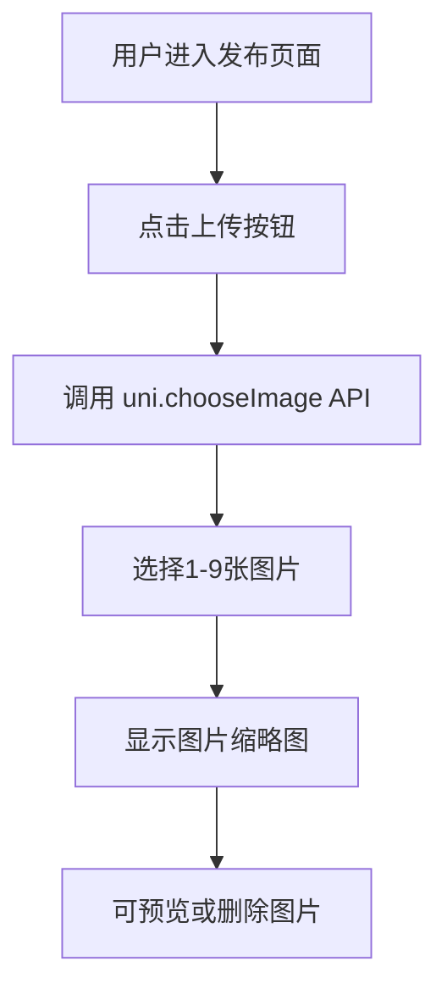
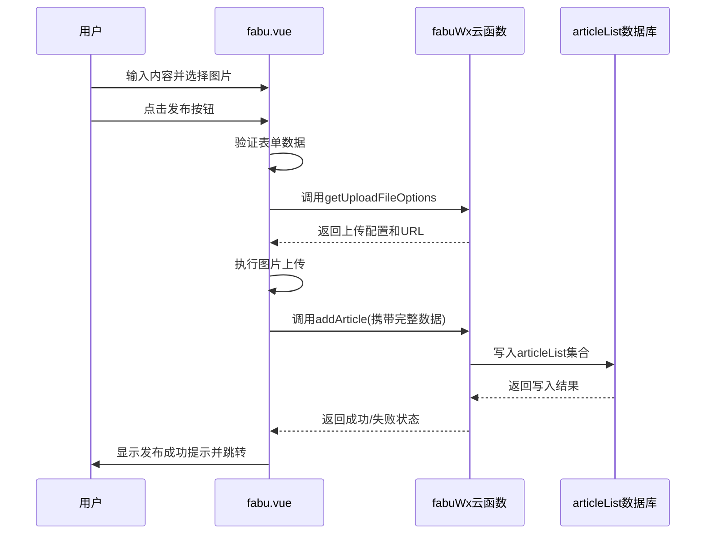
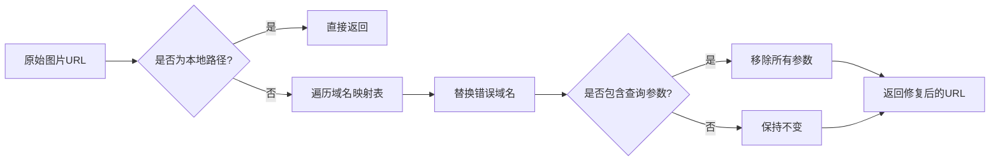

# 图文发布

<cite>
**本文档引用文件**   
- [fabu.vue](file://pages/fabu/fabu.vue)
- [fabuWx/index.obj.js](file://uniCloud-aliyun/cloudfunctions/fabuWx/index.obj.js)
- [articleList.schema.json](file://uniCloud-aliyun/database/articleList.schema.json)
- [domainConfig.js](file://utils/domainConfig.js)
- [uni-file-picker.vue](file://uni_modules/uni-file-picker/components/uni-file-picker/uni-file-picker.vue)
- [u-upload.vue](file://uni_modules/uview-plus/components/u-upload/u-upload.vue)
</cite>

## 目录
1. [项目结构](#项目结构)
2. [核心组件](#核心组件)
3. [前端实现流程](#前端实现流程)
4. [云函数处理逻辑](#云函数处理逻辑)
5. [数据库设计](#数据库设计)
6. [图片域名优化](#图片域名优化)
7. [依赖分析](#依赖分析)

## 项目结构
根据提供的项目目录结构，图文发布功能主要涉及以下几个关键目录：
- `pages/fabu/`：包含发布页面的核心实现文件 `fabu.vue`
- `uniCloud-aliyun/cloudfunctions/`：存放云函数，其中 `fabuWx` 负责处理上传配置和分类管理
- `uniCloud-aliyun/database/`：数据库集合定义，`articleList.schema.json` 定义了文章数据结构
- `uni_modules/`：第三方组件库，使用 `uview-plus` 的 `u-upload` 和 `uni-file-picker` 进行文件操作
- `utils/`：工具函数，`domainConfig.js` 负责图片域名的修复与管理

**Section sources**
- [fabu.vue](file://pages/fabu/fabu.vue#L0-L3113)
- [fabuWx/index.obj.js](file://uniCloud-aliyun/cloudfunctions/fabuWx/index.obj.js#L0-L710)
- [articleList.schema.json](file://uniCloud-aliyun/database/articleList.schema.json#L0-L159)

## 核心组件
本功能的核心组件包括：
- `fabu.vue`：发布页面的主组件，负责用户界面交互、内容输入、图片选择与预览，并调用云函数。
- `fabuWx` 云函数：提供文件上传配置、生成带水印的URL、处理区域分类等后端服务。
- `articleList` 数据库集合：存储发布的文章内容，包括文本、图片列表、视频链接、分类信息等。

这些组件通过 `uniCloud.callFunction` 或 `importObject` 方式进行通信，形成从前端到后端再到数据库的完整链路。

**Section sources**
- [fabu.vue](file://pages/fabu/fabu.vue#L0-L3113)
- [fabuWx/index.obj.js](file://uniCloud-aliyun/cloudfunctions/fabuWx/index.obj.js#L0-L710)
- [articleList.schema.json](file://uniCloud-aliyun/database/articleList.schema.json#L0-L159)

## 前端实现流程
### 图片多选与预览
在 `fabu.vue` 中，通过 `uview-plus` 组件库的 `u-upload` 组件实现图片的多选与预览功能。该组件允许用户从相册或相机选择最多9张图片，并在界面上以宫格形式展示缩略图。用户可以点击缩略图进行全屏预览，也可以删除已选图片。

**Diagram sources**
- [u-upload.vue](file://uni_modules/uview-plus/components/u-upload/u-upload.vue#L0-L613)
- [fabu.vue](file://pages/fabu/fabu.vue#L0-L3113)

### 文件类型校验与大小限制
前端结合 `uni-file-picker` 组件对文件进行类型和大小的初步校验。虽然 `uni-file-picker` 主要用于通用文件选择，但在本项目中，其配置确保只允许选择图片文件（`file-mediatype="image"`），并通过 `limit` 属性限制最大上传数量为9。实际的文件大小限制由云函数在后端执行。

### 富文本编辑与数据绑定
页面使用 `u--textarea` 组件作为富文本编辑器，通过 `v-model` 双向绑定 `content` 变量来实现数据绑定。用户输入的标题和正文内容实时反映在数据模型中，为后续提交做准备。

### 提交逻辑
当用户点击发布按钮时，前端执行以下步骤：
1. 验证标题和正文是否为空。
2. 检查是否选择了分类。
3. 收集所有已上传图片的URL，构建成包含 `url`、`compressedURL`、`thumbnailURL` 的对象数组。
4. 将用户输入的内容、图片URL列表、分类ID、位置信息等封装成一个JSON对象。
5. 调用 `uniCloud.callFunction` 方法，传入函数名 `fabuWx` 和参数对象，发起云函数调用。

**Diagram sources**
- [fabu.vue](file://pages/fabu/fabu.vue#L0-L3113)
- [fabuWx/index.obj.js](file://uniCloud-aliyun/cloudfunctions/fabuWx/index.obj.js#L0-L710)

### 发布后处理
发布成功后，页面会通过 `uni.showToast` 显示成功提示，并使用 `uni.redirectTo` 或 `uni.navigateBack` 跳转回文章列表页。如果发布失败，则捕获错误并显示相应的错误提示，如“请检查网络连接”或“内容不能为空”。

**Section sources**
- [fabu.vue](file://pages/fabu/fabu.vue#L0-L3113)

## 云函数处理逻辑
### 接收请求与权限验证
`fabuWx` 云函数接收来自前端的请求。虽然当前代码中未显式验证用户权限（如检查 `auth.uid`），但通常此类操作应在云函数的 `_before` 钩子或函数内部通过 `uniCloud.getAuthToken()` 获取用户身份信息来完成。

### 敏感词过滤
当前提供的 `fabuWx` 代码中未实现敏感词过滤功能。此功能需要额外集成文本审核API或维护一个敏感词库，在 `addArticle` 之前对 `content` 字段进行扫描和替换。

### 生成唯一ID与写入数据库
云函数本身不直接生成文章的唯一ID。ID的生成由数据库自动完成。当调用 `db.collection('articleList').add()` 方法时，MongoDB 会自动生成一个唯一的 `_id`。云函数的主要职责是将接收到的数据整理后，调用 `articleWx` 云函数中的 `addArticle` 方法，最终将数据写入 `articleList` 集合。

**Section sources**
- [fabuWx/index.obj.js](file://uniCloud-aliyun/cloudfunctions/fabuWx/index.obj.js#L0-L710)
- [articleWx/index.obj.js](file://uniCloud-aliyun/cloudfunctions/articleWx/index.obj.js#L0-L793)

## 数据库设计
### articleList 集合结构
`articleList.schema.json` 定义了文章数据的结构，其核心字段如下：

| 字段名 | 类型 | 描述 |
| :--- | :--- | :--- |
| _id | string | 文章唯一标识符，系统自动生成 |
| user_id | string | 发布者ID，关联 `user._id` |
| content | string | 文章正文内容，最大长度500字符 |
| images | array | 图片URL列表，每个元素包含原图、压缩图和缩略图URL |
| videoURL | string | 视频地址 |
| cate_id | string | 分类ID，关联 `cateList._id` |
| address | string | 发布时的地理位置 |
| district | string | 区县信息 |
| create_time | timestamp | 创建时间，默认为当前时间 |
| state | int | 文章状态：0-待审核, 1-已通过, 2-已拒绝 |

**Table sources**
- [articleList.schema.json](file://uniCloud-aliyun/database/articleList.schema.json#L0-L159)

## 图片域名优化
项目通过 `utils/domainConfig.js` 实现了图片域名的集中管理和优化。该模块提供了 `fixImageUrl` 函数，用于：
1. **修复错误域名**：将旧的或错误的域名（如 `jingle350.cn`）映射到正确的域名（`aly22.jingle0350.cn`）。
2. **移除冗余参数**：自动移除URL中的 `?imageMogr2` 等图片处理参数，确保加载原始高质量图片。
3. **本地路径保护**：对于以 `/` 开头的本地路径，不做任何处理，直接返回。

在 `fabu.vue` 中，无论是上传成功后的回调还是加载已有文章数据时，都会调用 `fixImageUrl` 来处理所有图片URL，保证了图片显示的一致性和正确性。

**Diagram sources**
- [domainConfig.js](file://utils/domainConfig.js#L0-L122)
- [fabu.vue](file://pages/fabu/fabu.vue#L0-L3113)

## 依赖分析
### 组件依赖
- `uview-plus`：提供 `u-upload` 组件，用于图片的选择、上传和预览。
- `uni-file-picker`：提供文件选择能力，与 `u-upload` 协同工作，增强文件管理功能。

### 云函数依赖
- `fabuWx`：被 `fabu.vue` 调用，提供上传配置和分类处理。
- `articleWx`：被 `fabuWx` 或 `fabu.vue` 调用，负责文章数据的增删改查。

### 数据库依赖
- `articleList`：存储文章主体数据。
- `cateList`：存储文章分类信息，`fabuWx` 在创建基于位置的分类时会访问此集合。

整个系统的依赖关系清晰，前端通过云函数作为中间层与数据库交互，实现了前后端分离和安全控制。

**Section sources**
- [fabu.vue](file://pages/fabu/fabu.vue#L0-L3113)
- [fabuWx/index.obj.js](file://uniCloud-aliyun/cloudfunctions/fabuWx/index.obj.js#L0-L710)
- [articleWx/index.obj.js](file://uniCloud-aliyun/cloudfunctions/articleWx/index.obj.js#L0-L793)
- [articleList.schema.json](file://uniCloud-aliyun/database/articleList.schema.json#L0-L159)
- [uni-file-picker.vue](file://uni_modules/uni-file-picker/components/uni-file-picker/uni-file-picker.vue#L0-L669)
- [u-upload.vue](file://uni_modules/uview-plus/components/u-upload/u-upload.vue#L0-L613)