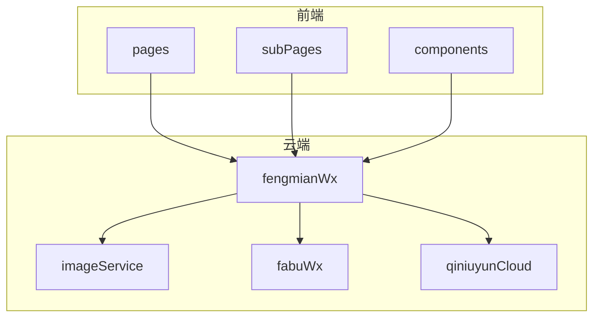
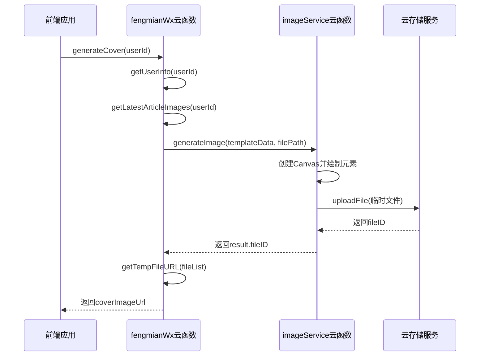
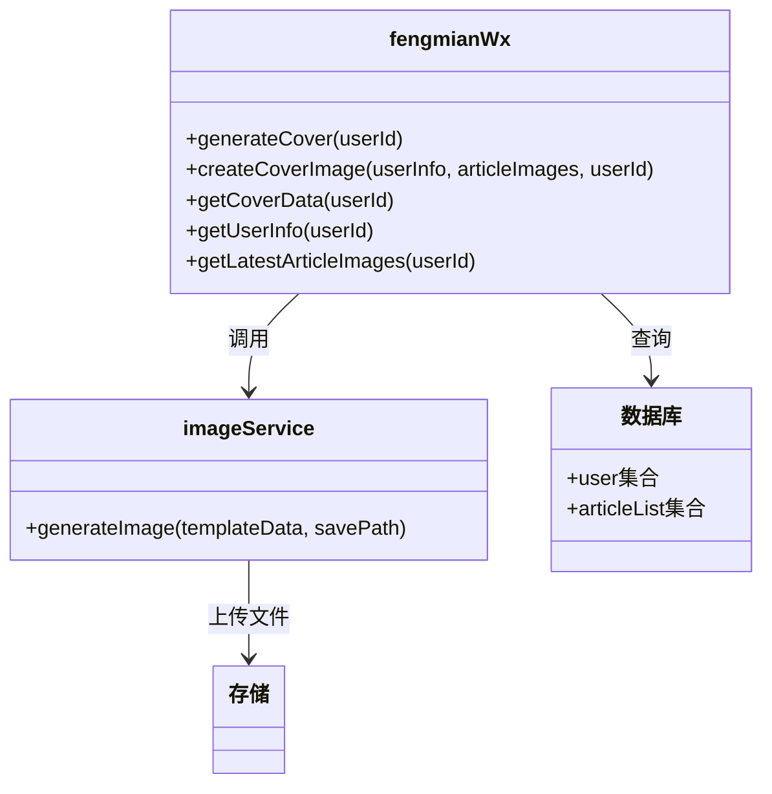
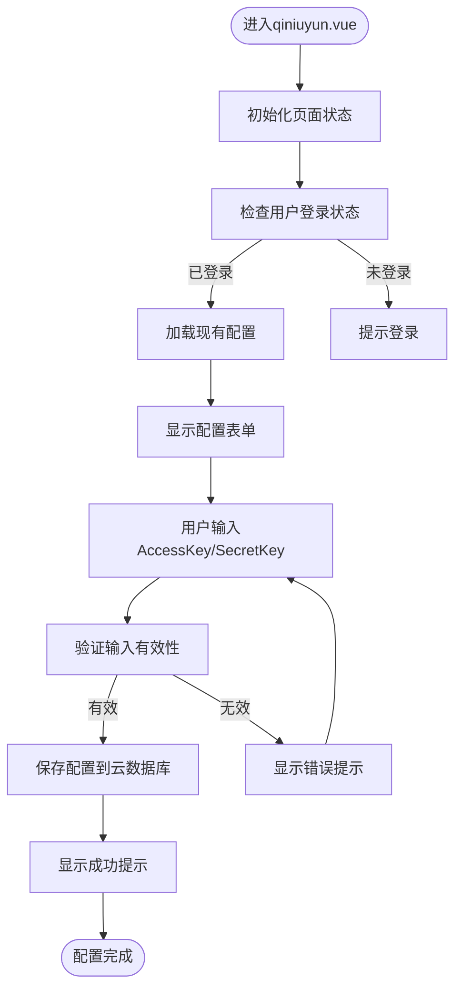
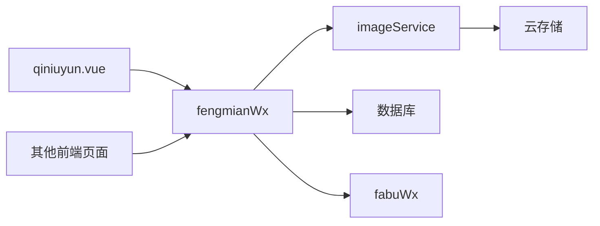

# 封面生成

<cite>
**本文档引用的文件**
- [fengmianWx/index.obj.js](file://uniCloud-aliyun/cloudfunctions/fengmianWx/index.obj.js)
- [qiniuyun.vue](file://subPages/qiniuyun/qiniuyun.vue)
- [imageService/index.obj.js](file://uniCloud-aliyun/cloudfunctions/imageService/index.obj.js)
- [fabuWx/index.obj.js](file://uniCloud-aliyun/cloudfunctions/fabuWx/index.obj.js)
</cite>

## 目录
1. [简介](#简介)
2. [项目结构](#项目结构)
3. [核心组件](#核心组件)
4. [架构概述](#架构概述)
5. [详细组件分析](#详细组件分析)
6. [依赖分析](#依赖分析)
7. [性能考虑](#性能考虑)
8. [故障排除指南](#故障排除指南)
9. [结论](#结论)

## 简介
本文档深入剖析文章封面自动生成的技术方案。当用户发布图文或视频内容时，系统会自动截取第一张图片或视频首帧作为默认封面。重点解析`fengmianWx`云函数的核心作用：接收原始媒体资源链接，调用七牛云API进行图像处理（如缩放、裁剪、水印添加），生成符合尺寸要求（例如300x200）的封面图并返回CDN地址。结合`qiniuyun.vue`管理界面，展示开发者如何配置七牛云的AccessKey、SecretKey及存储空间参数。提供代码实例演示前端如何传递参数至云函数，并处理异步生成结果，确保封面与内容同步更新。

## 项目结构
本项目采用分层模块化设计，主要包含前端页面、云函数和公共模块三大部分。前端页面按功能划分在`pages`和`subPages`目录下，云函数部署于`uniCloud-aliyun/cloudfunctions`目录中，实现了业务逻辑与前端展示的分离。

**图表来源**
- [fengmianWx/index.obj.js](file://uniCloud-aliyun/cloudfunctions/fengmianWx/index.obj.js)
- [qiniuyun.vue](file://subPages/qiniuyun/qiniuyun.vue)

**章节来源**
- [fengmianWx/index.obj.js](file://uniCloud-aliyun/cloudfunctions/fengmianWx/index.obj.js)
- [qiniuyun.vue](file://subPages/qiniuyun/qiniuyun.vue)

## 核心组件
系统的核心在于`fengmianWx`云函数，它负责整个封面生成流程的协调与执行。该函数通过调用`getLatestArticleImages`获取用户最新文章的图片列表，并利用`createCoverImage`方法在云端合成最终的封面图片。同时，`imageService`云函数提供了底层的图像绘制能力，使用Node.js的canvas库实现动态图片生成。

**章节来源**
- [fengmianWx/index.obj.js](file://uniCloud-aliyun/cloudfunctions/fengmianWx/index.obj.js)
- [imageService/index.obj.js](file://uniCloud-aliyun/cloudfunctions/imageService/index.obj.js)

## 架构概述
系统的整体架构遵循前后端分离原则，前端通过云对象调用机制与后端云函数交互。当需要生成封面时，前端发起请求到`fengmianWx`云函数，后者再协同`imageService`完成复杂的图像处理任务。

**图表来源**
- [fengmianWx/index.obj.js](file://uniCloud-aliyun/cloudfunctions/fengmianWx/index.obj.js)
- [imageService/index.obj.js](file://uniCloud-aliyun/cloudfunctions/imageService/index.obj.js)

## 详细组件分析

### fengmianWx云函数分析
`fengmianWx`是封面生成的核心控制器，其主要职责包括数据准备、流程调度和结果返回。

#### 类图

**图表来源**
- [fengmianWx/index.obj.js](file://uniCloud-aliyun/cloudfunctions/fengmianWx/index.obj.js)
- [imageService/index.obj.js](file://uniCloud-aliyun/cloudfunctions/imageService/index.obj.js)

**章节来源**
- [fengmianWx/index.obj.js](file://uniCloud-aliyun/cloudfunctions/fengmianWx/index.obj.js)

### qiniuyun.vue管理界面分析
`qiniuyun.vue`页面为开发者提供了七牛云存储的配置界面，支持设置AccessKey、SecretKey等关键参数。

#### 流程图

**图表来源**
- [qiniuyun.vue](file://subPages/qiniuyun/qiniuyun.vue)

**章节来源**
- [qiniuyun.vue](file://subPages/qiniuyun/qiniuyun.vue)

## 依赖分析
系统各组件之间存在明确的依赖关系，形成了一个清晰的服务调用链。

**图表来源**
- [fengmianWx/index.obj.js](file://uniCloud-aliyun/cloudfunctions/fengmianWx/index.obj.js)
- [qiniuyun.vue](file://subPages/qiniuyun/qiniuyun.vue)

**章节来源**
- [fengmianWx/index.obj.js](file://uniCloud-aliyun/cloudfunctions/fengmianWx/index.obj.js)
- [qiniuyun.vue](file://subPages/qiniuyun/qiniuyun.vue)

## 性能考虑
封面生成过程涉及多个I/O操作，包括数据库查询、网络请求和文件读写。建议对频繁访问的数据进行缓存，减少重复查询带来的延迟。同时，图像处理属于计算密集型任务，应合理控制并发数量，避免服务器资源耗尽。

## 故障排除指南
常见问题包括七牛云凭证失效、图像处理超时等。可通过查看云函数日志定位具体错误原因。对于凭证问题，需重新在`qiniuyun.vue`页面配置正确的AccessKey和SecretKey；对于超时问题，可适当增加云函数执行时间限制。

**章节来源**
- [fengmianWx/index.obj.js](file://uniCloud-aliyun/cloudfunctions/fengmianWx/index.obj.js)
- [qiniuyun.vue](file://subPages/qiniuyun/qiniuyun.vue)

## 结论
本文档全面解析了基于uniCloud平台的文章封面自动生成技术方案。通过`fengmianWx`云函数与`imageService`的协同工作，实现了高效、灵活的封面图片生成功能。结合友好的前端管理界面，使得整个系统既强大又易于维护。