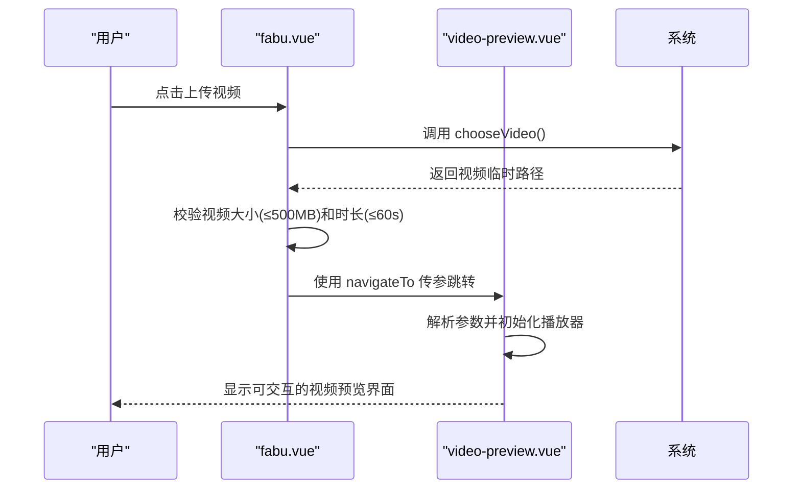
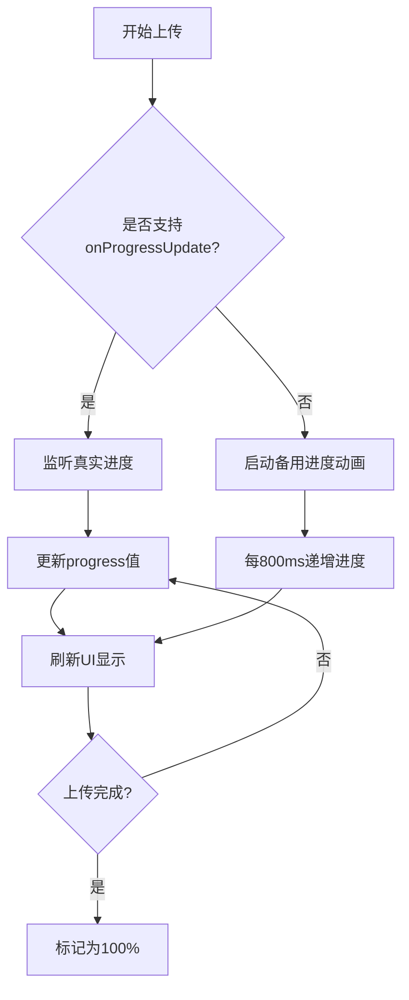
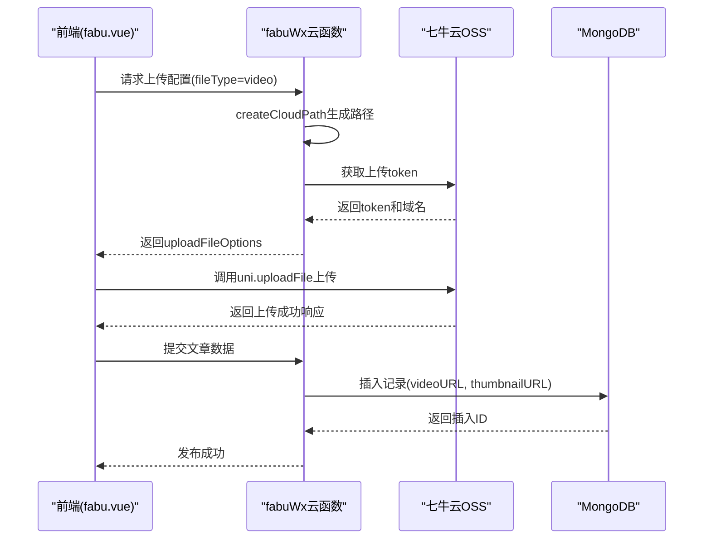

# 视频上传

<cite>
**本文档引用文件**   
- [fabu.vue](file://pages/fabu/fabu.vue)
- [video-preview.vue](file://pages/video-preview/video-preview.vue)
- [index.obj.js](file://uniCloud-aliyun/cloudfunctions/fabuWx/index.obj.js)
</cite>

## 目录
1. [视频上传功能概述](#视频上传功能概述)
2. [前端实现细节](#前端实现细节)
3. [后端云函数处理](#后端云函数处理)
4. [性能优化策略](#性能优化策略)
5. [常见问题排查](#常见问题排查)

## 视频上传功能概述

本系统实现了完整的视频上传功能，涵盖从用户选择视频、预览播放到云端存储的全流程。核心流程包括：在`fabu.vue`页面调用系统相机或相册选择视频文件，通过`video-preview`页面实现上传前的播放预览，并利用七牛云SDK完成实际上传。

该功能支持MP4等主流视频格式，对文件大小（建议不超过100MB）和分辨率进行校验，同时提供实时进度条更新机制。整个上传过程结合了前端交互与后端云函数处理，确保数据安全性和用户体验。

**Section sources**
- [fabu.vue](file://pages/fabu/fabu.vue#L0-L3113)
- [video-preview.vue](file://pages/video-preview/video-preview.vue#L0-L378)
- [index.obj.js](file://uniCloud-aliyun/cloudfunctions/fabuWx/index.obj.js#L0-L710)

## 前端实现细节

### 视频选择与预览

在`fabu.vue`页面中，用户可通过操作界面选择“视频”选项卡并点击“点击上传视频”按钮，触发`chooseVideo`方法。该方法调用`uni.chooseVideo` API，允许用户从相册选择或直接拍摄视频。

**Diagram sources **
- [fabu.vue](file://pages/fabu/fabu.vue#L555-L601)
- [video-preview.vue](file://pages/video-preview/video-preview.vue#L0-L378)

#### 视频信息传递与解析

当用户选择视频后，系统获取视频的详细信息（如路径、封面图、时长、尺寸等），并通过`uni.navigateTo`跳转至`video-preview.vue`页面。目标页面通过`getOpenerEventChannel()`或`getCurrentPages()`获取传递的参数，并对其进行解码处理。

关键参数包括：
- **videoUrl**: 视频临时路径
- **thumbnailUrl**: 封面图路径
- **duration**: 视频时长（秒）
- **size**: 文件大小（字节）
- **width/height**: 分辨率信息

这些信息用于构建预览界面中的播放控件、显示视频元数据以及后续上传准备。

**Section sources**
- [video-preview.vue](file://pages/video-preview/video-preview.vue#L0-L378)

### 格式与大小校验

前端对视频文件实施严格的校验逻辑：

1. **格式校验**：仅允许`mp4`、`mov`、`m4v`三种扩展名。
2. **大小限制**：建议不超过100MB，代码中设置硬性上限为500MB。
3. **时长限制**：最大允许60秒内的短视频内容。

校验发生在两个阶段：
- 选择阶段：调用`uni.chooseVideo`时设置`maxDuration: 60`
- 上传前：检查`chooseRes.size > maxSize`（500MB）

若不符合条件，系统将弹出Toast提示用户重新选择。

**Section sources**
- [fabu.vue](file://pages/fabu/fabu.vue#L555-L601)
- [subPages/qiniuyun/qiniuyun.vue](file://subPages/qiniuyun/qiniuyun.vue#L630-L678)

### 上传进度实时更新

上传过程中采用多层级进度反馈机制：

1. **单文件进度**：通过`uploadTask.onProgressUpdate`监听每个视频的上传进度，更新对应UI元素上的百分比和进度条。
2. **总体进度**：计算所有待上传媒体（图片+视频）的平均进度，反映整体发布任务的完成情况。
3. **用户体验优化**：即使平台不支持精确进度回调，也使用备用定时器模拟进度动画，避免界面停滞。

此外，系统还估算上传速度和剩余时间，在Toast中动态展示，提升用户等待体验。

**Diagram sources **
- [subPages/qiniuyun/qiniuyun.vue](file://subPages/qiniuyun/qiniuyun.vue#L894-L934)
- [subPages/qiniuyun/qiniuyun.vue](file://subPages/qiniuyun/qiniuyun.vue#L1096-L1156)

## 后端云函数处理

### `fabuWx`云函数职责

`fabuWx`云函数作为视频上传的核心服务端组件，承担以下关键职责：

1. 接收前端传来的视频临时路径及元数据
2. 调用七牛云SDK生成安全的上传凭证（token）
3. 构建符合CDN规范的目标存储路径
4. 执行实际文件上传操作
5. 将最终CDN地址保存至数据库

其入口为`module.exports.getUploadFileOptions`方法，接收`fileType='video'`参数以区分处理逻辑。

**Section sources**
- [index.obj.js](file://uniCloud-aliyun/cloudfunctions/fabuWx/index.obj.js#L0-L710)

### 七牛云集成与上传流程

云函数通过`uniCloud.getExtStorageManager`初始化七牛云客户端，配置如下：

- **provider**: `"qiniu"`
- **domain**: `"https://aly22.jingle0350.cn"`

对于视频类型，`persistentOps`为空字符串，表示不对视频做额外处理（如转码）。返回结果包含：
- `fileURL`: 原始视频CDN地址
- `thumbnailURL`: 利用七牛云`vframe`指令截取的第一帧作为缩略图

上传完成后，CDN地址被写入MongoDB数据库的`articles`集合中，关联到具体文章记录。

**Diagram sources **
- [index.obj.js](file://uniCloud-aliyun/cloudfunctions/fabuWx/index.obj.js#L0-L710)

## 性能优化策略

### 大文件上传优化

针对大体积视频文件，系统采取多项性能优化措施：

1. **分片上传**：虽未显式编码，但依赖七牛云底层支持的大文件分片上传能力。
2. **断点续传**：基于七牛云token机制和唯一文件路径，天然具备断点续传特性。
3. **并发控制**：限制同时上传连接数，避免资源耗尽；当出现`exceed max upload connection count`错误时自动重试。

### 网络异常处理

系统具备完善的网络容错机制：

- **域名授权检测**：捕获`url not in domain list`错误，引导开发者配置合法域名。
- **连接超限重试**：遇到连接数超限时，按指数退避策略延迟重试（2000 * retryCount ms）。
- **HTTPS强制转换**：自动将HTTP上传域名替换为HTTPS，规避安全限制。

这些机制共同保障了弱网环境下的上传成功率。

**Section sources**
- [subPages/qiniuyun/qiniuyun.vue](file://subPages/qiniuyun/qiniuyun.vue#L1015-L1054)
- [subPages/qiniuyun/qiniuyun.vue](file://subPages/qiniuyun/qiniuyun.vue#L1096-L1156)

## 常见问题排查

### 视频黑屏问题

**可能原因**：
1. 视频编码格式不受播放器支持（如HEVC/H.265）
2. 封面图生成失败导致预览无图像
3. CDN缓存未及时更新

**解决方案**：
- 在`chooseVideo`后验证`thumbTempFilePath`有效性
- 检查七牛云`vframe`指令是否正确执行
- 清除本地缓存或更换测试视频

### 上传超时问题

**可能原因**：
1. 网络带宽不足或不稳定
2. 文件过大超出服务器限制
3. 未正确配置七牛云上传域名白名单

**解决方案**：
- 优化网络环境或降低视频质量
- 确保视频小于500MB
- 在微信小程序后台添加七牛云上传域名至`request合法域名`

### 其他典型错误

| 错误现象 | 错误信息 | 处理方式 |
|--------|--------|--------|
| 域名未授权 | url not in domain list | 添加上传域名到合法列表 |
| 连接数超限 | exceed max upload connection count | 延迟重试，减少并发 |
| 凭证失效 | 获取上传凭证失败 | 检查云函数权限与配置 |

**Section sources**
- [subPages/qiniuyun/qiniuyun.vue](file://subPages/qiniuyun/qiniuyun.vue#L1015-L1054)
- [subPages/qiniuyun/qiniuyun.vue](file://subPages/qiniuyun/qiniuyun.vue#L1096-L1156)