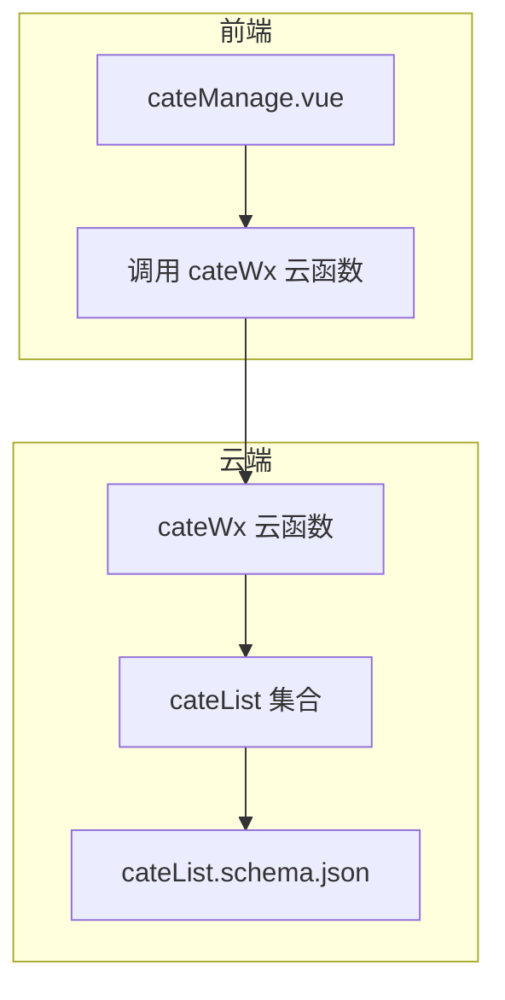
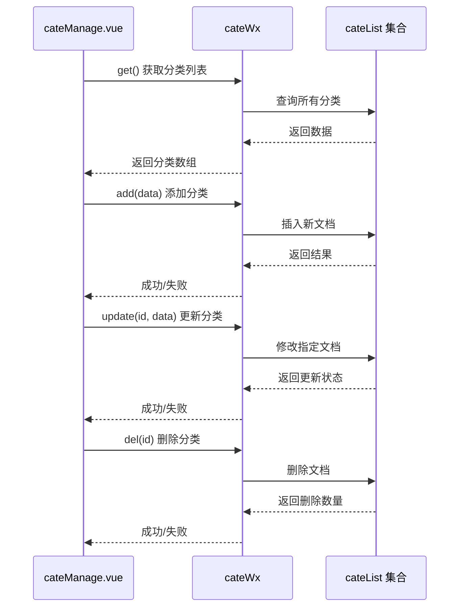
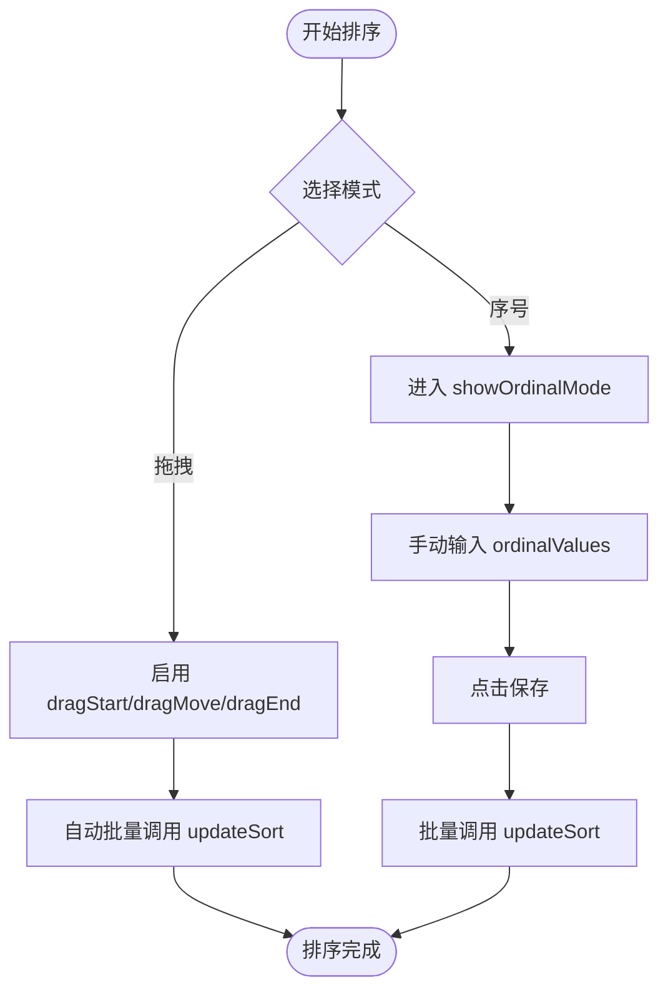
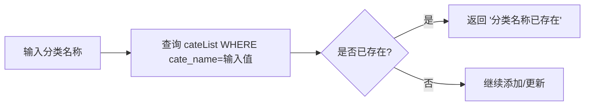
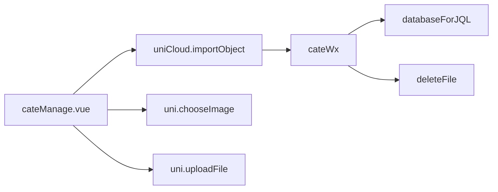

# 分类管理

<cite>
**本文档引用文件**  
- [cateManage.vue](file://subPages/cateManage/cateManage.vue)
- [index.obj.js](file://uniCloud-aliyun/cloudfunctions/cateWx/index.obj.js)
- [cateList.schema.json](file://uniCloud-aliyun/database/cateList.schema.json)
</cite>

## 目录
1. [项目结构](#项目结构)  
2. [核心组件](#核心组件)  
3. [架构概述](#架构概述)  
4. [详细组件分析](#详细组件分析)  
5. [依赖分析](#依赖分析)  
6. [性能考虑](#性能考虑)  
7. [故障排除指南](#故障排除指南)  
8. [结论](#结论)

## 项目结构

本项目采用模块化设计，分类管理功能位于 `subPages/cateManage` 目录下。前端界面由 `cateManage.vue` 实现，后端云函数通过 `uniCloud-aliyun/cloudfunctions/cateWx` 提供 CRUD 接口，数据模型定义在 `uniCloud-aliyun/database/cateList.schema.json` 中。

**图示来源**  
- [cateManage.vue](file://subPages/cateManage/cateManage.vue)
- [index.obj.js](file://uniCloud-aliyun/cloudfunctions/cateWx/index.obj.js)
- [cateList.schema.json](file://uniCloud-aliyun/database/cateList.schema.json)

**章节来源**  
- [cateManage.vue](file://subPages/cateManage/cateManage.vue)

## 核心组件

`cateManage.vue` 是分类管理的主界面组件，负责渲染分类列表、处理用户交互（新增、编辑、排序、删除），并调用 `cateWx` 云函数进行数据操作。该组件使用 Vue 3 的 Composition API 构建，结合 uni-app 框架实现跨平台兼容性。

**章节来源**  
- [cateManage.vue](file://subPages/cateManage/cateManage.vue)

## 架构概述

系统采用前后端分离架构，前端通过 `uniCloud.importObject('cateWx')` 调用云函数，实现对分类数据的安全访问与操作。数据存储于 MongoDB 风格的集合中，并通过 JSON Schema 定义字段规范。

**图示来源**  
- [cateManage.vue](file://subPages/cateManage/cateManage.vue)
- [index.obj.js](file://uniCloud-aliyun/cloudfunctions/cateWx/index.obj.js)

**章节来源**  
- [cateManage.vue](file://subPages/cateManage/cateManage.vue)
- [index.obj.js](file://uniCloud-aliyun/cloudfunctions/cateWx/index.obj.js)

## 详细组件分析

### 分类树形结构或列表的渲染方式

`cateManage.vue` 使用 `v-for` 指令遍历 `cateList` 数组，动态渲染分类项。列表按 `sort` 字段倒序排列，确保高权重分类优先显示。支持滚动加载和位置记忆，提升用户体验。

**章节来源**  
- [cateManage.vue](file://subPages/cateManage/cateManage.vue)

### 新增、编辑、排序、删除操作的用户交互流程

#### 新增分类
1. 用户点击“添加”按钮。
2. 弹出模态框，输入分类名称、选择图标。
3. 点击确认，调用 `cateApi.add()` 方法。
4. 后端验证唯一性后插入数据。
5. 刷新列表并提示成功。

#### 编辑分类
1. 用户点击某分类的编辑按钮。
2. 弹出模态框，预填充当前信息。
3. 修改内容后点击确认，调用 `cateApi.update()` 方法。
4. 后端验证并更新记录。
5. 刷新列表并提示成功。

#### 排序操作
支持两种排序模式：
- **拖拽排序**：用户长按分类项开始拖动，实时交换位置，松开后自动保存。
- **序号排序**：进入序号模式，手动调整每个分类的排序值，最后统一提交。

**图示来源**  
- [cateManage.vue](file://subPages/cateManage/cateManage.vue)

**章节来源**  
- [cateManage.vue](file://subPages/cateManage/cateManage.vue)

#### 删除分类
1. 用户点击删除按钮。
2. 显示确认对话框，防止误删。
3. 确认后调用 `cateApi.del(id)`。
4. 后端执行删除并清理关联云存储图片。
5. 刷新列表并提示结果。

**章节来源**  
- [cateManage.vue](file://subPages/cateManage/cateManage.vue)
- [index.obj.js](file://uniCloud-aliyun/cloudfunctions/cateWx/index.obj.js)

### 表单验证规则与图标选择功能

#### 分类名称唯一性验证
在 `add` 和 `update` 操作中，云函数会查询数据库检查是否存在同名分类：
- `add` 时直接检查 `cate_name` 是否已存在。
- `update` 时排除当前 ID，避免自身冲突。

**图示来源**  
- [index.obj.js](file://uniCloud-aliyun/cloudfunctions/cateWx/index.obj.js)

#### 图标选择功能
用户可通过相册或拍照上传图片，前端压缩后上传至云存储，返回 `fileID` 存入 `cate_img` 字段。若为临时路径，则替换为默认图标 `/static/images/defalut.png`。

**章节来源**  
- [cateManage.vue](file://subPages/cateManage/cateManage.vue)
- [index.obj.js](file://uniCloud-aliyun/cloudfunctions/cateWx/index.obj.js)

### cateWx 云函数 CRUD 接口剖析

`cateWx` 提供完整的 RESTful 风格接口：

| 方法 | 参数 | 功能 |
|------|------|------|
| `get(id, showAll)` | id: 分类ID showAll: 是否包含隐藏分类 | 获取单个或全部分类 |
| `add(cateData)` | cateData: {cate_name, cate_img, sort, is_visible} | 添加新分类 |
| `update(id, cateData)` | id: 分类ID cateData: 更新字段 | 更新分类信息 |
| `updateSort(id, sort)` | id: 分类ID sort: 排序值 | 仅更新排序 |
| `toggleVisibility(id, visible)` | id: 分类ID visible: 是否可见 | 切换显示状态 |
| `del(id)` | id: 分类ID | 删除分类 |

**章节来源**  
- [index.obj.js](file://uniCloud-aliyun/cloudfunctions/cateWx/index.obj.js)

### 层级分类 parentId 设计与递归查询处理

当前代码未实现 `parentId` 字段，分类为扁平结构。但可通过扩展 `cateList.schema.json` 添加 `parent_id` 字段，并在云函数中实现递归查询逻辑以支持树形分类。

**章节来源**  
- [cateList.schema.json](file://uniCloud-aliyun/database/cateList.schema.json)

### 字段规范定义与前端使用

`cateList.schema.json` 定义了以下核心字段：

| 字段名 | 类型 | 描述 | 规则 |
|--------|------|------|------|
| `cate_name` | string | 分类名称 | 必填，长度1-20，唯一索引 |
| `cate_img` | string | 图片URL | 可选，存储云文件ID或URL |
| `sort` | int | 排序权重 | 默认0，越大越靠前 |
| `is_visible` | bool | 是否显示 | 默认true |
| `create_time` | timestamp | 创建时间 | 自动填充当前时间 |
| `update_time` | timestamp | 更新时间 | 自动更新 |

前端通过 `uniCloud.importObject` 调用云函数，间接遵守这些约束。

**章节来源**  
- [cateList.schema.json](file://uniCloud-aliyun/database/cateList.schema.json)

### 分类变更对文章归属的影响及级联更新策略

当前代码未体现文章与分类的关联逻辑。建议在 `articleList` 集合中增加 `category_id` 字段，在分类删除时：
1. 检查是否有文章引用该分类。
2. 若有引用，禁止删除或提供迁移选项。
3. 可实现级联更新，将相关文章的分类设为默认或指定分类。

**章节来源**  
- [index.obj.js](file://uniCloud-aliyun/cloudfunctions/cateWx/index.obj.js)

### 操作安全提示与防循环嵌套算法

#### 删除前的引用检查
目前删除操作无前置引用检查，存在数据不一致风险。应增强 `del` 函数，在删除前查询 `articleList` 是否有关联文章。

#### 防止循环嵌套
由于暂无层级设计，无需防循环逻辑。未来若引入 `parent_id`，需在 `update` 时检测是否形成闭环，例如通过递归查找祖先节点。

**章节来源**  
- [index.obj.js](file://uniCloud-aliyun/cloudfunctions/cateWx/index.obj.js)

## 依赖分析

系统主要依赖如下模块：
- `uniCloud.databaseForJQL`：用于安全的数据访问。
- `uni.chooseImage` / `uni.uploadFile`：实现图片选择与上传。
- `uniCloud.getTempFileURL`：获取云文件临时链接。

**图示来源**  
- [cateManage.vue](file://subPages/cateManage/cateManage.vue)
- [index.obj.js](file://uniCloud-aliyun/cloudfunctions/cateWx/index.obj.js)

**章节来源**  
- [cateManage.vue](file://subPages/cateManage/cateManage.vue)
- [index.obj.js](file://uniCloud-aliyun/cloudfunctions/cateWx/index.obj.js)

## 性能考虑

- 列表获取时按 `sort desc, create_time desc` 排序，利用数据库索引提升查询效率。
- 图片上传前进行压缩，减少带宽消耗。
- 批量排序操作使用 `Promise.all` 并发提交，缩短等待时间。
- 滚动位置记忆避免重复滚动，优化用户体验。

**章节来源**  
- [cateManage.vue](file://subPages/cateManage/cateManage.vue)
- [index.obj.js](file://uniCloud-aliyun/cloudfunctions/cateWx/index.obj.js)

## 故障排除指南

| 问题 | 可能原因 | 解决方案 |
|------|----------|----------|
| 分类无法添加 | 名称重复 | 更换名称 |
| 图片上传失败 | 文件过大或网络问题 | 压缩后重试 |
| 排序未保存 | 拖拽未触发交换 | 确保移动距离足够 |
| 删除失败 | 云函数权限不足 | 检查 `permission` 设置 |
| 图标显示异常 | 临时路径未转换 | 检查 `validateImagePath` 逻辑 |

**章节来源**  
- [cateManage.vue](file://subPages/cateManage/cateManage.vue)
- [index.obj.js](file://uniCloud-aliyun/cloudfunctions/cateWx/index.obj.js)

## 结论

分类管理模块实现了完整的 CRUD 功能，具备良好的用户交互体验和基本的数据验证机制。未来可扩展层级分类、引用检查、级联更新等高级特性，进一步提升系统的健壮性和可用性。