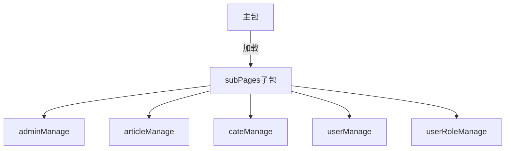
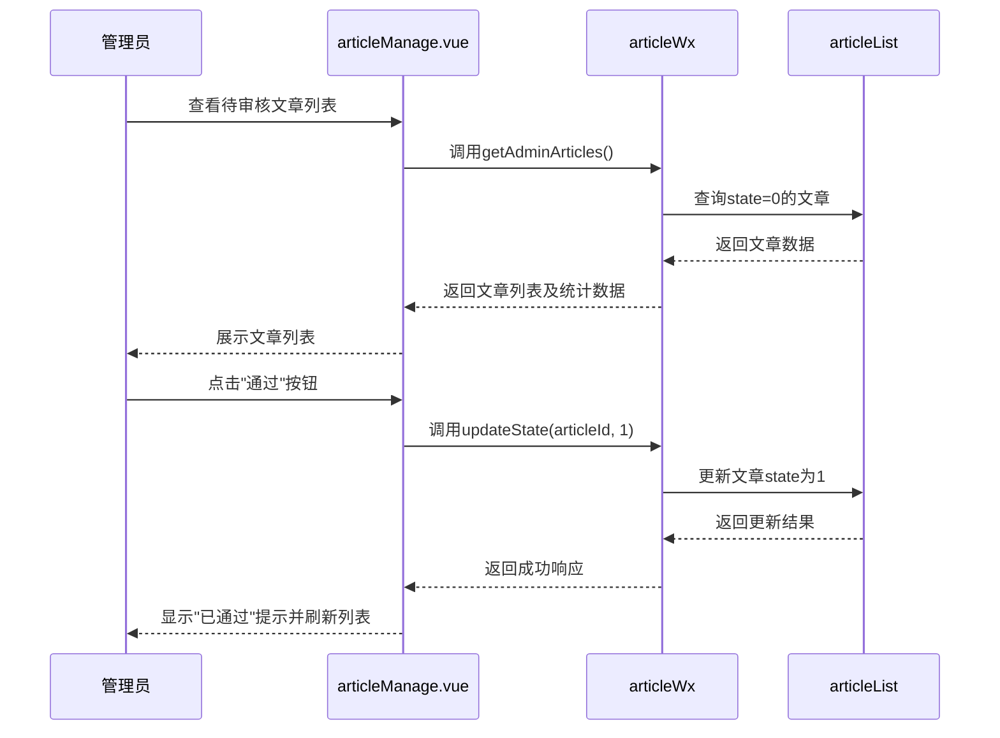
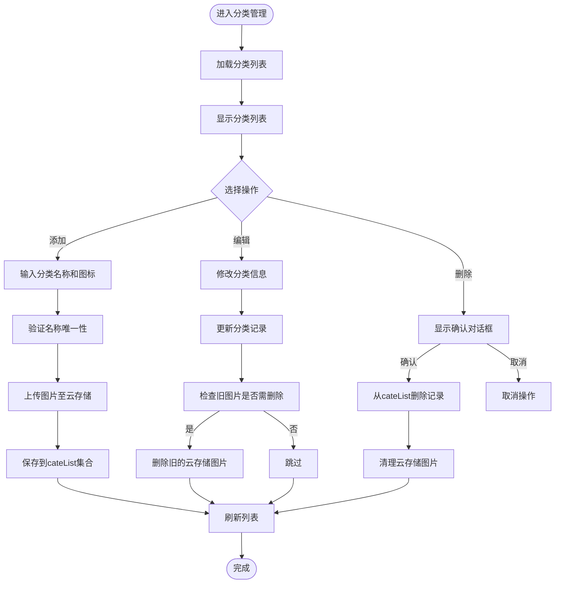
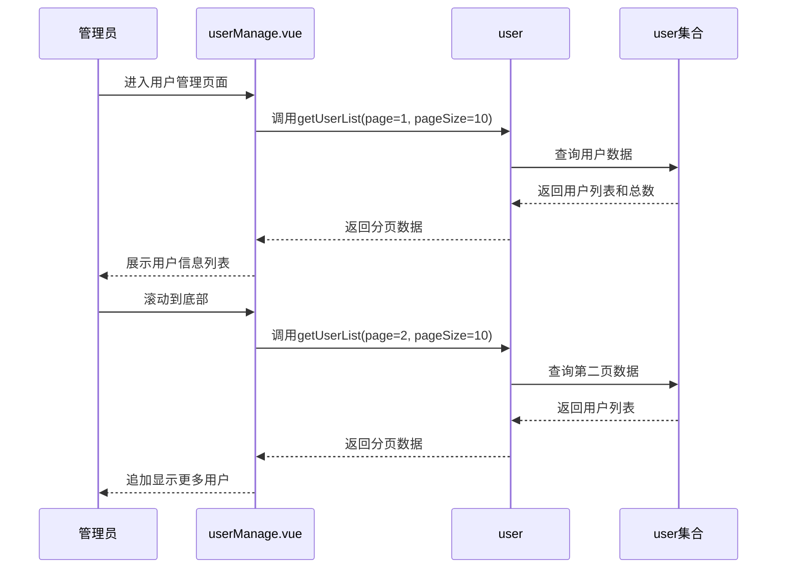
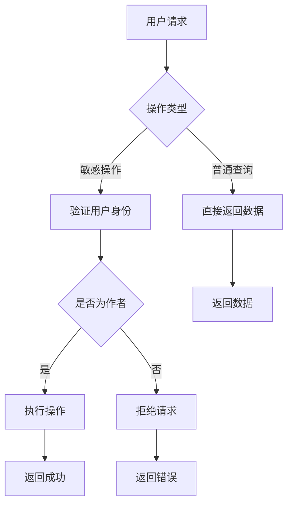
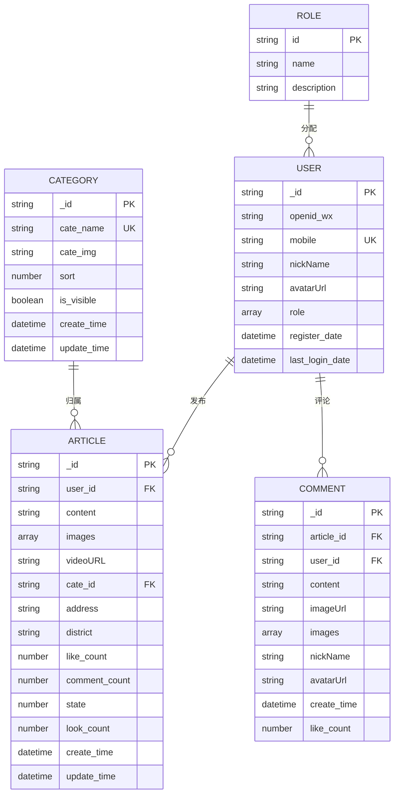
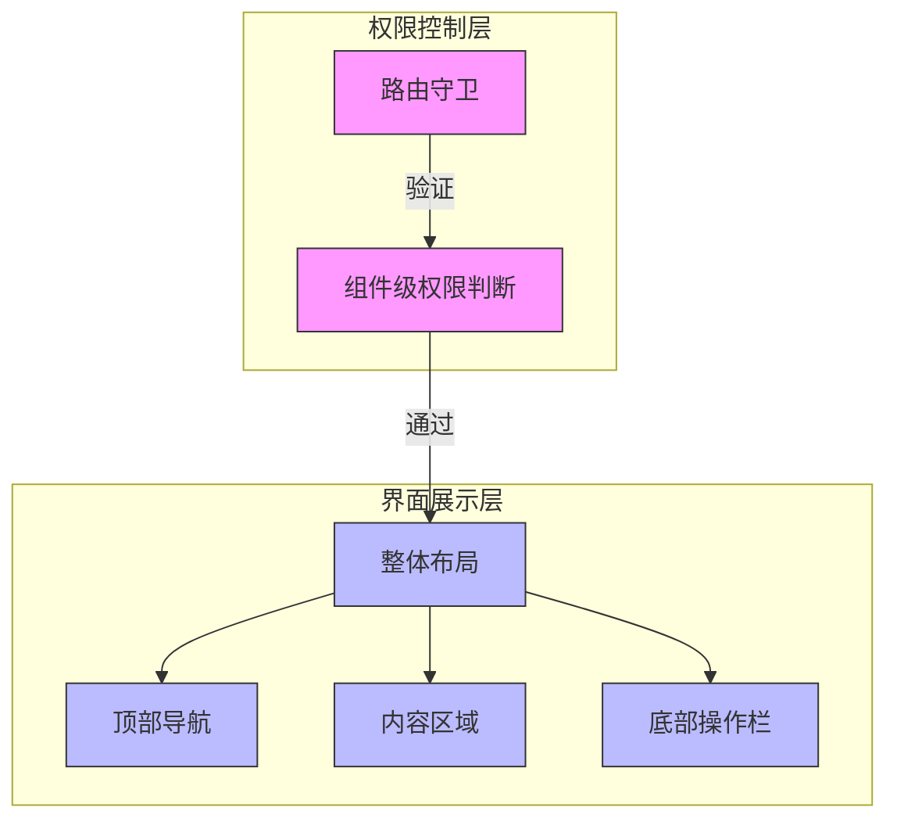

# 后台管理

<cite>
**Referenced Files in This Document**   
- [articleManage.vue](file://subPages/articleManage/articleManage.vue)
- [cateManage.vue](file://subPages/cateManage/cateManage.vue)
- [userManage.vue](file://subPages/userManage/userManage.vue)
- [userRoleManage.vue](file://subPages/userRoleManage/userRoleManage.vue)
- [articleWx/index.obj.js](file://uniCloud-aliyun/cloudfunctions/articleWx/index.obj.js)
- [cateWx/index.obj.js](file://uniCloud-aliyun/cloudfunctions/cateWx/index.obj.js)
- [userWx/index.obj.js](file://uniCloud-aliyun/cloudfunctions/userWx/index.obj.js)
- [config.js](file://uniCloud-aliyun/cloudfunctions/userWx/config.js)
- [pages.json](file://pages.json)
</cite>

## 目录
1. [子包拆分与性能优化](#子包拆分与性能优化)
2. [文章审核流程](#文章审核流程)
3. [分类管理功能](#分类管理功能)
4. [用户信息管理](#用户信息管理)
5. [角色权限分配机制](#角色权限分配机制)
6. [管理员身份认证与安全防护](#管理员身份认证与安全防护)
7. [前后端交互协议](#前后端交互协议)
8. [后台界面设计与权限控制](#后台界面设计与权限控制)

## 子包拆分与性能优化

项目采用`subPackages`（子包）方式进行模块化拆分，将后台管理相关功能集中于`subPages`目录下。这种策略有效实现了代码分割和按需加载，显著提升了小程序的启动性能。

通过在`pages.json`中配置`subPackages`，系统将`subPages`目录下的所有管理模块打包为独立的子包。当用户访问后台管理页面时，仅需下载对应的子包资源，避免了主包体积过大导致的加载延迟。这种方式不仅减少了首屏加载时间，还降低了内存占用，特别适合包含多个管理功能的复杂应用。



**Diagram sources**
- [pages.json](file://pages.json#L100-L150)

**Section sources**
- [pages.json](file://pages.json#L100-L150)

## 文章审核流程

`articleManage`模块实现了完整的文章审核工作流，包括待审核、已通过和已拒绝三种状态的管理。该模块通过调用`articleWx`云函数与后端进行数据交互，确保审核操作的安全性和一致性。

前端界面提供了直观的状态切换按钮和统计卡片，展示各状态的文章数量。审核人员可以查看文章内容、图片等详细信息，并执行"通过"或"拒绝"操作。删除文章时需要二次确认，防止误操作。



**Diagram sources**
- [articleManage.vue](file://subPages/articleManage/articleManage.vue#L1-L450)
- [articleWx/index.obj.js](file://uniCloud-aliyun/cloudfunctions/articleWx/index.obj.js#L300-L350)

**Section sources**
- [articleManage.vue](file://subPages/articleManage/articleManage.vue#L1-L450)
- [articleWx/index.obj.js](file://uniCloud-aliyun/cloudfunctions/articleWx/index.obj.js#L300-L350)

## 分类管理功能

`cateManage`模块提供了全面的分类增删改查功能，支持分类名称、图标、可见性和排序权重的管理。该模块通过`cateWx`云函数实现与后端的数据同步，确保操作的原子性和一致性。

新增分类时，系统会校验分类名称的唯一性，防止重复创建。编辑功能允许修改分类的基本信息和图标，上传的图片会自动验证路径有效性并存储到云存储服务。删除分类前有确认对话框，且会自动清理关联的云存储图片资源，避免资源浪费。



**Diagram sources**
- [cateManage.vue](file://subPages/cateManage/cateManage.vue#L1-L800)
- [cateWx/index.obj.js](file://uniCloud-aliyun/cloudfunctions/cateWx/index.obj.js#L100-L200)

**Section sources**
- [cateManage.vue](file://subPages/cateManage/cateManage.vue#L1-L800)
- [cateWx/index.obj.js](file://uniCloud-aliyun/cloudfunctions/cateWx/index.obj.js#L100-L200)

## 用户信息管理

`userManage`模块实现了用户信息的分页查询和浏览功能。该模块通过调用`user`云函数获取用户列表，支持基本的分页加载和下拉刷新操作。

前端界面以卡片形式展示用户的用户名、昵称、联系方式和注册信息等关键字段。数据加载采用懒加载策略，初始加载第一页数据，后续通过滚动触底事件加载更多内容。错误处理机制完善，网络异常或数据获取失败时会显示友好的提示信息。



**Diagram sources**
- [userManage.vue](file://subPages/userManage/userManage.vue#L1-L160)
- [userWx/index.obj.js](file://uniCloud-aliyun/cloudfunctions/userWx/index.obj.js#L150-L200)

**Section sources**
- [userManage.vue](file://subPages/userManage/userManage.vue#L1-L160)
- [userWx/index.obj.js](file://uniCloud-aliyun/cloudfunctions/userWx/index.obj.js#L150-L200)

## 角色权限分配机制

`userRoleManage`模块实现了精细化的角色权限管理系统。该模块允许管理员为用户分配不同的角色，如管理员、VIP用户、编辑、审核员等，每个角色对应特定的系统权限。

前端界面清晰展示了所有可用角色及其描述，通过开关组件实现角色的添加和移除。系统内置了安全规则，普通用户角色作为基础权限不可移除，确保用户始终具备基本的系统访问能力。角色变更操作会立即生效，并通过事务机制保证数据一致性。

```mermaid
classDiagram
class RoleManager {
+allRoles : Array
+userInfo : Object
+loading : Boolean
+toggleRole(roleId) : Promise
+hasRole(roleId) : Boolean
-getUserDetail() : Promise
}
class Role {
+id : String
+name : String
+description : String
}
class User {
+_id : String
+username : String
+role : Array[String]
+mobile : String
}
RoleManager --> Role : "管理"
RoleManager --> User : "操作"
User --> Role : "拥有"
note right of RoleManager
角色管理核心逻辑
- 支持多角色分配
- 基础角色保护机制
- 即时生效
end note
```

**Diagram sources**
- [userRoleManage.vue](file://subPages/userRoleManage/userRoleManage.vue#L1-L286)
- [userWx/index.obj.js](file://uniCloud-aliyun/cloudfunctions/userWx/index.obj.js#L200-L230)

**Section sources**
- [userRoleManage.vue](file://subPages/userRoleManage/userRoleManage.vue#L1-L286)
- [userWx/index.obj.js](file://uniCloud-aliyun/cloudfunctions/userWx/index.obj.js#L200-L230)

## 管理员身份认证与安全防护

系统通过多层次的安全机制保障后台管理操作的安全性。首先，在云函数层面实施严格的参数校验和权限检查，确保只有合法请求才能执行敏感操作。

对于文章删除等高风险操作，系统要求验证操作者与文章作者的身份一致性，防止越权删除他人内容。分类管理中的图片上传和删除操作均包含资源清理逻辑，避免云存储资源泄露。所有数据库操作都经过精心设计的查询条件过滤，防止注入攻击。

此外，系统在`userWx`云函数中集成了微信登录鉴权机制，通过`config.js`中的AppID和AppSecret验证用户身份，确保只有授权用户才能访问管理功能。



**Diagram sources**
- [articleWx/index.obj.js](file://uniCloud-aliyun/cloudfunctions/articleWx/index.obj.js#L600-L650)
- [cateWx/index.obj.js](file://uniCloud-aliyun/cloudfunctions/cateWx/index.obj.js#L300-L350)
- [config.js](file://uniCloud-aliyun/cloudfunctions/userWx/config.js#L1-L5)

**Section sources**
- [articleWx/index.obj.js](file://uniCloud-aliyun/cloudfunctions/articleWx/index.obj.js#L600-L650)
- [cateWx/index.obj.js](file://uniCloud-aliyun/cloudfunctions/cateWx/index.obj.js#L300-L350)
- [config.js](file://uniCloud-aliyun/cloudfunctions/userWx/config.js#L1-L5)

## 前后端交互协议

系统采用标准化的前后端交互协议，通过云函数作为API网关统一处理所有请求。各管理模块通过`uniCloud.importObject()`方法导入对应的云函数对象，建立安全的通信通道。

数据过滤规则严格，前端只请求必要的字段，后端返回结构化的JSON响应，包含code、message和data三个标准字段。错误处理机制完善，所有异常都会被捕获并转换为用户友好的错误消息。



**Diagram sources**
- [articleWx/index.obj.js](file://uniCloud-aliyun/cloudfunctions/articleWx/index.obj.js#L1-L100)
- [cateWx/index.obj.js](file://uniCloud-aliyun/cloudfunctions/cateWx/index.obj.js#L1-L100)
- [userWx/index.obj.js](file://uniCloud-aliyun/cloudfunctions/userWx/index.obj.js#L1-L100)

**Section sources**
- [articleWx/index.obj.js](file://uniCloud-aliyun/cloudfunctions/articleWx/index.obj.js#L1-L100)
- [cateWx/index.obj.js](file://uniCloud-aliyun/cloudfunctions/cateWx/index.obj.js#L1-L100)
- [userWx/index.obj.js](file://uniCloud-aliyun/cloudfunctions/userWx/index.obj.js#L1-L100)

## 后台界面设计与权限控制

后台界面采用简洁直观的设计风格，注重用户体验和操作效率。各管理模块保持一致的视觉语言和交互模式，降低用户学习成本。

权限控制遵循最小权限原则，不同角色的管理员只能访问其职责范围内的功能模块。系统通过路由守卫和组件级权限判断双重机制，确保未授权用户无法访问敏感页面。

界面布局合理利用屏幕空间，重要信息优先展示，操作按钮位置符合用户习惯。响应式设计确保在不同设备上都能提供良好的使用体验，同时通过加载状态和操作反馈增强系统的可感知性。



**Diagram sources**
- [articleManage.vue](file://subPages/articleManage/articleManage.vue#L1-L450)
- [cateManage.vue](file://subPages/cateManage/cateManage.vue#L1-L800)
- [userManage.vue](file://subPages/userManage/userManage.vue#L1-L160)

**Section sources**
- [articleManage.vue](file://subPages/articleManage/articleManage.vue#L1-L450)
- [cateManage.vue](file://subPages/cateManage/cateManage.vue#L1-L800)
- [userManage.vue](file://subPages/userManage/userManage.vue#L1-L160)