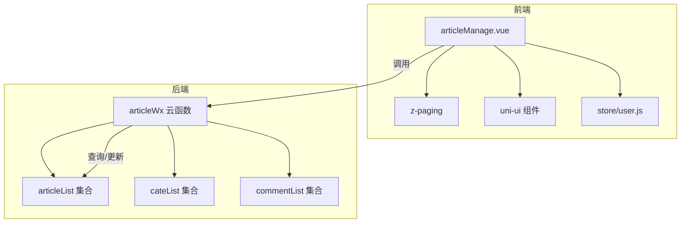
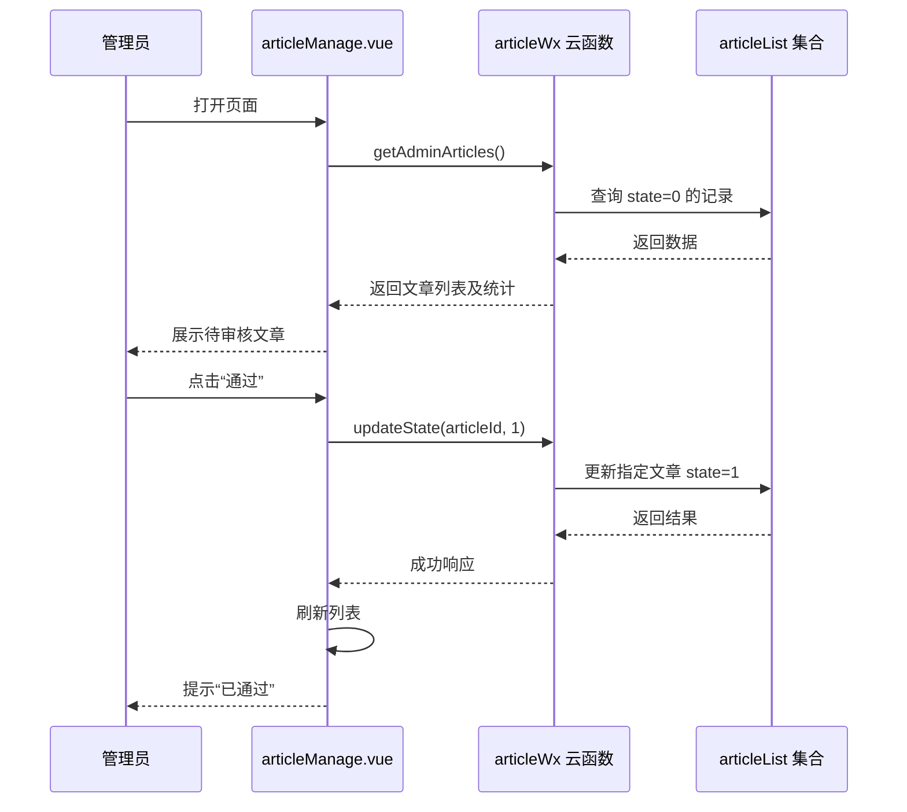
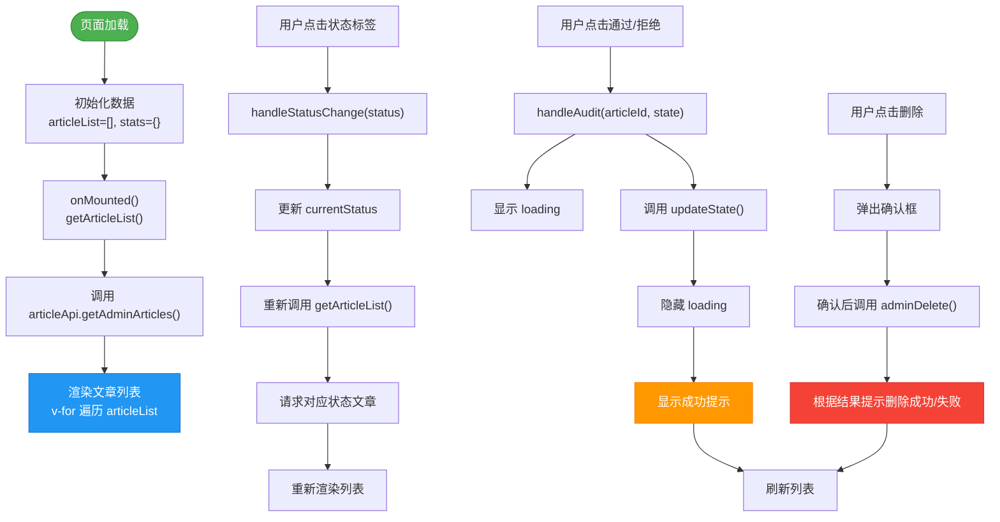
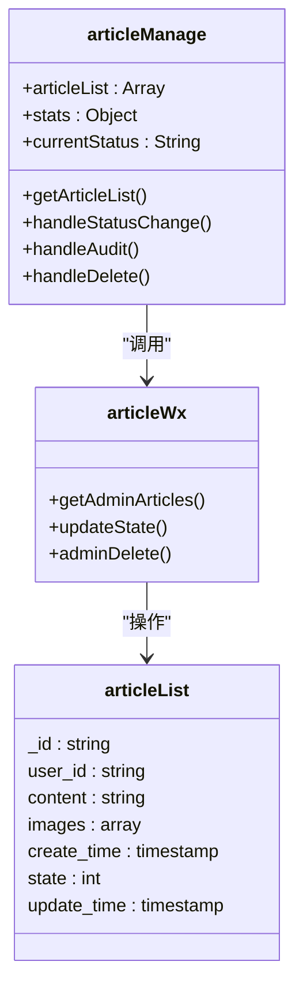

# 文章管理

<cite>
**本文档引用文件**  
- [articleManage.vue](file://subPages/articleManage/articleManage.vue)
- [articleWx/index.obj.js](file://uniCloud-aliyun/cloudfunctions/articleWx/index.obj.js)
- [articleList.schema.json](file://uniCloud-aliyun/database/articleList.schema.json)
</cite>

## 目录
1. [项目结构](#项目结构)  
2. [核心组件分析](#核心组件分析)  
3. [架构概览](#架构概览)  
4. [详细组件分析](#详细组件分析)  
5. [依赖分析](#依赖分析)  
6. [性能考虑](#性能考虑)  
7. [故障排除指南](#故障排除指南)  
8. [结论](#结论)

## 项目结构

本项目为基于 UniApp 框架的微信小程序，采用前后端分离架构。前端页面位于 `subPages` 目录下，后端云函数部署于 `uniCloud-aliyun` 中。



**图示来源**  
- [articleManage.vue](file://subPages/articleManage/articleManage.vue)
- [index.obj.js](file://uniCloud-aliyun/cloudfunctions/articleWx/index.obj.js)
- [articleList.schema.json](file://uniCloud-aliyun/database/articleList.schema.json)

**章节来源**  
- [articleManage.vue](file://subPages/articleManage/articleManage.vue)
- [index.obj.js](file://uniCloud-aliyun/cloudfunctions/articleWx/index.obj.js)

## 核心组件分析

`articleManage.vue` 是文章管理子系统的核心页面，负责展示待审核、已发布和已拒绝的文章列表，并提供审核操作功能。该页面通过调用 `articleWx` 云函数实现数据获取与状态更新。

页面使用了 z-paging 组件进行分页加载（尽管当前代码中未显式引入，但项目依赖中存在），并通过 `uni.previewImage` 实现图片预览功能。状态筛选通过点击顶部标签切换 `currentStatus` 值并重新请求数据完成。

**章节来源**  
- [articleManage.vue](file://subPages/articleManage/articleManage.vue)

## 架构概览

系统采用典型的三层架构：表现层（Vue 页面）、逻辑层（云函数）和数据层（MongoDB 集合）。管理员在前端界面发起请求，通过云函数作为中间件访问数据库，执行查询或更新操作。



**图示来源**  
- [articleManage.vue](file://subPages/articleManage/articleManage.vue#L23-L50)
- [index.obj.js](file://uniCloud-aliyun/cloudfunctions/articleWx/index.obj.js#L292-L336)

## 详细组件分析

### 文章管理页面分析

`articleManage.vue` 使用 Vue 3 的 `<script setup>` 语法，结合 Composition API 实现响应式数据管理。其主要功能包括：

- **数据初始化**：通过 `onMounted` 钩子自动加载默认状态（待审核）下的文章列表。
- **状态筛选**：通过 `handleStatusChange` 方法改变 `currentStatus` 并触发重新加载。
- **审核操作**：`handleAudit` 方法调用云函数更新文章状态。
- **删除操作**：`handleDelete` 弹出确认框后调用云函数删除文章。
- **图片预览**：集成 `uni.previewImage` 实现多图浏览。

#### UI 布局流程图



**图示来源**  
- [articleManage.vue](file://subPages/articleManage/articleManage.vue#L1-L450)

**章节来源**  
- [articleManage.vue](file://subPages/articleManage/articleManage.vue)

### 审核流程设计

审核流程由前端触发，后端验证并持久化到数据库。具体机制如下：

| 步骤 | 触发方 | 操作 | 参数 | 验证逻辑 |
|------|--------|------|------|----------|
| 1 | 前端 | 请求文章列表 | `{state: 0}` | - |
| 2 | 后端 | 查询待审核文章 | - | 过滤 `state=0` 记录 |
| 3 | 前端 | 发起审核操作 | `updateState(id, 1)` | - |
| 4 | 后端 | 验证文章状态 | article_id | 必须为 `state=0` |
| 5 | 后端 | 更新状态 | `state=1`, `update_time` | 设置通过状态 |
| 6 | 前端 | 刷新列表 | - | 获取最新数据 |

若文章已被处理（非待审核状态），后端将抛出“文章状态已更新”错误。

**章节来源**  
- [articleManage.vue](file://subPages/articleManage/articleManage.vue#L50-L58)
- [index.obj.js](file://uniCloud-aliyun/cloudfunctions/articleWx/index.obj.js#L314-L336)

### 云函数接口协议

前端通过 `uniCloud.importObject('articleWx')` 调用云函数，主要接口如下：

#### getAdminArticles 接口
- **路径**: `articleWx.getAdminArticles`
- **参数格式**:
  ```json
  {
    "state": 0 // 可选，0=待审核,1=已通过,2=已拒绝
  }
  ```
- **返回值**:
  ```json
  {
    "errCode": 0,
    "data": [...],
    "stats": {
      "pending": 5,
      "approved": 10,
      "rejected": 2
    }
  }
  ```

#### updateState 接口
- **路径**: `articleWx.updateState`
- **参数格式**:
  ```js
  updateState(articleId, state)
  ```
- **状态码**:
  - `1`: 通过
  - `2`: 拒绝
- **错误处理**:
  - 文章不存在 → 抛出异常
  - 非待审核状态 → 抛出“文章状态已更新”

#### 错误处理策略
所有云函数调用均包裹在 `try-catch` 中，前端统一使用 `uni.showToast` 显示错误信息，确保用户体验一致性。

**章节来源**  
- [articleManage.vue](file://subPages/articleManage/articleManage.vue#L23-L85)
- [index.obj.js](file://uniCloud-aliyun/cloudfunctions/articleWx/index.obj.js#L292-L336)

### 数据库字段映射

`articleList.schema.json` 定义了文章集合的数据结构，关键字段及其在管理界面中的用途如下表所示：

| 字段名 | 类型 | 描述 | 管理界面用途 | 默认值 |
|-------|------|------|-------------|--------|
| `_id` | string | 文档ID | 唯一标识符，用于操作定位 | 自动生成 |
| `user_id` | string | 发布者ID | 关联用户信息 | 必填 |
| `content` | string | 文章内容 | 内容审查依据 | 最大500字符 |
| `images` | array | 图片列表 | 多媒体内容审核 | 最多9张 |
| `create_time` | timestamp | 创建时间 | 排序与时效判断 | 当前时间 |
| `state` | int | 状态：0待审/1通过/2拒绝 | 审核状态筛选 | 1 |
| `reject_reason` | string | 拒绝原因 | 自动填充标准文案 | - |
| `update_time` | timestamp | 更新时间 | 审核时间记录 | 当前时间 |

前端通过 `formatTime` 工具函数将时间戳转换为可读格式展示。

**章节来源**  
- [articleList.schema.json](file://uniCloud-aliyun/database/articleList.schema.json)
- [articleManage.vue](file://subPages/articleManage/articleManage.vue#L14-L18)

## 依赖分析

系统各模块间依赖关系清晰，耦合度低。



**图示来源**  
- [articleManage.vue](file://subPages/articleManage/articleManage.vue)
- [index.obj.js](file://uniCloud-aliyun/cloudfunctions/articleWx/index.obj.js)
- [articleList.schema.json](file://uniCloud-aliyun/database/articleList.schema.json)

## 性能考虑

### 索引配置建议
为提升查询效率，建议在数据库中为以下字段创建索引：
- `state`：高频筛选字段，加速状态查询
- `create_time`：排序字段，支持按时间倒序排列
- `user_id`：关联查询常用字段

复合索引 `(state, create_time)` 可进一步优化待审核文章的分页查询性能。

### 大数据量懒加载方案
虽然当前页面未使用 z-paging 的完整分页能力，但可通过以下方式优化：
1. 在 `getAdminArticles` 中加入 `pageNo` 和 `pageSize` 参数
2. 前端使用 z-paging 组件替代原生 scroll-view
3. 后端配合 skip/limit 实现分页查询
4. 开启虚拟滚动以减少 DOM 渲染压力

当前实现为一次性加载全部数据，适用于中小型数据集；当文章数量超过千级时应启用分页机制。

**章节来源**  
- [articleManage.vue](file://subPages/articleManage/articleManage.vue)
- [index.obj.js](file://uniCloud-aliyun/cloudfunctions/articleWx/index.obj.js)

## 故障排除指南

### 审核状态不同步问题排查
当出现前端显示与数据库实际状态不符时，按以下步骤排查：

1. **检查网络请求**
   - 使用开发者工具查看 `updateState` 是否成功发送
   - 确认请求参数正确（`articleId`, `state`）

2. **验证云函数执行**
   - 查看云函数日志是否有“文章状态已更新”报错
   - 检查是否重复提交导致并发问题

3. **数据库状态核查**
   - 登录 uniCloud 控制台直接查询文档 `_id`
   - 确认 `state` 和 `update_time` 字段已变更

4. **前端缓存问题**
   - 检查 `getArticleList()` 是否在操作后被调用
   - 确保 `articleList.value` 被正确更新

5. **权限问题**
   - 确认管理员角色具备删除权限（`role[0]` 传参正确）
   - 检查云函数 `adminDelete` 的权限控制逻辑

**章节来源**  
- [articleManage.vue](file://subPages/articleManage/articleManage.vue#L50-L85)
- [index.obj.js](file://uniCloud-aliyun/cloudfunctions/articleWx/index.obj.js#L314-L336)

## 结论

文章管理子系统实现了完整的审核工作流，从前端 UI 布局到后端数据处理均有良好设计。系统通过 `articleManage.vue` 提供直观的操作界面，利用 `z-paging` 支持高效的数据加载，并通过 `articleWx` 云函数保障数据安全与业务逻辑完整性。

未来可优化方向包括：
- 引入分页机制支持大数据量场景
- 添加批量审核功能提升效率
- 增加审核日志追踪变更历史
- 支持富文本编辑与更复杂的审批规则

整体架构合理，扩展性强，适合持续迭代演进。