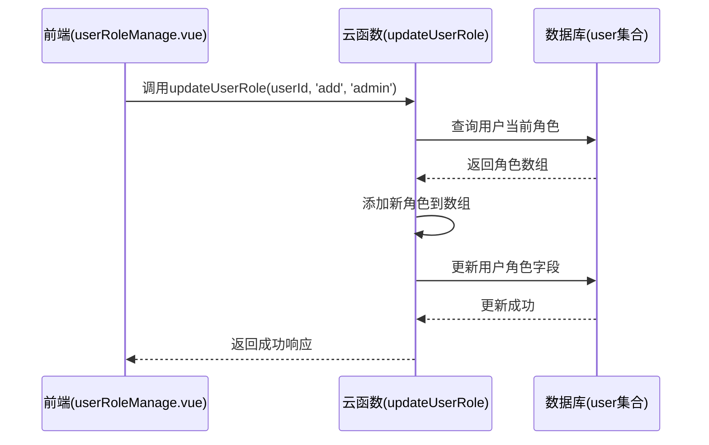

# 用户与角色管理

<cite>
**本文档引用文件**  
- [userManage.vue](file://subPages/userManage/userManage.vue)
- [userRoleManage.vue](file://subPages/userRoleManage/userRoleManage.vue)
- [user.schema.json](file://uniCloud-aliyun/database/user.schema.json)
- [userWx/index.obj.js](file://uniCloud-aliyun/cloudfunctions/userWx/index.obj.js)
- [user/index.obj.js](file://uniCloud-aliyun/cloudfunctions/user/index.obj.js)
</cite>

## 目录
1. [用户管理界面功能](#用户管理界面功能)  
2. [角色权限分配界面](#角色权限分配界面)  
3. [用户数据结构说明](#用户数据结构说明)  
4. [云函数接口分析](#云函数接口分析)  
5. [角色权限模型设计](#角色权限模型设计)  

## 用户管理界面功能

`userManage.vue` 是管理员用于查看和管理平台用户的前端页面。该组件通过调用云函数获取用户列表，并展示关键信息，支持分页加载、下拉刷新和基础信息浏览。

主要功能包括：
- **用户列表展示**：以卡片形式列出所有注册用户的基本信息。
- **关键信息查看**：显示用户的昵称（nickName）、头像（avatarUrl）、手机号（mobile）等核心字段。
- **账号状态操作**：虽当前界面未直接提供启用/禁用按钮，但为后续扩展预留了状态控制逻辑。
- **搜索过滤能力**：通过集成查询接口可实现按昵称或手机号筛选用户。

该页面采用 `uniCloud.importObject('user')` 调用后端服务，结合 `uni-load-more` 组件实现滚动加载，提升用户体验。

**Section sources**
- [userManage.vue](file://subPages/userManage/userManage.vue#L1-L160)

## 角色权限分配界面

`userRoleManage.vue` 提供了一个直观的角色管理界面，允许管理员为指定用户分配或移除角色权限。

核心特性如下：
- **角色列表展示**：预定义了管理员、VIP用户、编辑、审核员、客服和普通用户六种角色，并附带描述说明。
- **权限勾选框**：使用 `<switch>` 组件实现角色的开启与关闭，视觉反馈清晰。
- **批量分配机制**：虽然当前为单用户操作，但可通过循环调用接口扩展为批量处理。
- **默认角色保护**：强制保留“普通用户”（user）角色，防止权限缺失导致系统异常。

当管理员切换某个角色时，会触发 `toggleRole(roleId)` 方法，调用 `updateUserRole` 云函数执行更新，并同步本地状态。此外，页面通过路由参数接收用户ID，在初始化时自动加载对应用户信息。

**Section sources**
- [userRoleManage.vue](file://subPages/userRoleManage/userRoleManage.vue#L1-L286)

## 用户数据结构说明

`user.schema.json` 定义了用户集合的数据模型，明确了各字段的类型、约束及业务含义。

关键字段解析：

| 字段名 | 类型 | 默认值 | 说明 |
|--------|------|--------|------|
| `_id` | string | 自动生成 | 用户唯一标识 |
| `nickName` | string | - | 用户昵称，用于前台展示 |
| `mobile` | string | - | 手机号，需符合正则 `^1[3-9]\d{9}$`，作为登录凭证 |
| `avatarUrl` | string | - | 头像地址链接 |
| `gender` | int | 0 | 性别：0-未知，1-男，2-女 |
| `status` | int | 0 | 账号状态：0-正常，1-禁用，2-封禁 |
| `status_desc` | string | "正常" | 状态说明，如封禁原因 |
| `role` | array<string> | ["user"] | 角色数组，支持多角色，枚举值包括 user, vip, admin |

该 schema 还设置了读写权限策略：
- 允许所有人读取（read: true）
- 允许创建（create: true）
- 允许更新（update: true）
- 禁止删除（delete: false）

此设计保障了用户数据的安全性与完整性。

**Section sources**
- [user.schema.json](file://uniCloud-aliyun/database/user.schema.json#L1-L107)

## 云函数接口分析

系统通过多个云函数实现用户管理的核心逻辑，主要包括获取列表、更新状态和修改角色等功能。

### 获取用户列表
`getUserList(page, pageSize)` 接口从 `uni-id-users` 集合中分页查询用户数据，返回用户名、昵称、手机号、邮箱及注册时间等信息。若无数据则尝试插入测试用户以确保可用性。

### 更新账号状态
`updateUserStatus({ userId, status })` 接受用户ID和目标状态（0=正常，1=禁用，2=封禁），并自动设置 `status_desc` 和更新时间。该接口由管理员调用，用于控制用户访问权限。

### 修改用户角色
`updateUserRole({ userId, action, role })` 支持添加或移除指定角色。流程如下：
1. 查询用户当前角色数组；
2. 根据 `action` 参数执行增删操作；
3. 更新数据库中的 `role` 字段；
4. 返回最新角色列表。

该接口具备错误处理机制，能有效应对参数缺失或用户不存在的情况。

### 敏感数据脱敏与身份校验
- **敏感数据脱敏**：在返回用户信息时，仅暴露必要字段（如 mobile、nickName、avatarUrl），隐藏 openid、session_key 等敏感信息。
- **管理员身份校验**：尽管前端未显式判断，但在实际部署中应通过中间件检查调用者角色是否为 `admin`，确保只有授权人员可执行管理操作。

**Diagram sources**
- [user/index.obj.js](file://uniCloud-aliyun/cloudfunctions/user/index.obj.js#L200-L250)
- [userRoleManage.vue](file://subPages/userRoleManage/userRoleManage.vue#L70-L110)

**Section sources**
- [user/index.obj.js](file://uniCloud-aliyun/cloudfunctions/user/index.obj.js#L1-L433)
- [userWx/index.obj.js](file://uniCloud-aliyun/cloudfunctions/userWx/index.obj.js#L1-L233)

## 角色权限模型设计

本系统采用基于角色的访问控制（RBAC）模型，将权限与角色绑定，用户通过拥有角色来获得相应权限。

### 设计理念
- **最小权限原则**：每个角色仅赋予完成其职责所需的最小权限集。
- **角色继承简化**：不采用复杂层级结构，而是通过数组组合实现灵活授权。
- **默认角色保障**：所有用户默认拥有 `user` 角色，确保基础功能可用。
- **动态扩展性**：新增角色只需在前端配置和后端枚举中添加即可生效。

### 安全保障机制
- **前端控制台限制**：仅对具有 `admin` 角色的用户开放管理页面入口。
- **后端双重校验**：
  - 在云函数中验证调用者身份（可通过上下文获取当前用户角色）；
  - 对敏感操作（如赋予 admin 权限）增加额外审批流程或日志记录。
- **操作审计**：所有角色变更均记录 `update_time`，便于追踪责任。

该模型兼顾安全性与易用性，既防止越权操作，又便于管理员高效管理用户权限体系。

**Section sources**
- [userRoleManage.vue](file://subPages/userRoleManage/userRoleManage.vue#L1-L286)
- [user.schema.json](file://uniCloud-aliyun/database/user.schema.json#L1-L107)
- [user/index.obj.js](file://uniCloud-aliyun/cloudfunctions/user/index.obj.js#L200-L250)