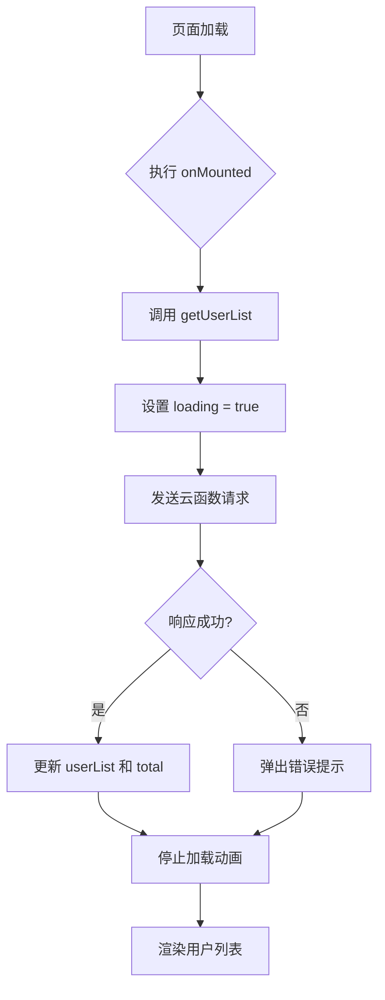
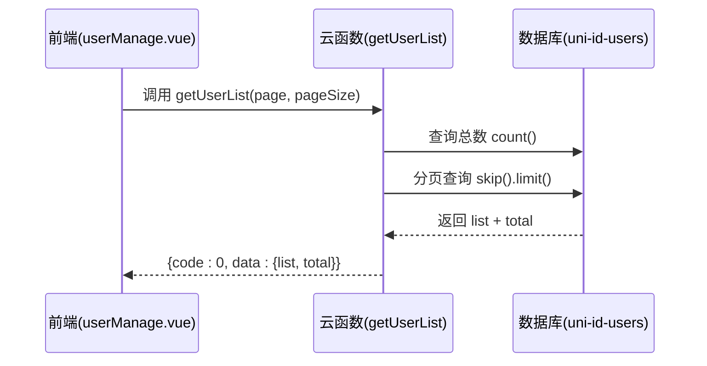

# 用户管理

<cite>
**本文档引用文件**  
- [userManage.vue](file://subPages/userManage/userManage.vue)
- [user.schema.json](file://uniCloud-aliyun/database/user.schema.json)
- [index.obj.js](file://uniCloud-aliyun/cloudfunctions/user/index.obj.js)
</cite>

## 目录
1. [项目结构](#项目结构)
2. [核心组件分析](#核心组件分析)
3. [数据模型说明](#数据模型说明)
4. [云函数实现机制](#云函数实现机制)
5. [前端调用示例](#前端调用示例)
6. [常见问题与优化建议](#常见问题与优化建议)

## 项目结构

本模块主要包含以下关键路径：
- 前端页面：`subPages/userManage/userManage.vue`
- 数据库 Schema：`uniCloud-aliyun/database/user.schema.json`
- 云函数逻辑：`uniCloud-aliyun/cloudfunctions/user/index.obj.js`

该结构实现了前后端分离的用户管理功能，通过 uniCloud 提供的云函数接口进行数据交互。

**Section sources**
- [userManage.vue](file://subPages/userManage/userManage.vue#L1-L160)
- [user.schema.json](file://uniCloud-aliyun/database/user.schema.json#L1-L107)
- [index.obj.js](file://uniCloud-aliyun/cloudfunctions/user/index.obj.js#L1-L433)

## 核心组件分析

### UI布局与交互逻辑

`userManage.vue` 页面采用 Vue 3 的 `<script setup>` 语法糖构建响应式界面。其核心功能包括：

- **用户列表展示**：使用 `v-for` 遍历 `userList` 数组渲染用户信息卡片。
- **分页加载**：通过 `pagination` 对象控制当前页码和每页数量，支持滚动加载更多（`loadMore` 方法）。
- **下拉刷新**：绑定 `onPullDownRefresh` 实现下拉重置页码并重新请求数据。
- **状态管理**：利用 `ref` 定义响应式变量如 `loading`、`userList` 等。

#### 字段渲染方式
| 字段名 | 显示标签 | 渲染规则 |
|--------|---------|----------|
| `_id` | - | 不在前端显示 |
| `username` | 用户名 | 直接展示，空值显示“-” |
| `nickname` | 昵称 | 来自数据库 `nickName` 字段 |
| `mobile` | 手机 | 展示完整手机号 |
| `email` | 邮箱 | 可为空，空则显示“-” |
| `register_date` | 注册时间 | 使用 `formatDate()` 格式化为 YYYY-MM-DD |

头像信息目前未在该页面中渲染，但数据模型中已定义 `avatarUrl` 字段可用于后续扩展。



**Diagram sources**
- [userManage.vue](file://subPages/userManage/userManage.vue#L13-L43)

**Section sources**
- [userManage.vue](file://subPages/userManage/userManage.vue#L1-L160)

## 数据模型说明

`user.schema.json` 文件定义了用户集合的数据结构与校验规则。

### 核心字段定义

| 字段名 | 类型 | 必填 | 默认值 | 业务含义 | 校验规则 |
|--------|------|------|--------|----------|-----------|
| `_id` | string | 是 | 系统生成 | 文档唯一标识 | 自动生成 ObjectId |
| `nickName` | string | 否 | - | 用户昵称 | 两端去空格 |
| `mobile` | string | 是 | - | 手机号 | 正则校验：`^1[3-9]\d{9}$` |
| `avatarUrl` | string | 否 | - | 头像地址 | URL 或 CDN 路径 |
| `gender` | int | 否 | 0 | 性别 | 0=未知，1=男，2=女 |
| `status` | int | 否 | 0 | 账号状态 | 0=正常，1=禁用，2=封禁 |
| `status_desc` | string | 否 | "正常" | 状态说明 | 如封禁原因等 |
| `create_time` | timestamp | 否 | $env.now | 创建时间 | 自动填充当前时间 |
| `role` | array | 否 | ["user"] | 角色列表 | 枚举：user/vip/admin |

### 权限配置
```json
"permission": {
  "read": true,
  "create": true,
  "update": true,
  "delete": false
}
```
表示允许读取、创建、更新，但禁止删除操作，保障数据安全。

**Section sources**
- [user.schema.json](file://uniCloud-aliyun/database/user.schema.json#L1-L107)

## 云函数实现机制

### 获取用户列表 (`getUserList`)

位于 `index.obj.js` 中的 `getUserList(page, pageSize)` 函数负责分页查询用户数据。

#### 请求参数解析
- `page`: 当前页码，默认为 1
- `pageSize`: 每页条数，默认为 10

#### 实现流程


#### 关键技术点
- **数据库连接**：使用 `uniCloud.database()` 获取 DB 实例。
- **字段过滤**：通过 `.field()` 限制返回字段，提升性能。
- **排序规则**：按 `register_date` 降序排列。
- **异常处理**：捕获错误并返回统一格式 `{code:-1, msg}`。

**Diagram sources**
- [index.obj.js](file://uniCloud-aliyun/cloudfunctions/user/index.obj.js#L9-L85)

### 更新账号状态 (`updateUserStatus`)

用于启用/禁用用户账号。

#### 参数校验
```js
if (![0, 1, 2].includes(status)) {
  return { code: 1, message: '状态值无效' };
}
```

#### 数据库操作
- 更新 `status` 字段
- 自动设置 `status_desc` 描述
- 记录 `update_time` 时间戳

#### 权限控制
虽然当前未显式校验管理员身份，但从调用链看，仅管理员页面可触发此操作，间接实现权限隔离。

```mermaid
flowchart LR
A[接收 userId,status] --> B{状态合法?}
B --> |否| C[返回错误]
B --> |是| D[构造更新对象]
D --> E[执行 update()]
E --> F[返回 success]
```

**Diagram sources**
- [index.obj.js](file://uniCloud-aliyun/cloudfunctions/user/index.obj.js#L147-L164)

**Section sources**
- [index.obj.js](file://uniCloud-aliyun/cloudfunctions/user/index.obj.js#L9-L164)

## 前端调用示例

通过 `uniCloud.importObject` 导入云对象并发起调用：

```javascript
// 初始化 API
const userApi = uniCloud.importObject('user', { customUI: true })

// 获取第一页数据
const result = await userApi.getUserList(1, 10)

// 更新用户状态（示例）
try {
  await userApi.updateUserStatus({
    userId: 'xxx',
    status: 1 // 1=禁用
  })
  uni.showToast({ title: '操作成功', icon: 'success' })
} catch(e) {
  uni.showToast({ title: e.message, icon: 'none' })
}
```

**Section sources**
- [userManage.vue](file://subPages/userManage/userManage.vue#L5-L12)

## 常见问题与优化建议

### 列表加载缓慢排查方向

1. **索引缺失**
   - 检查 `uni-id-users` 集合是否对 `register_date` 建立了索引。
   - 若有搜索功能，需为 `mobile`、`nickName` 字段建立文本索引。

2. **网络延迟**
   - 使用 Chrome DevTools 查看请求耗时。
   - 检查云函数执行日志中的“执行时间”。

3. **数据量过大**
   - 确保 `.limit(pageSize)` 生效，避免全量加载。
   - 可增加缓存层（如 Redis）存储热门数据。

### 性能优化建议

| 优化项 | 建议方案 |
|-------|---------|
| 数据库查询 | 为 `register_date` 添加升序索引 |
| 字段传输 | 减少不必要的字段返回，使用 `.field()` 精确控制 |
| 分页策略 | 支持 scroll_id 游标分页替代 offset，避免深度分页性能下降 |
| 缓存机制 | 对频繁访问的用户信息添加短期缓存 |
| 错误监控 | 添加 Sentry 或日志上报，便于定位慢查询 |

**Section sources**
- [userManage.vue](file://subPages/userManage/userManage.vue#L13-L43)
- [index.obj.js](file://uniCloud-aliyun/cloudfunctions/user/index.obj.js#L9-L85)