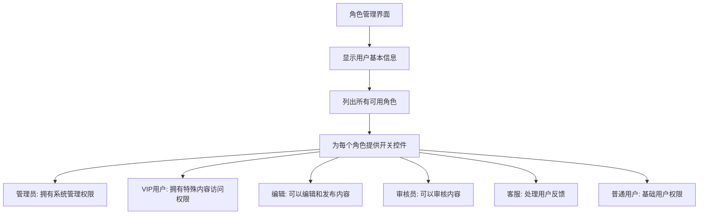
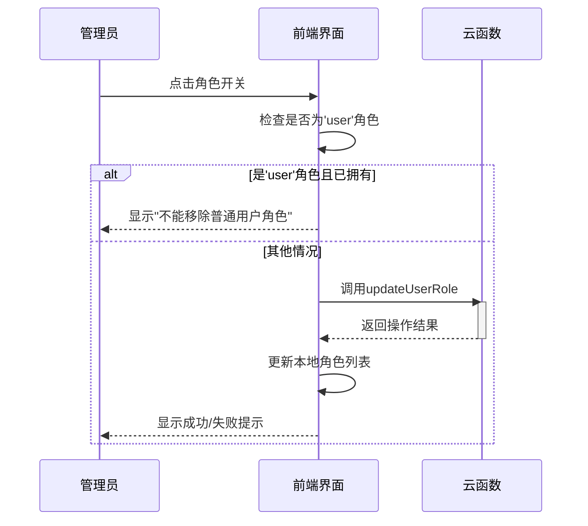
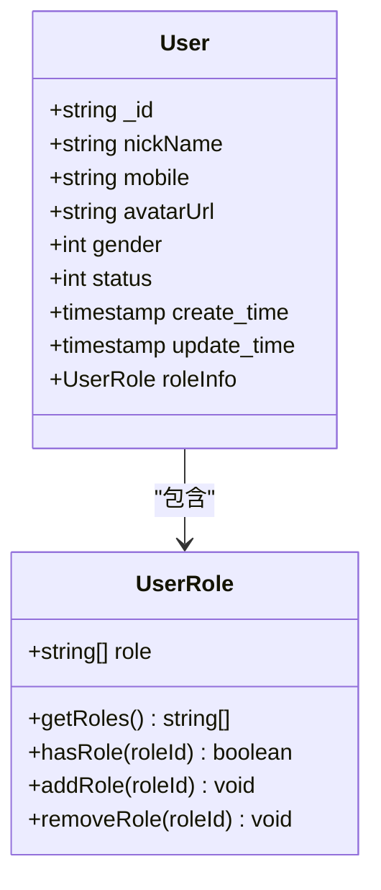
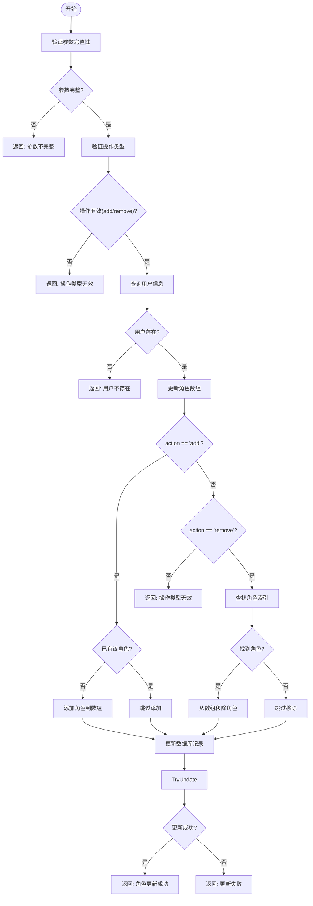
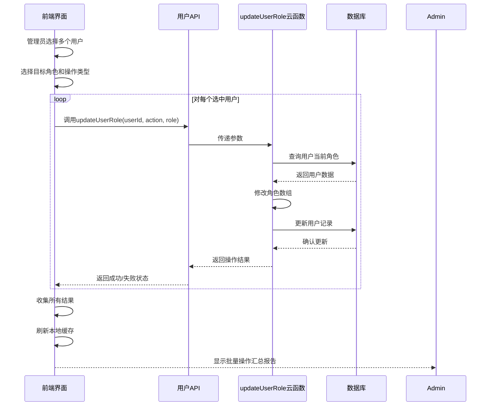

# 角色管理

<cite>
**本文档引用文件**
- [userRoleManage.vue](file://subPages/userRoleManage/userRoleManage.vue)
- [user.schema.json](file://uniCloud-aliyun/database/user.schema.json)
- [index.obj.js](file://uniCloud-aliyun/cloudfunctions/user/index.obj.js)
</cite>

## 目录
1. [角色管理模块概述](#角色管理模块概述)
2. [前端界面设计与功能](#前端界面设计与功能)
3. [用户角色数据结构](#用户角色数据结构)
4. [后端云函数逻辑分析](#后端云函数逻辑分析)
5. [前后端协作流程](#前后端协作流程)
6. [基于角色的访问控制(RBAC)应用](#基于角色的访问控制rbac应用)
7. [开发注意事项](#开发注意事项)

## 角色管理模块概述

本文档详细阐述了系统中角色管理模块的设计与实现，涵盖从前端用户界面到后端云函数的完整技术栈。该模块允许管理员对用户的角色进行精细化管理，通过直观的界面操作实现权限的动态分配与回收。

**Section sources**
- [userRoleManage.vue](file://subPages/userRoleManage/userRoleManage.vue#L0-L285)

## 前端界面设计与功能

### 角色类型枚举与多选框布局

`userRoleManage.vue` 页面提供了清晰的角色管理界面，定义了六种角色类型：管理员、VIP用户、编辑、审核员、客服和普通用户。这些角色在界面上以列表形式展示，每个角色项包含名称、描述以及一个开关控件。

**Diagram sources**
- [userRoleManage.vue](file://subPages/userRoleManage/userRoleManage.vue#L10-L20)

#### 权限分配界面交互逻辑

当管理员点击某个角色的开关时，系统会执行 `toggleRole` 函数。该函数首先检查目标角色是否为"普通用户"，如果是且当前已拥有该角色，则禁止移除，确保每个用户至少保留基础权限。

**Diagram sources**
- [userRoleManage.vue](file://subPages/userRoleManage/userRoleManage.vue#L97-L145)

**Section sources**
- [userRoleManage.vue](file://subPages/userRoleManage/userRoleManage.vue#L97-L145)

## 用户角色数据结构

### schema定义与权限层级

`user.schema.json` 文件中的 `role` 字段定义了用户角色的数据结构，采用数组形式存储多个角色，其值限定为字符串枚举：`user`、`vip` 和 `admin`。这种设计支持用户拥有多重身份。

| 字段 | 类型 | 枚举值 | 默认值 | 描述 |
|------|------|--------|--------|------|
| role | 数组 | user, vip, admin | ["user"] | 用户角色列表 |

**Diagram sources**
- [user.schema.json](file://uniCloud-aliyun/database/user.schema.json#L85-L106)

**Section sources**
- [user.schema.json](file://uniCloud-aliyun/database/user.schema.json#L85-L106)

## 后端云函数逻辑分析

### updateUserRole接口核心逻辑

`updateUserRole` 接口位于 `user/index.obj.js` 中，是角色管理的核心后端逻辑。该接口实现了严格的身份验证、参数校验和原子化数据库操作。

**Diagram sources**
- [index.obj.js](file://uniCloud-aliyun/cloudfunctions/user/index.obj.js#L157-L280)

#### 安全性与错误处理机制

该接口实施了多层次的安全保障：
1. **身份认证**：虽然代码中未直接体现，但通过云函数调用上下文可推断需要登录且具备管理员权限。
2. **输入验证**：严格检查 `userId`、`action` 和 `role` 参数的完整性和有效性。
3. **原子化操作**：先读取当前角色，修改后再一次性更新，避免并发问题。
4. **错误码策略**：使用标准化的错误码（code=1表示失败，code=0表示成功）和详细的错误消息。

**Section sources**
- [index.obj.js](file://uniCloud-aliyun/cloudfunctions/user/index.obj.js#L157-L280)

## 前后端协作流程

### 批量用户角色修改操作流程

尽管当前实现主要针对单个用户，但可通过扩展支持批量操作。完整的协作流程如下：

**Diagram sources**
- [userRoleManage.vue](file://subPages/userRoleManage/userRoleManage.vue#L97-L145)
- [index.obj.js](file://uniCloud-aliyun/cloudfunctions/user/index.obj.js#L157-L280)

### 提交后的反馈提示机制

前端实现了完善的用户体验反馈机制：
- **加载状态**：操作期间显示"处理中..."的加载提示。
- **成功反馈**：根据操作类型显示"已添加角色"或"已移除角色"的成功提示。
- **错误处理**：捕获异常并显示具体的错误信息，如"操作失败: [错误详情]"。
- **特殊限制**：对"普通用户"角色的移除尝试给出明确的业务规则提示。

**Section sources**
- [userRoleManage.vue](file://subPages/userRoleManage/userRoleManage.vue#L105-L145)

## 基于角色的访问控制(RBAC)应用

### RBAC原则在项目中的实践

本项目采用了基于角色的访问控制模型，其核心原则体现在：
1. **最小权限原则**：新用户默认仅赋予`user`角色，确保权限最小化。
2. **角色继承与叠加**：用户可以同时拥有多个角色（如既是`vip`又是`editor`），权限叠加生效。
3. **职责分离**：不同角色对应不同的业务职责，如`reviewer`负责审核，`customer`负责客服。
4. **动态授权**：通过管理界面可实时调整用户角色，实现权限的动态管理。

**Section sources**
- [user.schema.json](file://uniCloud-aliyun/database/user.schema.json#L85-L106)
- [userRoleManage.vue](file://subPages/userRoleManage/userRoleManage.vue#L10-L20)

## 开发注意事项

### 敏感权限逻辑保护

开发者必须注意以下安全最佳实践：
1. **避免客户端暴露**：不要在前端代码中硬编码角色与权限的映射关系，应在服务端进行权限判断。
2. **服务端验证**：所有关键操作必须在服务端重新验证用户权限，防止客户端篡改。
3. **日志审计**：建议为角色变更操作添加审计日志，记录操作者、时间、前后角色状态。
4. **批量操作优化**：对于批量角色更新，应考虑使用数据库事务或批量操作API提高性能。

**Section sources**
- [userRoleManage.vue](file://subPages/userRoleManage/userRoleManage.vue#L97-L145)
- [index.obj.js](file://uniCloud-aliyun/cloudfunctions/user/index.obj.js#L157-L280)