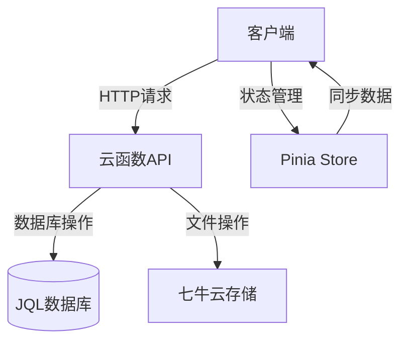
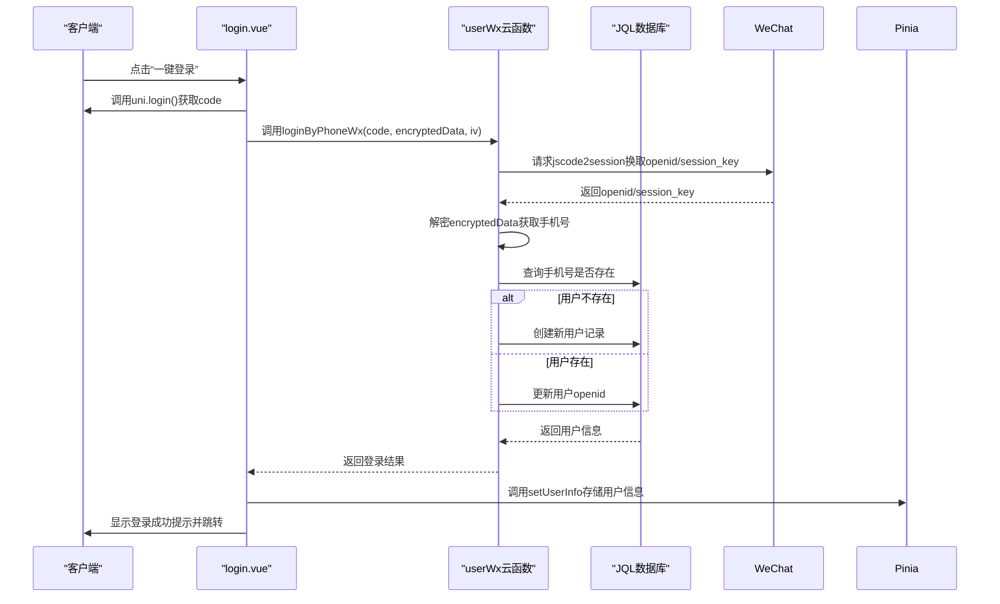
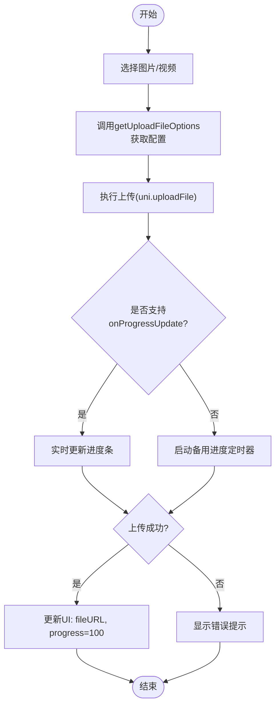
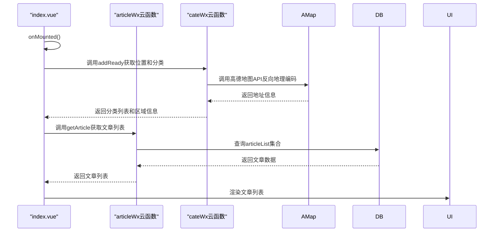
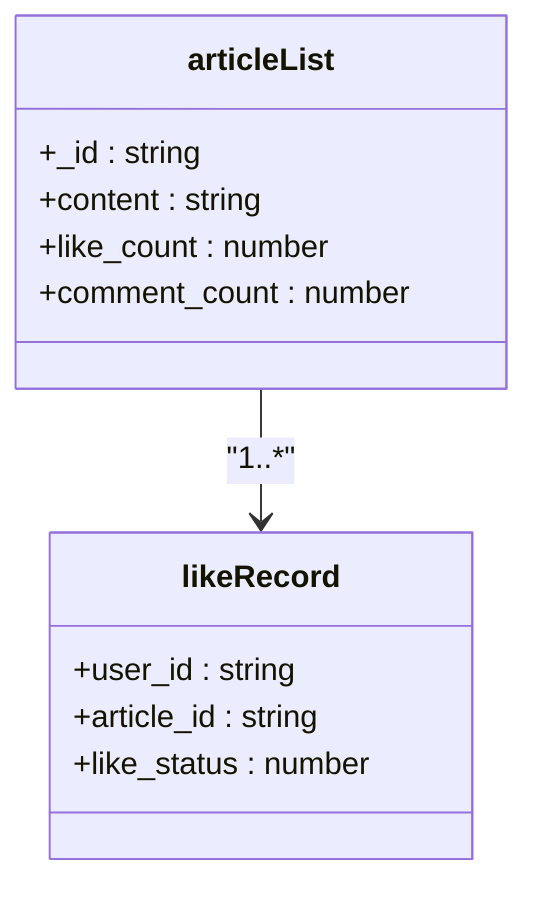
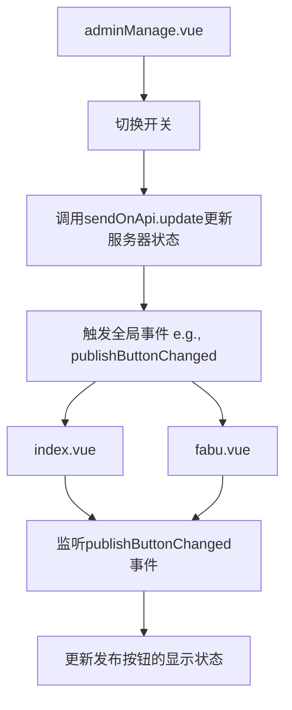

# 核心功能技术设计

<cite>
**本文档引用的文件**
- [main.js](file://main.js)
- [App.vue](file://App.vue)
- [login.vue](file://pages/login/login.vue)
- [user.js](file://store/user.js)
- [userWx/index.obj.js](file://uniCloud-aliyun/cloudfunctions/userWx/index.obj.js)
- [fabuWx/index.obj.js](file://uniCloud-aliyun/cloudfunctions/fabuWx/index.obj.js)
- [articleWx/index.obj.js](file://uniCloud-aliyun/cloudfunctions/articleWx/index.obj.js)
- [commentList/index.obj.js](file://uniCloud-aliyun/cloudfunctions/commentList/index.obj.js)
- [adminManage.vue](file://subPages/adminManage/adminManage.vue)
- [index.vue](file://pages/index/index.vue)
- [articleDetail.vue](file://pages/article/articleDetail.vue)
- [fabu.vue](file://pages/fabu/fabu.vue)
</cite>

## 目录
1. [引言](#引言)
2. [项目结构](#项目结构)
3. [核心组件](#核心组件)
4. [架构概述](#架构概述)
5. [详细组件分析](#详细组件分析)
6. [依赖分析](#依赖分析)
7. [性能考虑](#性能考虑)
8. [故障排除指南](#故障排除指南)
9. [结论](#结论)

## 引言
本项目是一个基于微信生态的社交内容发布与管理系统，旨在为用户提供一个便捷的内容创作、分享和互动平台。系统通过集成微信登录、七牛云存储等第三方服务，实现了从用户认证到内容发布的完整闭环。其主要功能包括：用户系统（微信登录、资料完善）、内容发布（图文/视频上传至七牛云）、内容展示（首页推荐流、文章详情页）、社交互动（点赞、评论）以及后台管理（分类审核、用户权限控制）。该文档将深入探讨这些核心功能的技术实现方案，结合具体源码分析数据流、组件交互模式和用户体验设计，并提供典型场景下的调用链路示例。

## 项目结构
项目采用分层模块化设计，整体结构清晰，便于维护和扩展。主要分为以下几个部分：
- `components`: 存放可复用的UI组件。
- `pages`: 存放各个页面的视图文件。
- `store`: 使用Pinia进行状态管理。
- `style` 和 `styles`: 存放全局样式和SCSS变量。
- `subPages`: 存放管理后台的子页面。
- `uniCloud-aliyun`: 包含所有云函数和数据库Schema。
- `utils`: 存放工具函数。
- `uni_modules`: 第三方插件库。

```mermaid
graph TB
subgraph "前端"
App[App.vue]
Pages[pages目录]
Components[components目录]
Store[store目录]
Utils[utils目录]
end
subgraph "后端 (UniCloud)"
CloudFunctions[cloudfunctions目录]
Database[database目录]
end
App --> Pages
Pages --> Components
Pages --> Store
Pages --> Utils
Store --> CloudFunctions
Components --> CloudFunctions
Utils --> CloudFunctions
CloudFunctions < --> Database
```

**图表来源**
- [App.vue](file://App.vue#L1-L20)
- [pages/login/login.vue](file://pages/login/login.vue#L1-L50)
- [store/user.js](file://store/user.js#L1-L20)
- [uniCloud-aliyun/cloudfunctions/userWx/index.obj.js](file://uniCloud-aliyun/cloudfunctions/userWx/index.obj.js#L1-L20)

**章节来源**
- [main.js](file://main.js#L1-L70)
- [App.vue](file://App.vue#L1-L20)

## 核心组件

### 用户系统
用户系统是整个应用的基础，负责用户的注册、登录和信息管理。它利用微信开放能力，通过一键登录获取用户身份，并在首次登录时引导用户补充手机号等必要信息。

**章节来源**
- [login.vue](file://pages/login/login.vue#L1-L428)
- [user.js](file://store/user.js#L1-L89)
- [userWx/index.obj.js](file://uniCloud-aliyun/cloudfunctions/userWx/index.obj.js#L1-L232)

### 内容发布系统
内容发布系统允许用户创建并发布包含图文或视频的文章。它集成了七牛云对象存储服务，实现了文件的上传、处理和访问控制。

**章节来源**
- [fabu.vue](file://pages/fabu/fabu.vue#L1-L799)
- [fabuWx/index.obj.js](file://uniCloud-aliyun/cloudfunctions/fabuWx/index.obj.js#L1-L709)

### 内容展示系统
内容展示系统负责将已发布的内容以列表和详情的形式呈现给用户。首页采用推荐流形式，根据分类和热度排序；详情页则提供完整的阅读体验。

**章节来源**
- [index.vue](file://pages/index/index.vue#L1-L799)
- [articleDetail.vue](file://pages/article/articleDetail.vue#L1-L799)

### 社交互动系统
社交互动系统支持用户对文章进行点赞和评论，增强了社区的活跃度。系统记录了用户的互动行为，并实时更新相关计数。

**章节来源**
- [articleWx/index.obj.js](file://uniCloud-aliyun/cloudfunctions/articleWx/index.obj.js#L1-L792)
- [commentList/index.obj.js](file://uniCloud-aliyun/cloudfunctions/commentList/index.obj.js#L1-L238)

### 后台管理系统
后台管理系统为管理员提供了对内容和用户权限的全面控制。管理员可以审核文章、管理分类，并通过开关控制各项功能的启用状态。

**章节来源**
- [adminManage.vue](file://subPages/adminManage/adminManage.vue#L1-L459)
- [articleWx/index.obj.js](file://uniCloud-aliyun/cloudfunctions/articleWx/index.obj.js#L1-L792)

## 架构概述
系统采用前后端分离的架构，前端使用Vue 3框架构建用户界面，后端依托阿里云UniCloud运行云函数处理业务逻辑。数据持久化通过UniCloud的JQL数据库完成。这种架构使得前端专注于用户体验，而后端则高效地处理数据和安全验证。



**图表来源**
- [main.js](file://main.js#L1-L70)
- [user.js](file://store/user.js#L1-L89)
- [uniCloud-aliyun/cloudfunctions/userWx/index.obj.js](file://uniCloud-aliyun/cloudfunctions/userWx/index.obj.js#L1-L232)

## 详细组件分析

### 用户系统分析
用户系统的实现分为前端和后端两个层面。前端通过`uni.login()`获取临时登录凭证code，然后调用云函数`loginByPhoneWx`完成登录流程。

#### 登录流程序列图


**图表来源**
- [login.vue](file://pages/login/login.vue#L1-L428)
- [userWx/index.obj.js](file://uniCloud-aliyun/cloudfunctions/userWx/index.obj.js#L1-L232)

#### 关键设计决策
- **异步处理策略**: 整个登录过程涉及多个异步操作（网络请求、数据库查询），通过`async/await`语法确保了代码的可读性和执行顺序。
- **错误边界处理**: 在每个关键步骤都添加了try-catch块，捕获并处理可能的异常，如网络超时、解密失败等，保证了用户体验的流畅性。
- **性能优化手段**: 使用Pinia的持久化插件，将用户信息缓存到本地存储中，避免每次启动应用都重新登录。

**章节来源**
- [login.vue](file://pages/login/login.vue#L1-L428)
- [user.js](file://store/user.js#L1-L89)
- [userWx/index.obj.js](file://uniCloud-aliyun/cloudfunctions/userWx/index.obj.js#L1-L232)

### 内容发布系统分析
内容发布系统的核心在于文件上传和元数据管理。当用户选择图片或视频后，前端会先调用`getUploadFileOptions`云函数获取上传配置，然后使用`uni.uploadFile`进行上传。

#### 文件上传流程


**图表来源**
- [fabu.vue](file://pages/fabu/fabu.vue#L1-L799)
- [fabuWx/index.obj.js](file://uniCloud-aliyun/cloudfunctions/fabuWx/index.obj.js#L1-L709)

#### 七牛云集成
云函数`fabuWx`通过`uniCloud.getExtStorageManager`与七牛云对接。上传时，通过`persistentOps`参数指定图片处理指令，如压缩、裁剪和添加水印，从而在云端自动完成图片优化。

**章节来源**
- [fabu.vue](file://pages/fabu/fabu.vue#L1-L799)
- [fabuWx/index.obj.js](file://uniCloud-aliyun/cloudfunctions/fabuWx/index.obj.js#L1-L709)

### 内容展示系统分析
内容展示系统通过`z-paging`组件实现高效的列表渲染和分页加载。首页根据用户的地理位置动态加载附近的分类和文章。

#### 首页推荐流加载流程


**图表来源**
- [index.vue](file://pages/index/index.vue#L1-L799)
- [articleWx/index.obj.js](file://uniCloud-aliyun/cloudfunctions/articleWx/index.obj.js#L1-L792)

**章节来源**
- [index.vue](file://pages/index/index.vue#L1-L799)

### 社交互动系统分析
社交互动系统实现了点赞和评论两大核心功能。点赞操作直接修改文章的`like_count`字段，并在`likeRecord`集合中记录用户行为。

#### 点赞功能实现


当用户点击点赞按钮时，前端调用`clickLike`云函数。如果用户未点赞，则`like_count`加1，并在`likeRecord`中插入一条记录；反之则减1并删除记录。

**图表来源**
- [articleWx/index.obj.js](file://uniCloud-aliyun/cloudfunctions/articleWx/index.obj.js#L1-L792)
- [uniCloud-aliyun/database/articleList.schema.json](file://uniCloud-aliyun/database/articleList.schema.json)
- [uniCloud-aliyun/database/likeRecord.schema.json](file://uniCloud-aliyun/database/likeRecord.schema.json)

**章节来源**
- [articleWx/index.obj.js](file://uniCloud-aliyun/cloudfunctions/articleWx/index.obj.js#L1-L792)

### 后台管理系统分析
后台管理系统通过全局事件总线(`uni.$emit`)实现跨页面的状态同步。例如，当管理员在`adminManage.vue`中切换“发布按钮”开关时，会触发`publishButtonChanged`事件，通知其他页面更新UI。

#### 权限控制流程


**图表来源**
- [adminManage.vue](file://subPages/adminManage/adminManage.vue#L1-L459)
- [index.vue](file://pages/index/index.vue#L1-L799)
- [fabu.vue](file://pages/fabu/fabu.vue#L1-L799)

**章节来源**
- [adminManage.vue](file://subPages/adminManage/adminManage.vue#L1-L459)

## 依赖分析
项目的依赖关系清晰，前端组件通过`uniCloud.importObject`按需引入云函数，降低了耦合度。Pinia作为状态管理库，被多个页面共享，确保了用户状态的一致性。

```mermaid
graph LR
    main.js --> App.vue
    App.vue --> login.vue
    App.vue --> index.vue
    App.vue --> fabu.vue
    App.vue --> articleDetail.vue
    login.vue --> user.js
    index.vue --> user.js
    fab