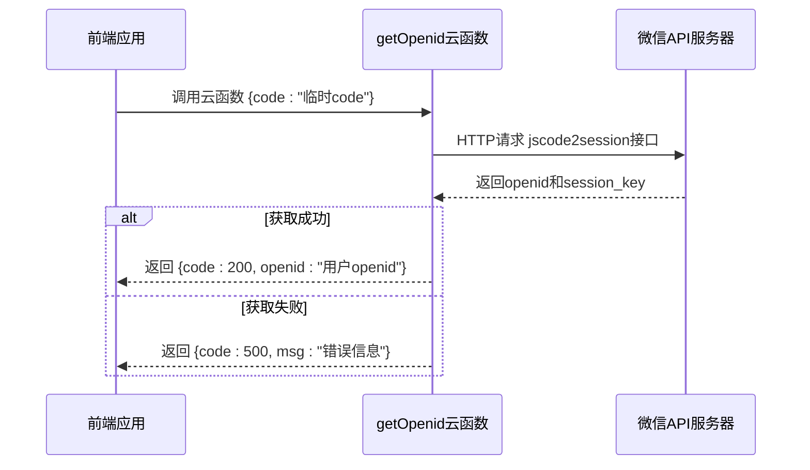
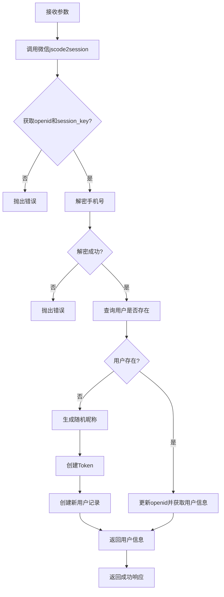
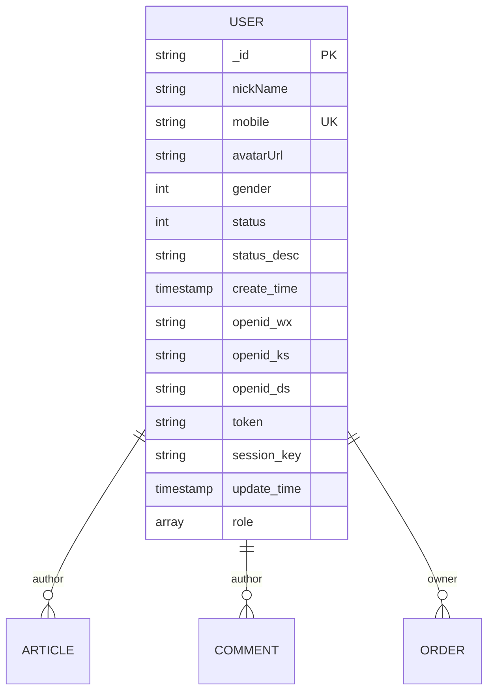
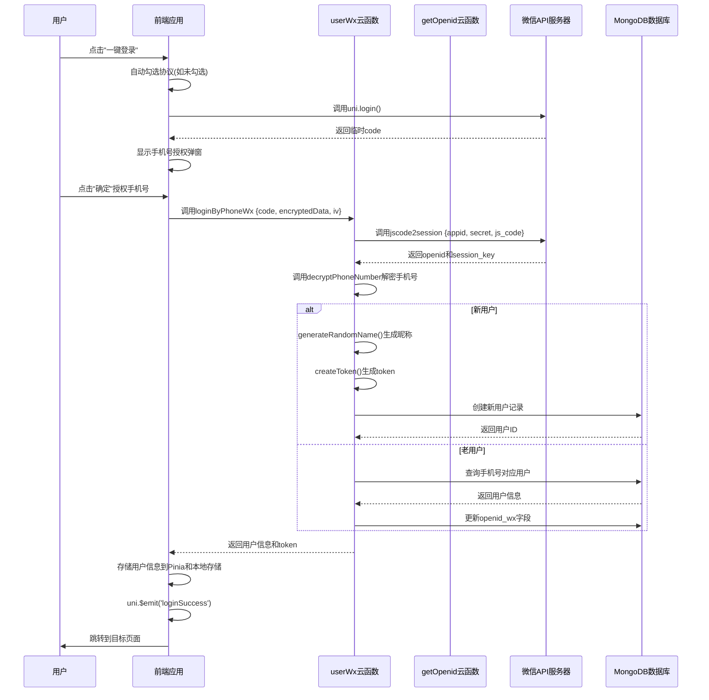

# 微信登录

<cite>
**Referenced Files in This Document **   
- [login.vue](file://pages/login/login.vue)
- [getOpenid/index.js](file://uniCloud-aliyun/cloudfunctions/getOpenid/index.js)
- [userWx/index.obj.js](file://uniCloud-aliyun/cloudfunctions/userWx/index.obj.js)
- [userWx/generateRandomName.js](file://uniCloud-aliyun/cloudfunctions/userWx/generateRandomName.js)
- [userWx/config.js](file://uniCloud-aliyun/cloudfunctions/userWx/config.js)
- [user.schema.json](file://uniCloud-aliyun/database/user.schema.json)
- [userWx/createToken.js](file://uniCloud-aliyun/cloudfunctions/userWx/createToken.js)
- [userWx/decryptPhoneNumber.js](file://uniCloud-aliyun/cloudfunctions/userWx/decryptPhoneNumber.js)
</cite>

## 目录
1. [微信登录流程概述](#微信登录流程概述)
2. [前端实现分析](#前端实现分析)
3. [后端云函数解析](#后端云函数解析)
4. [用户数据模型与初始化](#用户数据模型与初始化)
5. [完整交互时序图](#完整交互时序图)
6. [常见问题与解决方案](#常见问题与解决方案)

## 微信登录流程概述

本项目实现了完整的微信一键登录功能，采用前后端分离的架构设计。整个流程始于前端调用 `uni.login()` 获取临时登录凭证（code），随后将该 code 发送至后端云函数进行解密以获取用户的唯一标识 openid。系统通过 openid 识别用户身份，并在用户首次登录时自动创建用户记录。

该登录机制结合了微信官方的安全认证体系和自定义的用户管理系统，确保了用户身份验证的安全性和可靠性。当用户完成手机号授权后，系统会触发全局事件通知其他页面组件，实现无缝的用户体验。整个流程设计考虑了各种异常情况的处理，如网络中断、code 过期等，提供了完善的错误处理和重试机制。

## 前端实现分析

### login.vue 页面结构与逻辑

`login.vue` 页面是微信登录功能的核心入口，包含了完整的用户授权引导界面和交互逻辑。

```mermaid
flowchart TD
A[页面加载] --> B{检查重定向参数}
B --> |存在| C[保存重定向URL]
B --> |不存在| D[继续正常流程]
D --> E[显示登录页面]
E --> F[用户点击一键登录]
F --> G[调用 uni.login()]
G --> H[获取临时code]
H --> I[显示手机号授权弹窗]
I --> J{用户授权手机号}
J --> |同意| K[调用 userWx.loginByPhoneWx]
J --> |拒绝| L[提示授权失败]
K --> M[等待服务器响应]
M --> N{登录成功?}
N --> |是| O[存储用户信息]
N --> |否| P[显示错误信息]
O --> Q[触发 loginSuccess 事件]
Q --> R{有重定向URL?}
R --> |是| S[跳转到指定页面]
R --> |否| T[返回上一页或首页]
```

**Diagram sources**
- [login.vue](file://pages/login/login.vue#L0-L428)

**Section sources**
- [login.vue](file://pages/login/login.vue#L0-L428)

### 授权引导UI设计

页面采用了渐进式的用户体验设计策略，首先展示简洁的欢迎界面，仅包含品牌Logo和"欢迎登录进行使用"的提示文本。在用户点击"一键登录"按钮前，必须勾选同意服务协议和隐私政策，这一设计符合当前主流应用的合规要求。

授权流程分为两个阶段：第一阶段是微信登录授权，通过 `uni.login()` 获取临时 code；第二阶段是手机号授权，使用 `open-type="getPhoneNumber"` 的 button 组件触发微信原生的手机号授权弹窗。这种分步授权的设计降低了用户的决策压力，提高了授权成功率。

弹窗设计注重用户体验细节，包含默认头像图标、清晰的标题"请先完善个人信息"以及说明文字"手机号作为多端信息同步使用"，帮助用户理解授权目的。操作按钮采用"取消"和"确定"的配对设计，符合用户的心理预期。

### 一键登录交互流程

一键登录的交互流程经过精心设计，优化了多个用户体验细节：

1. **自动勾选协议**：当用户点击登录按钮但未勾选协议时，系统会自动勾选并给予100毫秒的视觉反馈，既保证了流程的顺畅性，又让用户意识到协议已被同意。
2. **加载状态管理**：在登录过程中，系统会显示相应的加载提示，避免用户因等待而重复操作。
3. **智能跳转逻辑**：登录成功后，系统优先跳转到登录前尝试访问的页面（通过 redirect 参数传递），若无此参数则返回上一页，最后兜底方案是跳转到首页，确保用户始终处于合理的导航路径中。

## 后端云函数解析

### getOpenid 云函数

`getOpenid` 云函数负责将前端传入的临时 code 解密为用户的 openid。



**Diagram sources**
- [getOpenid/index.js](file://uniCloud-aliyun/cloudfunctions/getOpenid/index.js#L0-L36)

**Section sources**
- [getOpenid/index.js](file://uniCloud-aliyun/cloudfunctions/getOpenid/index.js#L0-L36)

该函数通过向微信官方的 `sns/jscode2session` 接口发起 HTTP 请求，传入小程序的 appId、appSecret 和临时 code 来换取用户的 openid 和 session_key。函数内部包含了完整的错误处理机制，能够捕获网络异常和微信接口返回的错误码，并将其转换为统一的错误响应格式。

值得注意的是，项目中存在两套配置：一套在 `getOpenid/index.js` 中硬编码，另一套在 `userWx/config.js` 中通过模块导出。这可能是历史遗留的设计，建议统一配置管理以避免维护困难。

### userWx 云函数

`userWx` 云函数是用户管理的核心，其中 `loginByPhoneWx` 方法实现了完整的用户登录和注册逻辑。



**Diagram sources**
- [userWx/index.obj.js](file://uniCloud-aliyun/cloudfunctions/userWx/index.obj.js#L0-L232)
- [userWx/generateRandomName.js](file://uniCloud-aliyun/cloudfunctions/userWx/generateRandomName.js#L0-L29)
- [userWx/createToken.js](file://uniCloud-aliyun/cloudfunctions/userWx/createToken.js#L0-L6)
- [userWx/decryptPhoneNumber.js](file://uniCloud-aliyun/cloudfunctions/userWx/decryptPhoneNumber.js#L0-L31)

**Section sources**
- [userWx/index.obj.js](file://uniCloud-aliyun/cloudfunctions/userWx/index.obj.js#L0-L232)

#### 用户首次登录处理逻辑

当系统检测到用户为首次登录时（即数据库中不存在该手机号的记录），会执行以下初始化逻辑：

1. **默认昵称生成**：调用 `generateRandomName.js` 模块生成形如"匿名ABcD12"的随机昵称，其中包含"匿名"前缀、4个随机字母和2个随机数字，既保护了用户隐私又提供了可识别的用户名。
2. **头像地址处理**：新用户默认头像地址为空，但在前端逻辑中会回退到 `/static/images/default.png` 这个静态资源，确保了头像显示的一致性。
3. **角色初始化**：所有新用户默认被赋予 `['user']` 角色数组，这是系统中最基础的用户权限级别，符合最小权限原则。

#### 安全相关实现

- **手机号解密**：使用 AES-128-CBC 算法对微信加密的手机号数据进行解密，确保了敏感信息传输的安全性。
- **Token生成**：基于用户的 openid、session_key 和时间戳通过 MD5 哈希算法生成唯一的 token，用于后续的接口鉴权。
- **会话管理**：将 session_key 存储在用户记录中，用于后续可能的消息推送或其他需要会话密钥的功能。

## 用户数据模型与初始化

### 用户数据结构

用户数据存储在 MongoDB 数据库的 `user` 集合中，其结构由 `user.schema.json` 文件定义。



**Diagram sources**
- [user.schema.json](file://uniCloud-aliyun/database/user.schema.json#L0-L106)

**Section sources**
- [user.schema.json](file://uniCloud-aliyun/database/user.schema.json#L0-L106)

#### 核心字段说明

- **mobile**: 手机号字段，具有唯一性约束和正则表达式校验（`^1[3-9]\d{9}$`），确保了中国大陆手机号格式的正确性。
- **openid_wx**: 微信平台的用户唯一标识，用于关联微信账号。
- **role**: 角色数组，默认值为 `["user"]`，支持多角色分配，为未来的权限系统扩展提供了基础。
- **token**: 用户鉴权令牌，用于 API 接口的身份验证。
- **status**: 账号状态字段，支持正常、禁用、封禁三种状态，便于后台管理。

#### 数据验证规则

数据库 schema 定义了严格的验证规则：
- 必填字段：`mobile`
- 枚举限制：`gender` (0-未知,1-男,2-女), `status` (0-正常,1-禁用,2-封禁), `role` (user,vip,admin)
- 默认值：`create_time` 自动填充为当前时间，`role` 默认为 `["user"]`
- 字段权限：读、创建、更新权限开放，删除权限关闭，防止用户数据意外丢失

## 完整交互时序图



**Diagram sources**
- [login.vue](file://pages/login/login.vue#L0-L428)
- [userWx/index.obj.js](file://uniCloud-aliyun/cloudfunctions/userWx/index.obj.js#L0-L232)
- [getOpenid/index.js](file://uniCloud-aliyun/cloudfunctions/getOpenid/index.js#L0-L36)

## 常见问题与解决方案

### 登录无响应

**现象**：用户点击登录按钮后没有任何反应。

**排查路径**：
1. 检查 `login.vue` 中 `clickLogin` 方法是否正确绑定到按钮的 `@click` 事件
2. 确认 uView Plus 组件库是否正确引入和配置
3. 查看浏览器控制台是否有 JavaScript 错误
4. 验证网络连接是否正常

**解决方案**：
- 在 `clickLogin` 方法中添加 try-catch 块捕获潜在异常
- 添加加载状态指示器，让用户知道操作正在进行
- 实现超时机制，避免用户无限等待

### Code过期

**现象**：登录过程中提示"获取用户信息失败"。

**原因分析**：微信的临时 code 有效期为5分钟，且只能使用一次。如果用户获取 code 后长时间未完成登录流程，或者 code 被重复使用，就会导致此错误。

**解决方案**：
- 在用户进入登录页面时预加载必要的资源，减少登录过程中的等待时间
- 实现 code 刷新机制，在检测到过期时自动重新获取
- 提供清晰的错误提示，引导用户重新尝试登录

### 手机号授权失败

**现象**：用户拒绝手机号授权或解密失败。

**处理策略**：
1. 前端应优雅地处理拒绝情况，不强制用户授权
2. 提供替代的登录方式（如账号密码登录）
3. 记录失败日志用于后续分析

**代码示例**：
```javascript
// 前端调用云对象示例
const userApi = uniCloud.importObject('userWx')
const params = {
  code: res.code,
  encryptedData: e.detail.encryptedData,
  iv: e.detail.iv,
}
const result = await userApi.loginByPhoneWx(params)
```

### 全局事件通知

登录成功后，通过 `uni.$emit('loginSuccess')` 触发全局事件，其他页面可以通过 `uni.$on('loginSuccess', callback)` 监听此事件并执行相应逻辑，如刷新用户信息、更新界面状态等，实现了组件间的松耦合通信。