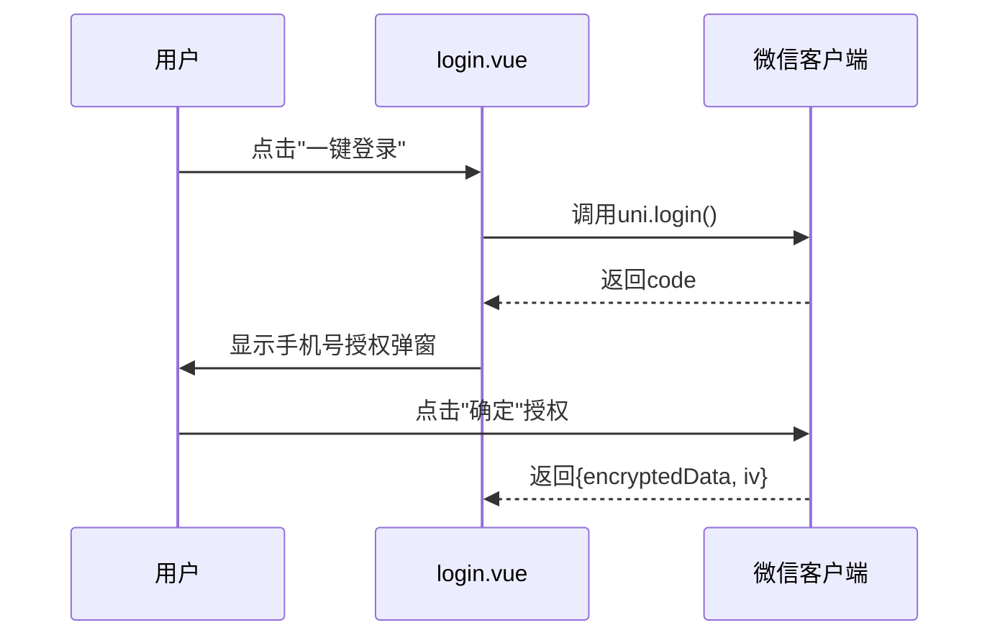
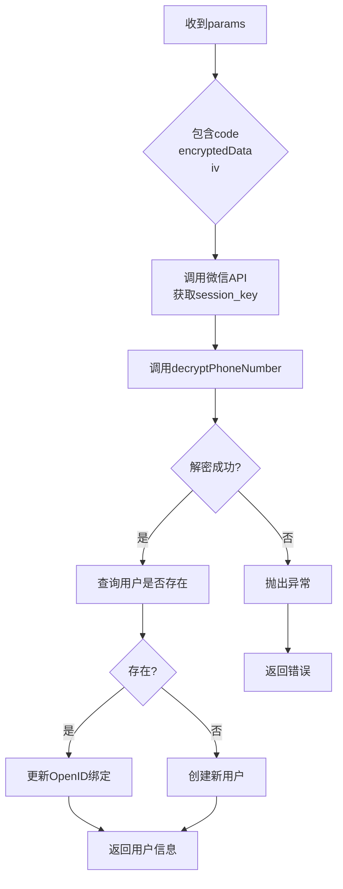
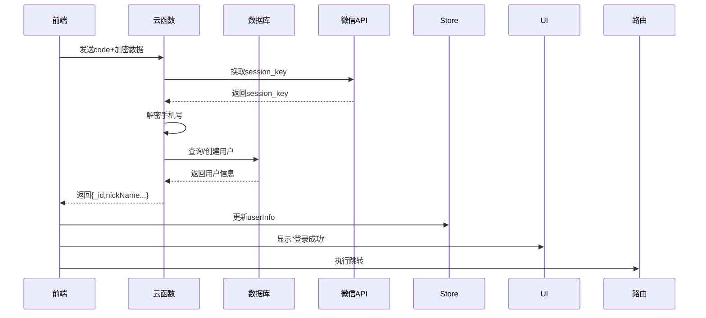

<cite>
**本文档中引用的文件**
- [login.vue](file://pages/login/login.vue)
- [decryptPhoneNumber.js](file://uniCloud-aliyun/cloudfunctions/userWx/decryptPhoneNumber.js)
- [index.obj.js](file://uniCloud-aliyun/cloudfunctions/userWx/index.obj.js)
- [config.js](file://uniCloud-aliyun/cloudfunctions/userWx/config.js)
</cite>

# 手机号绑定

## 目录
1. [技术实现机制概述](#技术实现机制概述)
2. [前端授权与数据获取流程](#前端授权与数据获取流程)
3. [云函数安全解密链路](#云函数安全解密链路)
4. [数据传输安全性保障](#数据传输安全性保障)
5. [成功回调处理逻辑](#成功回调处理逻辑)
6. [错误场景捕获与提示](#错误场景捕获与提示)
7. [调试建议](#调试建议)

## 技术实现机制概述

本项目实现了基于微信原生能力的手机号快速绑定功能，通过前端`open-type='getPhoneNumber'`触发微信授权弹窗，获取加密数据后经由云函数完成解密验证。整个流程涉及前端页面交互、敏感信息加密传输、云端身份校验与用户数据管理等多个环节，构成完整的安全认证体系。

**Section sources**
- [login.vue](file://pages/login/login.vue#L1-L429)
- [index.obj.js](file://uniCloud-aliyun/cloudfunctions/userWx/index.obj.js#L1-L233)

## 前端授权与数据获取流程

在登录页面中，用户点击“一键登录”按钮后，系统首先调用`uni.login()`获取临时登录凭证code，并展示手机号授权弹窗。当用户点击“确定”按钮时，`open-type='getPhoneNumber'`触发微信原生授权机制，返回包含`encryptedData`和`iv`向量的加密数据包。

该过程的关键在于使用微信官方提供的开放能力，在不暴露用户隐私的前提下完成身份确认。前端通过监听`@getphonenumber`事件接收加密数据，并将其与之前获取的code一并提交至后端进行处理。

**Diagram sources**
- [login.vue](file://pages/login/login.vue#L1-L429)

**Section sources**
- [login.vue](file://pages/login/login.vue#L1-L429)

## 云函数安全解密链路

前端传入的加密数据通过`userApi.loginByPhoneWx(params)`接口发送至名为`userWx`的云函数。该函数执行以下核心步骤：

1. **会话密钥获取**：利用从`config.js`读取的AppID和AppSecret，结合前端传入的code，向微信服务器请求`session_key`。
2. **手机号解密**：调用`decryptPhoneNumber.js`模块，使用`session_key`对`encryptedData`进行AES-128-CBC模式解密。
3. **用户状态判断**：查询数据库是否存在对应手机号记录，若无则创建新用户并生成随机昵称；若有则更新其OpenID绑定关系。
4. **响应构建**：返回包含用户基本信息及认证令牌的结果对象。

此链路确保了敏感信息仅在受信任的云端环境中解密，避免了私钥泄露风险。

**Diagram sources**
- [index.obj.js](file://uniCloud-aliyun/cloudfunctions/userWx/index.obj.js#L1-L233)
- [decryptPhoneNumber.js](file://uniCloud-aliyun/cloudfunctions/userWx/decryptPhoneNumber.js#L1-L33)
- [config.js](file://uniCloud-aliyun/cloudfunctions/userWx/config.js#L1-L5)

**Section sources**
- [index.obj.js](file://uniCloud-aliyun/cloudfunctions/userWx/index.obj.js#L1-L233)
- [decryptPhoneNumber.js](file://uniCloud-aliyun/cloudfunctions/userWx/decryptPhoneNumber.js#L1-L33)
- [config.js](file://uniCloud-aliyun/cloudfunctions/userWx/config.js#L1-L5)

## 数据传输安全性保障

系统采用多层次安全措施保护用户数据：
- **HTTPS加密通道**：所有与微信API的通信均通过HTTPS协议进行，防止中间人攻击。
- **敏感字段脱敏**：日志输出时对解密结果进行截断处理（仅显示前100字符），避免完整手机号被意外记录。
- **密钥隔离存储**：AppSecret等敏感配置独立存放于`config.js`，不参与前端构建。
- **运行环境隔离**：解密操作在服务端云函数中完成，前端无法直接访问`session_key`。

这些措施共同构成了纵深防御体系，符合最小权限原则和数据最小化收集规范。

**Section sources**
- [decryptPhoneNumber.js](file://uniCloud-aliyun/cloudfunctions/userWx/decryptPhoneNumber.js#L1-L33)
- [config.js](file://uniCloud-aliyun/cloudfunctions/userWx/config.js#L1-L5)

## 成功回调处理逻辑

从前端`getMobile`方法出发，完整成功流程如下：
1. 接收微信返回的加密数据
2. 构造参数对象并调用云函数
3. 解析云函数返回结果
4. 更新本地用户状态（Vuex Store）
5. 显示成功提示（Toast）
6. 执行跳转逻辑（优先重定向URL，否则返回上一页）

特别地，系统支持携带`redirect`参数的深层链接跳转，在登录完成后自动导向目标页面，提升用户体验连贯性。

**Diagram sources**
- [login.vue](file://pages/login/login.vue#L1-L429)
- [index.obj.js](file://uniCloud-aliyun/cloudfunctions/userWx/index.obj.js#L1-L233)

**Section sources**
- [login.vue](file://pages/login/login.vue#L1-L429)

## 错误场景捕获与提示

系统针对典型异常情况设计了完善的错误处理机制：

| 错误类型 | 触发条件 | 处理方式 |
|---------|--------|--------|
| 用户拒绝授权 | `errMsg !== 'getPhoneNumber:ok'` | 捕获异常并提示"获取手机号失败" |
| 解密失败 | `decryptPhoneNumber`返回null | 记录详细错误日志并抛出"手机号解密失败" |
| 会话失效 | 微信API返回无效`session_key` | 抛出"获取用户信息失败" |
| 数据库异常 | 查询或写入操作失败 | 捕获异常并返回带错误消息的结果 |

前端统一通过try-catch结构捕获错误，并以友好的提示文案告知用户，同时保留必要的调试信息用于问题排查。

**Section sources**
- [login.vue](file://pages/login/login.vue#L1-L429)
- [index.obj.js](file://uniCloud-aliyun/cloudfunctions/userWx/index.obj.js#L1-L233)
- [decryptPhoneNumber.js](file://uniCloud-aliyun/cloudfunctions/userWx/decryptPhoneNumber.js#L1-L33)

## 调试建议

为便于开发调试，推荐以下实践：
1. 在`decryptPhoneNumber.js`中保留解密结果的日志输出（已做脱敏处理）
2. 使用`console.log`分段打印关键变量值（如code、session_key、phoneData等）
3. 利用云函数日志查看器实时监控执行流
4. 测试时可临时放宽某些校验条件，但上线前必须恢复
5. 对于网络相关问题，检查`manifest.json`中是否正确配置了request合法域名

此外，建议在非生产环境中开启详细的错误堆栈输出，以便快速定位问题根源。

**Section sources**
- [decryptPhoneNumber.js](file://uniCloud-aliyun/cloudfunctions/userWx/decryptPhoneNumber.js#L1-L33)
- [index.obj.js](file://uniCloud-aliyun/cloudfunctions/userWx/index.obj.js#L1-L233)