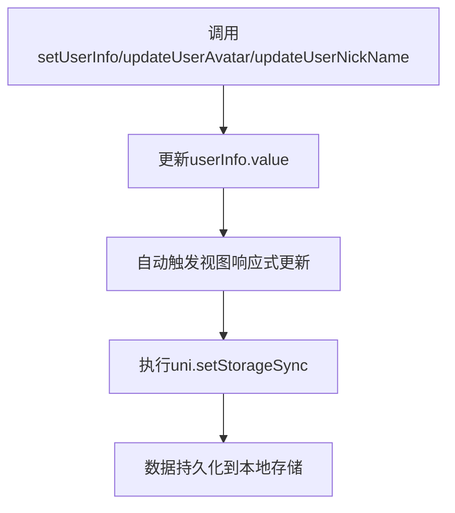
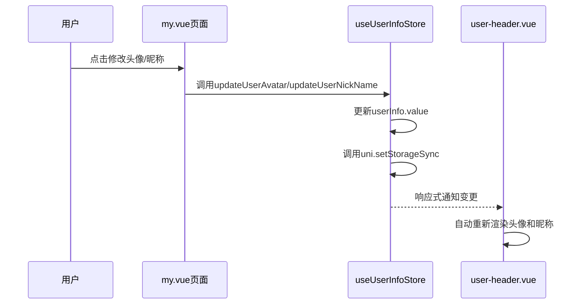

# 用户资料管理

<cite>
**本文档引用文件**   
- [user.js](file://store/user.js)
- [user-header.vue](file://components/user-header/user-header.vue)
- [my.vue](file://pages/my/my.vue)
- [login.vue](file://pages/login/login.vue)
</cite>

## 目录
1. [用户信息状态管理设计](#用户信息状态管理设计)
2. [核心方法实现与持久化机制](#核心方法实现与持久化机制)
3. [组件使用场景与响应式渲染](#组件使用场景与响应式渲染)
4. [退出登录安全清理行为](#退出登录安全清理行为)
5. [多页面数据一致性保障](#多页面数据一致性保障)

## 用户信息状态管理设计

在wx2项目中，用户资料管理采用Pinia作为状态管理模式，通过`useUserInfoStore`统一维护用户的核心信息。该store位于`store/user.js`文件中，定义了包括uid、昵称、头像、手机号及登录状态等关键字段。

`useUserInfoStore`基于Vue 3的Composition API构建，利用`ref`创建响应式数据对象`userInfo`，并以`defaultUserInfo`作为初始默认值。这种设计确保了用户数据在整个应用生命周期内的统一性和可预测性。所有对用户信息的读取和修改都必须通过该store进行，实现了单一数据源（Single Source of Truth）的原则。

store中暴露的`userInfo`为一个响应式引用（ref），其内部结构包含：
- `uid`: 用户本地平台唯一标识
- `nickName`: 用户昵称
- `avatarUrl`: 头像图片地址
- `mobile`: 手机号码
- `isLogin`: 登录状态标志
- `role`: 用户角色数组

通过将这些核心信息集中管理，避免了在多个组件间传递props的复杂性，同时保证了数据的一致性和同步更新。

**Section sources**
- [user.js](file://store/user.js#L3-L89)

## 核心方法实现与持久化机制

### setUserInfo方法
`setUserInfo`方法负责设置完整的用户数据对象。当调用此方法时，会将传入的对象直接赋值给`userInfo.value`。特别地，该方法会根据传入对象是否包含`uid`来自动更新`isLogin`状态：若存在`uid`则置为`true`，否则为`false`。这是判断用户登录状态的关键逻辑。

### updateUserAvatar与updateUserNickName方法
这两个方法分别用于更新用户的头像和昵称。它们直接修改`userInfo.value`中的对应属性，并立即触发视图更新。例如，`updateUserAvatar(avatarUrl)`会将新的头像URL赋值给`userInfo.value.avatarUrl`。

### 持久化联动机制
所有状态变更操作均与`uni.setStorageSync`方法联动，实现数据的本地持久化存储。每次调用`setUserInfo`、`updateUserAvatar`或`updateUserNickName`时，都会执行`uni.setStorageSync('userInfo', userInfo.value)`，将最新的用户信息同步保存到本地缓存中。这确保了即使应用被关闭或重启，用户的状态也能得到恢复。

此外，在`main.js`中配置了Pinia的持久化插件，指定了`userInfo` store需要持久化，进一步强化了数据的可靠性。

**Diagram sources**
- [user.js](file://store/user.js#L20-L30)
- [user.js](file://store/user.js#L41-L45)
- [user.js](file://store/user.js#L48-L52)

**Section sources**
- [user.js](file://store/user.js#L20-L52)

## 组件使用场景与响应式渲染

### user-header组件集成
`user-header`组件（位于`components/user-header/user-header.vue`）是展示用户信息的典型使用场景。该组件通过`import { useUserInfoStore } from '@/store/user'`导入store，并创建`userStore`实例。

在模板中，通过绑定`userStore.userInfo.avatarUrl`和`userStore.userInfo.nickName`，实现了头像与昵称的动态渲染。由于Pinia store的响应式特性，一旦`userInfo`发生变化（如登录后调用`setUserInfo`），组件视图会自动更新，无需额外的手动刷新操作。

### 实际代码片段演示
在`my.vue`页面中，展示了如何通过store更新用户信息：
- 修改头像时调用`userStore.updateUserAvatar(uploadRes.fileID)`
- 修改昵称时调用`userStore.updateUserNickName(nickName)`

这些操作不仅更新了store中的状态，还通过持久化机制保存到了本地，同时触发了所有依赖该状态的组件（如`user-header`）的视图更新。

**Diagram sources**
- [user-header.vue](file://components/user-header/user-header.vue#L0-L60)
- [my.vue](file://pages/my/my.vue#L100-L150)

**Section sources**
- [user-header.vue](file://components/user-header/user-header.vue#L0-L235)
- [my.vue](file://pages/my/my.vue#L100-L200)

## 退出登录安全清理行为

`cleanUserInfo`方法负责处理用户退出登录时的安全清理工作。其主要行为包括：

1. **状态重置**：将`userInfo.value`重新赋值为`defaultUserInfo`对象，即恢复所有字段到默认状态。这意味着`uid`被清空，`isLogin`被设为`false`，头像恢复为默认图片等。

2. **点赞记录清除**：除了用户基本信息外，该方法还会清空`likeRecords.value`数组，移除用户的点赞记录，确保个人数据的彻底清理。

3. **本地缓存同步**：虽然代码中未显式调用`uni.setStorageSync`，但由于Pinia的持久化配置，状态变更后会自动同步到本地存储，从而清除已保存的用户信息。

在`my.vue`页面中，退出登录按钮通过`uni.showModal`弹窗确认后，调用`userStore.cleanUserInfo()`完成整个退出流程，保障了操作的安全性。

**Section sources**
- [user.js](file://store/user.js#L33-L38)
- [my.vue](file://pages/my/my.vue#L250-L270)

## 多页面数据一致性保障

本项目通过以下策略确保多页面共享用户数据的一致性：

1. **全局状态单一源**：所有页面都从同一个`useUserInfoStore`实例读取用户信息，避免了数据分散导致的不一致问题。

2. **响应式更新**：利用Pinia的响应式系统，任何页面对用户信息的修改都会立即反映到其他所有使用该store的组件中。

3. **持久化同步**：结合`uni.setStorageSync`和Pinia持久化插件，确保跨页面导航或应用重启后数据仍保持一致。

4. **事件驱动更新**：在某些场景下（如发布文章后），通过`uni.$emit('globalRefresh')`等全局事件通知相关页面刷新数据，进一步增强一致性。

这种架构设计使得用户无论在哪个页面操作，都能获得一致且实时的用户体验。

**Section sources**
- [user.js](file://store/user.js#L3-L89)
- [my.vue](file://pages/my/my.vue#L200-L270)
- [login.vue](file://pages/login/login.vue#L100-L150)