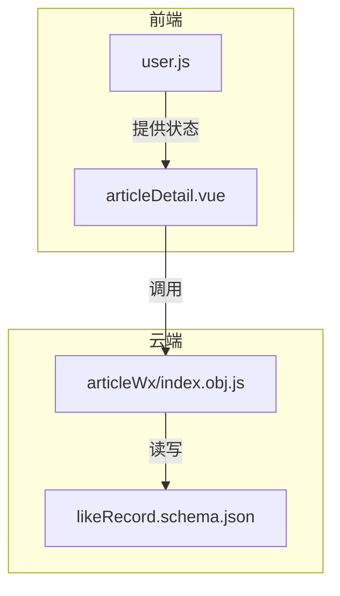
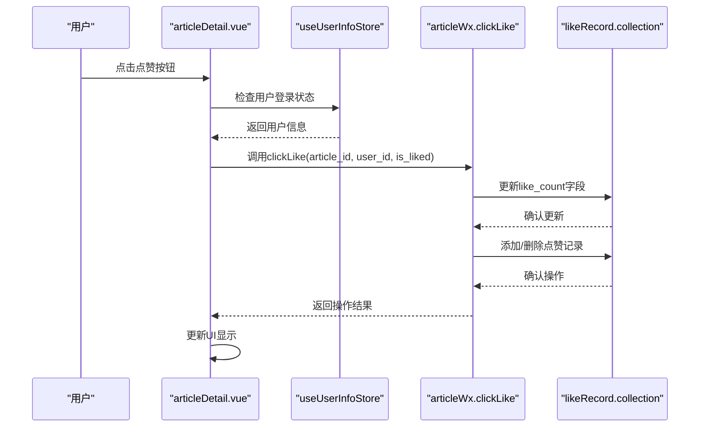
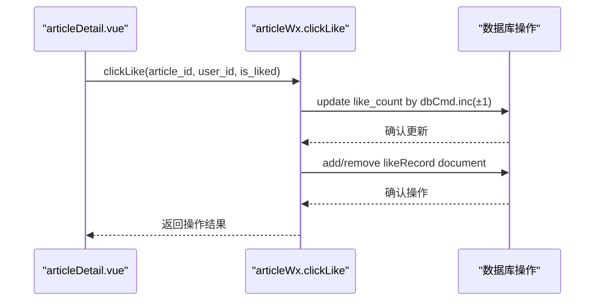
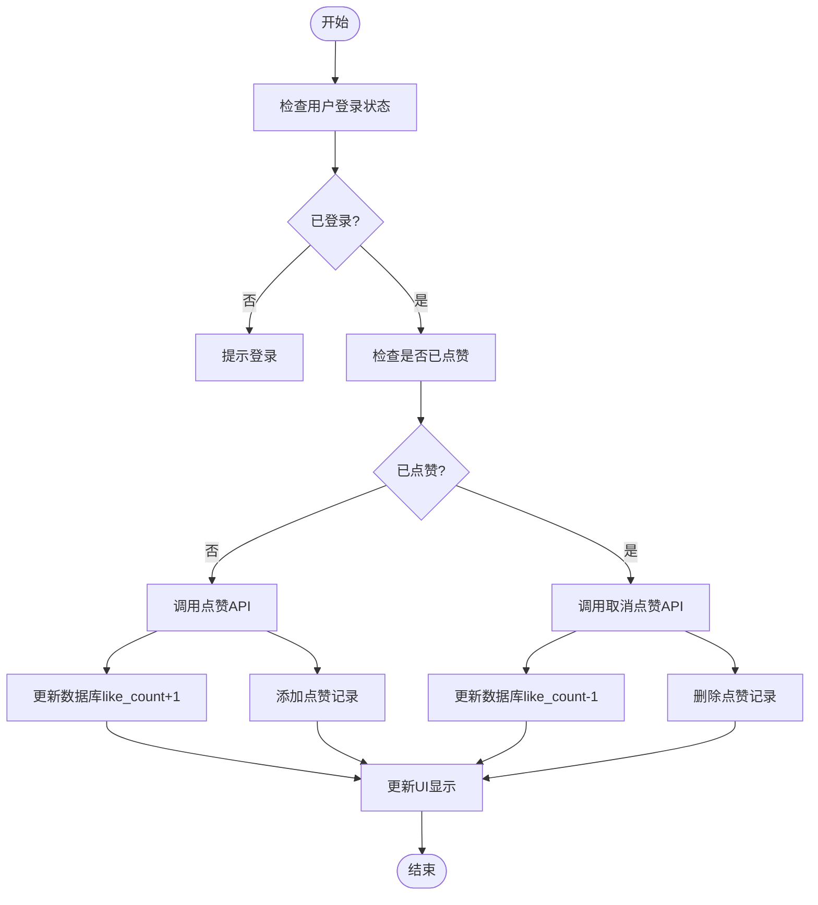
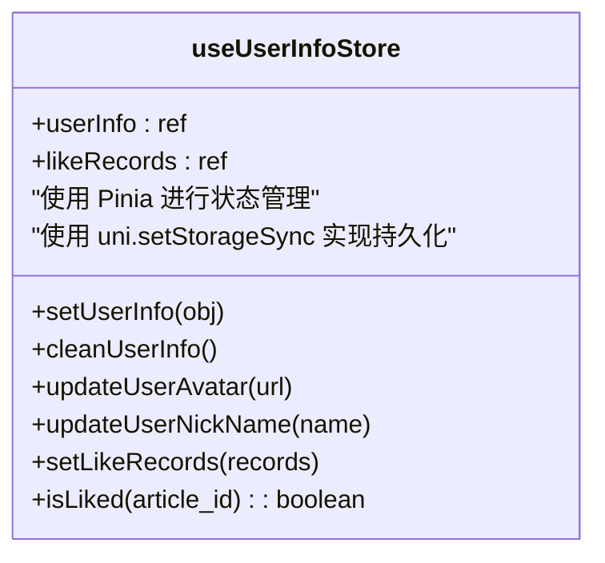
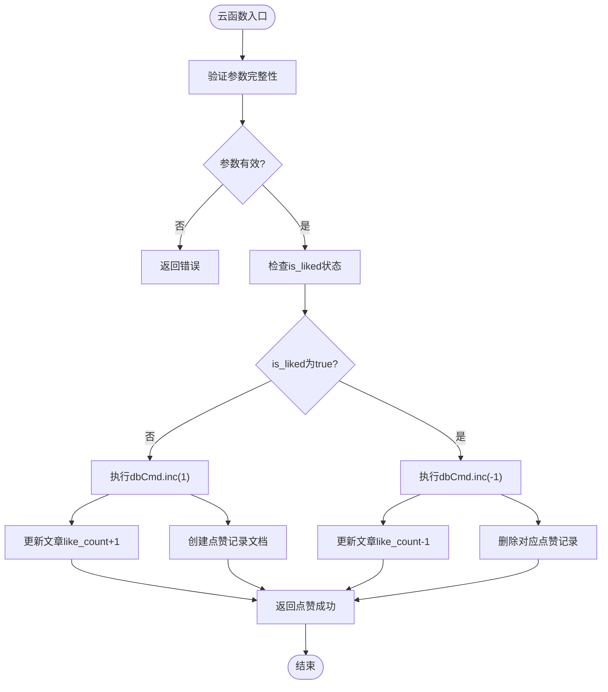
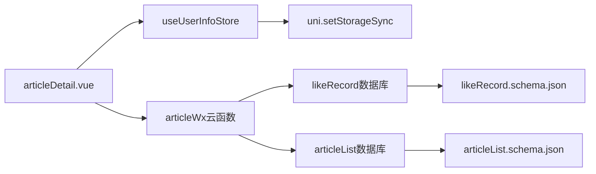

# 点赞机制

<cite>
**本文档引用的文件**   
- [articleDetail.vue](file://pages/article/articleDetail.vue)
- [user.js](file://store/user.js)
- [articleWx/index.obj.js](file://uniCloud-aliyun/cloudfunctions/articleWx/index.obj.js)
- [likeRecord.schema.json](file://uniCloud-aliyun/database/likeRecord.schema.json)
</cite>

## 目录
1. [简介](#简介)
2. [项目结构](#项目结构)
3. [核心组件](#核心组件)
4. [架构概述](#架构概述)
5. [详细组件分析](#详细组件分析)
6. [依赖分析](#依赖分析)
7. [性能考虑](#性能考虑)
8. [故障排除指南](#故障排除指南)
9. [结论](#结论)

## 简介
本文档深入解析了点赞功能的技术实现路径。重点阐述`articleDetail.vue`中点赞按钮的响应逻辑：如何通过Pinia的`useUserInfoStore`获取用户状态，调用`articleWx`云函数完成点赞/取消点赞操作，并实时更新本地UI状态。分析`articleWx`云函数内部对文章点赞数（like_count字段）的原子性增减与`likeRecord.schema.json`数据库记录的同步写入机制。结合`store/user.js`中的`likeList`缓存设计，说明离线点赞行为的暂存策略及网络恢复后的数据同步方案。提供防止重复提交、高并发下数据库锁竞争等常见问题的解决方案。

## 项目结构
本项目的文件组织遵循典型的UniApp+UniCloud架构模式，主要分为前端页面、状态管理、云函数和数据库模式四大部分。点赞功能的核心逻辑分布在前端页面组件、Pinia状态存储和云端数据库操作之间，形成了清晰的前后端分离架构。



**图表来源**
- [articleDetail.vue](file://pages/article/articleDetail.vue)
- [user.js](file://store/user.js)
- [articleWx/index.obj.js](file://uniCloud-aliyun/cloudfunctions/articleWx/index.obj.js)
- [likeRecord.schema.json](file://uniCloud-aliyun/database/likeRecord.schema.json)

**章节来源**
- [articleDetail.vue](file://pages/article/articleDetail.vue)
- [user.js](file://store/user.js)

## 核心组件
点赞功能的核心组件包括前端的`articleDetail.vue`页面组件、用于状态管理的`useUserInfoStore`以及云端的`articleWx`云函数。这些组件协同工作，实现了从用户交互到数据持久化的完整流程。

**章节来源**
- [articleDetail.vue](file://pages/article/articleDetail.vue)
- [user.js](file://store/user.js)
- [articleWx/index.obj.js](file://uniCloud-aliyun/cloudfunctions/articleWx/index.obj.js)

## 架构概述
整个点赞功能采用前后端分离的架构设计。前端负责用户界面展示和交互响应，通过Pinia进行全局状态管理；后端云函数处理业务逻辑和数据一致性，确保点赞操作的原子性和安全性。



**图表来源**
- [articleDetail.vue](file://pages/article/articleDetail.vue)
- [user.js](file://store/user.js)
- [articleWx/index.obj.js](file://uniCloud-aliyun/cloudfunctions/articleWx/index.obj.js)
- [likeRecord.schema.json](file://uniCloud-aliyun/database/likeRecord.schema.json)

## 详细组件分析
### 文章详情页分析
`articleDetail.vue`是点赞功能的主要交互界面，负责处理用户的点赞操作并更新UI状态。

#### 对象导向组件：
```mermaid
classDiagram
class articleDetail {
+props : {article_id, user_id}
+userStore : useUserInfoStore
+isArticleLiked : boolean
+likeCount : number
+handleLike() : void
+updateLikeStatus() : void
}
class useUserInfoStore {
+userInfo : object
+isLogin : boolean
+likeRecords : array
+isLiked(article_id) : boolean
}
articleDetail --> useUserInfoStore : "依赖"
```

**图表来源**
- [articleDetail.vue](file://pages/article/articleDetail.vue)
- [user.js](file://store/user.js)

#### API/服务组件：


**图表来源**
- [articleDetail.vue](file://pages/article/articleDetail.vue)
- [articleWx/index.obj.js](file://uniCloud-aliyun/cloudfunctions/articleWx/index.obj.js)

#### 复杂逻辑组件：


**图表来源**
- [articleDetail.vue](file://pages/article/articleDetail.vue)
- [articleWx/index.obj.js](file://uniCloud-aliyun/cloudfunctions/articleWx/index.obj.js)

**章节来源**
- [articleDetail.vue](file://pages/article/articleDetail.vue)
- [user.js](file://store/user.js)
- [articleWx/index.obj.js](file://uniCloud-aliyun/cloudfunctions/articleWx/index.obj.js)

### 用户状态存储分析
`store/user.js`中的`useUserInfoStore`提供了用户状态管理和点赞记录缓存功能。

#### 对象导向组件：


**图表来源**
- [user.js](file://store/user.js)

**章节来源**
- [user.js](file://store/user.js)

### 云函数逻辑分析
`articleWx/index.obj.js`中的`clickLike`方法实现了点赞操作的核心业务逻辑。

#### 复杂逻辑组件：


**图表来源**
- [articleWx/index.obj.js](file://uniCloud-aliyun/cloudfunctions/articleWx/index.obj.js)

**章节来源**
- [articleWx/index.obj.js](file://uniCloud-aliyun/cloudfunctions/articleWx/index.obj.js)

## 依赖分析
点赞功能涉及多个组件之间的依赖关系，从前端页面到状态管理再到云端服务，形成了完整的依赖链条。



**图表来源**
- [articleDetail.vue](file://pages/article/articleDetail.vue)
- [user.js](file://store/user.js)
- [articleWx/index.obj.js](file://uniCloud-aliyun/cloudfunctions/articleWx/index.obj.js)
- [likeRecord.schema.json](file://uniCloud-aliyun/database/likeRecord.schema.json)

**章节来源**
- [articleDetail.vue](file://pages/article/articleDetail.vue)
- [user.js](file://store/user.js)
- [articleWx/index.obj.js](file://uniCloud-aliyun/cloudfunctions/articleWx/index.obj.js)
- [likeRecord.schema.json](file://uniCloud-aliyun/database/likeRecord.schema.json)

## 性能考虑
点赞功能在设计时充分考虑了性能优化，包括本地状态缓存、防抖机制和数据库原子操作。通过Pinia的状态管理避免了频繁的API调用，利用`dbCmd.inc()`方法确保了数据库更新的原子性，防止了高并发场景下的数据不一致问题。

## 故障排除指南
当遇到点赞功能异常时，可按照以下步骤进行排查：
1. 检查用户是否已登录（通过`useUserInfoStore`的`isLogin`状态）
2. 验证`article_id`和`user_id`参数是否正确传递
3. 查看云函数日志确认`clickLike`执行情况
4. 检查数据库权限配置是否允许读写操作
5. 确认网络连接正常且API调用未被拦截

**章节来源**
- [articleDetail.vue](file://pages/article/articleDetail.vue)
- [user.js](file://store/user.js)
- [articleWx/index.obj.js](file://uniCloud-aliyun/cloudfunctions/articleWx/index.obj.js)

## 结论
本文档全面解析了点赞功能的技术实现路径，涵盖了从前端交互到后端数据处理的完整流程。通过Pinia状态管理、云函数业务逻辑和数据库模式设计的有机结合，实现了高效、可靠的点赞功能。该设计方案具有良好的可扩展性和维护性，为类似功能的开发提供了有价值的参考。