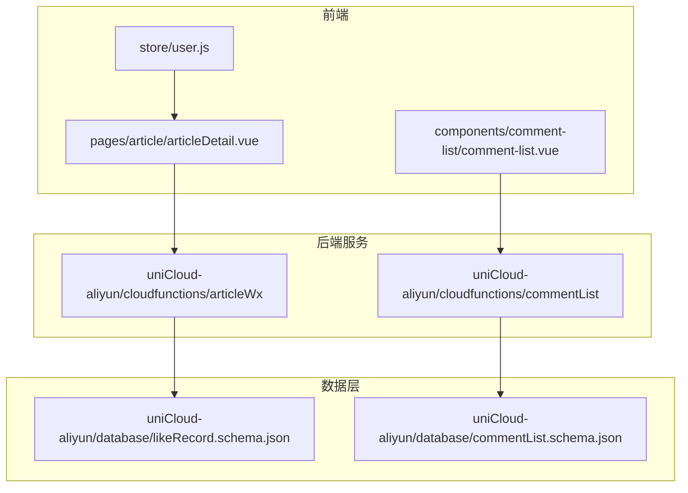
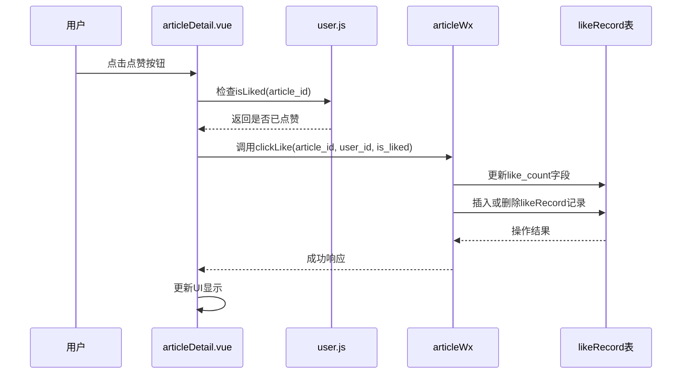
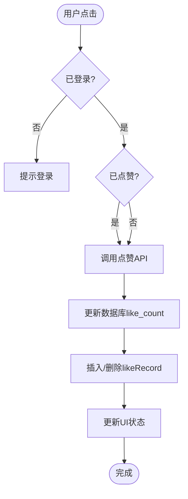
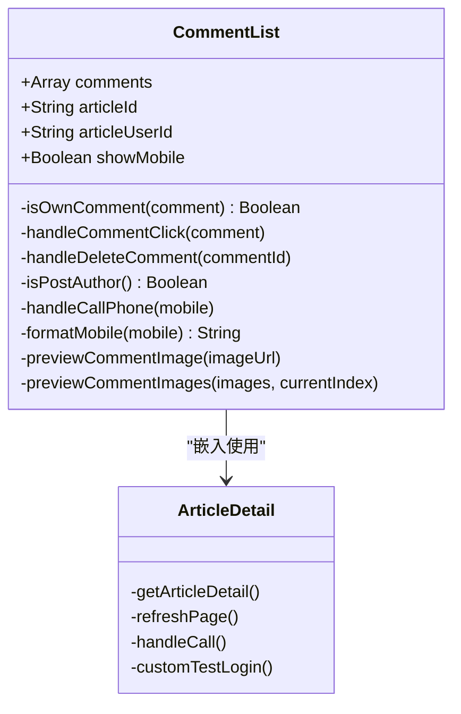
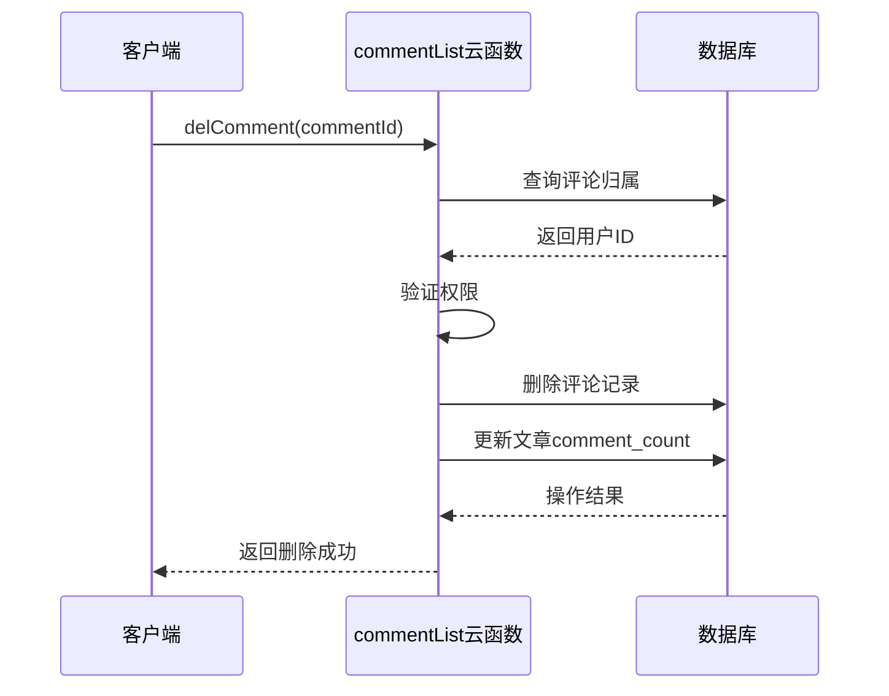
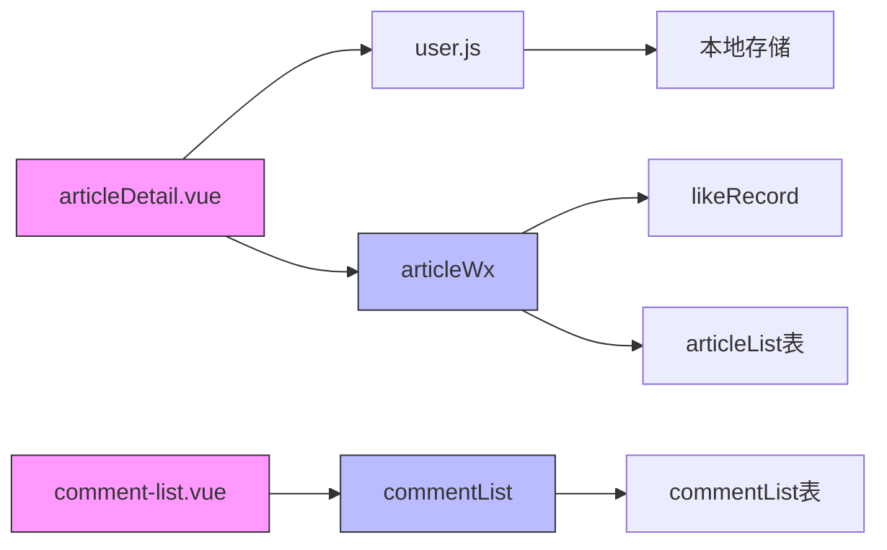

# 社交互动

<cite>
**本文档引用的文件**
- [articleDetail.vue](file://pages/article/articleDetail.vue)
- [comment-list.vue](file://components/comment-list/comment-list.vue)
- [user.js](file://store/user.js)
- [articleWx/index.obj.js](file://uniCloud-aliyun/cloudfunctions/articleWx/index.obj.js)
- [commentList/index.obj.js](file://uniCloud-aliyun/cloudfunctions/commentList/index.obj.js)
- [likeRecord.schema.json](file://uniCloud-aliyun/database/likeRecord.schema.json)
- [commentList.schema.json](file://uniCloud-aliyun/database/commentList.schema.json)
</cite>

## 目录
1. [简介](#简介)
2. [项目结构](#项目结构)
3. [核心组件](#核心组件)
4. [架构概览](#架构概览)
5. [详细组件分析](#详细组件分析)
6. [依赖分析](#依赖分析)
7. [性能考虑](#性能考虑)
8. [故障排除指南](#故障排除指南)
9. [结论](#结论)

## 简介
本文件系统性地讲解了社交互动功能的设计与实现，围绕点赞和评论两大核心行为展开。通过分析前端组件、云函数逻辑以及数据库设计，全面阐述了用户交互流程、数据同步机制及高并发场景下的优化策略。

## 项目结构
项目采用分层架构设计，主要分为前端页面、组件库、状态管理、云函数服务和数据库模式五个部分：

**图示来源**
- [articleDetail.vue](file://pages/article/articleDetail.vue)
- [comment-list.vue](file://components/comment-list/comment-list.vue)
- [user.js](file://store/user.js)
- [articleWx/index.obj.js](file://uniCloud-aliyun/cloudfunctions/articleWx/index.obj.js)
- [commentList/index.obj.js](file://uniCloud-aliyun/cloudfunctions/commentList/index.obj.js)
- [likeRecord.schema.json](file://uniCloud-aliyun/database/likeRecord.schema.json)
- [commentList.schema.json](file://uniCloud-aliyun/database/commentList.schema.json)

**章节来源**
- [project_structure](file://)

## 核心组件
文档聚焦于社交互动的核心功能模块：文章详情页的点赞机制、评论系统的增删改查操作、用户状态缓存与离线支持。这些组件共同构成了完整的用户参与体系。

**章节来源**
- [articleDetail.vue](file://pages/article/articleDetail.vue#L0-L3039)
- [comment-list.vue](file://components/comment-list/comment-list.vue#L0-L451)
- [user.js](file://store/user.js#L0-L90)

## 架构概览
整个社交互动系统基于客户端-服务器模型构建，使用UniApp框架进行跨平台开发，并依托阿里云UniCloud实现无服务器架构。

**图示来源**
- [articleDetail.vue](file://pages/article/articleDetail.vue#L0-L3039)
- [user.js](file://store/user.js#L0-L90)
- [articleWx/index.obj.js](file://uniCloud-aliyun/cloudfunctions/articleWx/index.obj.js#L0-L793)
- [likeRecord.schema.json](file://uniCloud-aliyun/database/likeRecord.schema.json#L0-L0)

## 详细组件分析

### 点赞功能分析
点赞功能实现了从用户界面到数据持久化的完整闭环，包含本地缓存、云端同步和实时反馈。

#### 状态响应逻辑
点赞按钮的状态由`store/user.js`中的`isLiked`方法决定，该方法检查用户的点赞记录数组中是否存在对应的文章ID。当用户点击时，先更新本地状态，再异步调用云函数完成数据同步。

**图示来源**
- [articleDetail.vue](file://pages/article/articleDetail.vue#L0-L3039)
- [user.js](file://store/user.js#L0-L90)
- [articleWx/index.obj.js](file://uniCloud-aliyun/cloudfunctions/articleWx/index.obj.js#L0-L793)

**章节来源**
- [articleDetail.vue](file://pages/article/articleDetail.vue#L0-L3039)
- [user.js](file://store/user.js#L0-L90)

### 评论系统分析
评论系统提供了完整的CRUD接口，支持图文混合内容发布，并具备权限控制能力。

#### 数据渲染机制
`comment-list.vue`组件接收外部传入的评论列表数据，通过v-for指令循环渲染每条评论。每条评论包含头像、昵称、内容、时间戳等信息，并根据当前用户身份决定是否显示删除按钮。

**图示来源**
- [comment-list.vue](file://components/comment-list/comment-list.vue#L0-L451)
- [articleDetail.vue](file://pages/article/articleDetail.vue#L0-L3039)

**章节来源**
- [comment-list.vue](file://components/comment-list/comment-list.vue#L0-L451)

#### 接口设计与事务处理
`commentList`云函数提供三个核心接口：
- `getCommentList`: 查询指定文章的所有评论
- `addComment`: 添加新评论并递增文章评论计数
- `delComment`: 删除评论并递减文章评论计数

在删除评论时，系统会启动数据库事务确保主表（articleList）和子表（commentList）的数据一致性。

**图示来源**
- [commentList/index.obj.js](file://uniCloud-aliyun/cloudfunctions/commentList/index.obj.js#L0-L239)
- [commentList.schema.json](file://uniCloud-aliyun/database/commentList.schema.json#L0-L37)

**章节来源**
- [commentList/index.obj.js](file://uniCloud-aliyun/cloudfunctions/commentList/index.obj.js#L0-L239)

## 依赖分析
系统各组件之间存在明确的依赖关系，形成了清晰的服务调用链路。

**图示来源**
- [articleDetail.vue](file://pages/article/articleDetail.vue#L0-L3039)
- [comment-list.vue](file://components/comment-list/comment-list.vue#L0-L451)
- [user.js](file://store/user.js#L0-L90)
- [articleWx/index.obj.js](file://uniCloud-aliyun/cloudfunctions/articleWx/index.obj.js#L0-L793)
- [commentList/index.obj.js](file://uniCloud-aliyun/cloudfunctions/commentList/index.obj.js#L0-L239)

**章节来源**
- 所有相关文件

## 性能考虑
针对高并发场景，建议采取以下优化措施：
1. 使用Redis缓存热点文章的点赞数和评论列表
2. 对likeRecord表建立复合索引(user_id, article_id)
3. 实现分页加载避免一次性获取过多评论
4. 采用WebSocket长连接推送实时互动消息
5. 在客户端实施防抖机制防止重复提交

此外，可通过局部刷新替代整页重载来提升用户体验流畅度。

## 故障排除指南
常见问题及解决方案：
- **点赞状态不同步**：检查`user.js`中`setLikeRecords`是否正确更新本地缓存
- **评论无法发布**：确认`commentList.schema.json`中required字段完整性
- **删除权限不足**：验证云函数`_before`钩子中用户身份校验逻辑
- **图片加载失败**：排查CDN域名配置和防盗链设置

**章节来源**
- [user.js](file://store/user.js#L0-L90)
- [commentList.schema.json](file://uniCloud-aliyun/database/commentList.schema.json#L0-L37)
- [commentList/index.obj.js](file://uniCloud-aliyun/cloudfunctions/commentList/index.obj.js#L0-L239)

## 结论
本文档详细解析了社交互动功能的技术实现方案，涵盖了从前端交互到后端服务再到数据存储的全链路设计。通过合理的状态管理和高效的云函数调用，系统能够稳定支撑大规模用户并发访问。未来可进一步引入消息队列和分布式缓存以应对更高负载需求。