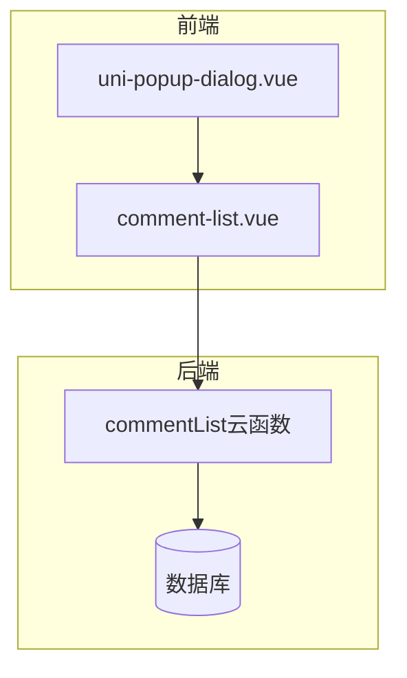
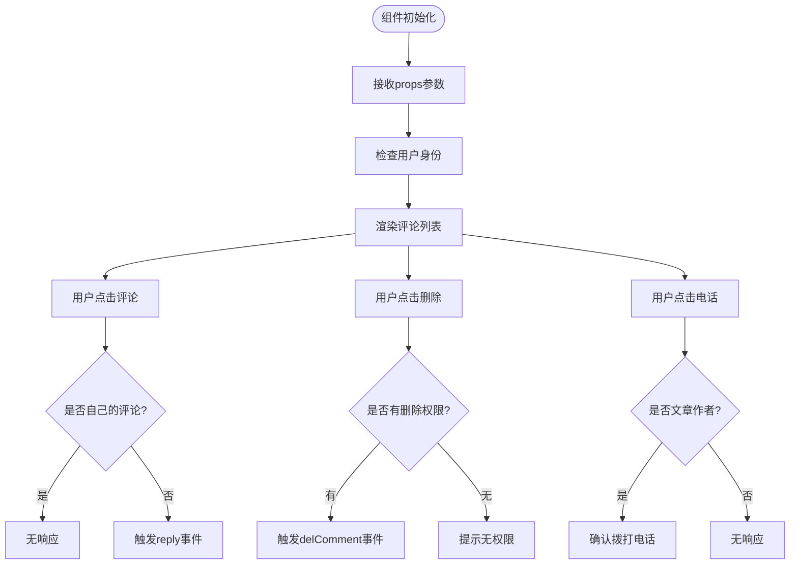
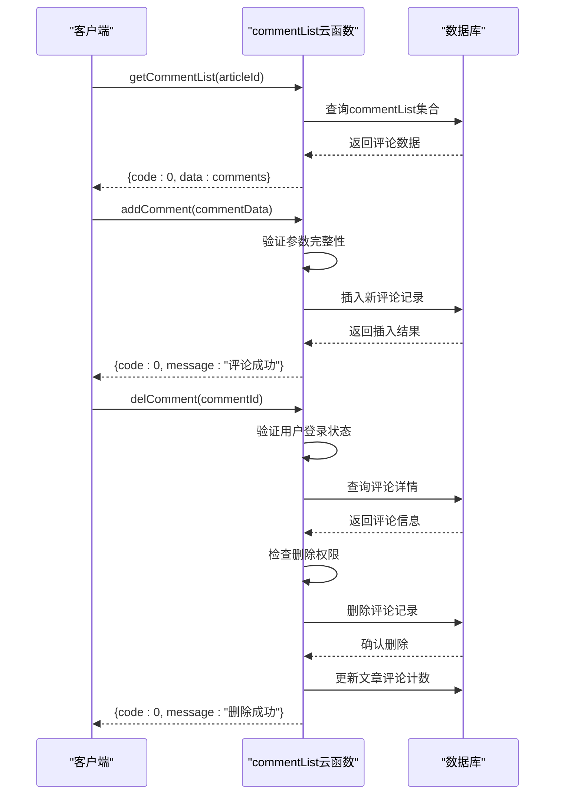
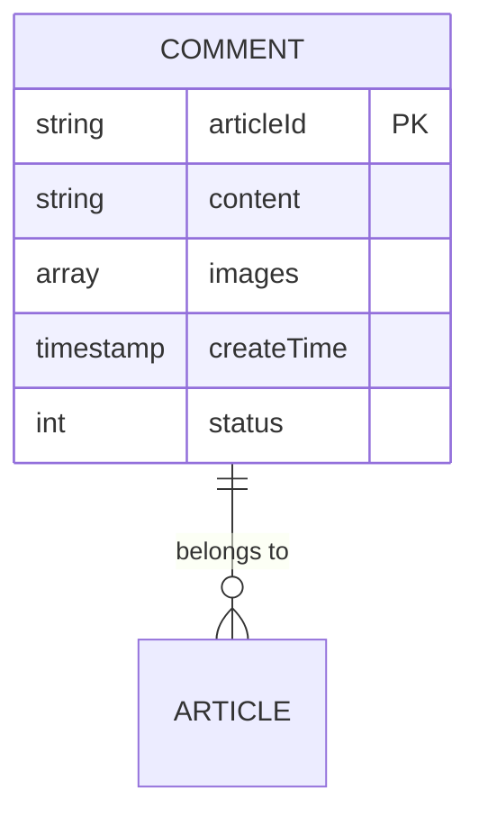
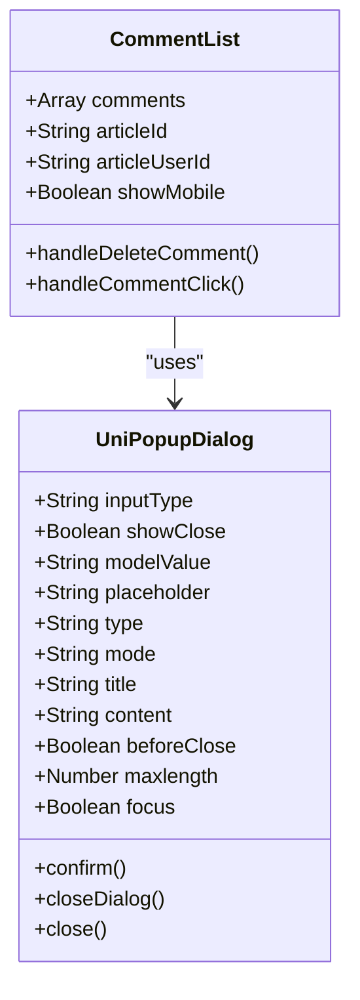

# 评论系统

<cite>
**Referenced Files in This Document **   
- [comment-list.vue](file://components/comment-list/comment-list.vue)
- [index.obj.js](file://uniCloud-aliyun/cloudfunctions/commentList/index.obj.js)
- [commentList.schema.json](file://uniCloud-aliyun/database/commentList.schema.json)
- [uni-popup-dialog.vue](file://uni_modules/uni-popup/components/uni-popup-dialog/uni-popup-dialog.vue)
</cite>

## 目录
1. [简介](#简介)
2. [项目结构](#项目结构)
3. [核心组件分析](#核心组件分析)
4. [云函数接口设计](#云函数接口设计)
5. [数据模型与验证](#数据模型与验证)
6. [交互逻辑实现](#交互逻辑实现)
7. [安全与权限控制](#安全与权限控制)
8. [性能优化策略](#性能优化策略)
9. [总结](#总结)

## 简介

本文档全面解析基于UniApp框架的评论系统架构设计与实现细节。该系统采用前后端分离架构，前端通过`comment-list.vue`组件实现评论列表渲染与用户交互，后端通过`commentList`云函数提供RESTful API接口处理数据操作，并利用`uni-popup-dialog`组件实现弹窗交互。系统支持评论的增删查改、层级回复、图片展示等功能，同时具备完善的安全过滤和权限校验机制。

## 项目结构

根据项目目录结构，评论系统主要由以下三个部分组成：

1. **前端组件层**：位于`components/comment-list/`目录下的`comment-list.vue`文件，负责评论列表的UI渲染和用户交互。
2. **后端服务层**：位于`uniCloud-aliyun/cloudfunctions/commentList/`目录下的`index.obj.js`文件，作为云函数提供API接口。
3. **数据模型层**：位于`uniCloud-aliyun/database/`目录下的`commentList.schema.json`文件，定义了评论数据的结构和验证规则。

此外，系统还依赖于`uni_modules/uni-popup`模块中的`uni-popup-dialog.vue`组件来实现对话框交互功能。



**Diagram sources**
- [comment-list.vue](file://components/comment-list/comment-list.vue)
- [index.obj.js](file://uniCloud-aliyun/cloudfunctions/commentList/index.obj.js)
- [commentList.schema.json](file://uniCloud-aliyun/database/commentList.schema.json)
- [uni-popup-dialog.vue](file://uni_modules/uni-popup/components/uni-popup-dialog/uni-popup-dialog.vue)

**Section sources**
- [comment-list.vue](file://components/comment-list/comment-list.vue)
- [index.obj.js](file://uniCloud-aliyun/cloudfunctions/commentList/index.obj.js)
- [commentList.schema.json](file://uniCloud-aliyun/database/commentList.schema.json)

## 核心组件分析

### comment-list.vue 组件分析

`comment-list.vue`是一个可复用的Vue组件，用于渲染文章的评论列表并处理用户交互。该组件通过props接收外部传入的数据，并通过emit触发事件通知父组件。

#### 属性与事件

组件定义了多个props属性：
- `comments`: 评论数据数组，包含每条评论的详细信息
- `articleId`: 关联的文章ID，用于标识评论所属内容
- `articleUserId`: 文章作者的用户ID，用于权限判断
- `showMobile`: 布尔值，控制是否显示联系电话

组件通过`defineEmits`定义了三个事件：
- `update:comments`: 更新评论列表
- `reply`: 触发回复操作
- `delComment`: 请求删除评论

#### 业务逻辑

组件实现了以下核心功能：

1. **权限判断逻辑**：通过`isOwnComment`方法判断当前用户是否为评论作者，以及通过`isPostAuthor`方法判断当前用户是否为文章作者。
2. **交互响应**：`handleCommentClick`方法处理评论点击事件，仅当点击他人评论时才触发回复；`handleDeleteComment`方法处理删除请求。
3. **敏感信息处理**：`formatMobile`方法对手机号进行脱敏处理，隐藏中间四位数字。
4. **媒体预览**：提供`previewCommentImage`和`previewCommentImages`方法分别处理单张和多张图片的预览功能。



**Diagram sources**
- [comment-list.vue](file://components/comment-list/comment-list.vue#L1-L450)

**Section sources**
- [comment-list.vue](file://components/comment-list/comment-list.vue#L1-L450)

## 云函数接口设计

`commentList`云函数提供了完整的CRUD接口，通过不同的方法处理各类请求。

### 接口方法

云函数暴露了以下几个主要方法：

1. **getCommentList(articleId)**: 获取指定文章的评论列表
2. **addComment(commentData)**: 添加新的评论
3. **delComment(commentId)**: 删除指定评论
4. **likeComment(params)**: 处理点赞/取消点赞操作

#### 请求流程



**Diagram sources**
- [index.obj.js](file://uniCloud-aliyun/cloudfunctions/commentList/index.obj.js#L1-L239)

**Section sources**
- [index.obj.js](file://uniCloud-aliyun/cloudfunctions/commentList/index.obj.js#L1-L239)

### 权限控制机制

云函数在`_before`钩子中实现了统一的权限验证：

- `addComment`和`delComment`方法需要用户登录才能调用
- `getCommentList`方法无需登录，允许匿名访问
- 删除评论时，系统会检查调用者是否为评论作者或管理员角色

这种分层的权限控制策略既保证了数据安全，又提升了用户体验。

## 数据模型与验证

### 数据结构定义

`commentList.schema.json`文件定义了评论数据的JSON Schema结构，确保数据的一致性和完整性。

#### 字段说明

| 字段名 | 类型 | 必填 | 描述 |
|-------|------|------|------|
| articleId | string | 是 | 关联的文章ID |
| content | string | 是 | 评论内容（1-500字符） |
| images | array | 否 | 评论图片URL数组 |
| createTime | timestamp | 否 | 创建时间戳 |
| status | int | 否 | 状态标识（1:正常） |



**Diagram sources**
- [commentList.schema.json](file://uniCloud-aliyun/database/commentList.schema.json#L1-L38)

**Section sources**
- [commentList.schema.json](file://uniCloud-aliyun/database/commentList.schema.json#L1-L38)

### 数据库操作

云函数通过`commentListCollection`常量引用数据库集合，实现了高效的数据操作：

```javascript
const commentListCollection = db.collection('commentList')
```

所有数据库操作都基于此引用进行，包括查询、插入、更新和删除等操作。系统使用`dbCmd`命令对象实现原子性操作，如`dbCmd.inc(-1)`用于递减文章的评论计数。

## 交互逻辑实现

### 弹窗组件集成

系统使用`uni-popup-dialog`组件实现评论相关的弹窗交互，该组件提供了灵活的对话框功能。

#### 组件特性

- 支持基础模式(base)和输入模式(input)
- 提供主题样式：success、warning、info、error
- 可自定义确认和取消按钮文本
- 支持输入框聚焦和最大长度限制

#### 使用场景

在评论系统中，`uni-popup-dialog`可能被用于：
- 确认删除评论操作
- 输入评论内容（在某些界面设计中）
- 显示操作结果提示



**Diagram sources**
- [uni-popup-dialog.vue](file://uni_modules/uni-popup/components/uni-popup-dialog/uni-popup-dialog.vue#L1-L317)
- [comment-list.vue](file://components/comment-list/comment-list.vue#L1-L450)

**Section sources**
- [uni-popup-dialog.vue](file://uni_modules/uni-popup/components/uni-popup-dialog/uni-popup-dialog.vue#L1-L317)

## 安全与权限控制

### 输入验证

系统在多个层面实施了输入验证：

1. **前端验证**：`comment-list.vue`组件在提交前检查必要参数
2. **云函数验证**：`addComment`方法验证`article_id`、`user_id`、`content`等关键字段
3. **数据库验证**：`commentList.schema.json`定义了字段类型和长度限制

### 权限校验

系统实现了严格的权限控制：

- **创建权限**：只有登录用户才能发表评论
- **删除权限**：评论作者或管理员可以删除评论
- **敏感信息访问**：仅文章作者可以看到评论者的联系电话

### 错误处理

云函数提供了完善的错误处理机制，所有异常都会被捕获并返回标准化的错误响应，包含`code`和`message`字段，便于前端进行相应的错误提示。

## 性能优化策略

### 数据库优化

- 使用索引加速查询：虽然未在schema中明确定义，但建议为`article_id`和`create_time`字段创建复合索引
- 分页查询：当前实现一次性获取所有评论，建议在数据量大时实现分页功能
- 批量操作：删除评论时同时更新文章评论计数，减少数据库交互次数

### 缓存策略

- **客户端缓存**：前端组件可以缓存已加载的评论列表，避免重复请求
- **服务器端缓存**：对于热门文章的评论列表，可以在云函数层面实现缓存机制
- **CDN缓存**：评论中的图片资源可以通过CDN进行缓存加速

### 读写分离

在高负载场景下，可以考虑实现读写分离：
- 写操作（添加、删除评论）直接操作主数据库
- 读操作（获取评论列表）可以从只读副本读取，减轻主库压力

## 总结

本评论系统采用现代化的前后端分离架构，具有良好的可维护性和扩展性。前端组件设计合理，后端接口清晰，数据模型规范。系统在安全性、权限控制和用户体验方面都有较好的考量。未来可进一步优化的方向包括实现分页加载、增强缓存策略、添加敏感词过滤功能等，以应对更大规模的应用场景。