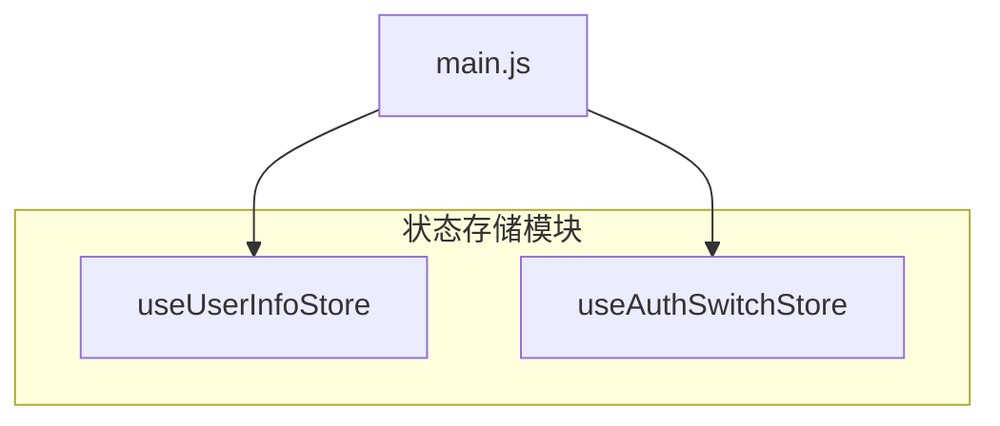
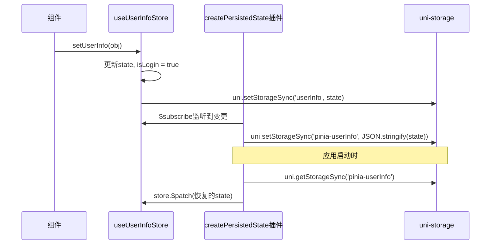

# 状态管理（Pinia）

<cite>
**Referenced Files in This Document**   
- [store/user.js](file://store/user.js)
- [store/authSwitch.js](file://store/authSwitch.js)
- [main.js](file://main.js)
- [pages/my/my.vue](file://pages/my/my.vue)
- [subPages/adminManage/adminManage.vue](file://subPages/adminManage/adminManage.vue)
- [pages/userArticleList/userArticleList.vue](file://pages/userArticleList/userArticleList.vue)
</cite>

## 目录
1. [简介](#简介)
2. [核心状态存储定义](#核心状态存储定义)
3. [用户信息存储 (useUserInfoStore)](#用户信息存储-useuserinfostore)
4. [权限开关存储 (useAuthSwitchStore)](#权限开关存储-useauthswitchstore)
5. [本地持久化机制](#本地持久化机制)
6. [组件中使用状态存储](#组件中使用状态存储)
7. [响应式原理与模块化组织](#响应式原理与模块化组织)
8. [最佳实践与常见陷阱](#最佳实践与常见陷阱)

## 简介

本项目采用 Pinia 作为 Vue 应用的状态管理库，以集中管理跨组件共享的全局状态。通过 `useUserInfoStore` 和 `useAuthSwitchStore` 两个核心 Store，分别管理用户登录信息和应用权限开关状态。利用自定义的持久化插件，实现了关键状态在用户设备上的本地存储，确保应用重启后状态不丢失。这种模式提高了代码的可维护性、可测试性和状态变更的可追踪性。

## 核心状态存储定义

项目中的状态存储遵循模块化设计原则，将不同的业务状态分离到独立的文件中，便于管理和维护。



**Diagram sources**
- [store/user.js](file://store/user.js#L3-L89)
- [store/authSwitch.js](file://store/authSwitch.js#L3-L52)
- [main.js](file://main.js#L20-L60)

**Section sources**
- [store/user.js](file://store/user.js#L1-L90)
- [store/authSwitch.js](file://store/authSwitch.js#L1-L53)

## 用户信息存储 (useUserInfoStore)

`useUserInfoStore` 定义在 `store/user.js` 文件中，负责管理用户的个人资料和登录状态。

### 状态字段
该 Store 的核心状态是一个名为 `userInfo` 的响应式引用（ref），其结构基于 `defaultUserInfo` 对象初始化，包含以下字段：
- **uid**: 用户的唯一标识符。
- **nickName**: 用户的昵称。
- **avatarUrl**: 用户头像的 URL 地址。
- **mobile**: 用户的手机号码。
- **isLogin**: 布尔值，表示当前的登录状态。
- **role**: 数组，存储用户的角色信息。

此外，还定义了 `likeRecords` 来存储用户的点赞记录。

### Getter 计算属性
此 Store 没有显式定义 getter，但 `userInfo` 和 `likeRecords` 本身是响应式的，可以被组件直接读取。

### Action 方法
Store 提供了一系列 action 方法来安全地修改状态：
- **setUserInfo(obj)**: 设置完整的用户信息对象，并根据 `obj.uid` 的存在与否自动更新 `isLogin` 状态。
- **cleanUserInfo()**: 清空用户数据，将其恢复为默认值。
- **updateUserAvatar(avatarUrl)**: 专门用于更新用户头像。
- **updateUserNickName(nickName)**: 专门用于更新用户昵称。
- **setLikeRecords(records)**: 设置用户的点赞记录。
- **isLiked(article_id)**: 检查指定文章是否已被当前用户点赞。

这些方法封装了状态变更的逻辑，确保了数据的一致性。

**Section sources**
- [store/user.js](file://store/user.js#L3-L89)

## 权限开关存储 (useAuthSwitchStore)

`useAuthSwitchStore` 定义在 `store/authSwitch.js` 文件中，用于管理应用内的各种功能开关。

### 状态字段
该 Store 的核心状态是一个名为 `authSwitch` 的布尔型响应式引用（ref），代表一个总开关或某种权限的开启/关闭状态。

### Getter 计算属性
同样，没有显式 getter，`authSwitch` 状态可直接访问。

### Action 方法
- **setAuthValue(v)**: 将 `authSwitch` 的值设置为传入的参数 `v`。
- **setAuth()**: 切换 `authSwitch` 的当前状态（true 变 false，false 变 true）。

值得注意的是，该 Store 使用了 Vue 的 `watch` 函数来监听 `authSwitch` 的变化，并在变化时自动将其序列化并保存到本地存储中。

**Section sources**
- [store/authSwitch.js](file://store/authSwitch.js#L3-L52)

## 本地持久化机制

为了实现用户登录状态和权限开关的持久化，项目采用了两种方式：Store 内置的 `persist` 配置和主应用中的自定义持久化插件。

### 自定义持久化插件
在 `main.js` 中，定义了一个名为 `createPersistedState` 的函数作为 Pinia 插件。该插件的核心功能是：
1.  **拦截状态变更**: 通过 `store.$subscribe` 监听所有状态的变更。
2.  **序列化并存储**: 将变更后的整个状态树序列化为 JSON 字符串，并使用 `uni.setStorageSync` 存储到本地。
3.  **恢复状态**: 在 Store 初始化时，尝试从 `uni.getStorageSync` 获取之前保存的状态，并使用 `store.$patch` 进行恢复。

此插件通过 `pinia.use()` 被注册到 Pinia 实例上，并支持配置需要持久化的 Store 列表（如 `userInfo`）和存储前缀。

### Store 内置持久化
`useUserInfoStore` 和 `useAuthSwitchStore` 都在其定义的选项中配置了 `persist` 属性。它指定了一个自定义的 `storage` 对象，该对象的 `getItem` 和 `setItem` 方法分别调用了 `uni.getStorageSync` 和 `uni.setStorageSync`，从而将 Pinia 默认使用的 `localStorage` 替换为 uni-app 的同步存储 API。

这两种机制共同作用，确保了状态能够可靠地在客户端持久化。



**Diagram sources**
- [main.js](file://main.js#L20-L60)
- [store/user.js](file://store/user.js#L70-L89)

**Section sources**
- [main.js](file://main.js#L20-L60)
- [store/user.js](file://store/user.js#L70-L89)
- [store/authSwitch.js](file://store/authSwitch.js#L40-L52)

## 组件中使用状态存储

在 Vue 组件中，可以通过导入对应的 Store 并调用它来获取状态和操作方法。

### 示例：我的页面 (my.vue)
在 `pages/my/my.vue` 中，用户点击“退出登录”按钮会触发 `loginOut` 方法，该方法调用了 `userStore.cleanUserInfo()` 来清空用户信息。

```javascript
// pages/my/my.vue
import { useUserInfoStore } from '@/store/user.js'
const userStore = useUserInfoStore()

// ...
const loginOut = () => {
    // ...确认对话框
    userStore.cleanUserInfo()
}
```

### 示例：后台管理页面 (adminManage.vue)
在 `subPages/adminManage/adminManage.vue` 中，管理员可以切换各种功能开关。当切换“发布按钮控制”的开关时，会先调用 `sendOnApi.update` 更新服务器状态，然后通过 `uni.$emit` 发送事件通知其他页面，同时也会更新本地的 `publishButtonState`。

```javascript
// subPages/adminManage/adminManage.vue
import { useAuthSwitchStore } from '@/store/authSwitch'
const authSwitchStore = useAuthSwitchStore()

// ...
const togglePublishButton = async (e) => {
    const newState = e.detail.value
    publishButtonState.value = newState // 更新本地UI状态
    await sendOnApi.update(true, newState, ...) // 同步到服务器
    uni.$emit('publishButtonChanged', newState) // 通知其他页面
}
```

### 示例：用户文章列表 (userArticleList.vue)
在 `pages/userArticleList/userArticleList.vue` 中，组件通过 `this.userStore = useUserInfoStore()` 获取 Store 实例，并在获取文章列表后，使用 `userStore.setUserInfo(...)` 来更新全局的用户信息。

```javascript
// pages/userArticleList/userArticleList.vue
import { useUserInfoStore } from '@/store/user.js'

export default {
    data() {
        return {
            userStore: null
        }
    },
    onLoad() {
        this.userStore = useUserInfoStore();
        // ...
        this.userStore.setUserInfo({...})
    }
}
```

**Section sources**
- [pages/my/my.vue](file://pages/my/my.vue#L10-L12)
- [subPages/adminManage/adminManage.vue](file://subPages/adminManage/adminManage.vue#L3-L4)
- [pages/userArticleList/userArticleList.vue](file://pages/userArticleList/userArticleList.vue#L2-L4)

## 响应式原理与模块化组织

Pinia 的核心优势在于其简洁的响应式系统。Store 中的所有状态都基于 Vue 3 的 Composition API（如 `ref` 和 `reactive`）构建，天然具备响应式特性。当组件中的模板依赖于 Store 的某个状态时，一旦该状态通过 action 方法被修改，Vue 的响应式系统会自动触发相关组件的重新渲染。

项目的模块化组织清晰明了：
- **`store/` 目录**: 集中存放所有状态定义文件，每个文件对应一个业务领域的 Store。
- **`main.js`**: 负责创建 Pinia 实例、安装插件（如持久化插件）并将 Pinia 注册到应用实例上。
- **各组件/页面**: 按需导入所需的 Store，实现状态的消费和交互。

这种组织方式使得状态管理逻辑高度内聚，易于理解和维护。

## 最佳实践与常见陷阱

### 最佳实践
1.  **使用 Actions 修改状态**: 始终通过定义好的 action 方法来修改状态，而不是直接修改 `store.state`。这有助于集中处理业务逻辑和副作用（如本地存储）。
2.  **合理拆分 Store**: 遵循单一职责原则，将不同领域的状态拆分到不同的 Store 文件中，避免创建过于庞大的单一 Store。
3.  **利用持久化**: 对于用户登录态等关键信息，务必启用持久化，提升用户体验。
4.  **命名清晰**: Store、状态字段和 action 方法的命名应具有明确的语义，便于团队协作。

### 常见陷阱
1.  **直接修改 State**: 避免在组件中直接执行 `userStore.userInfo.nickName = 'newName'`。这虽然可能生效，但绕过了 action，可能导致持久化等副作用未被触发，破坏了状态管理的约定。
2.  **滥用 Actions**: 不要为每一个微小的状态变更都创建一个 action。对于简单的、无副作用的变更，可以直接暴露状态让组件修改（尽管本项目倾向于全部通过 action）。更关键的是避免在 action 中放入过多不相关的逻辑。
3.  **忽略错误处理**: 在涉及异步操作（如网络请求）的 action 中，必须妥善处理异常，避免程序崩溃。
4.  **过度使用全局状态**: 并非所有状态都需要放在 Pinia 中。仅将需要跨组件共享或在应用生命周期内保持的状态放入 Store，其余状态应保留在组件内部。