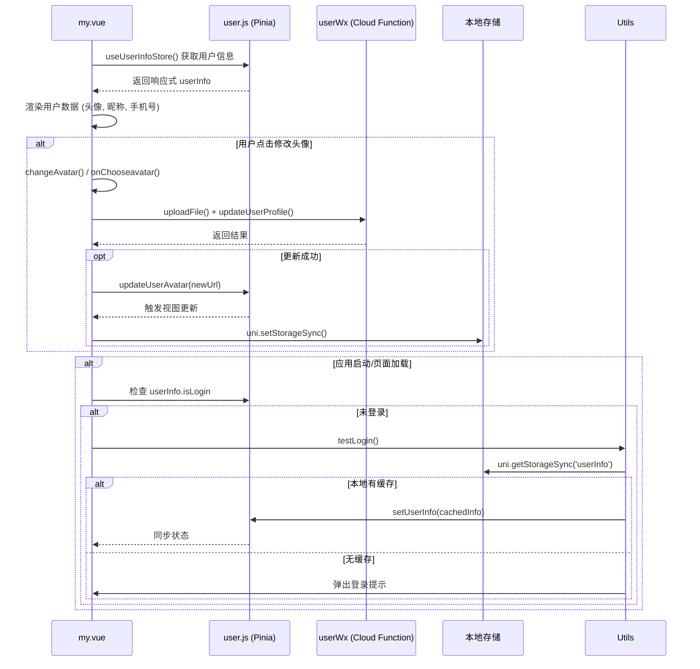
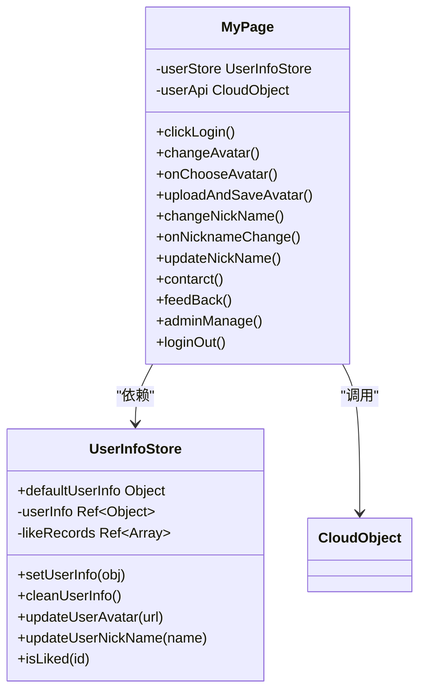

# 个人中心

<cite>
**Referenced Files in This Document **   
- [my.vue](file://pages/my/my.vue)
- [user.js](file://store/user.js)
- [isLogin.js](file://utils/isLogin.js)
- [pages.json](file://pages.json)
</cite>

## 目录
1. [介绍](#介绍)
2. [项目结构](#项目结构)
3. [核心组件](#核心组件)
4. [架构概述](#架构概述)
5. [详细组件分析](#详细组件分析)
6. [依赖分析](#依赖分析)
7. [性能考虑](#性能考虑)
8. [故障排除指南](#故障排除指南)
9. [结论](#结论)

## 介绍

`my.vue` 页面作为用户个人信息的聚合入口，承担着展示用户基本信息、提供功能导航和管理用户状态的核心职责。该页面通过 Pinia 状态管理库与全局用户状态进行交互，实现了数据驱动的动态渲染。页面集成了登录状态校验、信息展示、路由跳转和用户交互等多种功能，是应用中一个关键的用户界面模块。

## 项目结构

项目采用典型的 UniApp 多页面应用结构，将不同功能模块按目录分离。`my.vue` 文件位于 `pages/my/` 目录下，遵循了以功能命名的页面组织方式。相关的子功能页面被集中存放在 `subPages/` 目录中，形成了清晰的主从页面关系。状态管理逻辑通过 Pinia 存储在 `store/` 目录，而工具函数则统一放置在 `utils/` 目录，体现了良好的代码分层设计。

```mermaid
graph TB
subgraph "页面"
my[pages/my/my.vue]
sub[subPages/*]
end
subgraph "状态管理"
store[store/user.js]
end
subgraph "工具"
utils[utils/isLogin.js]
end
my --> store : "读取用户信息"
my --> sub : "导航至子页面"
my --> utils : "校验登录状态"
```

**Diagram sources **
- [my.vue](file://pages/my/my.vue)
- [user.js](file://store/user.js)
- [isLogin.js](file://utils/isLogin.js)
- [pages.json](file://pages.json)

**Section sources**
- [my.vue](file://pages/my/my.vue)
- [pages.json](file://pages.json)

## 核心组件

`my.vue` 页面的核心在于其作为用户信息聚合点的角色。它从 Pinia Store (`user.js`) 中读取用户的头像、昵称、手机号等信息，并根据登录状态动态渲染不同的 UI 内容。对于已登录用户，页面展示可编辑的昵称和经过掩码处理的手机号；对于未登录用户，则显示“点击登录”按钮。页面还通过计算属性 `isAdmin` 判断用户角色，动态控制“后台管理”菜单项的显示，实现了基于权限的功能可见性控制。

**Section sources**
- [my.vue](file://pages/my/my.vue#L1-L637)
- [user.js](file://store/user.js#L3-L89)

## 架构概述

整个系统的架构围绕着 `my.vue` 页面展开，形成了一个以状态管理为中心的数据流。用户信息存储在 Pinia Store 中，`my.vue` 作为视图层直接消费这些状态。当用户执行操作（如修改头像或昵称）时，页面会调用云函数 `userWx` 更新后端数据，并同步更新本地 Store，从而触发视图的重新渲染。登录状态的校验由独立的 `isLogin.js` 工具模块负责，它检查 Store 和本地缓存，确保了状态的一致性。



**Diagram sources **
- [my.vue](file://pages/my/my.vue#L1-L637)
- [user.js](file://store/user.js#L3-L89)
- [isLogin.js](file://utils/isLogin.js#L3-L63)

## 详细组件分析

### 我的页面分析

`my.vue` 组件是一个功能完备的 Vue 单文件组件，使用 `<script setup>` 语法糖简化了代码结构。它通过组合式 API (`ref`, `computed`, `onMounted`) 来管理状态和生命周期。

#### 数据获取与状态管理
页面通过 `useUserInfoStore()` 导入并实例化 Pinia Store，建立与全局用户状态的连接。所有用户信息（`userInfo`）都直接从 Store 中读取，实现了单一数据源。Store 本身配置了持久化插件，利用 `uni.setStorageSync` 将数据保存在本地，保证了应用重启后用户状态的延续性。



**Diagram sources **
- [my.vue](file://pages/my/my.vue#L1-L637)
- [user.js](file://store/user.js#L3-L89)

#### 路由跳转逻辑
页面内的导航通过 `uni.navigateTo` 方法实现，跳转到 `subPages` 目录下的各个管理页面。例如，`contarct()` 函数用于跳转到“信息公示”页面，`feedBack()` 跳转到“意见反馈”页面。对于“后台管理”，`adminManage()` 函数首先检查 `isAdmin` 计算属性，只有管理员角色才能成功跳转，否则会弹出权限不足的提示。

**Section sources**
- [my.vue](file://pages/my/my.vue#L1-L637)
- [pages.json](file://pages.json#L1-L186)

#### 登录状态校验机制
页面的 `onMounted` 生命周期钩子虽然没有直接包含校验逻辑，但整个应用的登录状态保障是由 `isLogin.js` 模块完成的。`testLogin` 函数构成了完整的校验流程：首先检查 Pinia Store 中的 `userInfo.uid`，若不存在则查询本地存储 `uni.getStorageSync('userInfo')`。如果在任一位置找到有效的用户 ID，则认为已登录；否则，弹出模态框引导用户登录，并自动记录当前页面路径作为登录后的重定向目标。

**Section sources**
- [my.vue](file://pages/my/my.vue#L1-L637)
- [isLogin.js](file://utils/isLogin.js#L3-L63)

#### UI布局与uview-plus集成
页面的 UI 布局采用了 Flexbox 进行排版，分为头部 (`myHead`) 和内容区 (`myContent`) 两大部分。头部区域包含用户头像、昵称和手机号，使用线性渐变背景营造视觉层次。内容区则是一个菜单列表，每个菜单项 (`menu-item`) 都由左侧图标文本和右侧箭头组成。
页面深度集成了 `uview-plus` 组件库，大量使用了 `uni-icons` 组件来渲染图标。通过 `easycom` 配置，实现了 `u-*` 组件的自动按需引入，无需手动 import。例如，`<uni-icons type="camera-filled">` 用于渲染相机图标，`custom-prefix="iconfont"` 则允许使用自定义的 iconfont 图标集。

**Section sources**
- [my.vue](file://pages/my/my.vue#L1-L637)
- [pages.json](file://pages.json#L1-L186)