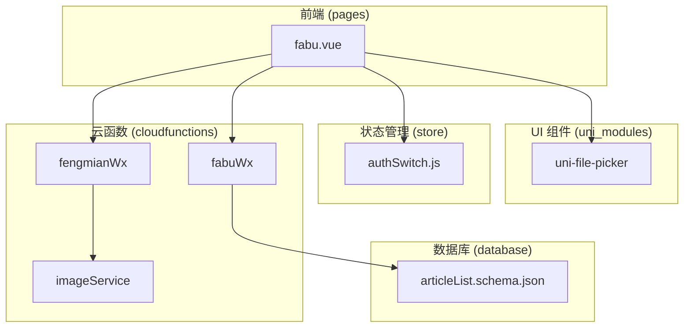
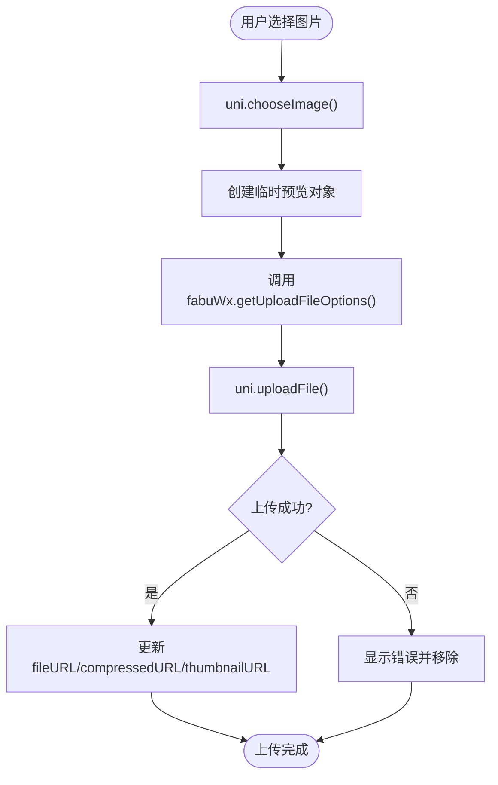
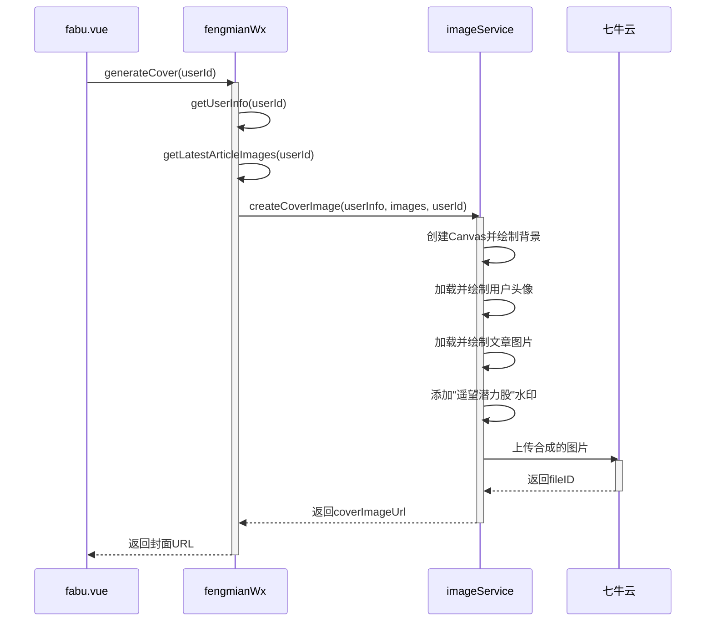
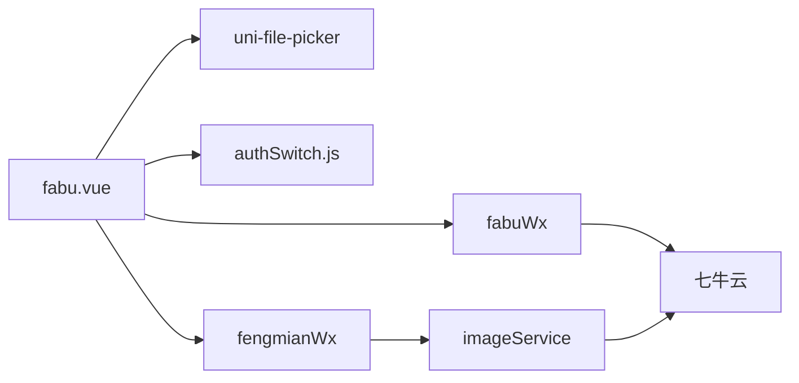

# 内容发布页

<cite>
**Referenced Files in This Document**   
- [fabu.vue](file://pages/fabu/fabu.vue)
- [uni-file-picker.vue](file://uni_modules/uni-file-picker/components/uni-file-picker/uni-file-picker.vue)
- [authSwitch.js](file://store/authSwitch.js)
- [fengmianWx/index.obj.js](file://uniCloud-aliyun/cloudfunctions/fengmianWx/index.obj.js)
- [imageService/index.obj.js](file://uniCloud-aliyun/cloudfunctions/imageService/index.obj.js)
- [fabuWx/index.obj.js](file://uniCloud-aliyun/cloudfunctions/fabuWx/index.obj.js)
- [articleList.schema.json](file://uniCloud-aliyun/database/articleList.schema.json)
</cite>

## 目录
1. [介绍](#介绍)
2. [项目结构](#项目结构)
3. [核心组件](#核心组件)
4. [架构概述](#架构概述)
5. [详细组件分析](#详细组件分析)
6. [依赖分析](#依赖分析)
7. [性能考虑](#性能考虑)
8. [故障排除指南](#故障排除指南)
9. [结论](#结论)

## 介绍

本技术文档深入剖析了 `fabu.vue` 页面的技术实现，聚焦于图文/视频内容发布的完整流程。该页面是用户创建和分享内容的核心入口，提供了完整的表单设计、媒体文件处理和数据持久化功能。系统通过集成 `uni-file-picker` 组件实现了图片和视频的选择与上传，并利用云函数链路将媒体文件安全地存储到七牛云对象存储服务中。整个发布流程包含严格的权限控制机制，确保只有经过身份验证的用户才能发布内容。最终，文章内容连同其元数据被写入 `articleList` 数据库集合，完成从用户输入到数据持久化的完整闭环。

## 项目结构

`fabu.vue` 页面位于项目的 `pages/fabu/` 目录下，是内容发布功能的独立视图组件。该页面与多个关键模块协同工作：它使用 `uni-file-picker` 组件处理媒体文件选择，调用位于 `uniCloud-aliyun/cloudfunctions/` 下的 `fengmianWx` 和 `imageService` 云函数生成封面并处理图片，最后通过 `fabuWx` 云函数将数据存入数据库。权限状态由 `store/authSwitch.js` 管理，而数据模型则由 `uniCloud-aliyun/database/articleList.schema.json` 定义。这种清晰的分层结构将前端交互、业务逻辑、云服务和数据存储分离，保证了代码的可维护性和可扩展性。



**Diagram sources**
- [fabu.vue](file://pages/fabu/fabu.vue)
- [uni-file-picker.vue](file://uni_modules/uni-file-picker/components/uni-file-picker/uni-file-picker.vue)
- [authSwitch.js](file://store/authSwitch.js)
- [fengmianWx/index.obj.js](file://uniCloud-aliyun/cloudfunctions/fengmianWx/index.obj.js)
- [imageService/index.obj.js](file://uniCloud-aliyun/cloudfunctions/imageService/index.obj.js)
- [fabuWx/index.obj.js](file://uniCloud-aliyun/cloudfunctions/fabuWx/index.obj.js)
- [articleList.schema.json](file://uniCloud-aliyun/database/articleList.schema.json)

**Section sources**
- [fabu.vue](file://pages/fabu/fabu.vue)
- [project_structure](file://workspace_root)

## 核心组件

`fabu.vue` 的核心在于其实现的内容发布工作流。页面初始化时，通过 `onLoad` 生命周期钩子检查是否为编辑模式，并调用 `getLocaAndCate` 函数获取用户的地理位置和可用的分类列表。表单主体由标题输入、富文本编辑器和 `uni-file-picker` 组件构成，后者负责管理图片和视频的上传。当用户提交表单时，`submitForm` 方法会执行一系列验证，包括内容非空、分类已选和位置信息有效。随后，它收集所有已上传媒体文件的URL，并调用 `fabuWx` 云函数进行最终的数据写入。整个过程中，`useAuthSwitchStore` 被用来确保用户具备发布权限，从而保障了系统的安全性。

**Section sources**
- [fabu.vue](file://pages/fabu/fabu.vue#L0-L3113)
- [authSwitch.js](file://store/authSwitch.js#L3-L52)

## 架构概述

该内容发布系统的架构遵循典型的前后端分离模式。前端 `fabu.vue` 负责用户界面和交互逻辑，它不直接与数据库或云存储交互，而是通过调用云对象（如 `articleApi` 和 `extStorageCo`）来间接操作后端服务。云函数作为中间件，承担了主要的业务逻辑处理。例如，`imageService` 云函数利用 Node.js 的 `canvas` 库在服务器端动态生成带有水印的封面图片，而 `fabuWx` 云函数则负责构建符合 `articleList` 数据模型的请求参数。这种设计不仅提升了安全性，也使得前端代码更加简洁，专注于用户体验。

```mermaid
sequenceDiagram
participant User as 用户
participant FabuVue as fabu.vue
participant CloudFunc as 云函数(fabuWx)
participant Database as articleList数据库
User->>FabuVue : 填写表单并点击发布
activate FabuVue
FabuVue->>FabuVue : 验证表单(内容, 分类, 位置)
alt 权限检查失败
FabuVue-->>User : 显示错误提示
deactivate FabuVue
else 权限检查通过
FabuVue->>CloudFunc : 调用fabuWx云函数
activate CloudFunc
CloudFunc->>Database : 将内容写入articleList
activate Database
Database-->>CloudFunc : 返回成功/失败
deactivate Database
CloudFunc-->>FabuVue : 返回结果
deactivate CloudFunc
FabuVue-->>User : 显示发布成功
deactivate FabuVue
end
```

**Diagram sources**
- [fabu.vue](file://pages/fabu/fabu.vue#L0-L3113)
- [fabuWx/index.obj.js](file://uniCloud-aliyun/cloudfunctions/fabuWx/index.obj.js#L0-L710)

## 详细组件分析

### 表单设计与媒体上传

`fabu.vue` 页面的表单设计围绕 `uni-file-picker` 组件展开。该组件提供了一个灵活的文件选择接口，支持图片和视频的上传。在 `fabu.vue` 中，它被配置为网格模式 (`mode: grid`)，以直观地展示已选择的图片缩略图。当用户通过 `chooseAndUploadImage` 方法选择图片时，系统会调用 `uni.chooseImage` API。选定的文件路径随后被传递给 `extStorageCo.getUploadFileOptions` 云函数，该函数返回一个包含七牛云上传所需配置的对象。接着，`uni.uploadFile` API 使用这些配置发起实际的上传请求。上传过程中，进度条会实时更新，为用户提供反馈。

#### 图片上传流程


**Diagram sources**
- [fabu.vue](file://pages/fabu/fabu.vue#L0-L3113)
- [uni-file-picker.vue](file://uni_modules/uni-file-picker/components/uni-file-picker/uni-file-picker.vue#L0-L669)

**Section sources**
- [fabu.vue](file://pages/fabu/fabu.vue#L0-L3113)
- [uni-file-picker.vue](file://uni_modules/uni-file-picker/components/uni-file-picker/uni-file-picker.vue#L0-L669)

### 云函数处理链路

媒体文件的处理是一个多阶段的云函数调用过程。首先，`fabuWx` 云函数根据文件类型和尺寸，生成包含水印指令的七牛云图片处理参数 (`persistentOps`)。这些参数确保了上传的原图、压缩图和缩略图都自动添加了品牌水印。其次，当需要生成文章封面时，`fabu.vue` 会调用 `fengmianWx.generateCover` 方法。此方法内部会先调用 `fengmianWx.getCoverData` 获取用户信息和最新文章的图片，然后调用 `imageService.generateImage` 云函数。`imageService` 利用 `canvas` 库在服务器端合成一张新的封面图片，并将其上传至云存储，最后返回访问URL。

#### 封面生成流程


**Diagram sources**
- [fengmianWx/index.obj.js](file://uniCloud-aliyun/cloudfunctions/fengmianWx/index.obj.js#L0-L247)
- [imageService/index.obj.js](file://uniCloud-aliyun/cloudfunctions/imageService/index.obj.js#L0-L194)

**Section sources**
- [fengmianWx/index.obj.js](file://uniCloud-aliyun/cloudfunctions/fengmianWx/index.obj.js#L0-L247)
- [imageService/index.obj.js](file://uniCloud-aliyun/cloudfunctions/imageService/index.obj.js#L0-L194)

### 数据持久化与权限控制

内容的最终落点是 `articleList` 数据库集合。`fabuWx` 云函数在接收到前端传来的数据后，会将其按照 `articleList.schema.json` 定义的结构进行组装。该数据模型要求 `user_id`, `content`, 和 `create_time` 字段为必填项，并对 `images` 数组的大小进行了限制。权限控制贯穿整个流程，`fabu.vue` 在提交前会检查 `authSwitch` 的值，而数据库自身的权限规则 `"create": "auth.uid != null"` 提供了第二道防线，确保只有登录用户才能创建新记录。

#### 数据库权限规则
```json
{
  "permission": {
    "read": true,
    "create": "auth.uid != null",
    "update": "auth.uid != null",
    "delete": "auth.uid != null"
  }
}
```

**Section sources**
- [fabuWx/index.obj.js](file://uniCloud-aliyun/cloudfunctions/fabuWx/index.obj.js#L0-L710)
- [articleList.schema.json](file://uniCloud-aliyun/database/articleList.schema.json#L0-L159)

## 依赖分析

`fabu.vue` 页面与多个外部组件和服务存在强依赖关系。最直接的依赖是 `uni-file-picker` 组件，它封装了复杂的文件选择和上传逻辑。状态管理依赖于 `pinia` store，特别是 `authSwitch.js`，用于同步用户的登录和发布权限状态。云函数之间的依赖形成了一个调用链：`fabu.vue` -> `fabuWx` -> `imageService`，以及 `fabu.vue` -> `fengmianWx` -> `imageService`。此外，系统还依赖于七牛云提供的对象存储和图片处理服务，这些外部API的稳定性和性能直接影响着整个发布流程的体验。



**Diagram sources**
- [fabu.vue](file://pages/fabu/fabu.vue)
- [uni-file-picker.vue](file://uni_modules/uni-file-picker/components/uni-file-picker/uni-file-picker.vue)
- [authSwitch.js](file://store/authSwitch.js)
- [fengmianWx/index.obj.js](file://uniCloud-aliyun/cloudfunctions/fengmianWx/index.obj.js)
- [imageService/index.obj.js](file://uniCloud-aliyun/cloudfunctions/imageService/index.obj.js)
- [fabuWx/index.obj.js](file://uniCloud-aliyun/cloudfunctions/fabuWx/index.obj.js)

**Section sources**
- [fabu.vue](file://pages/fabu/fabu.vue)
- [dependencies](file://all_referenced_files)

## 性能考虑

该系统的性能优化体现在多个层面。在前端，`fabu.vue` 对大文件进行了异步处理，避免阻塞主线程。上传进度条的设计改善了用户体验，让用户感知到操作正在进行。在云端，`fabuWx` 云函数通过 `persistentOps` 参数，利用七牛云的图片处理能力，在文件上传的同时自动生成不同尺寸的图片，避免了后续的二次处理开销。`imageService` 云函数在生成封面时，也采用了高效的 `canvas` 操作。然而，潜在的性能瓶颈在于网络延迟，尤其是当用户上传高分辨率图片或视频时，应考虑增加超时处理和断点续传功能。

## 故障排除指南

常见的发布问题通常源于以下几个方面：
1.  **权限问题**：如果 `authSwitch` 为 `false`，用户将无法发布。请检查 `authSwitch.js` 中的状态是否正确从本地存储加载。
2.  **上传失败**：这可能是由于网络问题或七牛云配置错误。检查 `fabuWx` 云函数返回的 `uploadFileOptionsRes` 是否包含有效的 `cloudPath` 和域名。
3.  **水印缺失**：确认 `fabuWx` 云函数中的 `persistentOps` 字符串是否正确包含了水印指令（`watermark/...`）。
4.  **数据库写入失败**：检查 `articleList.schema.json` 中的必填字段是否都已提供，特别是 `user_id` 和 `content`。

**Section sources**
- [authSwitch.js](file://store/authSwitch.js#L3-L52)
- [fabuWx/index.obj.js](file://uniCloud-aliyun/cloudfunctions/fabuWx/index.obj.js#L0-L710)
- [articleList.schema.json](file://uniCloud-aliyun/database/articleList.schema.json#L0-L159)

## 结论

`fabu.vue` 页面实现了一个功能完整且架构清晰的内容发布系统。它通过精心设计的表单、强大的媒体处理能力和稳健的权限控制，为用户提供了一站式的内容创作体验。系统采用前后端分离的架构，将复杂的业务逻辑下沉到云函数中，保证了前端的轻量化和响应速度。未来可以进一步优化的方向包括引入更智能的封面生成算法、增强视频处理能力以及优化移动端的上传体验。总体而言，该实现展示了如何利用现代云开发平台构建高效、安全的应用程序。