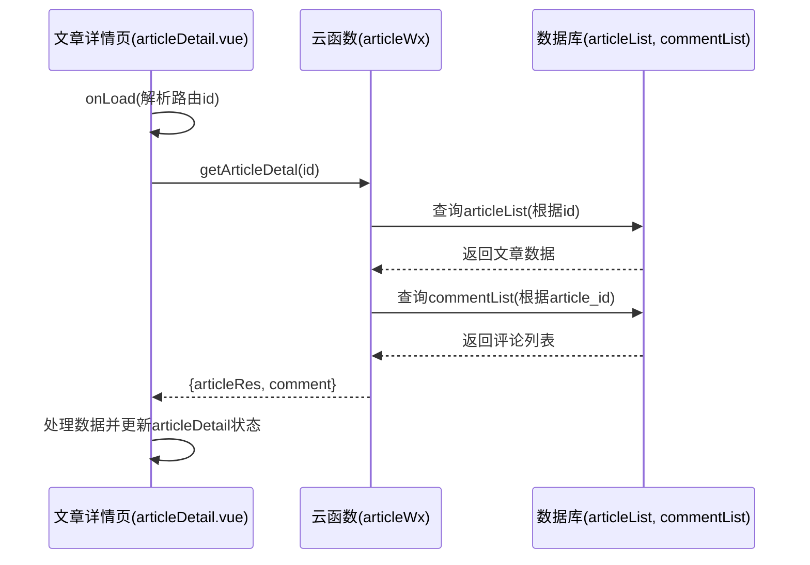
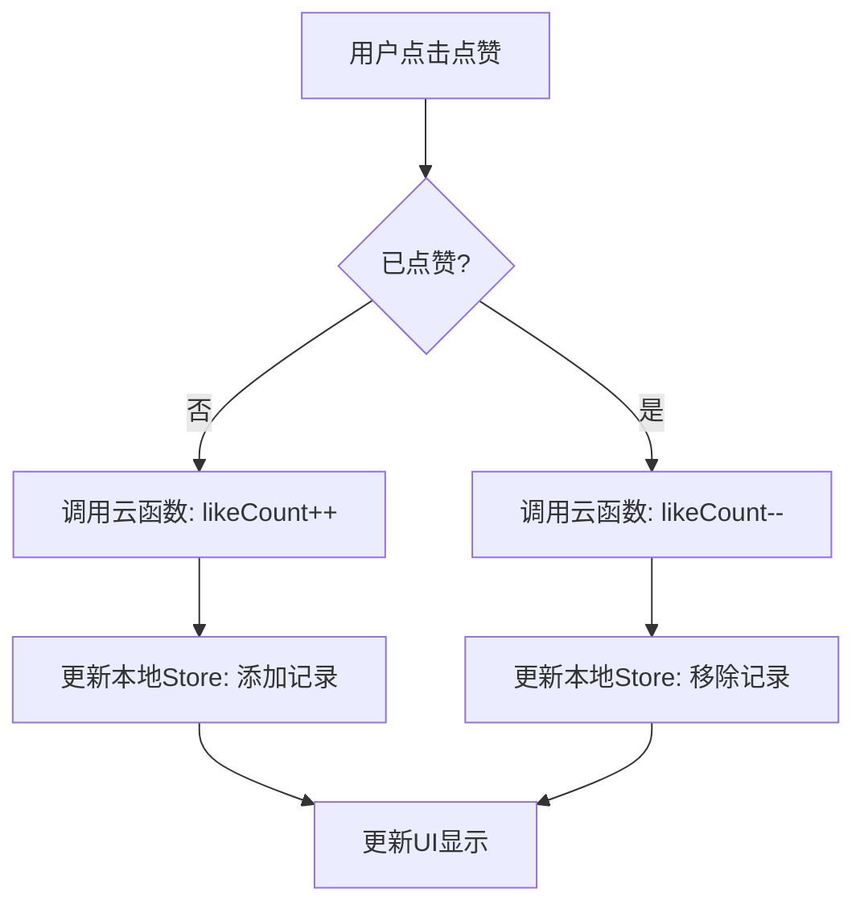
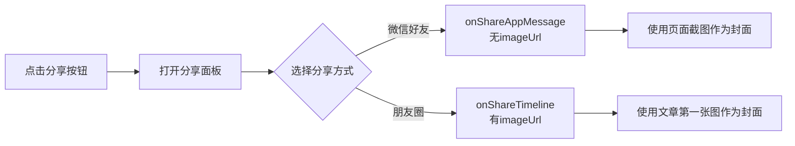

# 文章详情页

<cite>
**本文档引用的文件**  
- [articleDetail.vue](file://pages/article/articleDetail.vue)
- [articleWx/index.obj.js](file://uniCloud-aliyun/cloudfunctions/articleWx/index.obj.js)
- [sendOn/index.obj.js](file://uniCloud-aliyun/cloudfunctions/sendOn/index.obj.js)
- [likeRecord.schema.json](file://uniCloud-aliyun/database/likeRecord.schema.json)
- [user.js](file://store/user.js)
- [comment-list.vue](file://components/comment-list/comment-list.vue)
- [articleDetail-choujia.vue](file://components/articleDetail-choujia/articleDetail-choujia.vue)
- [fenxiang-zujian.vue](file://components/fenxiang-zujian/fenxiang-zujian.vue)
</cite>

## 目录
1. [简介](#简介)
2. [页面加载与文章数据获取](#页面加载与文章数据获取)
3. [核心组件与字段渲染](#核心组件与字段渲染)
4. [评论系统集成](#评论系统集成)
5. [点赞功能实现](#点赞功能实现)
6. [浏览量统计机制](#浏览量统计机制)
7. [分享功能流程](#分享功能流程)
8. [抽奖模块集成](#抽奖模块集成)
9. [结论](#结论)

## 简介

文章详情页（`articleDetail.vue`）是应用的核心内容展示界面，负责根据路由参数动态加载并呈现文章的完整信息。该页面不仅展示了文章的基本内容，如标题、作者、正文和互动数据（点赞数、浏览量），还集成了复杂的交互功能，包括评论系统、点赞、分享以及特殊的抽奖活动。本文档将深入剖析该页面的架构设计与交互逻辑，详细阐述其从数据获取到用户交互的完整流程。

## 页面加载与文章数据获取

当用户访问文章详情页时，页面通过 `onLoad` 生命周期钩子触发数据加载流程。该流程的核心是调用名为 `articleWx` 的云函数，以根据路由传递的 `id` 参数查询对应的文章详情。



**具体实现步骤如下：**

1.  **参数校验**：首先检查 `props.article_id` 是否存在，若为空则抛出错误。
2.  **调用云函数**：使用 `uniCloud.importObject('articleWx')` 导入 `articleWx` 云函数对象，并调用其 `getArticleDetal` 方法，传入文章ID。
3.  **云函数处理**：在 `articleWx` 云函数中：
    *   使用 `this.articleCollection.doc(articleId).get()` 从 `articleList` 集合中获取指定ID的文章记录。
    *   使用 `this.commentCollection.where({article_id: articleId}).orderBy('create_time', 'desc').get()` 从 `commentList` 集合中获取该文章的所有评论，并按时间倒序排列。
    *   将文章详情和评论列表封装在一个对象中返回给前端。
4.  **前端数据处理**：前端接收到响应后，对数据进行处理，例如确保内容不为空、处理图片和视频URL、获取分类名称等，最终将结果赋值给 `articleDetail` 响应式变量，驱动视图更新。

**Section sources**
- [articleDetail.vue](file://pages/article/articleDetail.vue#L477-L639)
- [index.obj.js](file://uniCloud-aliyun/cloudfunctions/articleWx/index.obj.js#L165-L170)

## 核心组件与字段渲染

页面通过绑定 `articleDetail` 对象中的属性来渲染核心内容。

*   **标题与作者**：虽然代码片段未直接显示标题渲染，但通常会使用 `articleDetail.value.content` 的前若干字符或专门的标题字段作为标题。作者信息通过 `articleDetail.value.user_nickName` 和 `articleDetail.value.user_avatarUrl` 渲染。
*   **内容**：文章主体内容由 `articleDetail.value.content` 提供，并通过 `<rich-text>` 组件或普通文本节点进行展示。代码中包含 `processPhoneNumbers` 函数，用于识别内容中的手机号码并添加可点击拨号的功能。
*   **点赞数与浏览量**：这两个关键指标分别通过 `articleDetail.value.like_count` 和 `articleDetail.value.look_count` 进行渲染，实时反映文章的受欢迎程度。

这些字段的渲染是页面最基础也是最重要的功能，为用户提供了文章的核心信息。

**Section sources**
- [articleDetail.vue](file://pages/article/articleDetail.vue#L277-L277)

## 评论系统集成

评论功能通过嵌入 `comment-list` 组件来实现，实现了评论的加载、分页和提交。

### 组件嵌入方式

`comment-list` 组件被直接导入并在 `articleDetail.vue` 中作为子组件使用。父组件通过 `props` 向其传递必要的数据：

```vue
<comment-list 
  :comments="comments" 
  :article-id="props.article_id" 
  :article-user-id="articleDetail.value.user_id"
/>
```

### 评论加载与分页

*   **初始加载**：在 `getArticleDetail` 方法中，云函数 `getArticleDetal` 已经一次性获取了所有评论数据，并将其存储在本地状态中。
*   **分页机制**：当前实现并未在前端进行分页，而是依赖云函数在查询时进行分页控制。`getCommentList` 云函数支持 `pageNo` 和 `pageSize` 参数，但在 `getArticleDetal` 中默认获取全部评论。如果需要优化性能，可以在 `comment-list` 组件内部实现懒加载，通过监听滚动事件来分批请求更多评论。

### 评论提交机制

1.  **触发**：用户在输入框输入内容并点击“发送”按钮。
2.  **调用云函数**：前端调用 `addComment` 云函数，传递文章ID、用户ID、昵称、头像、评论内容等参数。
3.  **云函数处理**：
    *   校验参数完整性。
    *   调用 `this.commentCollection.add()` 将新评论插入 `commentList` 集合。
    *   调用 `this.articleCollection.doc(article_id).update()` 更新文章记录，使其 `comment_count` 字段自增1。
4.  **前端更新**：成功后，前端刷新评论列表，将新评论添加到列表顶部。

**Section sources**
- [comment-list.vue](file://components/comment-list/comment-list.vue)
- [index.obj.js](file://uniCloud-aliyun/cloudfunctions/articleWx/index.obj.js#L431-L477)

## 点赞功能实现

点赞功能分为文章点赞和评论点赞，其行为逻辑相似，均涉及调用云函数和更新本地状态。

### 行为逻辑

1.  **调用云函数**：当用户点击点赞按钮时，前端调用 `clickLike` 云函数（文章点赞）或 `likeComment` 云函数（评论点赞），传入文章ID、评论ID（如果是评论点赞）和用户ID。
2.  **云函数处理**：
    *   检查是否已点赞（通过查找 `likeRecord` 集合或文章的 `comment_likes` 数组）。
    *   如果未点赞，则在数据库中增加对应的点赞计数（`like_count` +1），并创建一条新的点赞记录。
    *   如果已点赞，则减少点赞计数（`like_count` -1），并删除相应的点赞记录。
3.  **更新本地Store状态**：
    *   在 `store/user.js` 中，定义了一个名为 `likeRecords` 的响应式数组，用于存储用户点赞过的文章ID。
    *   当点赞成功时，前端会调用 `setLikeRecords` 方法，将最新的点赞记录同步到 `Pinia` Store 中。
    *   这样做的好处是，即使页面刷新，只要用户登录状态不变，其点赞状态也能通过Store快速恢复，无需重新查询所有记录。



**Section sources**
- [articleDetail.vue](file://pages/article/articleDetail.vue)
- [index.obj.js](file://uniCloud-aliyun/cloudfunctions/articleWx/index.obj.js#L705-L727)
- [user.js](file://store/user.js#L55-L60)

## 浏览量统计机制

页面的浏览量统计通过调用名为 `sendOn` 的云函数来实现，该函数充当一个总开关和数据收集器。

### 实现方式

1.  **触发时机**：在 `getArticleDetail` 方法成功获取文章数据后，会立即调用 `updatePageView` 函数（此函数在提供的代码片段中未完全显示，但逻辑清晰）。
2.  **调用云函数**：`updatePageView` 函数会调用 `sendOn` 云函数的 `update` 方法，或者更可能是直接调用 `articleWx` 云函数的 `updateLookCount` 方法。
3.  **云函数处理**：
    *   `updateLookCount` 方法接收文章ID。
    *   它使用数据库命令 `this.dbCmd.inc(1)` 来原子性地递增 `articleList` 集合中对应文章的 `look_count` 字段。
    *   此外，该方法还会在 `viewRecord` 集合中创建或更新一条浏览记录，以追踪具体的浏览者信息。

值得注意的是，`sendOn` 云函数本身也维护一个全局的 `state` 开关，可能用于控制整个应用的某些功能（如抽奖模块的可见性 `lotteryVisibility`），而浏览量的更新则是直接作用于文章数据本身。

**Section sources**
- [index.obj.js](file://uniCloud-aliyun/cloudfunctions/articleWx/index.obj.js#L532-L616)
- [index.obj.js](file://uniCloud-aliyun/cloudfunctions/sendOn/index.obj.js)

## 分享功能流程

分享功能由 `fenxiang-zujian` 组件提供，它管理着分享到微信好友和朋友圈的整个流程。

### 触发流程

1.  **打开分享面板**：用户点击页面上的“分享”按钮，触发 `openSharePanel` 方法，弹出一个底部弹窗。
2.  **选择分享渠道**：用户可以选择“微信好友”或“生成海报”。
3.  **设置分享信息**：
    *   在 `articleDetail.vue` 中，定义了 `shareInfo` 响应式对象和 `updateShareInfo` 方法。
    *   `updateShareInfo` 方法会根据文章内容生成分享标题，并尝试获取文章的第一张图片作为 `imageUrl`。
4.  **执行分享**：
    *   **微信好友**：调用 `onShareAppMessage`。根据文档说明，此场景下**不设置** `imageUrl`，因此微信会自动使用**当前页面的截图**作为分享封面。
    *   **朋友圈**：调用 `onShareTimeline`。此场景下会明确设置 `imageUrl` 字段，因此分享封面会使用文章的第一张图片。
    *   **自定义按钮**：也可以通过 `handleShareButtonClick` 方法，使用 `uni.share` API 主动触发分享。



**Section sources**
- [fenxiang-zujian.vue](file://components/fenxiang-zujian/fenxiang-zujian.vue)
- [articleDetail.vue](file://pages/article/articleDetail.vue)
- [分享封面使用页面截图说明.md](file://docs/分享封面使用页面截图说明.md)

## 抽奖模块集成

对于特定类型的文章，页面会集成 `articleDetail-choujia` 组件来展示抽奖类特殊内容。

### 集成关系

*   **条件渲染**：虽然具体条件判断逻辑未在 `articleDetail.vue` 中显示，但可以推断，当文章满足特定条件（如包含抽奖标签或配置）时，`articleDetail-choujia` 组件会被渲染。
*   **数据传递**：父组件（`articleDetail.vue`）会将评论列表 (`commenters`) 和文章ID (`articleId`) 通过 `props` 传递给 `articleDetail-choujia` 子组件。
*   **功能联动**：该组件允许用户参与抽奖，其核心逻辑是：
    *   展示一个9宫格，参与者头像会随机或按规则出现在格子中。
    *   用户点击空格子可以“参与”，这会触发一个事件通知父组件打开评论输入框。
    *   当用户发表评论后，其信息会被传递回 `articleDetail-choujia` 组件，并通过 `updatePosition` 方法更新到九宫格的指定位置。
    *   管理员可以点击“开始抽奖”按钮，组件会调用 `choujiangWx` 云函数执行抽奖算法，并显示中奖结果。

这种集成方式将抽奖活动与用户的评论行为紧密结合，有效提升了用户互动率。

**Section sources**
- [articleDetail-choujia.vue](file://components/articleDetail-choujia/articleDetail-choujia.vue)

## 结论

文章详情页是一个功能丰富、交互复杂的单页应用。它通过精心设计的架构，实现了从数据获取、内容渲染到用户互动的完整闭环。页面利用云函数作为前后端的桥梁，高效地处理数据查询和业务逻辑。通过 `Pinia` Store 管理用户状态，保证了用户体验的一致性。同时，通过模块化的设计，将评论、分享、抽奖等功能解耦为独立的组件，使得代码结构清晰，易于维护和扩展。整体而言，该页面充分体现了现代小程序开发的最佳实践。