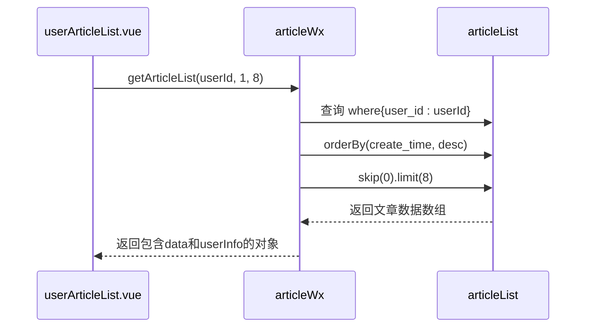
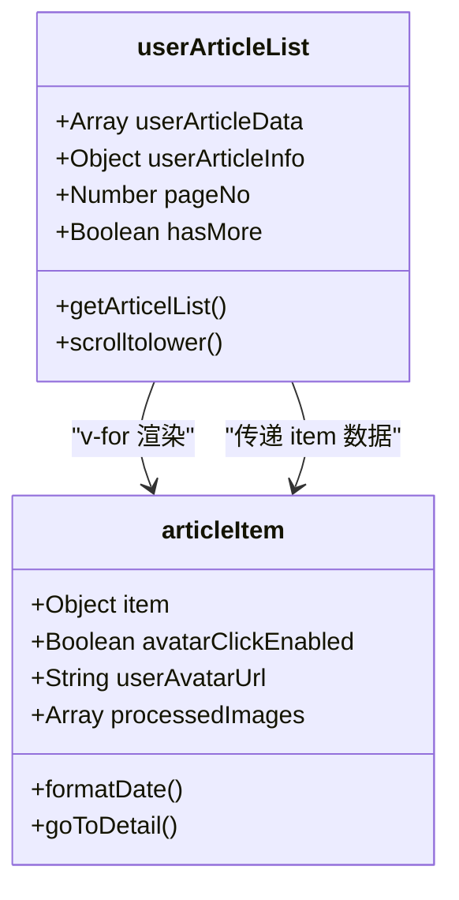

# 用户文章列表页

<cite>
**本文档引用的文件**
- [userArticleList.vue](file://pages/userArticleList/userArticleList.vue)
- [articleItem.vue](file://components/articleItem/articleItem.vue)
- [articleWx/index.obj.js](file://uniCloud-aliyun/cloudfunctions/articleWx/index.obj.js)
- [z-paging/readme.md](file://uni_modules/z-paging/readme.md)
</cite>

## 目录
1. [功能定位与页面作用](#功能定位与页面作用)
2. [数据查询逻辑分析](#数据查询逻辑分析)
3. [分页加载实现机制](#分页加载实现机制)
4. [列表项复用与数据绑定](#列表项复用与数据绑定)
5. [导航栏与用户主页联动](#导航栏与用户主页联动)
6. [性能优化与用户体验](#性能优化与用户体验)

## 功能定位与页面作用

`userArticleList.vue` 页面作为个人发布内容的集合视图，其核心作用是展示指定用户的全部文章记录。该页面通过接收 `userId` 参数来确定需要查询和展示的文章作者，实现了对特定用户内容的集中浏览。

当其他页面（如文章详情页、用户信息卡片等）需要跳转至某位用户的全部动态时，会携带该用户的唯一标识符 `userId` 作为参数打开此页面。页面加载后，首先从路由参数中提取 `userId`，并以此为基础发起后续的数据请求，确保展示内容的准确性和针对性。

此外，该页面还承担着分享功能的角色。在分享给好友时，系统会自动截取当前页面作为封面图；而在分享到朋友圈时，则优先使用该用户的头像作为封面，从而提升分享内容的个性化和辨识度。

**Section sources**
- [userArticleList.vue](file://pages/userArticleList/userArticleList.vue#L0-L799)

## 数据查询逻辑分析

页面通过调用名为 `articleWx` 的云函数来实现数据查询，其核心方法为 `getArticleList`。该查询逻辑严格遵循 `authorId`（即 `userId`）进行数据过滤，确保只返回目标用户发布的文章。

在 `userArticleList.vue` 的 `onLoad` 生命周期钩子中，代码通过 `uniCloud.importObject('articleWx', { customUI: true })` 导入云对象，并调用其 `getArticleList(userId, pageNo, pageSize)` 方法。该方法接受三个参数：用户ID、当前页码和每页条数。

在云函数 `articleWx/index.obj.js` 的实现中，`getArticleList` 方法构建了一个数据库查询条件 `{ user_id: user_id }`，并按创建时间倒序排列，从而获取最新的文章列表。同时，为了提供更完整的用户信息，该方法还会尝试从第一条文章数据中提取 `user_avatarUrl` 和 `user_nickName` 等字段，填充到页面的用户信息区域。



**Diagram sources**
- [userArticleList.vue](file://pages/userArticleList/userArticleList.vue#L0-L799)
- [articleWx/index.obj.js](file://uniCloud-aliyun/cloudfunctions/articleWx/index.obj.js#L247-L288)

## 分页加载实现机制

页面采用 `z-paging` 组件来实现高效的分页加载功能。`z-paging` 是一个专为 UniApp 设计的高性能分页组件，它极大地简化了分页逻辑的开发。

在 `userArticleList.vue` 中，虽然没有直接在模板中使用 `<z-paging>` 标签，但其分页逻辑的设计思想与 `z-paging` 的理念一致，即通过手动管理 `pageNo` 和 `pageSize` 来控制数据加载。页面初始化时，`pageNo` 被设置为1，`pageSize` 固定为8。

当用户滚动到底部时，`onReachBottom` 事件被触发，进而调用 `scrolltolower()` 方法。该方法会检查是否还有更多数据 (`hasMore`) 以及是否正在加载 (`isLoading`)，以避免重复请求。如果条件满足，则将 `pageNo` 加1，并调用 `getArticelList(false)` 方法加载下一页数据。

这种手动实现的分页方式，结合了防抖定时器 (`scrollToLowerTimer`) 和加载状态标志 (`isScrollLoading`)，有效防止了因快速滚动导致的多次并发请求，保证了用户体验的流畅性。

**Section sources**
- [userArticleList.vue](file://pages/userArticleList/userArticleList.vue#L0-L799)
- [z-paging/readme.md](file://uni_modules/z-paging/readme.md#L0-L56)

## 列表项复用与数据绑定

页面通过复用 `articleItem` 组件来渲染文章列表，实现了良好的组件化设计和代码复用。

`articleItem` 组件是一个独立的 Vue 组件，位于 `components/articleItem/articleItem.vue`。它接收一个名为 `item` 的 prop，该 prop 是一个包含单篇文章所有信息的对象。组件内部通过 `v-for` 指令遍历 `processedImages` 计算属性来渲染图片，并根据 `item.content` 显示文字内容。

在 `userArticleList.vue` 中，父组件通过 `v-for` 遍历 `userArticleData` 数组，并为每个 `articleItem` 实例传递相应的文章数据：
```html
<article-item v-for="item in userArticleData" :key="item._id" :item="item"></article-item>
```
这种父子组件间的通信模式清晰地分离了数据获取和数据展示的职责。`userArticleList.vue` 负责从服务器获取数据并管理状态，而 `articleItem.vue` 则专注于如何美观地呈现单个数据项。



**Diagram sources**
- [userArticleList.vue](file://pages/userArticleList/userArticleList.vue#L0-L799)
- [articleItem.vue](file://components/articleItem/articleItem.vue#L0-L571)

## 导航栏与用户主页联动

页面顶部的导航栏提供了返回功能，并与用户的个人主页形成了联动关系。

在 `articleItem` 组件中，用户头像区域被设置为可点击的。当点击头像时，会触发 `handleUserList` 方法，并通过 `$emit` 向父组件 `userArticleList.vue` 发送一个 `userList` 事件，同时携带被点击用户的 `user_id`。

`userArticleList.vue` 页面监听这个事件，并在接收到事件后，可以执行相应的业务逻辑，例如刷新当前页面或跳转到该用户的主页。这种事件驱动的通信机制使得组件间解耦，提高了代码的可维护性。

此外，页面还通过全局事件总线 (`uni.$on`) 监听了多个自定义事件，如 `'globalRefresh'`。当应用内其他地方（如发布新文章后）触发这些事件时，`userArticleList.vue` 可以立即响应，重新加载数据，确保用户看到的是最新内容，从而实现了跨页面的状态同步。

**Section sources**
- [userArticleList.vue](file://pages/userArticleList/userArticleList.vue#L0-L799)
- [articleItem.vue](file://components/articleItem/articleItem.vue#L0-L571)

## 性能优化与用户体验

页面在设计上充分考虑了性能和用户体验，实施了多项优化措施。

首先，为了避免重复请求，页面在 `onUnload` 生命周期中移除了所有通过 `uni.$on` 注册的事件监听器，防止内存泄漏。同时，对于触底加载等高频操作，采用了防抖 (debounce) 技术，通过 `setTimeout` 设置了500毫秒的延迟，确保在短时间内不会触发多次数据加载。

其次，为了提升用户体验，页面实现了视频播放状态的保存与恢复。当用户在浏览带有视频的文章列表时，如果触发了分页加载，系统会先暂停视频，记录其播放位置和状态。在新数据加载完成后，再将视频恢复到原来的位置和播放状态，使用户感觉不到中断。

最后，页面还预加载了默认的分享图片，减少了用户分享时的等待时间。并且，在获取文章总数时，利用了云函数的 `count()` 方法，避免了拉取全部数据来计算总数，显著提升了查询效率。

**Section sources**
- [userArticleList.vue](file://pages/userArticleList/userArticleList.vue#L0-L799)