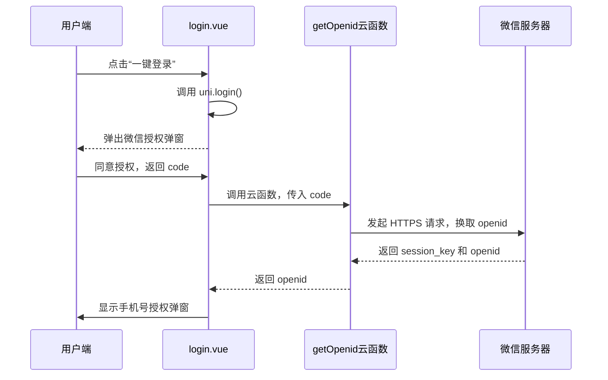
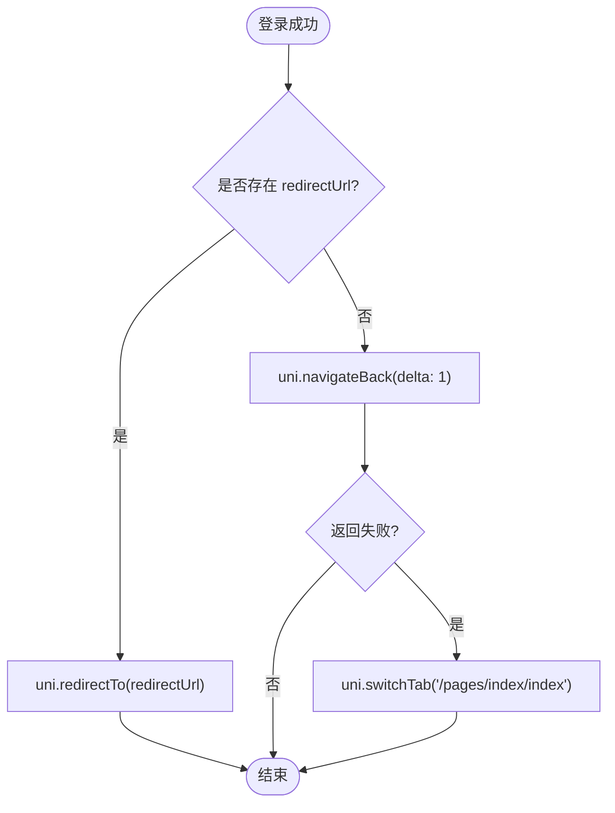

# 登录认证页

<cite>
**Referenced Files in This Document**   
- [login.vue](file://pages/login/login.vue)
- [getOpenid/index.js](file://uniCloud-aliyun/cloudfunctions/getOpenid/index.js)
- [userWx/decryptPhoneNumber.js](file://uniCloud-aliyun/cloudfunctions/userWx/decryptPhoneNumber.js)
- [user.js](file://store/user.js)
- [manifest.json](file://manifest.json)
- [1.html](file://pages/login/1.html)
- [2.html](file://pages/login/2.html)
</cite>

## 目录
1. [微信授权登录全流程](#微信授权登录全流程)
2. [用户信息授权与手机号解密](#用户信息授权与手机号解密)
3. [用户信息持久化机制](#用户信息持久化机制)
4. [辅助HTML文件作用分析](#辅助html文件作用分析)
5. [异常处理与用户引导](#异常处理与用户引导)

## 微信授权登录全流程

`login.vue` 页面实现了完整的微信小程序授权登录流程，其核心机制基于 `uni.login` API 与云函数的协同工作。

页面初始化时，通过 `onMounted` 钩子函数解析 URL 参数，获取可能存在的重定向地址 `redirectUrl`。当用户点击"一键登录"按钮时，触发 `clickLogin` 方法，该方法首先确保用户协议被勾选（若未勾选则自动勾选并延迟执行），随后调用 `uni.login()` 获取微信临时登录凭证 `code`。



**Diagram sources**
- [login.vue](file://pages/login/login.vue#L70-L85)
- [getOpenid/index.js](file://uniCloud-aliyun/cloudfunctions/getOpenid/index.js#L6-L36)

**Section sources**
- [login.vue](file://pages/login/login.vue#L70-L85)
- [getOpenid/index.js](file://uniCloud-aliyun/cloudfunctions/getOpenid/index.js#L6-L36)

## 用户信息授权与手机号解密

在成功获取 `openid` 后，系统会显示一个手机号授权弹窗。此弹窗由 `mobileLoginModel` 组件构成，其中包含一个 `open-type="getPhoneNumber"` 的按钮。

当用户点击"确定"按钮同意授权后，微信客户端会将加密的用户手机号数据（包括 `encryptedData` 和 `iv`）通过 `@getphonenumber` 事件回调传递给前端。前端将之前获取的 `code`、以及此次获得的 `encryptedData` 和 `iv` 一并作为参数，调用云对象 `userWx` 的 `loginByPhoneWx` 方法。

该云函数内部会使用 `decryptPhoneNumber.js` 工具函数进行解密。该函数利用 Node.js 内置的 `crypto` 模块，采用 AES-128-CBC 算法，以用户的 `session_key` 为密钥，`iv` 为初始向量，对 `encryptedData` 进行解密，最终得到包含用户真实手机号的 JSON 数据。

```mermaid
flowchart TD
A[用户点击确定] --> B{是否同意授权?}
B --> |是| C[获取 encryptedData 和 iv]
B --> |否| D[抛出错误：获取手机号失败]
C --> E[调用 userApi.loginByPhoneWx(params)]
E --> F[云函数 decryptPhoneNumber(session_key, encryptedData, iv)]
F --> G{解密成功?}
G --> |是| H[解析JSON，获取手机号]
G --> |否| I[记录错误日志，返回 null]
H --> J[完成用户登录]
```

**Diagram sources**
- [login.vue](file://pages/login/login.vue#L105-L130)
- [userWx/decryptPhoneNumber.js](file://uniCloud-aliyun/cloudfunctions/userWx/decryptPhoneNumber.js#L3-L32)

**Section sources**
- [login.vue](file://pages/login/login.vue#L105-L130)
- [userWx/decryptPhoneNumber.js](file://uniCloud-aliyun/cloudfunctions/userWx/decryptPhoneNumber.js#L3-L32)

## 用户信息持久化机制

登录成功后，系统会将从服务器返回的用户数据（包括 `_id`, `nickName`, `avatarUrl`, `mobile`, `role`, `openid_wx` 等）构建成 `userInfoData` 对象，并通过 Pinia Store 的 `setUserInfo` 方法将其存储到全局状态管理中。

`user.js` 文件定义了名为 `useUserInfoStore` 的 Pinia store。该 store 不仅在内存中维护用户信息，还通过配置 `persist` 选项，利用 `uni.setStorageSync` 将用户数据同步到本地缓存。这意味着即使用户关闭小程序后重新打开，只要本地缓存未被清除，系统就能通过 `uni.getStorageSync('userInfo')` 读取到之前的登录状态，实现“记住我”的功能。

```mermaid
classDiagram
class useUserInfoStore {
+ref userInfo
+function setUserInfo(obj)
+function cleanUserInfo()
+function updateUserAvatar(avatarUrl)
+function updateUserNickName(nickName)
+ref likeRecords
+function setLikeRecords(records)
+function isLiked(article_id)
}
class loginVue {
-const userStore : useUserInfoStore
+function clickLogin()
+function getMobile(e)
+function loginSuccess()
}
class userApi {
+function loginByPhoneWx(params)
}
loginVue --> useUserInfoStore : "依赖"
loginVue --> userApi : "调用"
useUserInfoStore --> "uni.setStorageSync" : "持久化"
```

**Diagram sources**
- [user.js](file://store/user.js#L1-L90)
- [login.vue](file://pages/login/login.vue#L120-L130)

**Section sources**
- [user.js](file://store/user.js#L1-L90)
- [login.vue](file://pages/login/login.vue#L120-L130)

## 辅助HTML文件作用分析

`login` 目录下的 `1.html` 和 `2.html` 是两个独立的 HTML 文件，分别用于展示“隐私权政策”和“服务协议”。

当用户点击登录页面上的“隐私政策”链接时，程序会根据 `type` 参数判断，对于“服务协议”直接跳转至本地的 `2.html` 文件；而对于“隐私政策”，则会先获取 `ag.js` 中配置的线上链接，再通过 `webview` 组件加载。这表明 `2.html` 主要服务于 H5 端或需要离线访问协议的场景。

在 `manifest.json` 文件中，虽然没有直接配置这两个 HTML 文件的路由，但其存在本身说明了项目对多端兼容性的考虑。H5 平台可以直接识别并访问这些静态 HTML 文件，而小程序平台则通过 `webview` 组件来渲染它们，从而实现了协议内容在不同平台的一致性展示。

**Section sources**
- [1.html](file://pages/login/1.html)
- [2.html](file://pages/login/2.html)
- [manifest.json](file://manifest.json)

## 异常处理与用户引导

系统设计了完善的异常处理策略。在网络请求失败或用户拒绝授权等情况下，代码会通过 `throw new Error` 抛出异常，并在控制台打印错误信息。

对于用户引导，系统采取了积极主动的策略：
1.  **协议自动勾选**：首次点击登录时，若用户未勾选协议，系统会自动为其勾选，降低操作门槛。
2.  **登录后跳转逻辑**：登录成功后，优先检查是否存在 `redirectUrl`。若有，则使用 `uni.redirectTo` 跳转回原页面，保证用户体验的连贯性；若无，则尝试 `uni.navigateBack` 返回上一页；若均失败，则兜底跳转至首页 `index`。
3.  **错误提示**：使用 `uni.showToast` 向用户展示简洁明了的成功或失败提示。



**Diagram sources**
- [login.vue](file://pages/login/login.vue#L135-L187)

**Section sources**
- [login.vue](file://pages/login/login.vue#L135-L187)