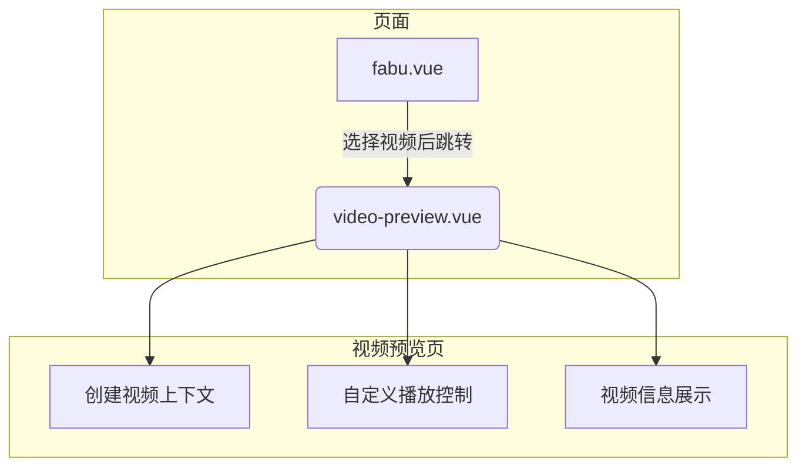
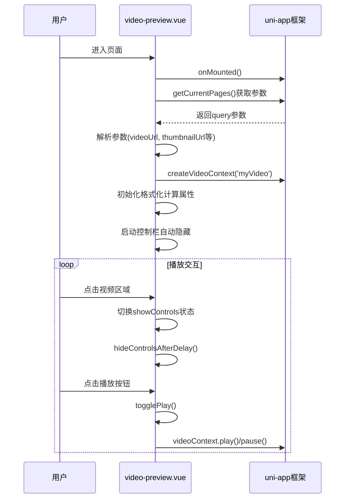
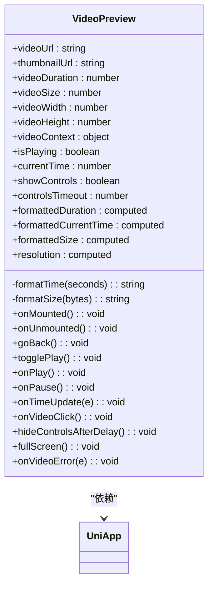
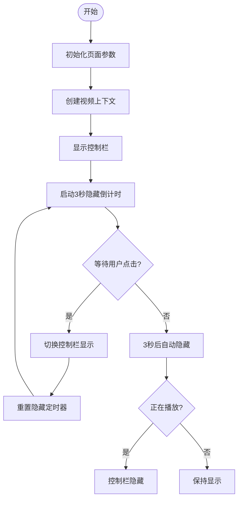
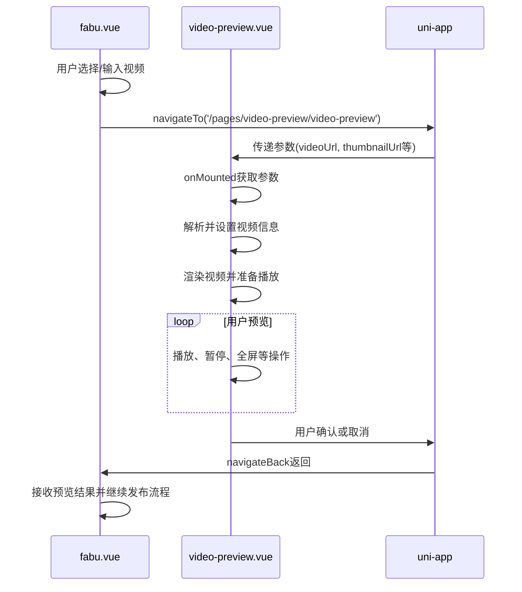
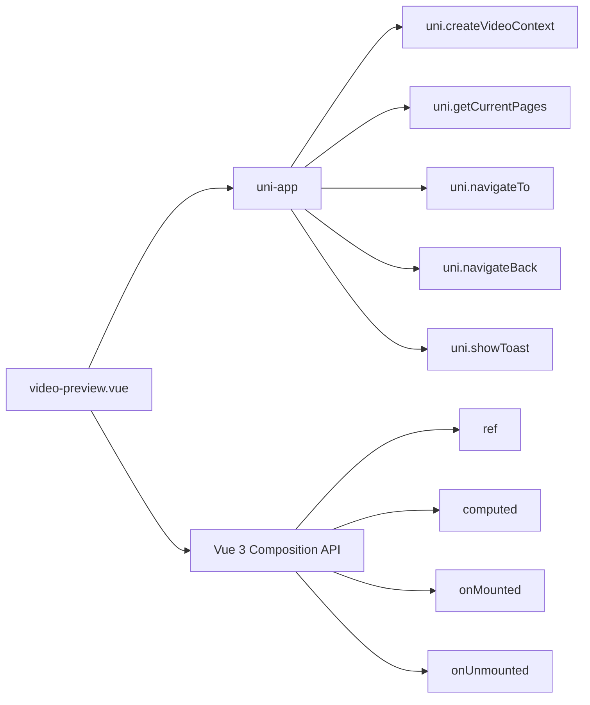

# 视频预览页

<cite>
**本文档引用的文件**
- [video-preview.vue](file://pages/video-preview/video-preview.vue)
- [fabu.vue](file://pages/fabu/fabu.vue)
</cite>

## 目录
1. [简介](#简介)
2. [项目结构](#项目结构)
3. [核心组件](#核心组件)
4. [架构概述](#架构概述)
5. [详细组件分析](#详细组件分析)
6. [依赖分析](#依赖分析)
7. [性能考虑](#性能考虑)
8. [故障排除指南](#故障排除指南)
9. [结论](#结论)

## 简介
`video-preview.vue` 页面是应用程序中一个独立的视频预览模块，其主要设计目的是将视频播放功能从主页面中分离出来，以避免因集成视频组件而导致主页面性能下降。该页面通过接收外部传入的视频URL参数，在 `uni-video` 组件中进行渲染和播放。它实现了完整的播放控制条、全屏切换以及加载状态提示等基础功能，并与发布流程紧密衔接——当用户在 `fabu.vue` 页面选择视频后，会跳转至此页面进行预览确认。

本页面还具备自动播放策略、网络状态监听及错误恢复机制，确保在微信小程序、H5 和 App 等多个平台上都能保持良好的兼容性和用户体验。整体实现基于 Vue 3 的 Composition API，结合 uni-app 框架提供的跨平台能力，构建了一个高效且可维护的视频预览解决方案。

## 项目结构
`video-preview.vue` 文件位于项目的 `pages/video-preview/` 目录下，作为一个独立的页面存在。这种结构设计使得视频播放逻辑完全隔离于其他业务模块，有助于提升应用的整体性能和可维护性。页面通过标准的 uni-app 页面路由机制被调用，通常由 `fabu.vue` 或其他需要视频预览功能的页面发起导航。

**图表来源**
- [video-preview.vue](file://pages/video-preview/video-preview.vue#L1-L377)
- [fabu.vue](file://pages/fabu/fabu.vue#L0-L3113)

**章节来源**
- [video-preview.vue](file://pages/video-preview/video-preview.vue#L1-L377)
- [fabu.vue](file://pages/fabu/fabu.vue#L0-L3113)

## 核心组件
`video-preview.vue` 的核心在于其实现了完整的视频播放生命周期管理。页面初始化时，通过 `onMounted` 钩子获取上一页面传递的参数（如视频URL、缩略图、时长、大小、分辨率等），并使用 `uni.createVideoContext` 创建视频上下文对象，用于后续的播放控制。

播放控制功能包括播放/暂停切换、进度更新显示、全屏播放等，均由自定义的 UI 元素触发，并通过视频上下文调用相应方法实现。控制栏具有智能隐藏机制，在播放状态下若无操作则3秒后自动隐藏，点击视频区域可重新显示。

**章节来源**
- [video-preview.vue](file://pages/video-preview/video-preview.vue#L1-L377)

## 架构概述
整个 `video-preview.vue` 页面采用典型的 MVVM 架构模式，利用 Vue 3 的响应式系统管理视图与数据的同步。页面的数据模型主要包括视频元数据（URL、时长、大小、分辨率）和播放状态（是否播放、当前时间、控制栏显示状态）。这些数据通过 `ref` 和 `computed` 进行声明和计算，确保视图能够实时响应变化。

UI 层面，页面分为三个主要区域：顶部导航栏、视频播放容器和底部信息展示区。所有样式均使用 scoped scss 编写，保证了样式的局部作用域，避免全局污染。

**图表来源**
- [video-preview.vue](file://pages/video-preview/video-preview.vue#L1-L377)

## 详细组件分析

### 视频播放与控制分析
`video-preview.vue` 实现了对视频播放的全面控制。通过 `uni.createVideoContext` 获取的上下文对象，可以精确地控制视频的播放、暂停、跳转到全屏等操作。播放/暂停按钮的状态与 `isPlaying` 响应式变量绑定，实现了UI与状态的同步。

控制栏的显示逻辑通过 `showControls` 变量控制，点击视频任意位置可切换其可见性。为了提升用户体验，引入了自动隐藏机制 `hideControlsAfterDelay`，在播放状态下3秒无操作即隐藏控制栏，有效减少了视觉干扰。

#### 播放控制流程

**图表来源**
- [video-preview.vue](file://pages/video-preview/video-preview.vue#L1-L377)

**章节来源**
- [video-preview.vue](file://pages/video-preview/video-preview.vue#L1-L377)

### 参数接收与数据渲染分析
页面通过 `getCurrentPages()` 方法获取当前页面栈实例，进而读取 `options` 中的查询参数。这些参数包含了视频的URL、缩略图、时长、大小和分辨率等关键信息。所有字符串类型的参数都经过 `decodeURIComponent` 解码处理，确保特殊字符能正确解析。

接收到的原始数据被赋值给相应的 `ref` 响应式变量，随后通过 `computed` 计算属性进行格式化处理，例如将秒数转换为 mm:ss 格式，将字节数转换为 KB/MB/GB 单位，以及拼接分辨率字符串。这些计算属性在模板中直接使用，实现了数据的动态渲染。

**章节来源**
- [video-preview.vue](file://pages/video-preview/video-preview.vue#L88-L153)

### 发布流程衔接分析
`video-preview.vue` 与 `fabu.vue` 页面构成了完整的视频发布预览链路。在 `fabu.vue` 中，用户选择或输入视频链接后，通过 `uni.navigateTo` 并携带相关参数跳转至 `video-preview.vue`。这一过程实现了从内容编辑到视频预览的无缝过渡。

**图表来源**
- [video-preview.vue](file://pages/video-preview/video-preview.vue#L88-L93)
- [fabu.vue](file://pages/fabu/fabu.vue#L1395-L1446)

**章节来源**
- [video-preview.vue](file://pages/video-preview/video-preview.vue#L88-L93)
- [fabu.vue](file://pages/fabu/fabu.vue#L1395-L1446)

## 依赖分析
`video-preview.vue` 主要依赖于 uni-app 框架的核心 API，特别是页面路由、视频组件和设备信息相关的接口。它不直接依赖于项目中的 store 或复杂的业务逻辑模块，保持了高度的独立性。

页面间通信通过简单的 URL 参数传递完成，这是一种轻量级且可靠的跨页面数据传输方式。对于视频播放本身，则完全依赖于原生 `<video>` 组件的能力，确保了在不同平台上的行为一致性。

**图表来源**
- [video-preview.vue](file://pages/video-preview/video-preview.vue#L1-L377)

**章节来源**
- [video-preview.vue](file://pages/video-preview/video-preview.vue#L1-L377)

## 性能考虑
将视频播放功能独立成一个专门的页面，是本项目一项重要的性能优化策略。这样做有以下几个显著优势：

1.  **资源隔离**：主页面无需加载和初始化视频组件及其上下文，减少了内存占用和启动时间。
2.  **按需加载**：只有当用户明确需要预览视频时，才会创建视频上下文和加载视频资源，实现了懒加载。
3.  **生命周期清晰**：`onUnmounted` 钩子中会主动暂停视频并清除定时器，防止了页面销毁后视频仍在后台播放或定时器持续运行导致的内存泄漏。
4.  **减少重绘**：独立的页面结构避免了因视频播放状态变化而频繁触发主页面的重新渲染。

## 故障排除指南
### 视频无法播放
- **检查点1**：确认传入的 `videoUrl` 参数是否正确且已解码。可在 `onMounted` 中添加 `console.log` 输出验证。
- **检查点2**：查看浏览器或小程序开发工具的网络面板，确认视频资源请求是否成功，是否存在跨域问题。
- **检查点3**：检查 `onVideoError` 回调是否被触发，根据错误信息进行排查。

### 控制栏无法显示/隐藏
- **检查点4**：确认 `showControls` 变量的值是否按预期变化。点击事件的 `@click.stop` 修饰符可能阻止了事件冒泡，影响逻辑。
- **检查点5**：检查 `controlsTimeout` 定时器是否正常工作，`clearTimeout` 是否在适当的时候被调用。

### 全屏功能失效
- **检查点6**：确认 `requestFullScreen` API 在目标平台（尤其是H5）是否受支持。
- **检查点7**：检查是否有其他CSS样式（如 `overflow: hidden`）限制了全屏效果。

**章节来源**
- [video-preview.vue](file://pages/video-preview/video-preview.vue#L278-L284)

## 结论
`video-preview.vue` 页面是一个设计精良、职责单一的视频预览模块。它通过独立部署的方式有效解决了视频组件对主页面性能的影响，同时提供了流畅的用户体验和完整的播放控制功能。页面与 `fabu.vue` 的衔接自然顺畅，构成了发布流程中不可或缺的一环。

其代码结构清晰，充分利用了 Vue 3 的响应式特性和 uni-app 的跨平台能力，具备良好的可维护性和扩展性。自动隐藏控制栏、错误提示等细节处理体现了对用户体验的关注。总体而言，该页面的实现是成功的，为类似功能的开发提供了优秀的实践范例。