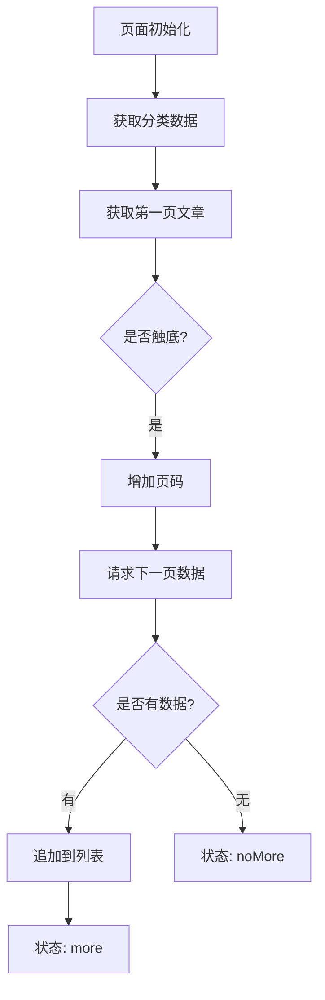
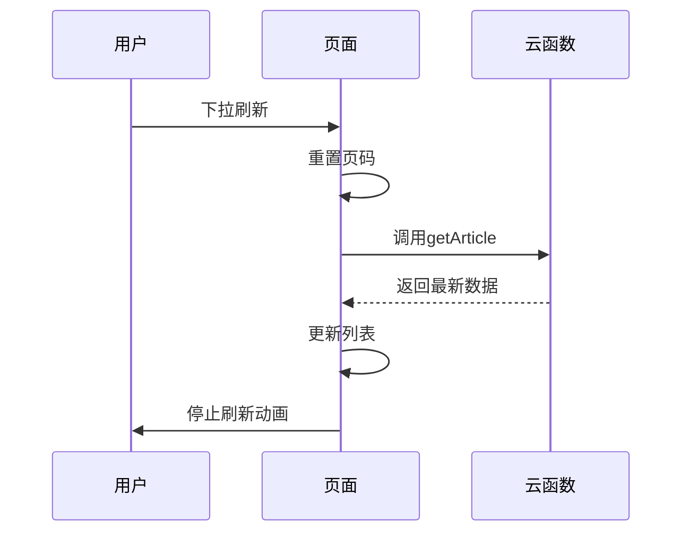
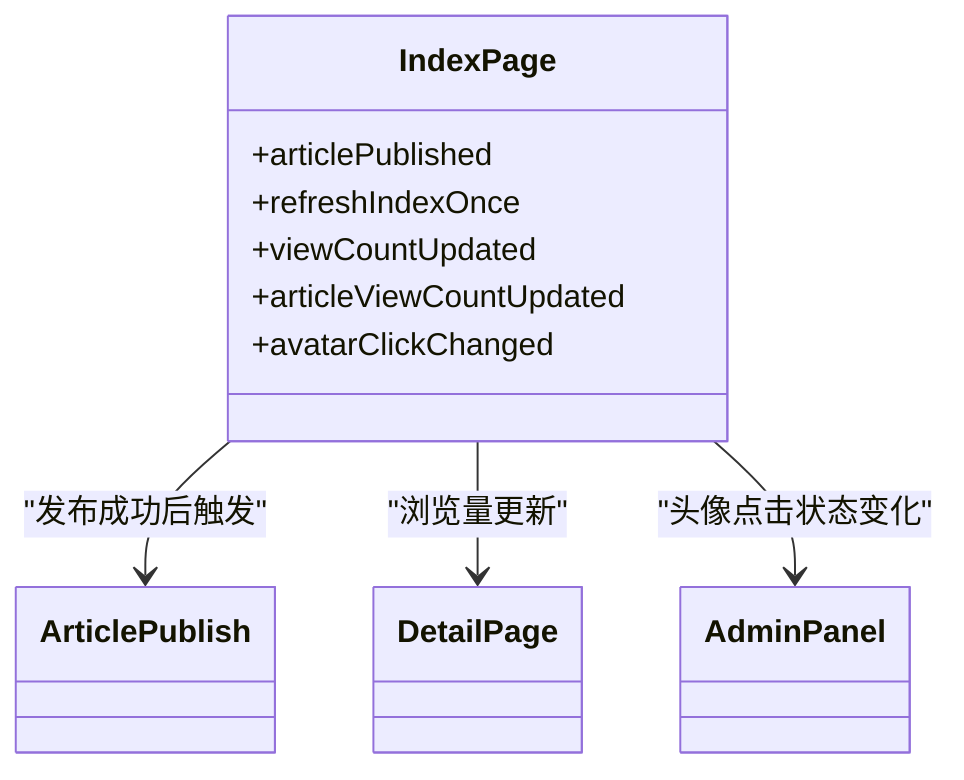
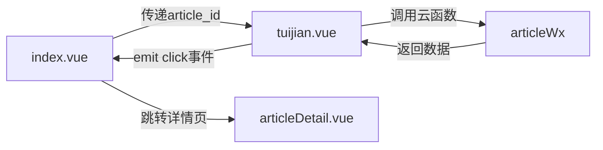

# 首页（推荐流）

<cite>
**本文档引用的文件**
- [index.vue](file://pages/index/index.vue)
- [tuijian.vue](file://components/tuijian/tuijian.vue)
- [user.js](file://store/user.js)
- [articleWx/index.obj.js](file://uniCloud-aliyun/cloudfunctions/articleWx/index.obj.js)
</cite>

## 目录
1. [简介](#简介)
2. [页面结构与核心功能](#页面结构与核心功能)
3. [分页加载机制](#分页加载机制)
4. [数据请求流程](#数据请求流程)
5. [状态管理与Store联动](#状态管理与store联动)
6. [用户交互与懒加载优化](#用户交互与懒加载优化)
7. [组件交互模式](#组件交互模式)

## 简介
首页作为应用的核心内容展示页面，承担着推荐文章流的主要展示功能。该页面通过集成z-paging组件实现高效的分页加载，并结合tuijian组件展示相关推荐内容。页面实现了完整的生命周期管理、数据同步机制和用户状态联动，为用户提供流畅的内容浏览体验。

## 页面结构与核心功能

首页(index.vue)采用Vue 3的组合式API进行开发，主要包含两个核心区域：顶部分类导航和文章列表展示区。页面通过`scroll-view`组件实现水平滚动的分类标签栏，每个分类项显示图标和名称，并对当前定位区域进行特殊标记。

文章列表区域使用`articleItem`组件进行循环渲染，每个项目包含作者信息、内容摘要、图片展示和操作按钮。页面通过`uni-load-more`组件显示加载状态，在数据为空时提供友好的空状态提示。

页面初始化时会自动获取用户位置信息，并根据当前位置智能排序分类列表，将与用户所在区域匹配的分类优先展示。

**Section sources**
- [index.vue](file://pages/index/index.vue#L0-L1078)

## 分页加载机制

### z-paging组件的应用
虽然当前代码中未直接使用z-paging组件，但项目已引入该模块并具备使用条件。z-paging是一个高性能的分页组件，支持自定义下拉刷新、上拉加载更多、虚拟列表等高级功能。

### 自定义分页实现
当前页面通过手动实现分页逻辑来管理数据加载：

1. **状态管理**：使用`pageNo`和`status`两个响应式变量分别跟踪当前页码和加载状态
2. **初始加载**：在`onMounted`生命周期中调用`cateListGet()`方法获取分类和文章数据
3. **触底检测**：通过`onReachBottom`生命周期函数监听滚动到底部事件
4. **状态控制**：`status`变量有三种状态 - 'more'(可加载更多)、'loading'(加载中)、'noMore'(无更多数据)



**Diagram sources**
- [index.vue](file://pages/index/index.vue#L0-L1078)

**Section sources**
- [index.vue](file://pages/index/index.vue#L0-L1078)

## 数据请求流程

### 云函数调用
首页通过uniCloud的云函数`articleWx`获取文章数据，具体流程如下：

1. **导入云对象**：
```javascript
const articleApi = uniCloud.importObject('articleWx', { customUI: true })
```

2. **获取文章列表**：
```javascript
const res = await articleApi.getArticle(cate_id || '', pageNo.value, pageSize)
```

### 初始化数据请求
页面加载时执行完整的数据获取流程：

1. 获取用户地理位置
2. 调用`addReady`云函数获取位置文本信息
3. 获取分类列表并按位置相关性排序
4. 加载第一个分类的文章数据

### 下拉刷新处理
`onPullDownRefresh`生命周期函数处理下拉刷新操作：



**Diagram sources**
- [index.vue](file://pages/index/index.vue#L0-L1078)
- [articleWx/index.obj.js](file://uniCloud-aliyun/cloudfunctions/articleWx/index.obj.js#L0-L793)

**Section sources**
- [index.vue](file://pages/index/index.vue#L0-L1078)
- [articleWx/index.obj.js](file://uniCloud-aliyun/cloudfunctions/articleWx/index.obj.js#L0-L793)

## 状态管理与store联动

### Pinia状态管理
页面通过Pinia实现全局状态管理，主要依赖`store/user.js`中的`useUserInfoStore`：

```javascript
import { useUserInfoStore } from '@/store/user.js'
const userStore = useUserInfoStore()
```

### 用户状态同步
页面与用户状态store保持实时同步：

1. **登录状态检查**：在删除文章等敏感操作前检查`userStore.userInfo.isLogin`
2. **用户信息获取**：通过`userStore.userInfo.uid`获取当前用户ID
3. **事件驱动更新**：监听全局事件更新本地状态

### 全局事件通信
页面注册了多个全局事件监听器：



**Diagram sources**
- [index.vue](file://pages/index/index.vue#L0-L1078)
- [user.js](file://store/user.js#L0-L90)

**Section sources**
- [index.vue](file://pages/index/index.vue#L0-L1078)
- [user.js](file://store/user.js#L0-L90)

## 用户交互与懒加载优化

### 滚动行为处理
页面通过多种方式优化滚动体验：

1. **触底加载**：`onReachBottom`实现无限滚动
2. **滚动监听**：`onPageScroll`确保滚动时隐藏加载动画
3. **返回刷新**：`onBackPress`在返回首页时自动刷新内容
4. **页面激活**：`onActivated`在从后台切回时检查是否需要刷新

### 图片预览优化
实现高效的图片预览功能：

```javascript
const previewImage = (urls, current) => {
    // 使用域名修复后的URL
    let previewUrls = urls.map(url => fixImageUrl(url));
    
    uni.previewImage({
        urls: previewUrls,
        current: current,
        loop: true
    });
}
```

### 性能优化策略
1. **防重复请求**：使用`loadingManager.isLoading`标志防止重复加载
2. **延迟执行**：关键操作使用`setTimeout`避免冲突
3. **资源释放**：在`onUnmounted`中移除所有事件监听
4. **智能刷新**：设置时间间隔防止频繁刷新

**Section sources**
- [index.vue](file://pages/index/index.vue#L0-L1078)

## 组件交互模式

### tuijian组件集成
`tuijian.vue`组件作为推荐内容展示的重要部分，具有以下特点：

1. **属性传递**：
   - `currentArticleId`: 当前文章ID
   - `cate_id`: 分类ID

2. **事件通信**：
   ```javascript
   const emit = defineEmits(['click'])
   ```

3. **方法暴露**：
   ```javascript
   defineExpose({
       loadMore,
       refresh: () => getMoreArticles(true)
   })
   ```

### 组件间数据流


### 交互流程
1. 主页面传递当前文章ID和分类信息给推荐组件
2. 推荐组件调用云函数获取相关文章
3. 用户点击推荐文章时触发click事件
4. 主页面接收到事件后跳转到对应文章详情

**Diagram sources**
- [index.vue](file://pages/index/index.vue#L0-L1078)
- [tuijian.vue](file://components/tuijian/tuijian.vue#L0-L439)

**Section sources**
- [index.vue](file://pages/index/index.vue#L0-L1078)
- [tuijian.vue](file://components/tuijian/tuijian.vue#L0-L439)