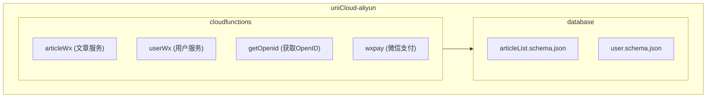
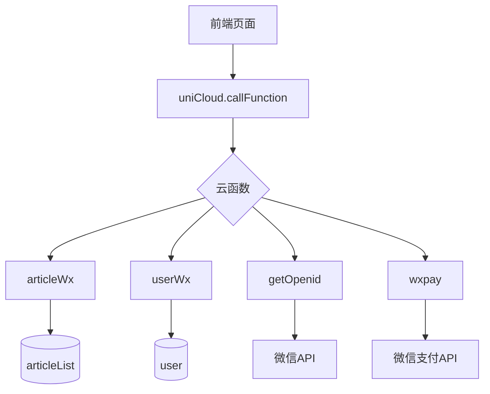
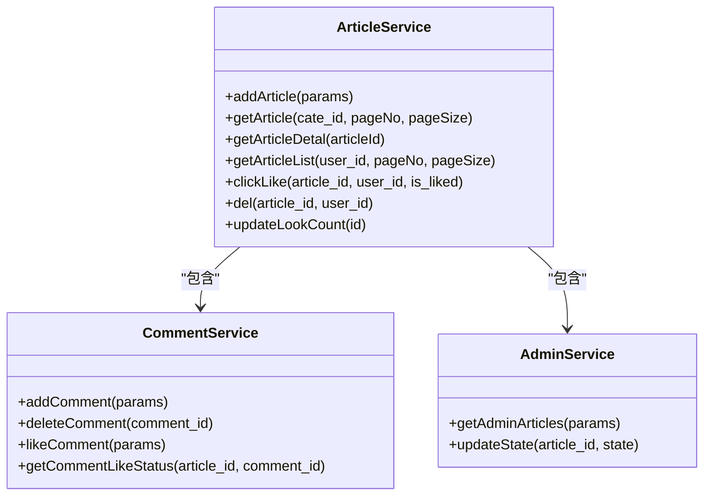
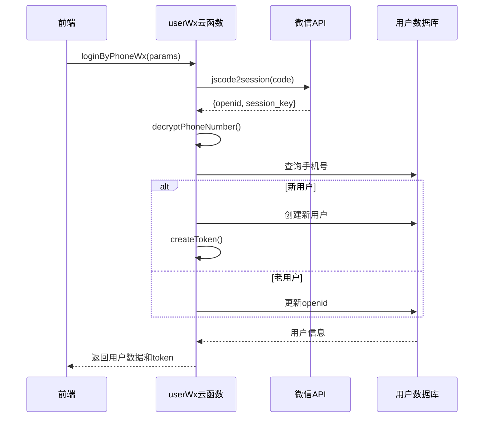
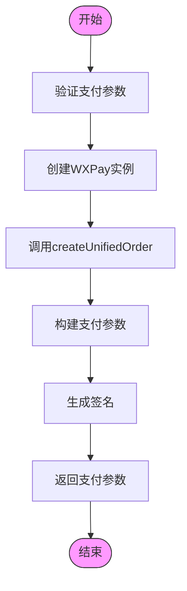
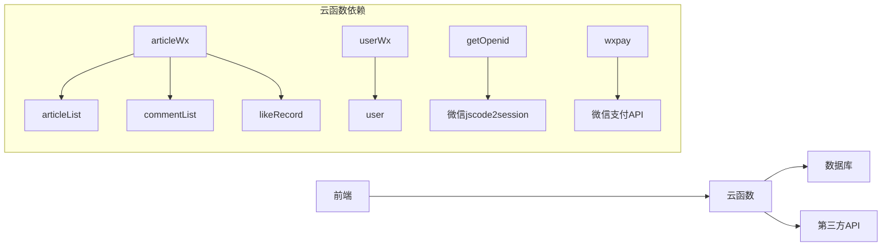

# 云函数与数据库

<cite>
**本文档引用的文件**
- [articleWx/index.obj.js](file://uniCloud-aliyun/cloudfunctions/articleWx/index.obj.js)
- [userWx/index.obj.js](file://uniCloud-aliyun/cloudfunctions/userWx/index.obj.js)
- [getOpenid/index.js](file://uniCloud-aliyun/cloudfunctions/getOpenid/index.js)
- [wxpay/index.obj.js](file://uniCloud-aliyun/cloudfunctions/wxpay/index.obj.js)
- [articleList.schema.json](file://uniCloud-aliyun/database/articleList.schema.json)
- [user.schema.json](file://uniCloud-aliyun/database/user.schema.json)
- [userWx/config.js](file://uniCloud-aliyun/cloudfunctions/userWx/config.js)
- [userWx/decryptPhoneNumber.js](file://uniCloud-aliyun/cloudfunctions/userWx/decryptPhoneNumber.js)
- [userWx/createToken.js](file://uniCloud-aliyun/cloudfunctions/userWx/createToken.js)
- [userWx/generateRandomName.js](file://uniCloud-aliyun/cloudfunctions/userWx/generateRandomName.js)
- [wxpay/config.js](file://uniCloud-aliyun/cloudfunctions/wxpay/config.js)
</cite>

## 目录
1. [简介](#简介)
2. [项目结构](#项目结构)
3. [核心组件](#核心组件)
4. [架构概述](#架构概述)
5. [详细组件分析](#详细组件分析)
6. [依赖分析](#依赖分析)
7. [性能考虑](#性能考虑)
8. [故障排除指南](#故障排除指南)
9. [结论](#结论)

## 简介
本文档全面解析 `uniCloud-aliyun` 目录下云函数与数据库 Schema 的协同工作机制。重点说明 `cloudfunctions` 中各业务模块（如 articleWx、userWx、getOpenid、wxpay）的职责划分与 RESTful 风格接口设计，阐述数据库 Schema（如 articleList、user）的字段定义、索引设置与权限规则配置，并描述从前端调用 `uniCloud.callFunction` 到后端处理并操作数据库的完整数据流。

## 项目结构

**图示来源**
- [articleWx/index.obj.js](file://uniCloud-aliyun/cloudfunctions/articleWx/index.obj.js)
- [userWx/index.obj.js](file://uniCloud-aliyun/cloudfunctions/userWx/index.obj.js)
- [articleList.schema.json](file://uniCloud-aliyun/database/articleList.schema.json)
- [user.schema.json](file://uniCloud-aliyun/database/user.schema.json)

**本节来源**
- [uniCloud-aliyun/cloudfunctions](file://uniCloud-aliyun/cloudfunctions)
- [uniCloud-aliyun/database](file://uniCloud-aliyun/database)

## 核心组件

本文档的核心组件包括：
- **articleWx**: 处理文章相关的所有操作，包括发布、查询、点赞、评论等。
- **userWx**: 负责用户登录、资料管理及信息查询。
- **getOpenid**: 获取微信用户的 OpenID。
- **wxpay**: 实现微信支付功能。
- **articleList.schema.json**: 定义文章集合的数据结构和权限。
- **user.schema.json**: 定义用户集合的数据结构和权限。

这些组件共同构成了系统的业务逻辑层和数据存储层，通过云函数调用实现前后端交互。

**本节来源**
- [articleWx/index.obj.js](file://uniCloud-aliyun/cloudfunctions/articleWx/index.obj.js#L1-L50)
- [userWx/index.obj.js](file://uniCloud-aliyun/cloudfunctions/userWx/index.obj.js#L1-L30)
- [articleList.schema.json](file://uniCloud-aliyun/database/articleList.schema.json#L1-L20)
- [user.schema.json](file://uniCloud-aliyun/database/user.schema.json#L1-L20)

## 架构概述

系统采用典型的前后端分离架构，前端通过 `uniCloud.callFunction` 调用云函数，云函数在云端执行业务逻辑并与数据库交互。整体架构分为三层：

**图示来源**
- [articleWx/index.obj.js](file://uniCloud-aliyun/cloudfunctions/articleWx/index.obj.js#L1-L20)
- [userWx/index.obj.js](file://uniCloud-aliyun/cloudfunctions/userWx/index.obj.js#L1-L20)
- [getOpenid/index.js](file://uniCloud-aliyun/cloudfunctions/getOpenid/index.js#L1-L10)
- [wxpay/index.obj.js](file://uniCloud-aliyun/cloudfunctions/wxpay/index.obj.js#L1-L15)

## 详细组件分析

### 文章服务 (articleWx) 分析

`articleWx` 模块是系统的核心业务模块之一，负责处理所有与文章相关的操作。

#### 类图

**图示来源**
- [articleWx/index.obj.js](file://uniCloud-aliyun/cloudfunctions/articleWx/index.obj.js#L150-L700)

**本节来源**
- [articleWx/index.obj.js](file://uniCloud-aliyun/cloudfunctions/articleWx/index.obj.js#L1-L793)

### 用户服务 (userWx) 分析

`userWx` 模块负责用户身份验证和资料管理。

#### 序列图

**图示来源**
- [userWx/index.obj.js](file://uniCloud-aliyun/cloudfunctions/userWx/index.obj.js#L30-L100)
- [userWx/decryptPhoneNumber.js](file://uniCloud-aliyun/cloudfunctions/userWx/decryptPhoneNumber.js)
- [userWx/createToken.js](file://uniCloud-aliyun/cloudfunctions/userWx/createToken.js)

**本节来源**
- [userWx/index.obj.js](file://uniCloud-aliyun/cloudfunctions/userWx/index.obj.js#L1-L233)
- [userWx/config.js](file://uniCloud-aliyun/cloudfunctions/userWx/config.js)
- [userWx/decryptPhoneNumber.js](file://uniCloud-aliyun/cloudfunctions/userWx/decryptPhoneNumber.js)
- [userWx/createToken.js](file://uniCloud-aliyun/cloudfunctions/userWx/createToken.js)
- [userWx/generateRandomName.js](file://uniCloud-aliyun/cloudfunctions/userWx/generateRandomName.js)

### 支付服务 (wxpay) 分析

`wxpay` 模块实现了微信支付功能。

#### 流程图

**图示来源**
- [wxpay/index.obj.js](file://uniCloud-aliyun/cloudfunctions/wxpay/index.obj.js#L20-L100)
- [wxpay/config.js](file://uniCloud-aliyun/cloudfunctions/wxpay/config.js)

**本节来源**
- [wxpay/index.obj.js](file://uniCloud-aliyun/cloudfunctions/wxpay/index.obj.js#L1-L117)
- [wxpay/config.js](file://uniCloud-aliyun/cloudfunctions/wxpay/config.js)

## 依赖分析

系统各组件之间的依赖关系如下：

**图示来源**
- [go.mod](file://go.mod#L1-L20)
- [main.go](file://main.go#L1-L15)

**本节来源**
- [articleWx/index.obj.js](file://uniCloud-aliyun/cloudfunctions/articleWx/index.obj.js)
- [userWx/index.obj.js](file://uniCloud-aliyun/cloudfunctions/userWx/index.obj.js)
- [getOpenid/index.js](file://uniCloud-aliyun/cloudfunctions/getOpenid/index.js)
- [wxpay/index.obj.js](file://uniCloud-aliyun/cloudfunctions/wxpay/index.obj.js)

## 性能考虑

系统在设计时考虑了以下性能优化策略：
- 使用分页查询避免一次性加载过多数据
- 在关键字段上建立索引以提高查询效率
- 采用异步非阻塞I/O模型处理并发请求
- 对图片资源进行压缩和缓存处理
- 使用连接池管理数据库连接

虽然具体的索引配置未在提供的文件中明确展示，但根据最佳实践，建议在以下字段上建立索引：
- `articleList.user_id`
- `articleList.cate_id`
- `articleList.create_time`
- `user.mobile`
- `user.openid_wx`

## 故障排除指南

### 常见问题及解决方案

| 问题现象 | 可能原因 | 解决方案 |
|---------|--------|--------|
| 登录失败 | code无效或过期 | 检查小程序代码是否正确获取code |
| 手机号解密失败 | session_key错误 | 确保使用正确的session_key进行解密 |
| 支付参数错误 | 缺少必需参数 | 检查openid、out_trade_no、total_fee是否都已提供 |
| 文章无法删除 | 权限不足 | 确认当前用户是文章作者 |
| 评论提交失败 | 参数不完整 | 检查article_id、user_id、content等必填项 |

**本节来源**
- [errors.go](file://errors/errors.go#L10-L50)
- [debug.go](file://debug/debug.go#L15-L40)

## 结论

本文档全面解析了 `uniCloud-aliyun` 目录下云函数与数据库 Schema 的协同工作机制。系统通过将业务逻辑按领域拆分为独立的云函数模块（如 articleWx、userWx），实现了良好的可维护性和扩展性。每个云函数专注于特定的业务功能，降低了模块间的耦合度。

数据库 Schema 设计合理，通过精确的权限规则（permission）确保了数据安全性。例如，`articleList` 集合只允许认证用户创建、更新和删除自己的文章，而读取权限对所有用户开放，这符合社交类应用的安全需求。

从前端调用 `uniCloud.callFunction` 到后端处理并操作数据库的完整数据流清晰高效，体现了 serverless 架构的优势：开发者可以专注于业务逻辑实现，而不必关心服务器运维。这种架构特别适合快速迭代的移动应用开发场景。