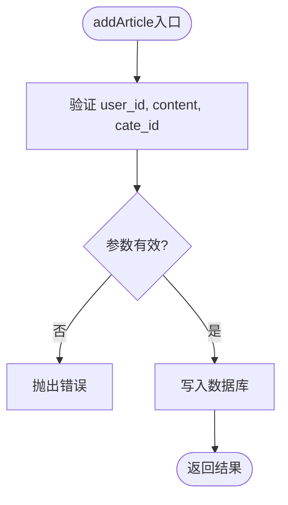

# 云函数详解

<cite>
**本文档引用文件**  
- [articleWx/index.obj.js](file://uniCloud-aliyun/cloudfunctions/articleWx/index.obj.js)
- [userWx/index.obj.js](file://uniCloud-aliyun/cloudfunctions/userWx/index.obj.js)
- [getOpenid/index.js](file://uniCloud-aliyun/cloudfunctions/getOpenid/index.js)
- [wxpay/index.obj.js](file://uniCloud-aliyun/cloudfunctions/wxpay/index.obj.js)
- [userWx/config.js](file://uniCloud-aliyun/cloudfunctions/userWx/config.js)
- [wxpay/config.js](file://uniCloud-aliyun/cloudfunctions/wxpay/config.js)
</cite>

## 目录
1. [简介](#简介)
2. [核心云函数职责划分](#核心云函数职责划分)
3. [文章管理云函数（articleWx）](#文章管理云函数articlewx)
4. [用户信息处理云函数（userWx）](#用户信息处理云函数userwx)
5. [获取用户标识云函数（getOpenid）](#获取用户标识云函数getopenid)
6. [支付逻辑云函数（wxpay）](#支付逻辑云函数wxpay)
7. [前端调用方式与RESTful角色](#前端调用方式与restful角色)
8. [安全策略与最佳实践](#安全策略与最佳实践)
9. [总结](#总结)

## 简介
本项目基于uniCloud阿里云环境构建，采用微服务架构设计思想，通过多个独立的云函数实现高内聚、低耦合的功能模块。各云函数分别承担文章管理、用户认证、支付处理等关键业务逻辑，具备良好的可维护性和扩展性。

## 核心云函数职责划分
系统中的核心云函数按照功能边界清晰划分职责：
- **articleWx**：负责文章全生命周期管理，包括发布、查询、点赞、评论等操作
- **userWx**：处理用户登录、资料更新及信息查询
- **getOpenid**：获取微信用户唯一标识
- **wxpay**：处理微信支付请求与订单查询


**图示来源**
- [articleWx/index.obj.js](file://uniCloud-aliyun/cloudfunctions/articleWx/index.obj.js)
- [userWx/index.obj.js](file://uniCloud-aliyun/cloudfunctions/userWx/index.obj.js)
- [getOpenid/index.js](file://uniCloud-aliyun/cloudfunctions/getOpenid/index.js)
- [wxpay/index.obj.js](file://uniCloud-aliyun/cloudfunctions/wxpay/index.obj.js)

## 文章管理云函数（articleWx）

### 请求参数校验机制
`articleWx`云函数在执行前对输入参数进行严格校验，确保数据完整性：
- 新增文章时验证用户ID、内容和分类ID不能为空
- 删除文章时检查用户权限，防止越权操作
- 更新状态时验证文章当前状态是否为待审核



**图示来源**
- [articleWx/index.obj.js](file://uniCloud-aliyun/cloudfunctions/articleWx/index.obj.js#L100-L130)

### 业务逻辑处理流程
文章管理包含完整的CRUD操作链路：
1. 用户提交文章内容及多媒体资源
2. 系统自动获取地理位置并关联分类
3. 写入`articleList`集合并初始化互动计数
4. 支持按分类、热度、时间等多种维度检索

### 数据库操作方式
使用uniCloud JQL语法进行数据库交互：
- 通过`db.collection('articleList')`获取集合引用
- 使用`.where()`、`.orderBy()`构建查询条件
- 利用`dbCmd.inc()`原子操作实现点赞/评论数递增

### 异常捕获机制
所有异步操作均包裹在try-catch中，并返回结构化错误响应：
```json
{
  "code": -1,
  "message": "获取失败",
  "error": "具体错误信息"
}
```

**章节来源**
- [articleWx/index.obj.js](file://uniCloud-aliyun/cloudfunctions/articleWx/index.obj.js)

## 用户信息处理云函数（userWx）

### 登录流程解析
`loginByPhoneWx`方法实现微信手机号一键登录：
1. 接收小程序端传来的code、encryptedData和iv
2. 调用微信接口换取session_key和openid
3. 解密获取真实手机号
4. 查询或创建用户记录


**图示来源**
- [userWx/index.obj.js](file://uniCloud-aliyun/cloudfunctions/userWx/index.obj.js#L20-L80)
- [userWx/config.js](file://uniCloud-aliyun/cloudfunctions/userWx/config.js)

### 用户资料更新
提供`updateUserProfile`接口用于修改昵称和头像：
- 参数校验确保uid存在
- 动态构建更新字段对象
- 使用`.update()`方法持久化变更

### 多用户信息批量查询
`getUsersByIds`支持根据ID数组批量获取用户基础信息：
- 使用`db.command.in()`构造包含查询
- 限定返回字段以提升性能
- 返回标准化结果格式

**章节来源**
- [userWx/index.obj.js](file://uniCloud-aliyun/cloudfunctions/userWx/index.obj.js)

## 获取用户标识云函数（getOpenid）

### 接口设计
该云函数专用于解耦微信登录流程：
- 输入：临时登录凭证code
- 输出：用户的唯一标识openid
- 错误码统一规范（200成功，500失败）

### 实现细节
直接调用微信官方`jscode2session`接口完成鉴权：
- 配置appid和appSecret常量
- 使用`uniCloud.httpclient.request`发起HTTPS请求
- 对errcode进行判断并返回友好提示


**图示来源**
- [getOpenid/index.js](file://uniCloud-aliyun/cloudfunctions/getOpenid/index.js)

**章节来源**
- [getOpenid/index.js](file://uniCloud-aliyun/cloudfunctions/getOpenid/index.js)

## 支付逻辑云函数（wxpay）

### 支付参数校验
`wxpay`方法对接收到的支付参数进行全面验证：
- 检查openid、商户订单号、金额是否存在
- 验证金额为正数且类型正确
- 防止空对象或非对象参数传入

### 统一下单流程
集成`wx-pay` SDK完成微信支付核心流程：
1. 初始化支付客户端（含证书pfx）
2. 调用`createUnifiedOrder`生成预支付交易单
3. 按照微信规范重组签名所需参数
4. 计算MD5签名后返回完整支付参数


**图示来源**
- [wxpay/index.obj.js](file://uniCloud-aliyun/cloudfunctions/wxpay/index.obj.js#L20-L70)
- [wxpay/config.js](file://uniCloud-aliyun/cloudfunctions/wxpay/config.js)

### 订单查询功能
提供`getWxOrder`接口用于查询订单状态：
- 输入商户订单号out_trade_no
- 调用SDK的queryOrder方法
- 返回原始订单信息供业务判断

### 安全配置管理
敏感信息如商户密钥、证书路径等通过`config.js`集中管理：
- `notifyUrl`：支付结果通知地址
- `appid`、`mch_id`、`partner_key`：微信支付必要参数

**章节来源**
- [wxpay/index.obj.js](file://uniCloud-aliyun/cloudfunctions/wxpay/index.obj.js)
- [wxpay/config.js](file://uniCloud-aliyun/cloudfunctions/wxpay/config.js)

## 前端调用方式与RESTful角色

### uniCloud.callFunction调用示例
从前端页面调用云函数的标准方式：

```javascript
// 调用文章新增接口
uniCloud.callFunction({
  name: 'articleWx',
  data: {
    action: 'addArticle',
    params: {
      user_id: 'xxx',
      content: '测试内容',
      cate_id: '01'
    }
  }
}).then(res => {
  console.log('发布成功', res.result)
})
```

```javascript
// 调用微信支付
uniCloud.callFunction({
  name: 'wxpay',
  data: {
    action: 'wxpay',
    params: {
      openid: 'oTvsd5...',
      out_trade_no: 'ORDER_20240101',
      total_fee: 100
    }
  }
}).then(res => {
  // 使用返回参数发起微信支付
  uni.requestPayment(res.result)
})
```

### RESTful架构角色定位
尽管使用callFunction而非HTTP API，但仍遵循RESTful设计理念：
- **资源导向**：每个云函数对应一类资源（文章、用户、支付）
- **无状态通信**：每次调用独立，不依赖上下文
- **统一接口**：通过action字段区分操作类型
- **自描述消息**：返回JSON格式包含code/message/data

**章节来源**
- [articleWx/index.obj.js](file://uniCloud-aliyun/cloudfunctions/articleWx/index.obj.js#L750-L790)
- [wxpay/index.obj.js](file://uniCloud-aliyun/cloudfunctions/wxpay/index.obj.js)

## 安全策略与最佳实践

### 权限控制机制
- 文章删除操作验证`user_id`与作者一致
- 管理员接口需额外身份校验（虽未显式体现但应补充）
- 敏感操作日志记录（可通过console.log追踪）

### 输入验证策略
- 所有入口函数均包含参数存在性检查
- 数值型参数进行类型和范围验证
- 字符串参数trim处理避免空格干扰

### 日志记录规范
- 关键步骤使用`console.log`输出调试信息
- 错误捕获后打印详细堆栈`console.error`
- 生产环境建议增加日志级别控制

### 最佳实践建议
1. **敏感信息保护**：将appid、密钥等移至环境变量
2. **事务处理**：涉及多表更新的操作使用数据库事务
3. **频率限制**：对高频接口增加调用频次限制
4. **数据脱敏**：返回用户信息时过滤敏感字段
5. **接口文档化**：完善JSDoc注释便于团队协作

## 总结
本文深入剖析了uniCloud环境下四大核心云函数的实现机制。`articleWx`实现了完整的内容管理系统，`userWx`提供了安全的用户认证方案，`getOpenid`简化了微信登录流程，`wxpay`集成了可靠的支付能力。整体架构体现了模块化、安全性与可维护性的良好平衡，为类似应用开发提供了有价值的参考范例。