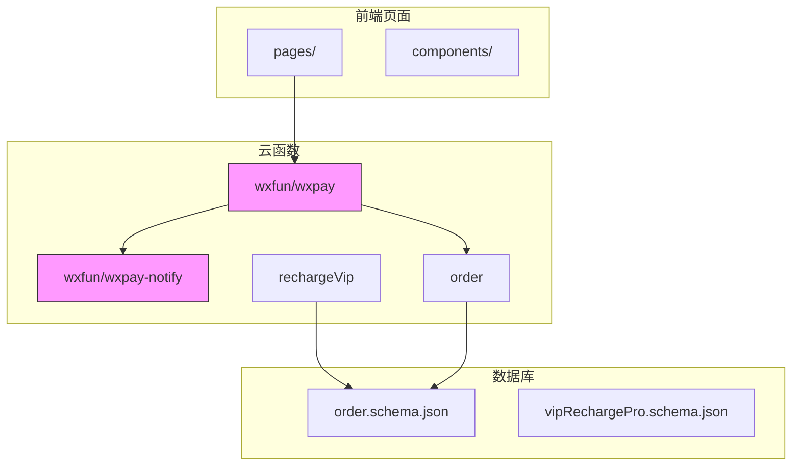
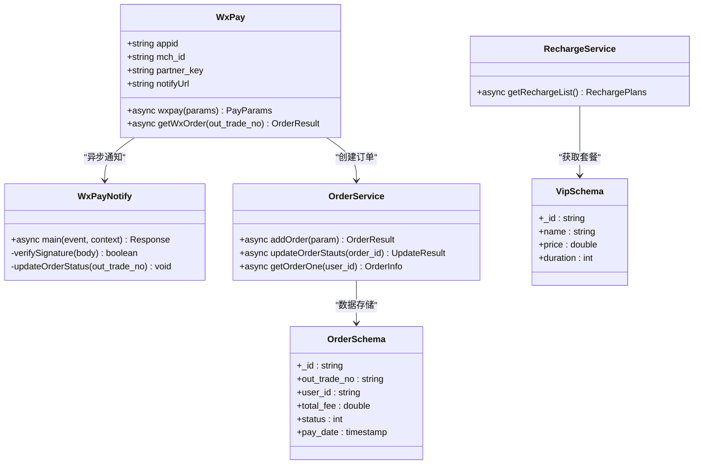
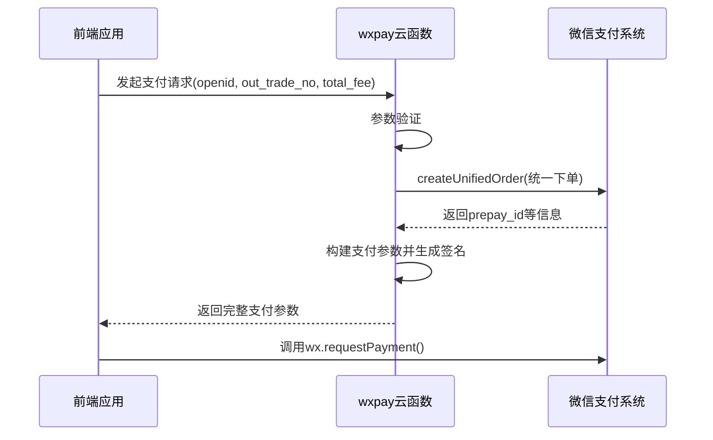
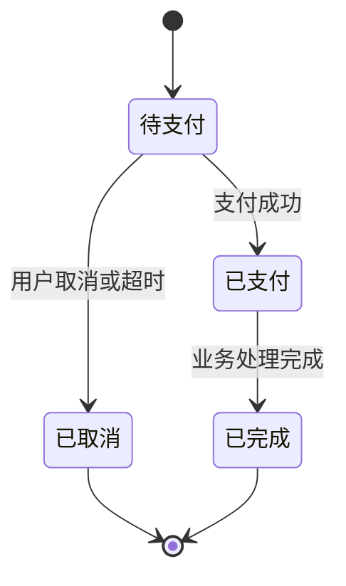
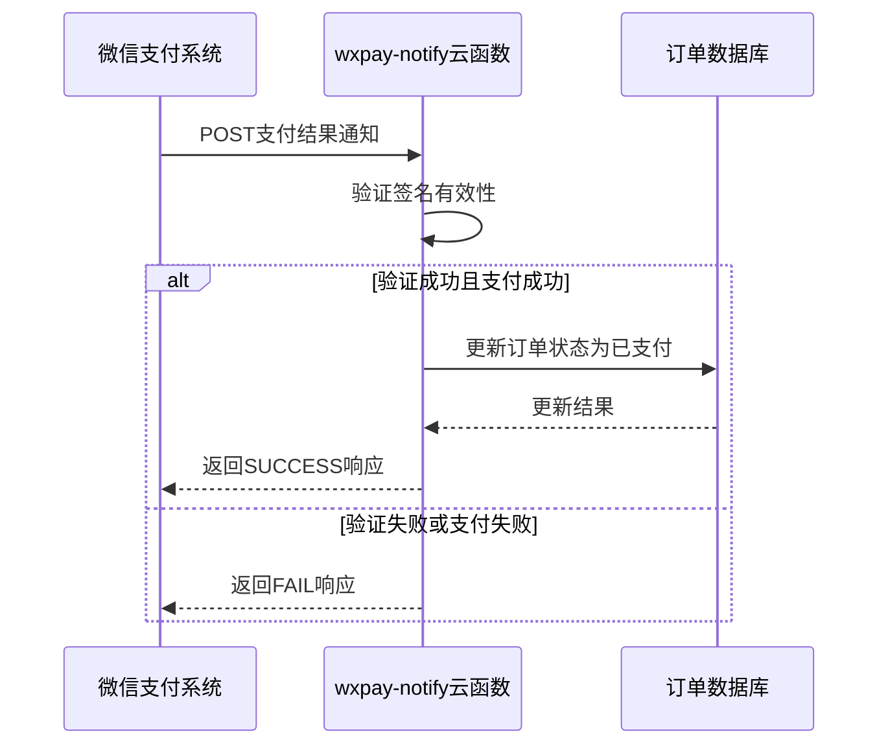
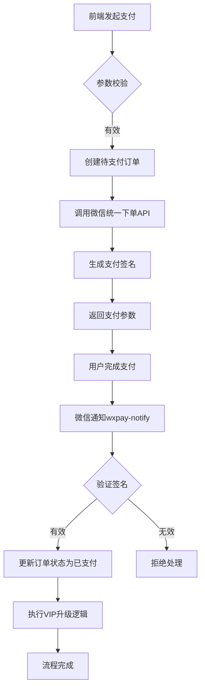

# 微信支付处理逻辑

<cite>
**Referenced Files in This Document**  
- [config.js](file://uniCloud-aliyun/cloudfunctions/wxpay/config.js)
- [index.obj.js](file://uniCloud-aliyun/cloudfunctions/wxpay/index.obj.js)
- [index.js](file://uniCloud-aliyun/cloudfunctions/wxpay-notify/index.js)
- [order.schema.json](file://uniCloud-aliyun/database/order.schema.json)
- [rechargeVip/index.obj.js](file://uniCloud-aliyun/cloudfunctions/rechargeVip/index.obj.js)
- [order/index.obj.js](file://uniCloud-aliyun/cloudfunctions/order/index.obj.js)
</cite>

## 目录
1. [项目结构](#项目结构)
2. [核心组件](#核心组件)
3. [统一下单接口实现](#统一下单接口实现)
4. [订单状态流转设计](#订单状态流转设计)
5. [支付通知回调机制](#支付通知回调机制)
6. [VIP充值与订单支付全流程](#vip充值与订单支付全流程)
7. [安全性要求](#安全性要求)

## 项目结构

本项目采用uniCloud云开发架构，微信支付相关功能主要集中在`uniCloud-aliyun/cloudfunctions`目录下。核心支付功能由`wxpay`云函数实现，支付结果通知由独立的`wxpay-notify`云函数处理。

**Diagram sources**
- [config.js](file://uniCloud-aliyun/cloudfunctions/wxpay/config.js)
- [index.obj.js](file://uniCloud-aliyun/cloudfunctions/wxpay/index.obj.js)
- [index.js](file://uniCloud-aliyun/cloudfunctions/wxpay-notify/index.js)
- [order.schema.json](file://uniCloud-aliyun/database/order.schema.json)

**Section sources**
- [config.js](file://uniCloud-aliyun/cloudfunctions/wxpay/config.js)
- [index.obj.js](file://uniCloud-aliyun/cloudfunctions/wxpay/index.obj.js)
- [index.js](file://uniCloud-aliyun/cloudfunctions/wxpay-notify/index.js)
- [order.schema.json](file://uniCloud-aliyun/database/order.schema.json)

## 核心组件

系统的核心支付功能由多个云函数协同完成，主要包括微信支付主函数、支付通知处理器、订单管理服务和VIP充值服务。

**Diagram sources**
- [config.js](file://uniCloud-aliyun/cloudfunctions/wxpay/config.js)
- [index.obj.js](file://uniCloud-aliyun/cloudfunctions/wxpay/index.obj.js)
- [index.js](file://uniCloud-aliyun/cloudfunctions/wxpay-notify/index.js)
- [order/index.obj.js](file://uniCloud-aliyun/cloudfunctions/order/index.obj.js)
- [rechargeVip/index.obj.js](file://uniCloud-aliyun/cloudfunctions/rechargeVip/index.obj.js)
- [order.schema.json](file://uniCloud-aliyun/database/order.schema.json)

**Section sources**
- [index.obj.js](file://uniCloud-aliyun/cloudfunctions/wxpay/index.obj.js)
- [index.js](file://uniCloud-aliyun/cloudfunctions/wxpay-notify/index.js)
- [order/index.obj.js](file://uniCloud-aliyun/cloudfunctions/order/index.obj.js)
- [rechargeVip/index.obj.js](file://uniCloud-aliyun/cloudfunctions/rechargeVip/index.obj.js)

## 统一下单接口实现

### 参数构造

`wxpay`云函数的`wxpay`方法负责处理统一下单请求，接收包含用户标识、订单号和金额的参数对象：

- `openid`: 用户唯一标识
- `out_trade_no`: 商户系统内部订单号
- `total_fee`: 订单总金额（单位：分）

这些参数在调用前会进行严格的类型和值验证，确保支付请求的合法性。

### 签名生成

签名生成过程遵循微信支付API规范，具体步骤如下：

1. 调用`WXPay`库创建支付实例，使用配置文件中的商户信息
2. 调用微信统一下单API，获取预支付交易会话标识（prepay_id）
3. 构建前端所需支付参数，包括：
   - appId: 公众账号ID
   - timeStamp: 时间戳
   - nonceStr: 随机字符串
   - package: 预支付ID包装的包
   - signType: 签名类型（MD5）
4. 按字典序对参数排序后，使用商户密钥生成最终签名

返回给前端的支付参数包含了完整的JSAPI调用所需信息。

**Diagram sources**
- [index.obj.js](file://uniCloud-aliyun/cloudfunctions/wxpay/index.obj.js)

**Section sources**
- [index.obj.js](file://uniCloud-aliyun/cloudfunctions/wxpay/index.obj.js#L20-L85)

## 订单状态流转设计

### 数据模型

订单数据模型定义在`order.schema.json`中，核心字段包括：

| 字段 | 类型 | 描述 |
|------|------|------|
| _id | string | 系统自动生成的文档ID |
| out_trade_no | string | 商户订单号 |
| user_id | string | 支付用户的ID |
| total_fee | double | 充值金额 |
| status | int | 支付状态 |
| pay_date | timestamp | 支付时间 |

### 状态管理

订单状态通过整数枚举表示，实现了清晰的状态流转：

- **0 - 待支付**: 订单已创建但尚未完成支付
- **1 - 已支付**: 支付成功，订单已完成
- **2 - 已取消**: 订单被取消
- **3 - 已完成**: 业务流程全部完成

状态转换主要通过以下云函数实现：
- `addOrder`: 创建新订单，默认状态为"待支付"(0)
- `updateOrderStauts`: 支付成功后更新状态为"已支付"(1)

**Diagram sources**
- [order.schema.json](file://uniCloud-aliyun/database/order.schema.json)
- [order/index.obj.js](file://uniCloud-aliyun/cloudfunctions/order/index.obj.js)

**Section sources**
- [order.schema.json](file://uniCloud-aliyun/database/order.schema.json#L1-L50)
- [order/index.obj.js](file://uniCloud-aliyun/cloudfunctions/order/index.obj.js#L30-L50)

## 支付通知回调机制

### 回调处理流程

`wxpay-notify`云函数专门处理微信支付服务器的异步通知，其主要职责包括：

1. 接收微信服务器POST请求体
2. 验证签名确保消息来源可信
3. 解析支付结果
4. 更新本地订单状态
5. 向微信服务器返回确认响应

### 安全验证

虽然当前实现中TODO标注了签名验证逻辑，但完整的安全验证应包含：
- 使用商户密钥验证通知签名
- 校验通知中的订单金额与本地记录一致
- 防止重复通知导致的状态错误更新

**Diagram sources**
- [index.js](file://uniCloud-aliyun/cloudfunctions/wxpay-notify/index.js)

**Section sources**
- [index.js](file://uniCloud-aliyun/cloudfunctions/wxpay-notify/index.js#L1-L32)

## VIP充值与订单支付全流程

### 前端发起流程

1. 用户选择VIP充值套餐
2. 前端调用`rechargeVip.getRechargeList`获取套餐信息
3. 创建订单并生成唯一订单号
4. 调用`order.addOrder`创建待支付订单
5. 调用`wxpay.wxpay`获取支付参数
6. 使用`wx.requestPayment`唤起微信支付

### 后端处理流程

**Section sources**
- [rechargeVip/index.obj.js](file://uniCloud-aliyun/cloudfunctions/rechargeVip/index.obj.js)
- [order/index.obj.js](file://uniCloud-aliyun/cloudfunctions/order/index.obj.js)
- [index.obj.js](file://uniCloud-aliyun/cloudfunctions/wxpay/index.obj.js)
- [index.js](file://uniCloud-aliyun/cloudfunctions/wxpay-notify/index.js)

## 安全性要求

### 签名验证

必须实现完整的签名验证机制，确保所有支付通知来自真实的微信服务器。验证过程应使用与下单相同的商户密钥对通知内容进行签名比对。

### 防止重复支付

通过订单号（out_trade_no）的唯一性约束和状态检查来防止重复支付：
- 在更新订单状态前检查当前状态是否为"待支付"
- 使用数据库事务确保状态更新的原子性
- 记录支付完成时间以供审计

### 敏感信息加密存储

- 商户密钥（partner_key）不应硬编码在代码中，建议使用环境变量或密钥管理系统
- 支付证书（apiclient_cert.p12）应妥善保管，限制访问权限
- 用户支付相关信息应遵循最小化原则，仅存储必要字段

**Section sources**
- [config.js](file://uniCloud-aliyun/cloudfunctions/wxpay/config.js)
- [index.obj.js](file://uniCloud-aliyun/cloudfunctions/wxpay/index.obj.js)
- [index.js](file://uniCloud-aliyun/cloudfunctions/wxpay-notify/index.js)