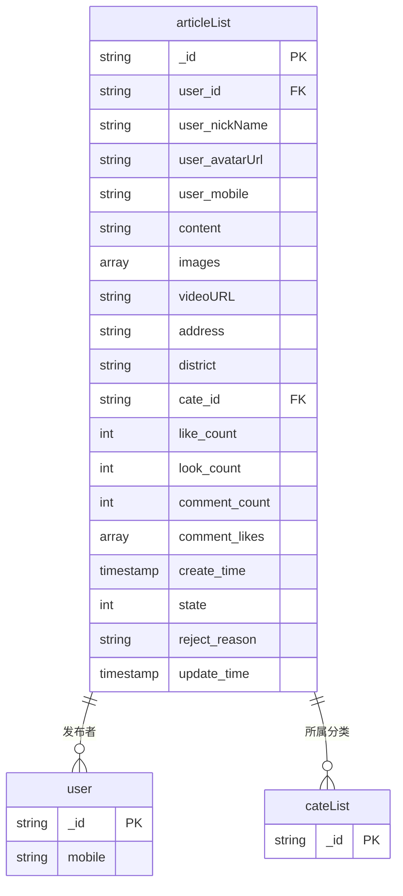
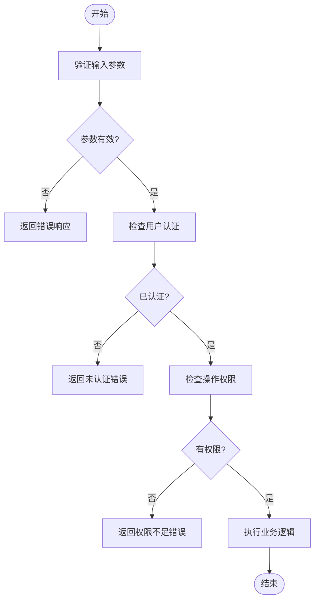
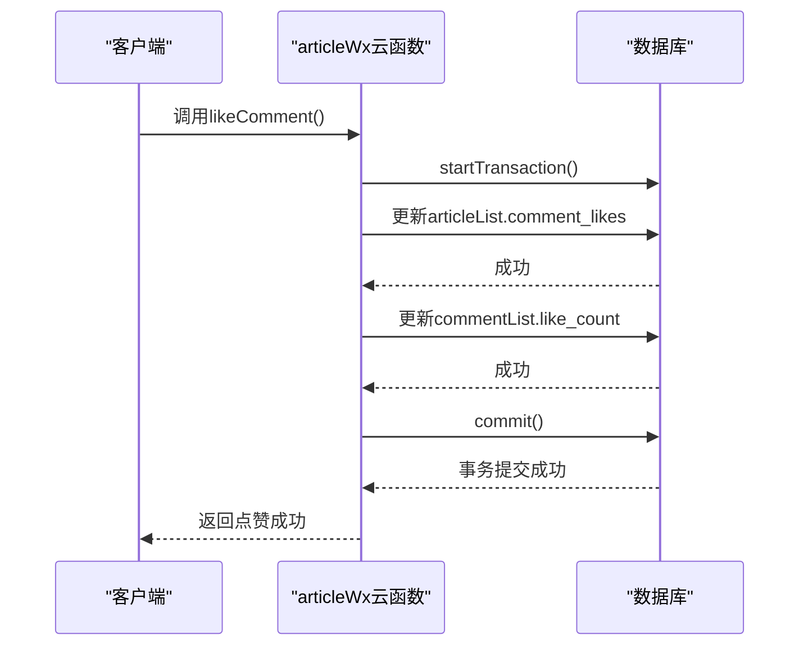

# 文章管理云函数

<cite>
**本文档引用的文件**
- [articleWx/index.obj.js](file://uniCloud-aliyun/cloudfunctions/articleWx/index.obj.js)
- [articleList.schema.json](file://uniCloud-aliyun/database/articleList.schema.json)
- [articleDetail.vue](file://pages/article/articleDetail.vue)
- [userArticleList.vue](file://pages/userArticleList/userArticleList.vue)
- [articleManage.vue](file://subPages/articleManage/articleManage.vue)
</cite>

## 目录
1. [简介](#简介)
2. [核心功能实现机制](#核心功能实现机制)
3. [数据模型映射关系](#数据模型映射关系)
4. [请求参数校验与权限控制](#请求参数校验与权限控制)
5. [数据库事务处理流程](#数据库事务处理流程)
6. [前端调用示例](#前端调用示例)
7. [核心业务场景实现](#核心业务场景实现)
8. [常见错误排查方法](#常见错误排查方法)

## 简介
`articleWx` 云函数是本应用中负责文章管理的核心服务模块，实现了完整的增删改查（CRUD）功能。该云函数通过统一的接口为前端提供文章发布、获取、更新和删除等操作支持，同时集成了权限验证、数据校验、浏览量统计、点赞管理等复杂业务逻辑。云函数与 `articleList` 数据库集合紧密配合，确保了数据的一致性和安全性。

## 核心功能实现机制
`articleWx` 云函数采用模块化设计，每个功能对应一个独立的方法，通过 `main` 入口函数根据传入的 `action` 参数路由到相应的处理方法。云函数在初始化时通过 `_before` 钩子建立数据库连接并初始化常用集合引用，包括文章集合（`articleList`）、评论集合（`commentList`）和浏览记录集合（`viewRecord`）。

云函数提供了以下主要功能：
- `addArticle`: 新增文章，自动设置创建时间和默认状态
- `getArticle`: 根据分类获取文章列表，支持分页
- `getArticleDetal`: 获取单篇文章详情及关联评论
- `getArticleList`: 获取指定用户的文章列表
- `del`: 删除文章，包含权限验证
- `updateState`: 管理员审核文章状态
- `clickLike`: 处理文章点赞/取消点赞
- `addComment`: 添加评论并更新文章评论计数
- `deleteComment`: 删除评论并同步更新文章数据
- `updateLookCount`: 更新浏览量并记录浏览者信息

所有数据库操作均使用 UniCloud 提供的 JQL API，确保了操作的安全性和效率。

**Section sources**
- [articleWx/index.obj.js](file://uniCloud-aliyun/cloudfunctions/articleWx/index.obj.js#L0-L911)

## 数据模型映射关系
`articleWx` 云函数的操作对象是 `articleList` 集合，其数据结构由 `articleList.schema.json` 文件定义。该数据模型包含了文章的所有属性及其约束条件。



**Diagram sources**
- [articleList.schema.json](file://uniCloud-aliyun/database/articleList.schema.json#L0-L158)

## 请求参数校验与权限控制
云函数在执行关键操作前会进行严格的参数校验和权限验证。参数校验主要检查必填字段是否存在且符合格式要求，如新增文章时会验证 `user_id`、`content` 和 `cate_id` 是否为空。

权限控制策略体现在多个层面：
1. **数据级权限**：在 `articleList.schema.json` 中定义了基于 `auth.uid` 的创建、更新和删除权限，确保只有登录用户才能操作。
2. **业务级权限**：在云函数代码中实现更细粒度的控制，如删除文章时会比对当前用户ID与文章作者ID是否一致，防止越权操作。
3. **管理员权限**：`updateState` 方法允许管理员更新文章状态，但会检查文章当前状态是否为待审核（0），防止重复审核。



**Diagram sources**
- [articleWx/index.obj.js](file://uniCloud-aliyun/cloudfunctions/articleWx/index.obj.js#L130-L140)
- [articleWx/index.obj.js](file://uniCloud-aliyun/cloudfunctions/articleWx/index.obj.js#L388-L395)
- [articleList.schema.json](file://uniCloud-aliyun/database/articleList.schema.json#L3-L8)

## 数据库事务处理流程
对于涉及多个数据表更新的操作，云函数使用数据库事务来保证数据一致性。最典型的例子是评论点赞功能，在 `likeComment` 方法中：

1. 当用户点赞评论时，需要同时更新文章文档中的 `comment_likes` 数组和评论文档中的 `like_count` 字段。
2. 云函数首先启动一个数据库事务。
3. 在事务中依次执行两个更新操作：向文章的 `comment_likes` 数组添加点赞记录，并将评论的 `like_count` 加1。
4. 如果两个操作都成功，则提交事务；如果任一操作失败，则回滚事务，确保数据不会处于不一致状态。

这种事务处理机制有效避免了因网络问题或系统异常导致的数据不一致问题。



**Diagram sources**
- [articleWx/index.obj.js](file://uniCloud-aliyun/cloudfunctions/articleWx/index.obj.js#L705-L730)

## 前端调用示例
前端通过 `uniCloud.callFunction` 方法调用 `articleWx` 云函数。以下是几个典型场景的调用示例：

```javascript
// 新增文章
uniCloud.callFunction({
  name: 'articleWx',
  data: {
    action: 'addArticle',
    params: {
      user_id: 'user123',
      content: '这是一篇测试文章',
      cate_id: '01',
      user_nickName: '张三',
      user_avatarUrl: 'https://example.com/avatar.jpg'
    }
  }
}).then(res => {
  console.log('文章发布成功', res.result);
});

// 获取文章详情
uniCloud.callFunction({
  name: 'articleWx',
  data: {
    action: 'getArticleDetal',
    article_id: 'article456'
  }
}).then(res => {
  console.log('文章详情', res.result.articleRes.data[0]);
});

// 点赞文章
uniCloud.callFunction({
  name: 'articleWx',
  data: {
    action: 'clickLike',
    article_id: 'article456',
    user_id: 'user123',
    is_liked: false
  }
}).then(res => {
  console.log('点赞结果', res.result);
});
```

**Section sources**
- [articleDetail.vue](file://pages/article/articleDetail.vue#L100-L110)
- [userArticleList.vue](file://pages/userArticleList/userArticleList.vue#L650-L660)

## 核心业务场景实现
### 分页查询与条件筛选
分页查询通过 `getArticle` 方法实现，接收 `pageNo` 和 `pageSize` 参数。云函数使用 `skip()` 和 `limit()` 方法实现分页，按创建时间倒序排列。特殊分类（如ID为'02'）会按点赞数排序。条件筛选主要通过 `where` 条件实现，如根据分类ID筛选文章，或在管理后台根据文章状态筛选。

### 点赞数更新机制
文章点赞采用原子操作实现。当用户点赞时，云函数使用 `dbCmd.inc(1)` 操作将文章的 `like_count` 字段原子性地加1，避免并发问题。同时，将用户的点赞记录存入 `likeRecord` 集合，用于后续的状态查询。取消点赞时则执行减1操作并删除记录。

### 浏览量统计与记录
`updateLookCount` 方法不仅更新文章的 `look_count`，还会记录详细的浏览者信息。如果用户已登录，会创建或更新 `viewRecord` 集合中的浏览记录，包含用户ID、昵称、头像、浏览时间等信息。这使得文章作者可以查看谁浏览了自己的文章。

**Section sources**
- [articleWx/index.obj.js](file://uniCloud-aliyun/cloudfunctions/articleWx/index.obj.js#L185-L230)
- [articleWx/index.obj.js](file://uniCloud-aliyun/cloudfunctions/articleWx/index.obj.js#L305-L315)
- [articleWx/index.obj.js](file://uniCloud-aliyun/cloudfunctions/articleWx/index.obj.js#L625-L680)

## 常见错误排查方法
### 权限拒绝
当出现权限拒绝错误时，应检查：
1. 用户是否已正确登录并获取了有效的 `user_id`
2. 操作是否符合数据表的权限规则（如只能删除自己的文章）
3. 云函数调用参数中的 `user_id` 是否与当前登录用户匹配

### 数据格式不匹配
此类错误通常发生在新增或更新文章时，应验证：
1. 必填字段（`user_id`, `content`, `create_time`）是否都已提供
2. 字段类型是否正确（如 `like_count` 应为整数）
3. 字符串长度是否超出限制（如 `content` 最大500字符）
4. 图片数组是否超过最大项数（9张）

### 其他常见问题
- **文章无法显示**：检查文章 `state` 状态是否为1（已通过），待审核或被拒绝的文章不会在普通列表中显示
- **点赞无效**：确认是否已正确处理 `is_liked` 参数，以及 `likeRecord` 集合是否有写入权限
- **浏览量不增加**：检查是否在短时间内重复调用，云函数可能有防刷机制

**Section sources**
- [articleWx/index.obj.js](file://uniCloud-aliyun/cloudfunctions/articleWx/index.obj.js#L130-L140)
- [articleWx/index.obj.js](file://uniCloud-aliyun/cloudfunctions/articleWx/index.obj.js#L388-L395)
- [articleList.schema.json](file://uniCloud-aliyun/database/articleList.schema.json#L15-L158)