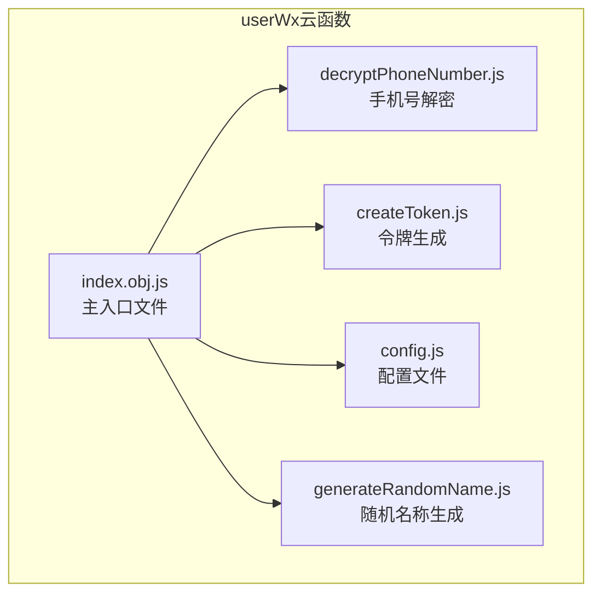
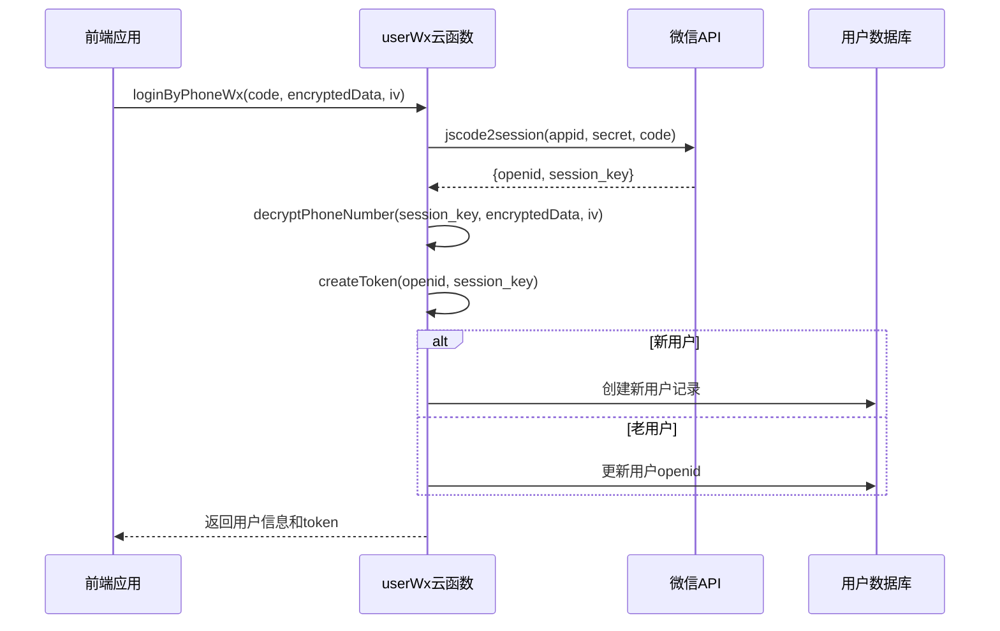
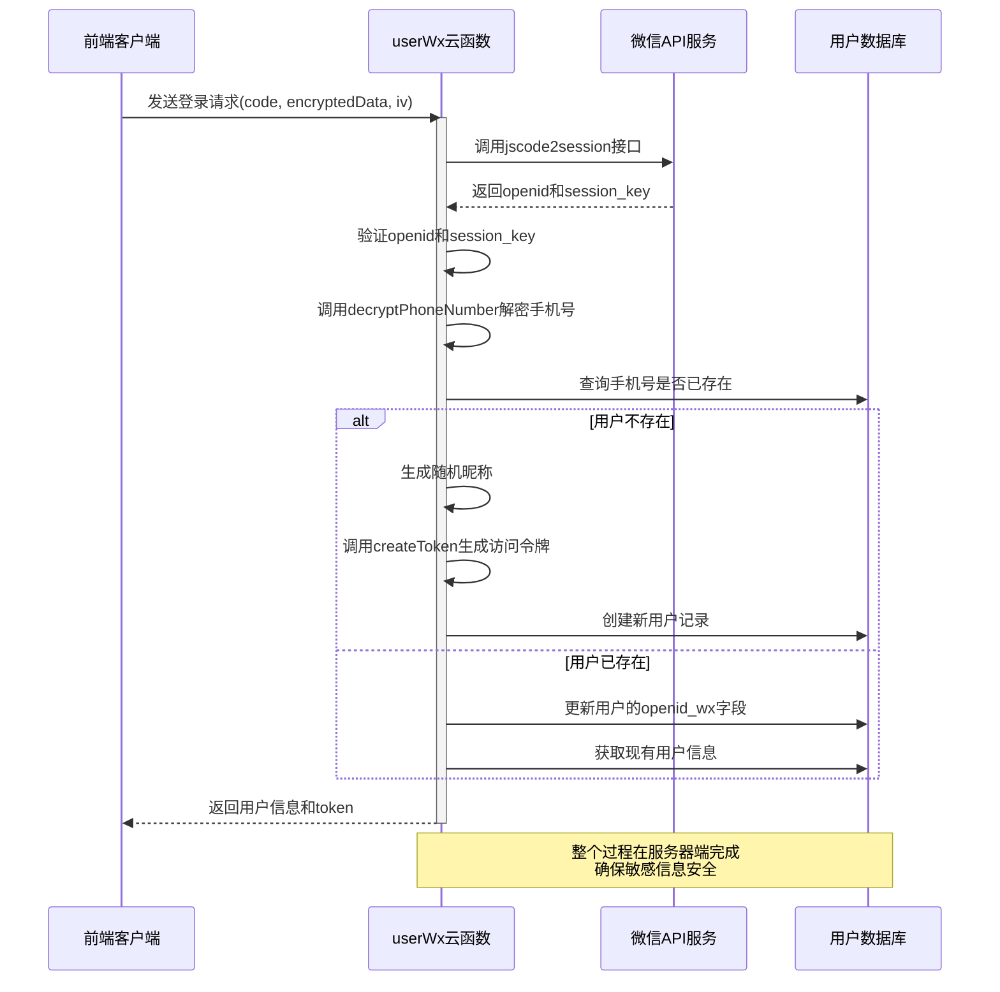
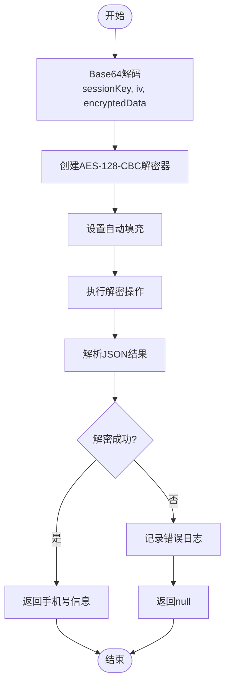
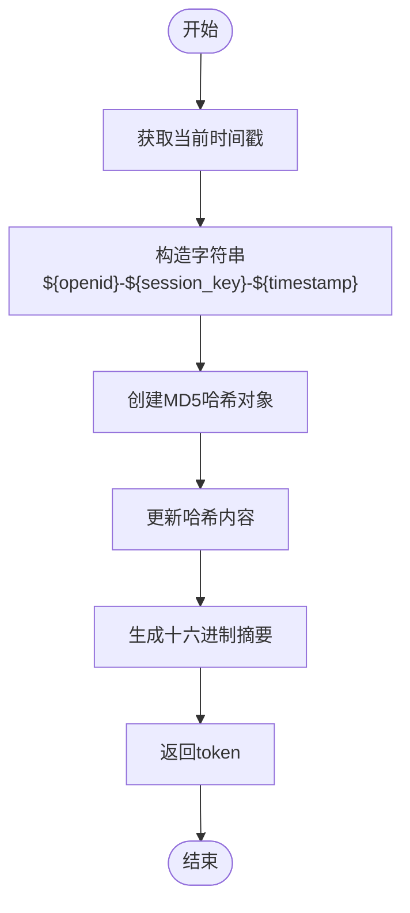
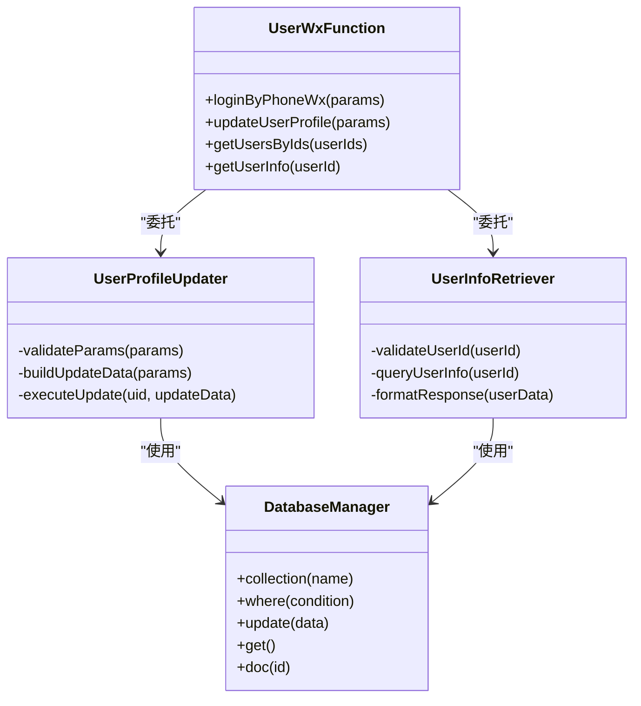
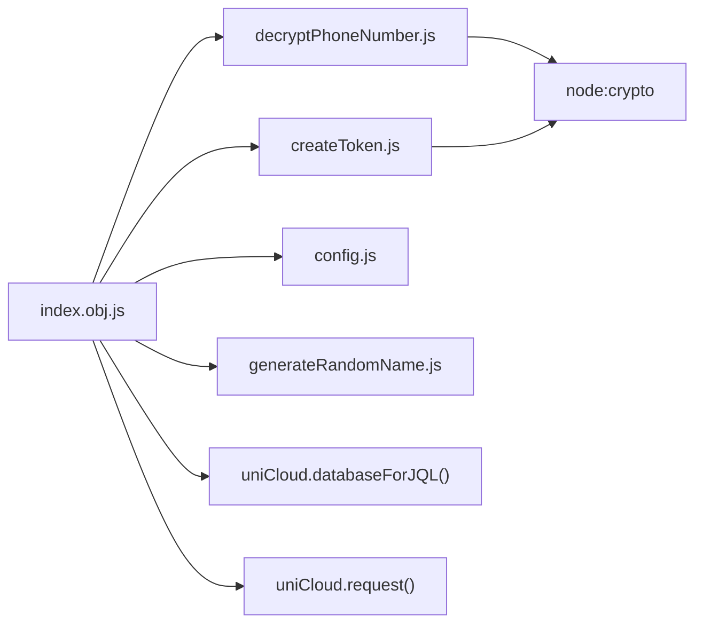

# 用户信息处理云函数

<cite>
**Referenced Files in This Document**
- [user.schema.json](file://uniCloud-aliyun/database/user.schema.json)
- [index.obj.js](file://uniCloud-aliyun/cloudfunctions/userWx/index.obj.js)
- [decryptPhoneNumber.js](file://uniCloud-aliyun/cloudfunctions/userWx/decryptPhoneNumber.js)
- [createToken.js](file://uniCloud-aliyun/cloudfunctions/userWx/createToken.js)
</cite>

## 目录
1. [简介](#简介)
2. [项目结构](#项目结构)
3. [核心组件](#核心组件)
4. [架构概述](#架构概述)
5. [详细组件分析](#详细组件分析)
6. [依赖分析](#依赖分析)
7. [性能考虑](#性能考虑)
8. [故障排除指南](#故障排除指南)
9. [结论](#结论)

## 简介
本文档深入解析`userWx`云函数在用户身份管理中的作用，重点阐述微信登录后获取用户信息、解密手机号、生成访问令牌的完整流程。说明其与`user.schema.json`的字段对应关系，包括用户昵称、头像、角色权限的存储与更新机制。展示如何通过云函数安全地处理敏感数据，并提供前端调用示例。强调安全最佳实践，如会话管理、敏感信息脱敏和异常处理。

## 项目结构
`userWx`云函数位于`uniCloud-aliyun/cloudfunctions/userWx`目录下，包含多个功能模块文件，共同实现用户身份验证和信息管理功能。

**Diagram sources**
- [index.obj.js](file://uniCloud-aliyun/cloudfunctions/userWx/index.obj.js)
- [decryptPhoneNumber.js](file://uniCloud-aliyun/cloudfunctions/userWx/decryptPhoneNumber.js)
- [createToken.js](file://uniCloud-aliyun/cloudfunctions/userWx/createToken.js)

**Section sources**
- [index.obj.js](file://uniCloud-aliyun/cloudfunctions/userWx/index.obj.js)
- [decryptPhoneNumber.js](file://uniCloud-aliyun/cloudfunctions/userWx/decryptPhoneNumber.js)

## 核心组件
`userWx`云函数的核心功能包括微信登录认证、手机号解密、访问令牌生成和用户信息管理。这些功能通过模块化设计分离关注点，确保代码的可维护性和安全性。

**Section sources**
- [index.obj.js](file://uniCloud-aliyun/cloudfunctions/userWx/index.obj.js#L1-L50)
- [user.schema.json](file://uniCloud-aliyun/database/user.schema.json#L1-L20)

## 架构概述
`userWx`云函数采用分层架构设计，将配置管理、业务逻辑、数据处理和安全功能分离。主入口文件`index.obj.js`协调各个模块的工作流，确保从微信授权到用户信息存储的完整流程。

**Diagram sources**
- [index.obj.js](file://uniCloud-aliyun/cloudfunctions/userWx/index.obj.js#L50-L150)
- [decryptPhoneNumber.js](file://uniCloud-aliyun/cloudfunctions/userWx/decryptPhoneNumber.js#L1-L30)
- [createToken.js](file://uniCloud-aliyun/cloudfunctions/userWx/createToken.js#L1-L8)

## 详细组件分析

### 登录流程分析
`loginByPhoneWx`函数实现了完整的微信手机号登录流程，从获取微信会话信息到解密手机号，再到用户记录的创建或更新。

#### 登录流程时序图

**Diagram sources**
- [index.obj.js](file://uniCloud-aliyun/cloudfunctions/userWx/index.obj.js#L50-L150)
- [decryptPhoneNumber.js](file://uniCloud-aliyun/cloudfunctions/userWx/decryptPhoneNumber.js#L1-L30)
- [createToken.js](file://uniCloud-aliyun/cloudfunctions/userWx/createToken.js#L1-L8)

**Section sources**
- [index.obj.js](file://uniCloud-aliyun/cloudfunctions/userWx/index.obj.js#L50-L150)

### 手机号解密组件
`decryptPhoneNumber.js`模块负责解密微信返回的加密手机号数据，使用AES-128-CBC算法进行解密操作。

#### 解密流程流程图

**Diagram sources**
- [decryptPhoneNumber.js](file://uniCloud-aliyun/cloudfunctions/userWx/decryptPhoneNumber.js#L1-L30)

**Section sources**
- [decryptPhoneNumber.js](file://uniCloud-aliyun/cloudfunctions/userWx/decryptPhoneNumber.js#L1-L30)

### 访问令牌生成组件
`createToken.js`模块负责生成用户的访问令牌，使用MD5哈希算法结合用户标识和时间戳创建唯一令牌。

#### 令牌生成流程

**Diagram sources**
- [createToken.js](file://uniCloud-aliyun/cloudfunctions/userWx/createToken.js#L1-L8)

**Section sources**
- [createToken.js](file://uniCloud-aliyun/cloudfunctions/userWx/createToken.js#L1-L8)

### 用户信息管理组件
`userWx`云函数提供了多个接口用于管理用户信息，包括更新用户资料和获取用户信息。

#### 用户信息管理类图

**Diagram sources**
- [index.obj.js](file://uniCloud-aliyun/cloudfunctions/userWx/index.obj.js#L150-L230)

**Section sources**
- [index.obj.js](file://uniCloud-aliyun/cloudfunctions/userWx/index.obj.js#L150-L230)

## 依赖分析
`userWx`云函数依赖于多个内部模块和外部服务，形成了清晰的依赖关系链。

**Diagram sources**
- [index.obj.js](file://uniCloud-aliyun/cloudfunctions/userWx/index.obj.js#L1-L20)
- [decryptPhoneNumber.js](file://uniCloud-aliyun/cloudfunctions/userWx/decryptPhoneNumber.js#L1)
- [createToken.js](file://uniCloud-aliyun/cloudfunctions/userWx/createToken.js#L1)

**Section sources**
- [index.obj.js](file://uniCloud-aliyun/cloudfunctions/userWx/index.obj.js#L1-L30)
- [decryptPhoneNumber.js](file://uniCloud-aliyun/cloudfunctions/userWx/decryptPhoneNumber.js#L1)
- [createToken.js](file://uniCloud-aliyun/cloudfunctions/userWx/createToken.js#L1)

## 性能考虑
`userWx`云函数在设计时考虑了性能优化，通过数据库索引、异步操作和错误处理机制确保高效运行。查询操作使用`.limit(1)`限制结果数量，更新操作采用条件更新避免不必要的数据库写入。

## 故障排除指南
当`userWx`云函数出现问题时，可以参考以下常见问题及解决方案：

**Section sources**
- [index.obj.js](file://uniCloud-aliyun/cloudfunctions/userWx/index.obj.js#L100-L120)
- [decryptPhoneNumber.js](file://uniCloud-aliyun/cloudfunctions/userWx/decryptPhoneNumber.js#L25-L30)

## 结论
`userWx`云函数通过模块化设计实现了安全可靠的用户身份管理功能。它有效地处理了微信登录、手机号解密、令牌生成和用户信息管理等关键任务，同时遵循了安全最佳实践。该函数的架构清晰，易于维护和扩展，为应用程序提供了稳定的用户认证基础。