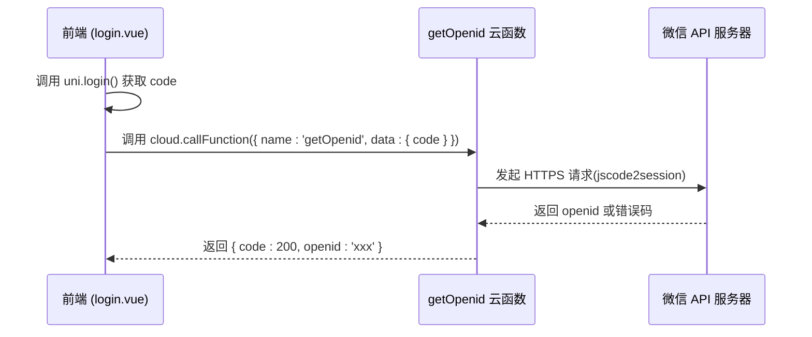

# 用户标识获取服务

<cite>
**本文档引用文件**   
- [getOpenid/index.js](file://uniCloud-aliyun/cloudfunctions/getOpenid/index.js)
- [userWx/index.obj.js](file://uniCloud-aliyun/cloudfunctions/userWx/index.obj.js)
- [userWx/config.js](file://uniCloud-aliyun/cloudfunctions/userWx/config.js)
- [login.vue](file://pages/login/login.vue)
- [user.js](file://store/user.js)
</cite>

## 目录
1. [简介](#简介)
2. [核心功能说明](#核心功能说明)
3. [接口调用流程](#接口调用流程)
4. [前端调用标准模式](#前端调用标准模式)
5. [在用户系统中的位置](#在用户系统中的位置)
6. [常见问题与解决方案](#常见问题与解决方案)
7. [结论](#结论)

## 简介
本项目为基于 uni-app 的微信小程序应用，采用 UniCloud 作为后端云开发平台。`getOpenid` 云函数是整个用户认证体系的核心组件之一，负责通过微信授权码（code）换取用户的唯一 OpenID 标识。该服务为后续的用户登录、身份识别和数据绑定提供了基础支持。

## 核心功能说明

`getOpenid` 云函数的主要作用是：接收从前端传入的微信临时登录凭证 `code`，向微信服务器发起请求以换取用户的 `openid`。`openid` 是微信生态中用于唯一标识一个用户在其某个应用下的身份 ID，具有全局唯一性和稳定性。

该云函数位于 `uniCloud-aliyun/cloudfunctions/getOpenid/` 目录下，其核心逻辑如下：
- 接收客户端传递的 `code`
- 使用预配置的小程序 `appid` 和 `appSecret` 向微信接口 `sns/jscode2session` 发起 HTTP 请求
- 解析微信返回结果，若成功则提取 `openid` 并返回给前端；若失败则返回错误信息

此服务不涉及 UnionID 的获取（当前代码未包含相关逻辑），仅专注于 OpenID 的获取，确保了职责单一性。

**Section sources**
- [getOpenid/index.js](file://uniCloud-aliyun/cloudfunctions/getOpenid/index.js#L1-L36)

## 接口调用流程



**Diagram sources**
- [getOpenid/index.js](file://uniCloud-aliyun/cloudfunctions/getOpenid/index.js#L1-L36)
- [login.vue](file://pages/login/login.vue#L40-L45)

## 前端调用标准模式

虽然在当前项目的实际实现中，并未直接调用 `getOpenid` 云函数，而是将获取 `openid` 的逻辑集成在 `userWx.loginByPhoneWx` 方法中，但其调用模式仍可作为标准参考。

标准调用方式应为：

```javascript
// 示例代码结构（非实际文件内容）
uni.login({
  success: async (res) => {
    const code = res.code;
    const result = await uniCloud.callFunction({
      name: 'getOpenid',
      data: { code }
    });
    
    if (result.result.code === 200) {
      const openid = result.result.openid;
      // 继续后续登录流程
    } else {
      console.error('获取OpenID失败:', result.result.msg);
    }
  }
});
```

然而，在 `login.vue` 中的实际流程是通过调用 `userApi.loginByPhoneWx(params)` 完成了一站式登录，其中包含了获取 session_key 和 openid 的过程。

**Section sources**
- [login.vue](file://pages/login/login.vue#L40-L80)
- [userWx/index.obj.js](file://uniCloud-aliyun/cloudfunctions/userWx/index.obj.js#L15-L45)

## 在用户系统中的位置

`getOpenid` 服务在整个用户认证体系中处于最底层的基础位置。它是连接微信授权体系与本地用户系统的桥梁。

当用户点击“一键登录”时，触发以下完整流程：

1. 小程序端调用 `uni.login()` 获取临时 `code`
2. 将 `code` 连同加密数据一起发送至 `userWx.loginByPhoneWx` 云函数
3. 该函数内部调用微信 `jscode2session` 接口获取 `openid` 和 `session_key`
4. 使用 `session_key` 解密用户手机号
5. 查询数据库是否存在该手机号用户：
   - 若不存在，则创建新用户并绑定 `openid`
   - 若存在，则更新其 `openid` 并返回用户信息
6. 返回包含 `uid`、`token` 等信息的完整用户对象
7. 前端将用户信息存入 Pinia Store 及本地缓存

因此，尽管 `getOpenid` 函数独立存在，但在业务层面已被更高层级的服务所封装和复用。

```mermaid
flowchart TD
A[用户点击登录] --> B[调用 uni.login()]
B --> C[获取微信 code]
C --> D[调用 loginByPhoneWx]
D --> E[请求微信 jscode2session]
E --> F{是否成功?}
F --> |是| G[获取 openid & session_key]
G --> H[解密手机号]
H --> I[查询/创建用户]
I --> J[返回用户信息]
F --> |否| K[返回错误]
```

**Diagram sources**
- [userWx/index.obj.js](file://uniCloud-aliyun/cloudfunctions/userWx/index.obj.js#L15-L45)
- [login.vue](file://pages/login/login.vue#L40-L80)

**Section sources**
- [userWx/index.obj.js](file://uniCloud-aliyun/cloudfunctions/userWx/index.obj.js#L15-L232)
- [login.vue](file://pages/login/login.vue#L40-L80)
- [user.js](file://store/user.js#L1-L90)

## 常见问题与解决方案

### 1. 网络超时
由于 `getOpenid` 需要访问微信远程接口，网络不稳定可能导致请求超时。

**解决方案：**
- 设置合理的超时时间（默认由 uniCloud.httpclient 控制）
- 前端增加重试机制
- 提供友好的错误提示：“网络异常，请稍后重试”

### 2. Code 失效
微信 `code` 仅能使用一次且有效期为 5 分钟，重复使用或过期会导致获取失败。

**解决方案：**
- 每次登录都重新调用 `uni.login()` 获取新 `code`
- 避免在多个异步操作中复用同一个 `code`
- 添加错误捕获逻辑，提示用户重新触发登录

### 3. AppID 或 AppSecret 错误
配置错误会导致微信返回 `invalid appid` 等错误。

**解决方案：**
- 确保 `getOpenid/index.js` 和 `userWx/config.js` 中的 `appid` 和 `appSecret` 正确无误
- 使用环境变量管理敏感信息（推荐做法）

### 4. 云函数执行失败
可能因权限、依赖缺失等原因导致云函数无法正常运行。

**解决方案：**
- 确保云函数已正确部署
- 检查日志输出（console.log）
- 确认 `uniCloud.httpclient` 权限已开启

**Section sources**
- [getOpenid/index.js](file://uniCloud-aliyun/cloudfunctions/getOpenid/index.js#L1-L36)
- [userWx/index.obj.js](file://uniCloud-aliyun/cloudfunctions/userWx/index.obj.js#L15-L45)

## 结论

`getOpenid` 云函数作为用户认证链路的第一环，承担着从微信生态获取用户唯一标识的关键任务。虽然在当前项目中其功能被更高阶的登录接口所整合，但它依然是整个用户体系不可或缺的基础服务。理解其工作原理有助于排查登录类问题，并为未来扩展多端登录、UnionID 统一等需求打下坚实基础。