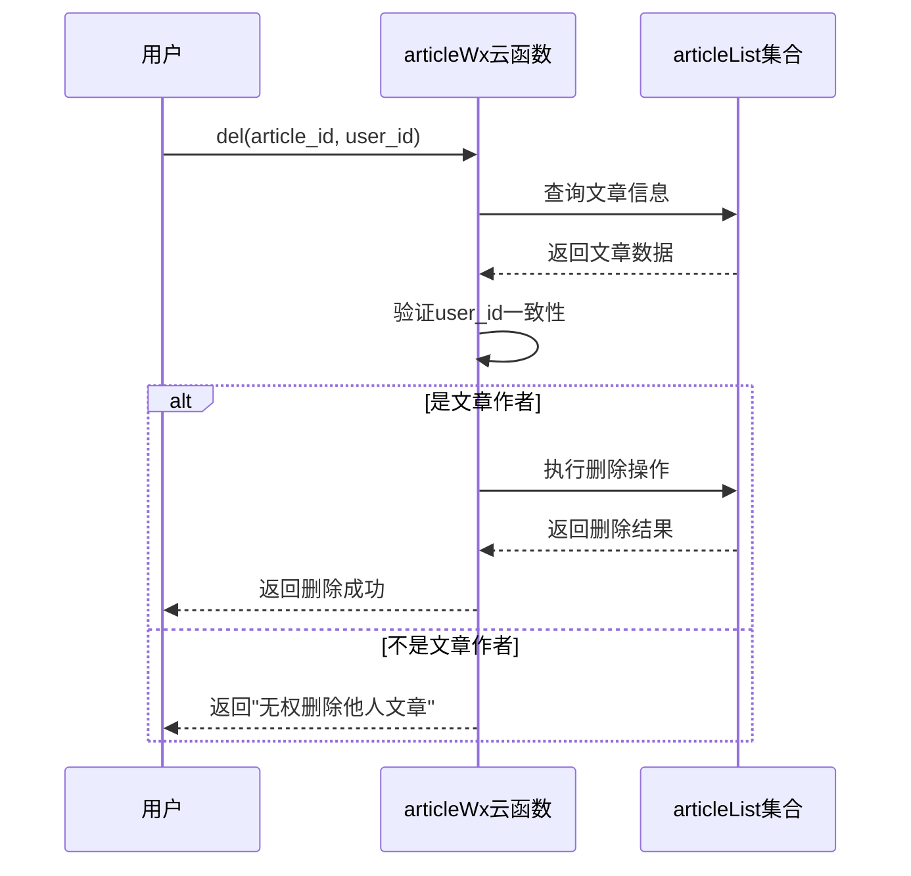
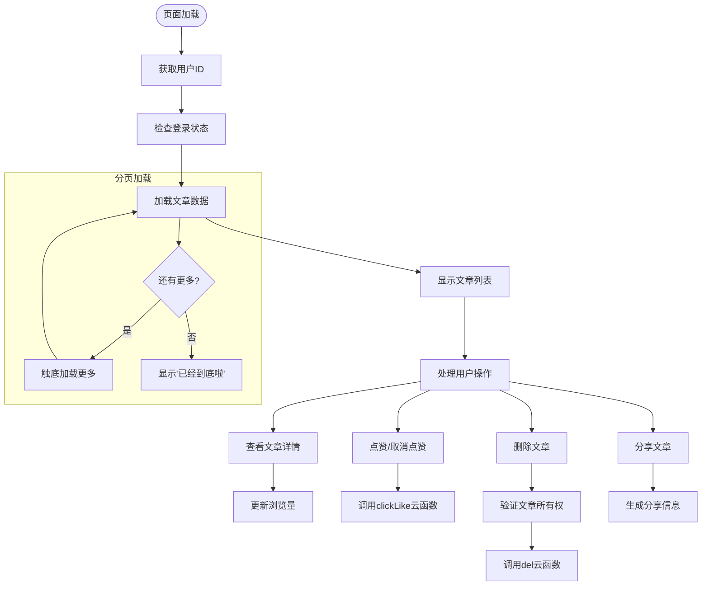

# 文章列表Schema设计

<cite>
**本文档引用的文件**
- [articleList.schema.json](file://uniCloud-aliyun/database/articleList.schema.json)
- [user.schema.json](file://uniCloud-aliyun/database/user.schema.json)
- [index.obj.js](file://uniCloud-aliyun/cloudfunctions/articleWx/index.obj.js)
- [userArticleList.vue](file://pages/userArticleList/userArticleList.vue)
</cite>

## 目录
1. [简介](#简介)
2. [核心字段结构分析](#核心字段结构分析)
3. [索引配置策略](#索引配置策略)
4. [权限控制规则](#权限控制规则)
5. [数据关联与引用](#数据关联与引用)
6. [实际文档样例](#实际文档样例)
7. [业务逻辑实现](#业务逻辑实现)

## 简介
本文档深入解析`articleList.schema.json`中的文章数据模型设计，详细说明其字段结构、索引策略、权限规则以及与其他集合的数据关联方式。该数据模型用于存储用户发布的文章内容，支持图文视频混合内容展示，并实现了完整的审核机制和访问控制。

## 核心字段结构分析
文章数据模型包含多个核心字段，每个字段都有明确的类型定义和业务含义：

### 基础标识字段
- **_id**: BSON对象ID，系统自动生成的唯一标识符
- **user_id**: 字符串类型，发布者用户ID，作为外键关联到用户集合

### 内容相关字段
- **content**: 字符串类型，文章正文内容，最大长度限制为500字符，自动去除首尾空格
- **images**: 数组类型，图片列表，最多包含9张图片，每张图片包含原图URL、压缩图URL和缩略图URL三个属性
- **videoURL**: 字符串类型，视频地址链接

### 用户信息字段
- **user_nickName**: 字符串类型，发布者昵称
- **user_avatarUrl**: 字符串类型，发布者头像URL
- **user_mobile**: 字符串类型，发布者联系电话

### 统计与状态字段
- **like_count**: 整数类型，点赞数，初始值为0
- **look_count**: 整数类型，阅读量，最小值为0，默认值为0
- **comment_count**: 整数类型，评论数量，最小值为0，默认值为0
- **state**: 整数类型，文章状态：0-待审核、1-已通过、2-已拒绝，默认值为1（已通过）
- **reject_reason**: 字符串类型，当文章被拒绝时的拒绝原因说明

### 时间戳字段
- **create_time**: 时间戳类型，创建时间，默认值为当前时间
- **update_time**: 时间戳类型，更新时间，默认值为当前时间

### 位置与分类字段
- **address**: 字符串类型，发布地址，自动去除首尾空格
- **district**: 字符串类型，区县信息
- **cate_id**: 字符串类型，分类ID，作为外键关联到分类集合

### 评论点赞记录
- **comment_likes**: 数组类型，存储评论点赞记录的对象数组，每个对象包含：
  - comment_id: 被点赞的评论ID
  - user_id: 点赞用户ID
  - user_mobile: 点赞用户手机号
  - create_time: 点赞时间，默认为当前时间

**Section sources**
- [articleList.schema.json](file://uniCloud-aliyun/database/articleList.schema.json#L1-L158)

## 索引配置策略
虽然在`articleList.schema.json`中未直接定义索引，但从业务需求和查询模式可以推断出合理的索引配置策略：

### 单字段索引
- **user_id**: 为支持按用户查询个人文章列表而建立的索引
- **create_time**: 为支持按时间排序的文章流而建立的索引
- **cate_id**: 为支持按分类筛选文章而建立的索引
- **state**: 为支持管理员审核功能而建立的索引

### 组合索引
- **(user_id, create_time)**: 这是最关键的组合索引，用于优化"个人文章按时间排序查询"的性能。当用户查看自己的文章列表或他人文章列表时，需要同时根据用户ID过滤并按创建时间倒序排列。
- **(cate_id, state, create_time)**: 用于优化分类文章列表的查询性能，先按分类筛选，再按审核状态过滤，最后按时间排序。

这些索引确保了常见查询场景下的高效执行，特别是在处理大量文章数据时能够保持良好的响应速度。

**Section sources**
- [articleList.schema.json](file://uniCloud-aliyun/database/articleList.schema.json#L1-L158)
- [index.obj.js](file://uniCloud-aliyun/cloudfunctions/articleWx/index.obj.js#L1-L912)

## 权限控制规则
文章数据模型通过精细的权限控制规则来保障数据安全和业务合规性：

### 读取权限
- **read: true**: 所有用户都可以读取文章数据，这符合社交平台的内容公开浏览需求

### 创建权限
- **create: "auth.uid != null"**: 只有已登录的认证用户才能创建文章，防止匿名发布

### 更新权限
- **update: "auth.uid != null"**: 只有已登录的认证用户才能更新文章，但具体能否更新某篇文章还需在业务逻辑层进一步验证

### 删除权限
- **delete: "auth.uid != null"**: 只有已登录的认证用户才能删除文章，同样需要在业务逻辑层进行作者身份验证

### 业务层权限控制
在云函数`index.obj.js`中实现了更细粒度的权限控制：



**Diagram sources**
- [articleList.schema.json](file://uniCloud-aliyun/database/articleList.schema.json#L1-L158)
- [index.obj.js](file://uniCloud-aliyun/cloudfunctions/articleWx/index.obj.js#L1-L912)

**Section sources**
- [articleList.schema.json](file://uniCloud-aliyun/database/articleList.schema.json#L1-L158)
- [index.obj.js](file://uniCloud-aliyun/cloudfunctions/articleWx/index.obj.js#L1-L912)

## 数据关联与引用
文章数据模型通过多种方式与其他数据集合建立关联关系：

### 外键关联
- **user_id**: 通过`foreignKey: "user._id"`关联到用户集合，确保文章发布者的有效性
- **cate_id**: 通过`foreignKey: "cateList._id"`关联到分类集合，确保文章分类的有效性
- **comment_likes.user_id**: 通过`foreignKey: "user._id"`关联到用户集合，确保点赞用户的有效性
- **comment_likes.user_mobile**: 通过`foreignKey: "user.mobile"`关联到用户集合，确保点赞用户手机号的有效性

### 嵌套数据结构
文章数据模型采用了嵌套的数据结构来存储复杂的关联信息：

```mermaid
erDiagram
ARTICLE ||--o{ COMMENT_LIKES : "包含"
USER ||--o{ COMMENT_LIKES : "点赞"
class ARTICLE {
+string _id
+string user_id
+string content
+array images
+string videoURL
+int like_count
+int look_count
+int comment_count
+timestamp create_time
+int state
}
class COMMENT_LIKES {
+string comment_id
+string user_id
+string user_mobile
+timestamp create_time
}
class USER {
+string _id
+string nickName
+string mobile
+string avatarUrl
}
```

**Diagram sources**
- [articleList.schema.json](file://uniCloud-aliyun/database/articleList.schema.json#L1-L158)
- [user.schema.json](file://uniCloud-aliyun/database/user.schema.json#L1-L107)

**Section sources**
- [articleList.schema.json](file://uniCloud-aliyun/database/articleList.schema.json#L1-L158)
- [user.schema.json](file://uniCloud-aliyun/database/user.schema.json#L1-L107)

## 实际文档样例
以下是一个符合`articleList.schema.json`规范的实际文档样例：

```json
{
  "_id": "64a1b2c3d4e5f6g7h8i9j0k1",
  "user_id": "u123456789",
  "user_nickName": "张三",
  "user_avatarUrl": "https://example.com/avatar/zhangsan.jpg",
  "user_mobile": "13800138000",
  "content": "今天天气真好，分享一张美丽的风景照。",
  "images": [
    {
      "url": "https://example.com/images/landscape.jpg",
      "compressedURL": "https://example.com/images/landscape_compressed.jpg",
      "thumbnailURL": "https://example.com/images/landscape_thumb.jpg"
    }
  ],
  "videoURL": "",
  "address": "北京市朝阳区",
  "district": "朝阳区",
  "cate_id": "travel",
  "like_count": 15,
  "look_count": 120,
  "comment_count": 3,
  "comment_likes": [
    {
      "comment_id": "c1",
      "user_id": "u987654321",
      "user_mobile": "13900139000",
      "create_time": 1688123456789
    }
  ],
  "create_time": 1688123456789,
  "state": 1,
  "update_time": 1688123456789
}
```

这个样例展示了完整的文章数据结构，包含了所有必要的字段及其典型值。

**Section sources**
- [articleList.schema.json](file://uniCloud-aliyun/database/articleList.schema.json#L1-L158)

## 业务逻辑实现
文章数据模型的业务逻辑主要通过云函数和前端页面协同实现：

### 云函数实现
`articleWx/index.obj.js`云函数提供了完整的CRUD操作接口：

- **addArticle**: 新增文章，设置默认状态为"已通过"(state=1)
- **getArticleList**: 获取用户文章列表，按创建时间倒序排列
- **del**: 删除文章，验证用户权限
- **updateState**: 管理员更新文章状态
- **clickLike**: 处理文章点赞/取消点赞
- **updateLookCount**: 更新文章浏览量

### 前端页面实现
`userArticleList.vue`页面实现了用户文章列表的展示和交互：



**Diagram sources**
- [index.obj.js](file://uniCloud-aliyun/cloudfunctions/articleWx/index.obj.js#L1-L912)
- [userArticleList.vue](file://pages/userArticleList/userArticleList.vue#L1-L2352)

**Section sources**
- [index.obj.js](file://uniCloud-aliyun/cloudfunctions/articleWx/index.obj.js#L1-L912)
- [userArticleList.vue](file://pages/userArticleList/userArticleList.vue#L1-L2352)