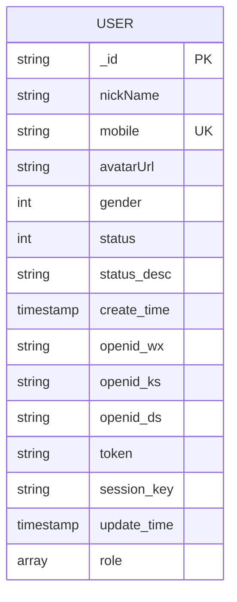
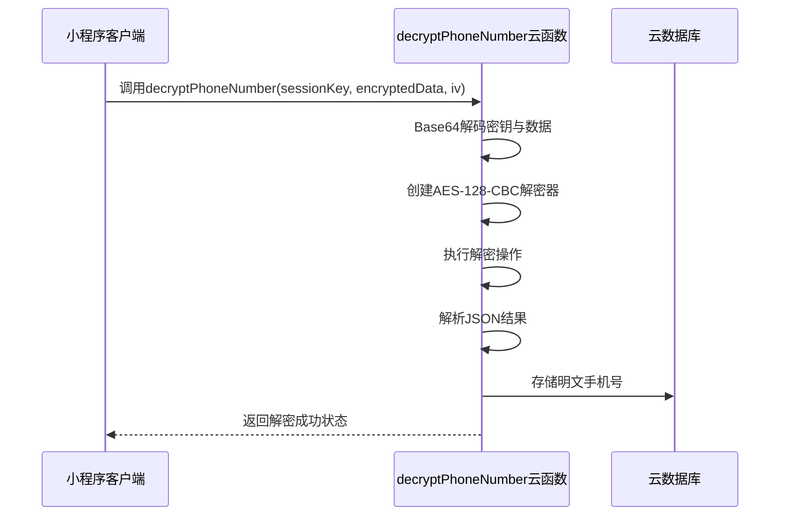
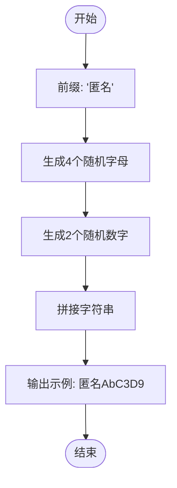
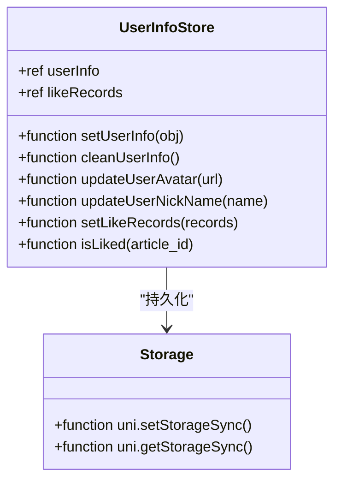

# 用户信息Schema设计

<cite>
**Referenced Files in This Document **  
- [user.schema.json](file://uniCloud-aliyun/database/user.schema.json)
- [user.js](file://store/user.js)
- [decryptPhoneNumber.js](file://uniCloud-aliyun/cloudfunctions/userWx/decryptPhoneNumber.js)
- [generateRandomName.js](file://uniCloud-aliyun/cloudfunctions/userWx/generateRandomName.js)
</cite>

## 目录
1. [用户数据模型概览](#用户数据模型概览)  
2. [核心字段解析](#核心字段解析)  
3. [手机号加密与解密机制](#手机号加密与解密机制)  
4. [角色权限控制实现](#角色权限控制实现)  
5. [默认头像与昵称生成逻辑](#默认头像与昵称生成逻辑)  
6. [前端状态同步机制](#前端状态同步机制)  

## 用户数据模型概览

本系统采用JSON Schema规范定义用户数据结构，存储于`uniCloud-aliyun/database/user.schema.json`文件中。该Schema遵循BSON类型标准，为云数据库提供完整的数据校验、默认值设置和访问权限控制。



**Diagram sources**  
- [user.schema.json](file://uniCloud-aliyun/database/user.schema.json)

**Section sources**  
- [user.schema.json](file://uniCloud-aliyun/database/user.schema.json)

## 核心字段解析

### 字段列表与约束条件

| 字段名 | 数据类型 | 约束条件 | 描述 |
|--------|--------|---------|------|
| `_id` | string | 主键 | 文档唯一标识，由系统自动生成 |
| `nickName` | string | trim: both | 用户昵称，前后空白自动去除 |
| `mobile` | string | required, pattern: ^1[3-9]\d{9}$ | 手机号（加密存储），中国大陆手机号格式校验 |
| `avatarUrl` | string | - | 头像图片URL地址 |
| `gender` | int | minimum: 0, maximum: 2, defaultValue: 0 | 性别：0-未知，1-男，2-女 |
| `status` | int | minimum: 0, maximum: 2, defaultValue: 0 | 账户状态：0-正常，1-禁用，2-封禁 |
| `status_desc` | string | defaultValue: "正常" | 状态说明（如封禁原因） |
| `create_time` | timestamp | defaultValue: $env.now | 创建时间，自动填充当前时间 |
| `openid_wx` | string | - | 微信平台OpenID |
| `openid_ks` | string | - | 快手平台OpenID |
| `openid_ds` | string | - | 抖音平台OpenID |
| `token` | string | - | 用户登录凭证Token |
| `session_key` | string | - | 会话密钥（用于解密敏感数据） |
| `update_time` | timestamp | defaultValue: $env.now | 最后更新时间 |
| `role` | array[string] | items.enum: ["user","vip","admin"], defaultValue: ["user"] | 用户角色数组 |

**Section sources**  
- [user.schema.json](file://uniCloud-aliyun/database/user.schema.json)

### 唯一索引设计

在`openid_wx`、`openid_ks`、`openid_ds`等第三方平台OpenID字段上建立唯一索引是确保账户体系一致性的关键设计。这种设计避免了同一用户重复注册的问题，支持多端登录时的无缝身份识别。

尽管Schema文件本身不直接定义索引，但这些字段作为用户身份的核心标识，在数据库层面必须配置唯一性约束以防止数据冗余和冲突。

## 手机号加密与解密机制

### 加密存储策略

手机号作为敏感个人信息，在数据库中以加密形式存储。前端通过微信授权获取加密的手机号数据包（包含`encryptedData`、`iv`向量），连同用户的`session_key`一并提交至云函数进行解密处理。

### 解密流程分析



**Diagram sources**  
- [decryptPhoneNumber.js](file://uniCloud-aliyun/cloudfunctions/userWx/decryptPhoneNumber.js)

**Section sources**  
- [decryptPhoneNumber.js](file://uniCloud-aliyun/cloudfunctions/userWx/decryptPhoneNumber.js)

#### 安全实现细节

- 使用AES-128-CBC对称加密算法，保证解密效率与安全性平衡
- `session_key`作为密钥，仅在用户会话期间有效，降低泄露风险
- 自动填充模式（PKCS#7）确保任意长度数据均可正确解密
- 异常捕获机制记录解密失败日志，便于问题排查而不暴露敏感信息

## 角色权限控制实现

### 枚举值设计

`role`字段采用字符串数组形式存储用户角色，其元素被限制在预定义枚举值内：

```json
"enum": ["user", "vip", "admin"]
```

这种设计支持多角色复合授权（例如同时拥有`vip`和`admin`权限），相比单值角色字段更具灵活性。

### 权限分级应用

- **普通用户(user)**：基础功能访问权限
- **VIP用户(vip)**：享受付费内容或高级服务
- **管理员(admin)**：后台管理界面访问及数据操作权限

后端业务逻辑可通过检查`role`数组是否包含特定角色来实施细粒度访问控制，例如：

```javascript
// 示例伪代码
if (user.role.includes('admin')) {
  // 允许执行管理操作
}
```

**Section sources**  
- [user.schema.json](file://uniCloud-aliyun/database/user.schema.json)

## 默认头像与昵称生成逻辑

### 昵称生成策略

当用户首次注册且未提供昵称时，系统调用`generateRandomName.js`云函数生成默认昵称。其命名规则如下：



**Diagram sources**  
- [generateRandomName.js](file://uniCloud-aliyun/cloudfunctions/userWx/generateRandomName.js)

**Section sources**  
- [generateRandomName.js](file://uniCloud-aliyun/cloudfunctions/userWx/generateRandomName.js)

该函数通过组合固定前缀、大小写字母和数字，确保生成的昵称具有足够随机性和可读性，避免与其他用户重名。

### 头像默认配置

前端默认头像路径在`store/user.js`中静态定义：

```javascript
avatarUrl: "/static/images/defalut.png"
```

此配置确保所有新用户在未上传自定义头像前均显示统一的品牌形象，提升用户体验一致性。

## 前端状态同步机制

### Pinia状态管理

系统使用Pinia框架管理用户状态，核心逻辑位于`store/user.js`文件中。`useUserInfoStore`定义了一个响应式用户信息仓库。



**Diagram sources**  
- [user.js](file://store/user.js)

**Section sources**  
- [user.js](file://store/user.js)

### 数据持久化策略

通过配置`persist`选项，将用户状态自动同步至`uni.setStorageSync`本地存储：

```javascript
persist: {
  storage: {
    getItem(key) { return uni.getStorageSync(key) },
    setItem(key, value) { uni.setStorageSync(key, value) }
  }
}
```

这一机制确保用户刷新页面或重新进入小程序时能恢复登录状态和个性化设置，无需重复认证。

### 状态更新流程

当用户完成登录或修改个人资料后，调用`setUserInfo()`方法更新状态：
1. 合并传入的对象数据到`userInfo.value`
2. 根据`uid`存在性自动更新`isLogin`标志
3. 触发`uni.setStorageSync('userInfo', ...)`保存至本地
4. Vue响应系统自动通知所有订阅组件刷新UI