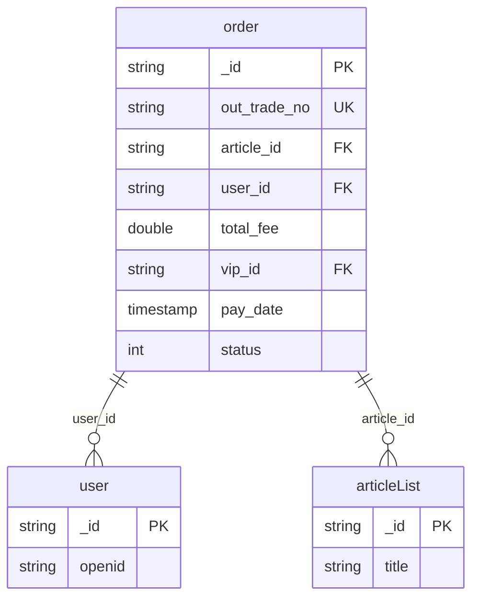
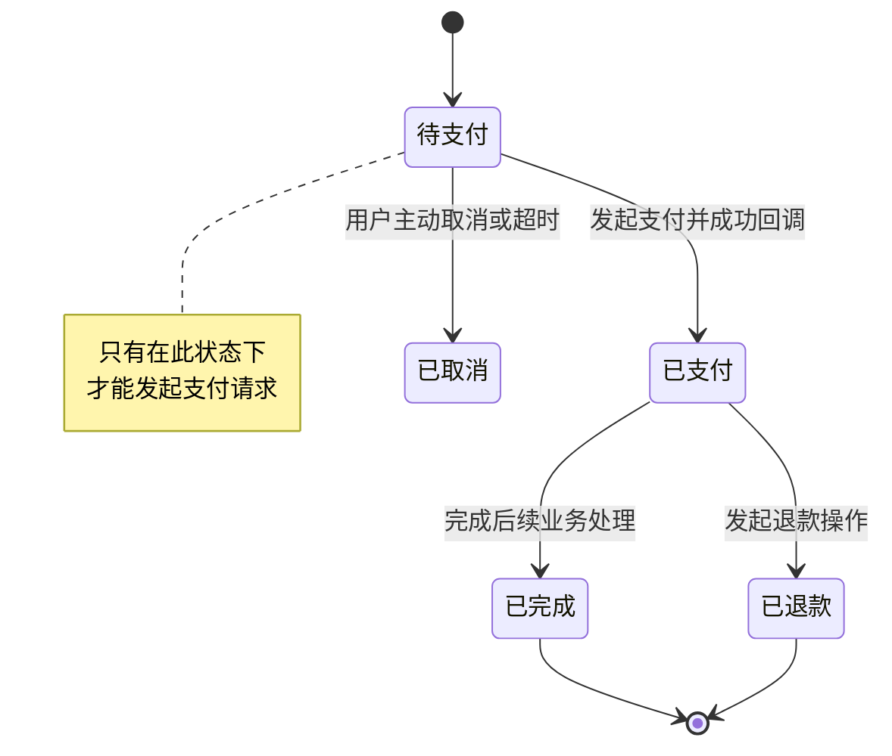
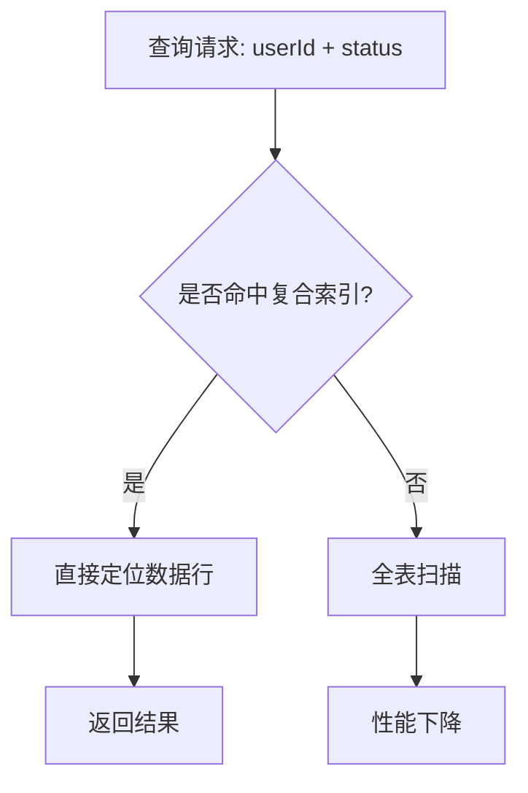
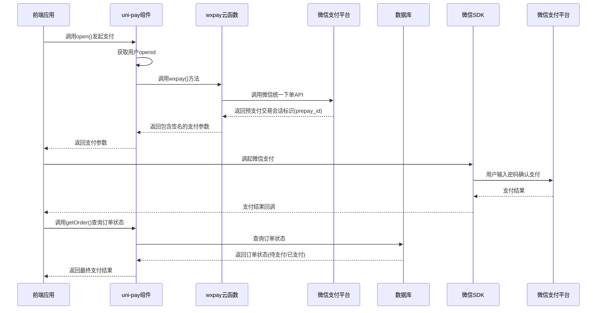

# 订单数据Schema设计

<cite>
**本文档引用的文件**   
- [order.schema.json](file://uniCloud-aliyun/database/order.schema.json)
- [wxpay/index.obj.js](file://uniCloud-aliyun/cloudfunctions/wxpay/index.obj.js)
- [uni-pay.vue](file://uni_modules/uni-pay/components/uni-pay/uni-pay.vue)
- [uni-pay-orders.index.json](file://uni_modules/uni-pay/uniCloud/database/uni-pay-orders.index.json)
- [config.js](file://uni_modules/uni-config-center/uniCloud/cloudfunctions/common/uni-config-center/uni-pay/config.js)
</cite>

## 目录
1. [订单数据模型技术规范](#订单数据模型技术规范)
2. [核心字段定义与业务逻辑](#核心字段定义与业务逻辑)
3. [订单状态机设计](#订单状态机设计)
4. [性能优化策略](#性能优化策略)
5. [支付流程数据流转](#支付流程数据流转)

## 订单数据模型技术规范

订单数据模型是整个支付系统的核心，其设计直接影响到系统的稳定性、可扩展性和业务逻辑的正确性。该模型通过 `order.schema.json` 文件进行定义，并结合 `uni-pay` 模块和云函数实现完整的支付闭环。

**图源**
- [order.schema.json](file://uniCloud-aliyun/database/order.schema.json)

**节源**
- [order.schema.json](file://uniCloud-aliyun/database/order.schema.json)

## 核心字段定义与业务逻辑

订单数据模型中的每个字段都承载着特定的业务含义和技术约束。

| 字段名 | 类型 | 描述 | 业务作用 |
| :--- | :--- | :--- | :--- |
| `_id` | string | MongoDB文档ID，系统自动生成 | 唯一标识一个订单记录 |
| `out_trade_no` | string | 商户订单号 | 对接微信支付等第三方支付平台的关键凭证，必须全局唯一 |
| `article_id` | string | 关联的文章ID | 记录当前发布人文章的ID，用于内容关联 |
| `user_id` | string | 支付用户的ID | 标识发起支付操作的用户，建立用户与订单的关系 |
| `total_fee` | double | 充值金额（单位：分） | 存储交易的实际金额，用于计算和对账 |
| `vip_id` | string | 渠道ID | 标识VIP套餐或渠道信息，可能指向用户表或其他配置表 |
| `pay_date` | timestamp | 支付时间 | 记录订单完成支付的时间戳，默认值为创建时的当前时间 |
| `status` | int | 支付状态 | 状态码表示订单生命周期，0=待支付, 1=已支付, 2=已取消, 3=已完成 |

**节源**
- [order.schema.json](file://uniCloud-aliyun/database/order.schema.json)

## 订单状态机设计

订单的状态机设计确保了订单生命周期的完整性和一致性，防止非法状态转换。

**图源**
- [order.schema.json](file://uniCloud-aliyun/database/order.schema.json)

**节源**
- [order.schema.json](file://uniCloud-aliyun/database/order.schema.json)

## 性能优化策略

为了支持高频查询操作，如“查询某用户所有未完成订单”，系统在数据库层面进行了针对性的索引优化。

根据 `uni-pay-orders.index.json` 的配置，系统在 `user_id` 和 `status` 字段上建立了独立索引，虽然不是严格意义上的复合索引，但足以高效支持基于这两个字段的联合查询。这种设计显著提升了查询效率，避免了全表扫描带来的性能瓶颈。

**图源**
- [uni-pay-orders.index.json](file://uni_modules/uni-pay/uniCloud/database/uni-pay-orders.index.json)

**节源**
- [uni-pay-orders.index.json](file://uni_modules/uni-pay/uniCloud/database/uni-pay-orders.index.json)

## 支付流程数据流转

结合 `wxpay` 云函数与 `uni-pay` 模块，订单从创建到支付成功的全流程数据流转如下：

此流程中，`uni-pay` 组件负责前端交互和调用云函数，`wxpay` 云函数封装了与微信支付平台的通信细节，而 `order.schema.json` 定义的数据结构则作为整个流程中状态持久化的基础。

**图源**
- [wxpay/index.obj.js](file://uniCloud-aliyun/cloudfunctions/wxpay/index.obj.js)
- [uni-pay.vue](file://uni_modules/uni-pay/components/uni-pay/uni-pay.vue)
- [order.schema.json](file://uniCloud-aliyun/database/order.schema.json)

**节源**
- [wxpay/index.obj.js](file://uniCloud-aliyun/cloudfunctions/wxpay/index.obj.js)
- [uni-pay.vue](file://uni_modules/uni-pay/components/uni-pay/uni-pay.vue)
- [config.js](file://uni_modules/uni-config-center/uniCloud/cloudfunctions/common/uni-config-center/uni-pay/config.js)