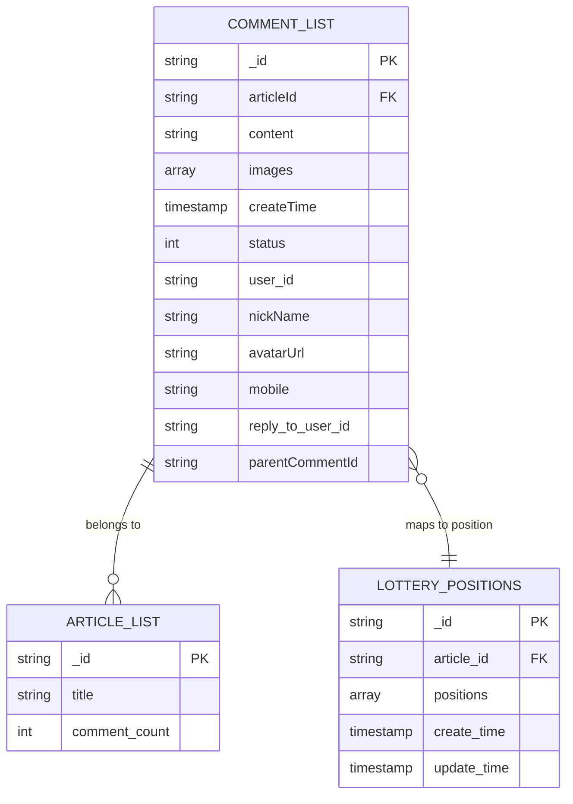
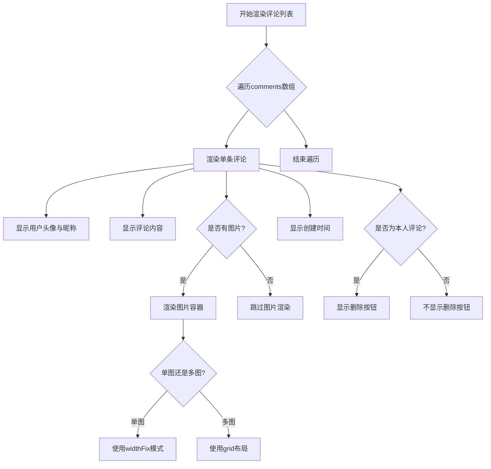

# 评论列表Schema设计

<cite>
**本文档引用文件**  
- [commentList.schema.json](file://uniCloud-aliyun/database/commentList.schema.json)
- [comment-list.vue](file://components/comment-list/comment-list.vue)
- [lottery_grid_positions.schema.json](file://uniCloud-aliyun/database/lottery_grid_positions.schema.json)
- [articleList.schema.json](file://uniCloud-aliyun/database/articleList.schema.json)
</cite>

## 目录
1. [引言](#引言)
2. [核心数据结构设计](#核心数据结构设计)
3. [字段语义与类型定义](#字段语义与类型定义)
4. [数据库索引优化策略](#数据库索引优化策略)
5. [权限控制机制](#权限控制机制)
6. [前端组件实现与渲染逻辑](#前端组件实现与渲染逻辑)
7. [多层级评论支持扩展建议](#多层级评论支持扩展建议)
8. [结论](#结论)

## 引言
本项目中的评论系统采用基于UniCloud的JSON Schema设计，通过`commentList.schema.json`定义了评论数据的核心结构。该设计不仅明确了各字段的语义和约束条件，还结合前端组件`comment-list.vue`实现了高效的评论展示与交互功能。当前系统已支持基础评论功能，并在抽奖类文章中通过`lottery_grid_positions.schema.json`扩展了九宫格位置映射能力。

## 核心数据结构设计

评论数据结构遵循简洁性与可扩展性原则，以最小化存储开销并最大化查询效率为目标进行设计。整体结构为MongoDB风格的对象文档模型，包含必填字段、可选字段及权限配置。



**图表来源**
- [commentList.schema.json](file://uniCloud-aliyun/database/commentList.schema.json#L1-L37)
- [articleList.schema.json](file://uniCloud-aliyun/database/articleList.schema.json#L87-L124)
- [lottery_grid_positions.schema.json](file://uniCloud-aliyun/database/lottery_grid_positions.schema.json#L1-L61)

**本节来源**
- [commentList.schema.json](file://uniCloud-aliyun/database/commentList.schema.json#L1-L37)

## 字段语义与类型定义

评论Schema中各字段具有明确的业务语义和技术约束，确保数据一致性与安全性。

| 字段名 | 类型 | 是否必填 | 约束条件 | 说明 |
|--------|------|----------|---------|------|
| `_id` | string | 是（自动生成） | - | 评论唯一标识符，由系统自动生成 |
| `articleId` | string | 是 | - | 关联的文章ID，用于建立评论与文章的关系 |
| `content` | string | 是 | minLength: 1, maxLength: 500 | 评论内容，限制长度防止恶意输入 |
| `images` | array[string] | 否 | items.type: string | 评论附带的图片URL数组，支持多图上传 |
| `createTime` | timestamp | 否 | - | 评论创建时间，用于排序和展示 |
| `status` | int | 否 | 建议值：1=正常 | 评论状态标记，可用于审核或屏蔽机制 |
| `user_id` | string | 否 | - | 发布评论的用户ID（实际存在于运行时数据中） |
| `nickName` | string | 否 | - | 用户昵称（运行时填充） |
| `avatarUrl` | string | 否 | - | 用户头像URL（运行时填充） |
| `mobile` | string | 否 | - | 用户手机号（特定场景下显示） |
| `reply_to_user_id` | string | 否 | - | 回复目标用户的ID（用于@功能） |
| `parentCommentId` | string | 否 | - | 父级评论ID，用于构建嵌套回复结构 |

> **注意**：尽管当前Schema未显式声明`user_id`等字段，但在实际运行时数据中存在这些字段，表明其为动态添加的运行时属性。

**本节来源**
- [commentList.schema.json](file://uniCloud-aliyun/database/commentList.schema.json#L1-L37)
- [comment-list.vue](file://components/comment-list/comment-list.vue#L10-L25)

## 数据库索引优化策略

为提升评论系统的性能表现，应在关键字段上建立适当的数据库索引。

### 文章关联索引
在`articleId`字段上建立单字段升序索引，显著加速按文章ID查询评论的操作，适用于文章详情页加载所有相关评论的场景。

```json
{
  "IndexName": "articleId_index",
  "MgoKeySchema": {
    "MgoIndexKeys": [
      { "Name": "articleId", "Direction": "1" }
    ],
    "MgoIsUnique": false
  }
}
```

此索引确保当用户访问某篇文章时，能够快速检索出该文章下的全部评论记录，避免全表扫描带来的性能瓶颈。

### 时间排序索引
在`createTime`字段上建立降序索引，支持“最新评论优先”展示需求：

```json
{
  "IndexName": "createTime_desc",
  "MgoKeySchema": {
    "MgoIndexKeys": [
      { "Name": "createTime", "Direction": -1 }
    ]
  }
}
```

该索引使得分页查询最新评论成为高效操作，尤其适合首页动态流或热门文章评论区。

**图表来源**
- [uni-pay-orders.index.json](file://uni_modules/uni-pay/uniCloud/database/uni-pay-orders.index.json#L1-L97)

**本节来源**
- [commentList.schema.json](file://uniCloud-aliyun/database/commentList.schema.json#L25-L30)
- [uni-pay-orders.index.json](file://uni_modules/uni-pay/uniCloud/database/uni-pay-orders.index.json#L1-L97)

## 权限控制机制

评论系统的权限规则通过Schema的`permission`字段定义，结合前端逻辑实现细粒度访问控制。

```json
"permission": {
  "read": true,
  "create": true,
  "update": true,
  "delete": true
}
```

上述配置表示数据库层面允许所有操作，但实际权限控制由应用层逻辑实现：

- **删除权限**：仅允许用户删除自己的评论
- **管理权限**：管理员可清理不当言论（需额外角色判断）

前端通过`isOwnComment()`方法判断当前用户是否为评论发布者：

```javascript
const isOwnComment = (comment) => {
  return comment.user_id === userInfoStore.userInfo.uid
}
```

若为本人评论，则显示删除按钮；否则隐藏。同时，文章作者可通过`isPostAuthor()`判断获得特殊权限（如查看联系方式），体现了基于角色的访问控制思想。

**本节来源**
- [commentList.schema.json](file://uniCloud-aliyun/database/commentList.schema.json#L4-L8)
- [comment-list.vue](file://components/comment-list/comment-list.vue#L27-L31)

## 前端组件实现与渲染逻辑

`comment-list.vue`组件负责将后端返回的评论数据渲染为可视化的评论列表，并处理用户交互行为。

### 组件属性与事件
| 属性名 | 类型 | 默认值 | 说明 |
|-------|------|--------|------|
| comments | Array | [] | 评论数据数组 |
| articleId | String | '' | 当前文章ID |
| articleUserId | String | '' | 文章作者用户ID |
| showMobile | Boolean | false | 是否显示手机号 |

| 事件名 | 参数 | 触发时机 |
|--------|------|-----------|
| reply | comment对象 | 点击他人评论时触发回复 |
| delComment | commentId | 用户点击删除按钮时触发 |

### 渲染流程
1. 遍历`comments`数组，逐条渲染评论项
2. 显示用户头像、昵称、评论内容及创建时间
3. 支持单张/多张图片预览（点击放大）
4. 对于自己的评论，显示删除按钮
5. 若为文章作者且开启`showMobile`，则显示可拨打电话的手机号标签

### 图片处理逻辑
- 单图使用`.comment-image-wrapper`
- 多图使用`.comment-images-grid`网格布局
- 点击图片调用`uni.previewImage`实现预览



**图表来源**
- [comment-list.vue](file://components/comment-list/comment-list.vue#L50-L450)

**本节来源**
- [comment-list.vue](file://components/comment-list/comment-list.vue#L1-L450)

## 多层级评论支持扩展建议

当前Schema虽未直接支持嵌套回复，但可通过以下方式扩展实现多层级评论树：

### 方案一：添加父级引用字段
在`commentList.schema.json`中新增`parentCommentId`字段：

```json
"parentCommentId": {
  "bsonType": "string",
  "description": "父级评论ID，为空表示一级评论"
}
```

并通过复合索引优化查询：
```json
{
  "IndexName": "article_parent_idx",
  "MgoKeySchema": {
    "MgoIndexKeys": [
      { "Name": "articleId", "Direction": "1" },
      { "Name": "parentCommentId", "Direction": "1" }
    ]
  }
}
```

### 方案二：前端递归渲染
利用现有数据结构，在前端构建评论树：

```javascript
function buildCommentTree(comments) {
  const map = new Map();
  const roots = [];

  // 构建映射表
  comments.forEach(comment => {
    comment.children = [];
    map.set(comment._id, comment);
  });

  // 建立父子关系
  comments.forEach(comment => {
    if (comment.parentCommentId && map.has(comment.parentCommentId)) {
      map.get(comment.parentCommentId).children.push(comment);
    } else {
      roots.push(comment);
    }
  });

  return roots;
}
```

### 渲染示例
```html
<view v-for="comment in rootComments" :key="comment._id">
  <comment-item :comment="comment" />
  <view v-if="comment.children.length > 0" class="replies">
    <comment-tree :comments="comment.children" />
  </view>
</view>
```

此方案无需修改后端Schema即可实现基本的嵌套回复效果。

## 结论

`commentList.schema.json`的设计体现了轻量级、高可用的数据建模理念。通过合理的字段定义、索引策略和权限控制，配合`comment-list.vue`组件的灵活渲染，构建了一个稳定高效的评论系统。未来可通过引入`parentCommentId`字段正式支持多层级嵌套回复，进一步提升用户体验。同时建议在`articleList`集合中维护`comment_count`字段，以减少聚合查询压力，提升页面加载速度。