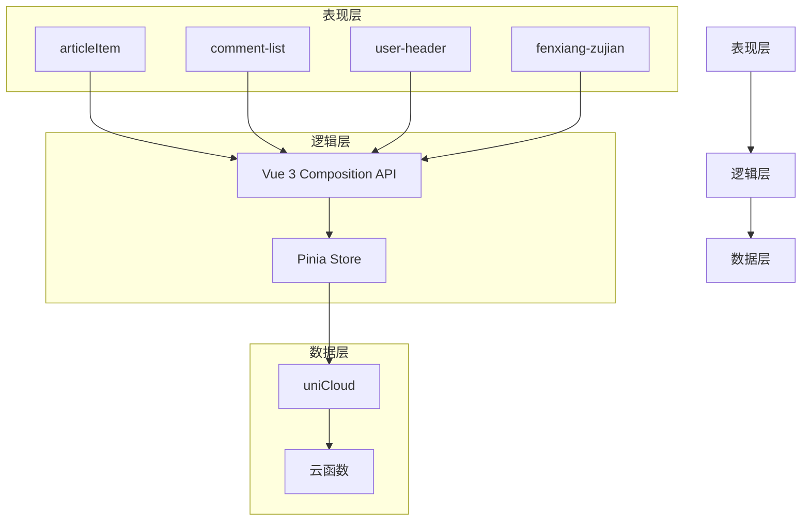
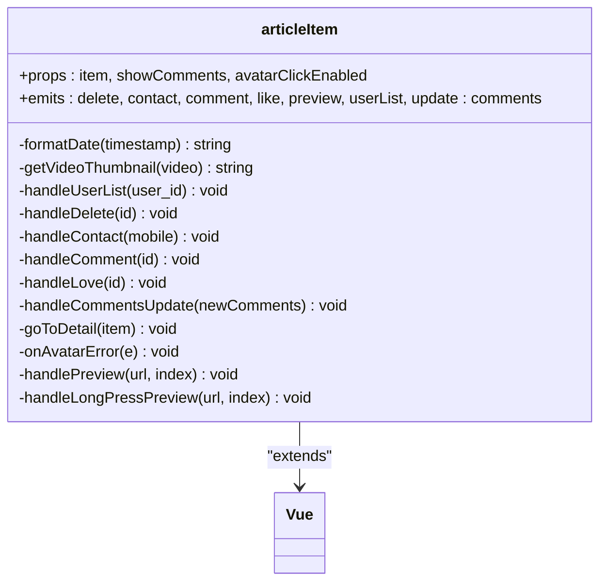
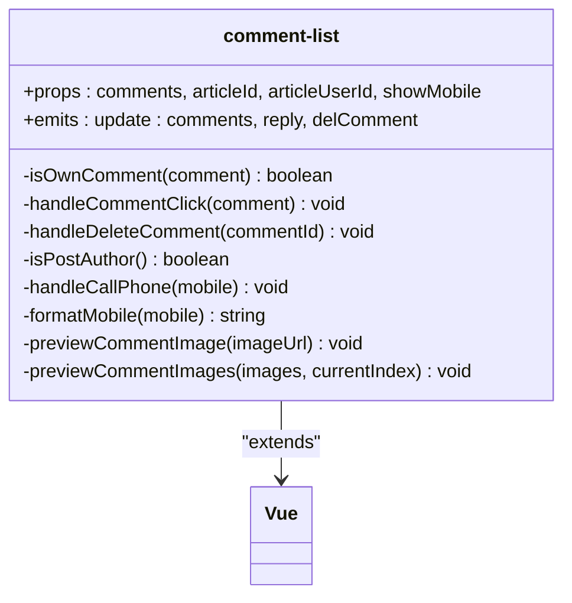
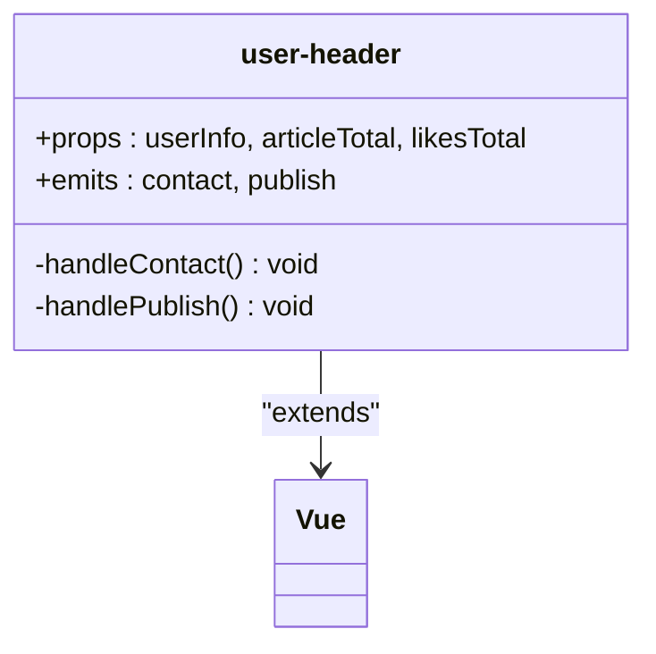
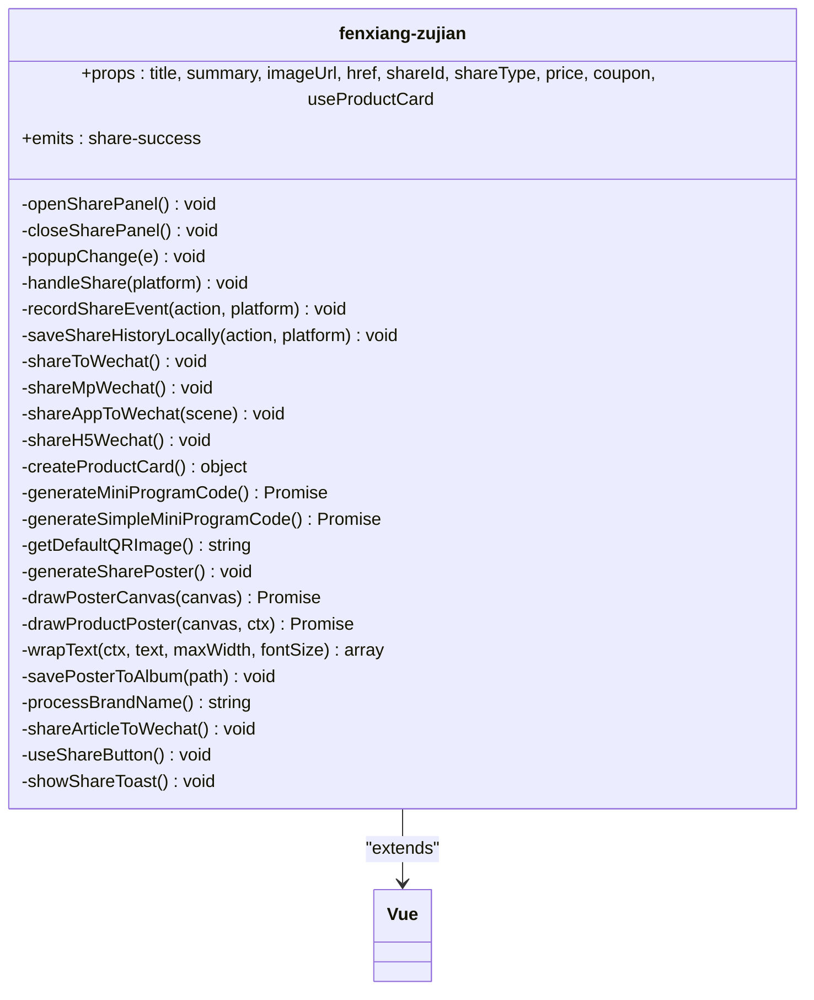
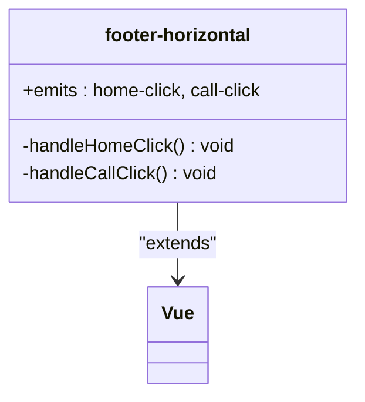
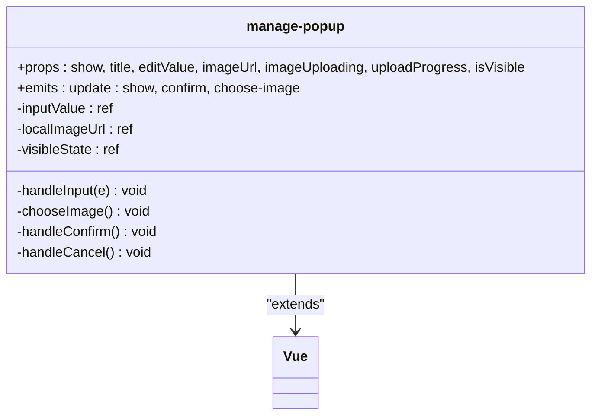
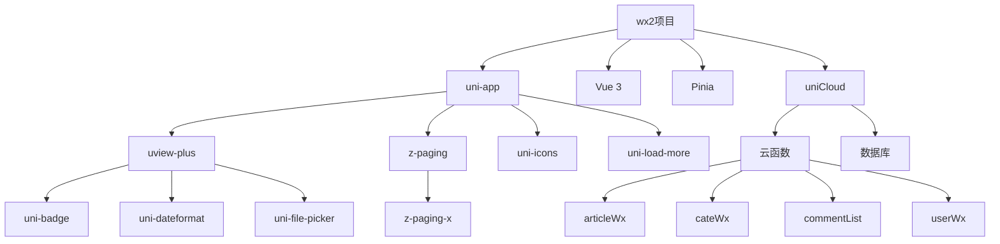

# 前端组件库

<cite>
**本文档引用的文件**   
- [articleItem.vue](file://components/articleItem/articleItem.vue)
- [comment-list.vue](file://components/comment-list/comment-list.vue)
- [user-header.vue](file://components/user-header/user-header.vue)
- [fenxiang-zujian.vue](file://components/fenxiang-zujian/fenxiang-zujian.vue)
- [footer-horizontal.vue](file://components/footer-horizontal/footer-horizontal.vue)
- [manage-popup.vue](file://components/manage-popup/manage-popup.vue)
- [index.vue](file://pages/index/index.vue)
- [articleDetail.vue](file://pages/article/articleDetail.vue)
</cite>

## 目录
1. [介绍](#介绍)
2. [项目结构](#项目结构)
3. [核心组件](#核心组件)
4. [架构概述](#架构概述)
5. [详细组件分析](#详细组件分析)
6. [依赖分析](#依赖分析)
7. [性能考虑](#性能考虑)
8. [故障排除指南](#故障排除指南)
9. [结论](#结论)

## 介绍
本技术文档全面解析wx2项目中`components`目录下的通用UI组件设计与实现。重点阐述`articleItem`（文章列表项）、`comment-list`（评论列表）、`user-header`（用户头像信息）、`fenxiang-zujian`（分享功能组件）等核心组件的结构、props接口、事件机制及样式封装方式。文档将说明这些组件如何通过Vue 3组合式API实现高复用性，并结合uview-plus和z-paging提升交互体验。同时提供实际使用示例，展示在`pages/index/index.vue`或`pages/article/articleDetail.vue`中的集成方法，并解释`footer-horizontal`和`manage-popup`等布局类组件的设计意图及其在多页面间的统一应用。

## 项目结构
wx2项目采用基于Vue 3的uni-app框架构建，整体结构清晰，遵循模块化设计理念。项目主要分为`components`（组件）、`pages`（页面）、`store`（状态管理）、`style`（样式）等核心目录。其中`components`目录存放了所有可复用的UI组件，包括业务组件和布局组件，实现了高度的代码复用和维护性。

```mermaid
graph TB
subgraph "根目录"
components[components]
pages[pages]
store[store]
style[style]
uni_modules[uni_modules]
end
subgraph "components"
articleItem[articleItem]
commentList[comment-list]
userHeader[user-header]
fenxiang[fenxiang-zujian]
footerHorizontal[footer-horizontal]
managePopup[manage-popup]
end
subgraph "pages"
index[index]
articleDetail[articleDetail]
end
subgraph "uni_modules"
uviewPlus[uview-plus]
zPaging[z-paging]
end
index --> articleItem
index --> commentList
articleDetail --> userHeader
articleDetail --> fenxiang
articleDetail --> commentList
footerHorizontal --> index
footerHorizontal --> articleDetail
```

**图表来源**
- [articleItem.vue](file://components/articleItem/articleItem.vue)
- [comment-list.vue](file://components/comment-list/comment-list.vue)
- [user-header.vue](file://components/user-header/user-header.vue)
- [fenxiang-zujian.vue](file://components/fenxiang-zujian/fenxiang-zujian.vue)
- [footer-horizontal.vue](file://components/footer-horizontal/footer-horizontal.vue)
- [index.vue](file://pages/index/index.vue)
- [articleDetail.vue](file://pages/article/articleDetail.vue)

**章节来源**
- [articleItem.vue](file://components/articleItem/articleItem.vue)
- [comment-list.vue](file://components/comment-list/comment-list.vue)
- [user-header.vue](file://components/user-header/user-header.vue)
- [fenxiang-zujian.vue](file://components/fenxiang-zujian/fenxiang-zujian.vue)
- [footer-horizontal.vue](file://components/footer-horizontal/footer-horizontal.vue)
- [index.vue](file://pages/index/index.vue)
- [articleDetail.vue](file://pages/article/articleDetail.vue)

## 核心组件
本节深入分析`components`目录下的核心UI组件，包括`articleItem`、`comment-list`、`user-header`、`fenxiang-zujian`等。这些组件构成了应用的主要界面元素，通过Vue 3的组合式API实现了逻辑与视图的分离，提高了代码的可读性和可维护性。每个组件都精心设计了props接口和事件机制，确保了高度的灵活性和复用性。

**章节来源**
- [articleItem.vue](file://components/articleItem/articleItem.vue#L1-L572)
- [comment-list.vue](file://components/comment-list/comment-list.vue#L1-L451)
- [user-header.vue](file://components/user-header/user-header.vue#L1-L236)
- [fenxiang-zujian.vue](file://components/fenxiang-zujian/fenxiang-zujian.vue#L1-L1233)

## 架构概述
wx2项目的前端架构基于uni-app框架，采用Vue 3的组合式API进行开发。整体架构分为三层：表现层（View）、逻辑层（Logic）和数据层（Data）。表现层由各类UI组件构成，逻辑层处理业务逻辑和状态管理，数据层通过uniCloud与后端服务进行交互。这种分层架构确保了代码的清晰度和可维护性。



**图表来源**
- [articleItem.vue](file://components/articleItem/articleItem.vue)
- [comment-list.vue](file://components/comment-list/comment-list.vue)
- [user-header.vue](file://components/user-header/user-header.vue)
- [fenxiang-zujian.vue](file://components/fenxiang-zujian/fenxiang-zujian.vue)
- [store/user.js](file://store/user.js)

## 详细组件分析
本节对各个关键组件进行深入分析，包括组件分析内容与具体文件分析。

### articleItem 组件分析
`articleItem`组件是文章列表的核心展示单元，负责渲染单篇文章的所有信息，包括用户信息、内容、图片和操作功能。

#### 结构与Props接口
该组件通过`defineProps`定义了三个主要属性：
- `item`: 文章数据对象，包含用户信息、内容、图片等
- `showComments`: 布尔值，控制是否显示评论区
- `avatarClickEnabled`: 布尔值，控制头像点击功能是否启用

#### 事件机制
组件通过`defineEmits`定义了多个事件，实现了与父组件的通信：
- `delete`: 删除文章事件
- `contact`: 联系作者事件
- `comment`: 评论事件
- `like`: 点赞事件
- `preview`: 图片预览事件
- `userList`: 用户列表点击事件
- `update:comments`: 评论更新事件

#### 样式封装
组件采用SCSS进行样式封装，通过BEM命名规范组织CSS类名，确保样式的独立性和可维护性。样式中使用了Sass变量和混合宏，如`$pyq-text-color-body`和`@include textShenglue(5)`，实现了样式的统一管理和复用。



**图表来源**
- [articleItem.vue](file://components/articleItem/articleItem.vue#L1-L572)

**章节来源**
- [articleItem.vue](file://components/articleItem/articleItem.vue#L1-L572)

### comment-list 组件分析
`comment-list`组件用于展示文章的评论列表，支持评论回复、删除和图片预览等功能。

#### 结构与Props接口
该组件定义了四个主要属性：
- `comments`: 评论数组
- `articleId`: 文章ID
- `articleUserId`: 文章作者ID
- `showMobile`: 是否显示手机号

#### 事件机制
组件通过`defineEmits`定义了三个事件：
- `update:comments`: 更新评论列表
- `reply`: 回复评论事件
- `delComment`: 删除评论事件

#### 样式封装
组件采用SCSS进行样式封装，通过嵌套规则和变量定义实现了样式的模块化。特别地，组件为自己的评论设置了不同的样式，通过`own-comment`类名实现视觉区分。



**图表来源**
- [comment-list.vue](file://components/comment-list/comment-list.vue#L1-L451)

**章节来源**
- [comment-list.vue](file://components/comment-list/comment-list.vue#L1-L451)

### user-header 组件分析
`user-header`组件用于展示用户头部信息，包括头像、昵称、发帖数和联系方式。

#### 结构与Props接口
该组件定义了三个主要属性：
- `userInfo`: 用户信息对象
- `articleTotal`: 文章总数
- `likesTotal`: 点赞总数

#### 事件机制
组件通过`defineEmits`定义了两个事件：
- `contact`: 联系事件
- `publish`: 发布事件

#### 样式封装
组件采用SCSS进行样式封装，通过渐变背景动画和阴影效果提升了视觉体验。组件使用了`backdrop-filter: blur(5px)`实现毛玻璃效果，增强了现代感。



**图表来源**
- [user-header.vue](file://components/user-header/user-header.vue#L1-L236)

**章节来源**
- [user-header.vue](file://components/user-header/user-header.vue#L1-L236)

### fenxiang-zujian 组件分析
`fenxiang-zujian`组件提供了完整的分享功能，支持微信好友分享和生成海报分享。

#### 结构与Props接口
该组件通过选项式API定义了多个属性：
- `title`: 分享标题
- `summary`: 分享摘要
- `imageUrl`: 分享图片
- `href`: 分享链接
- `shareId`: 分享ID
- `shareType`: 分享类型
- `price`: 商品价格
- `coupon`: 优惠券信息
- `useProductCard`: 是否使用商品卡片形式

#### 事件机制
组件内部通过`this.$emit`触发事件，但未在props中明确定义。主要事件包括：
- `share-success`: 分享成功事件

#### 样式封装
组件采用SCSS进行样式封装，通过`uni-popup`实现底部弹出面板，提供了良好的用户体验。组件还使用了隐藏的canvas元素来生成分享海报。



**图表来源**
- [fenxiang-zujian.vue](file://components/fenxiang-zujian/fenxiang-zujian.vue#L1-L1233)

**章节来源**
- [fenxiang-zujian.vue](file://components/fenxiang-zujian/fenxiang-zujian.vue#L1-L1233)

### footer-horizontal 组件分析
`footer-horizontal`组件是一个水平布局的页脚组件，包含首页按钮和打电话按钮。

#### 结构与Props接口
该组件没有定义任何props，是一个完全独立的布局组件。

#### 事件机制
组件通过`$emit`触发两个事件：
- `home-click`: 首页点击事件
- `call-click`: 打电话点击事件

#### 样式封装
组件采用SCSS进行样式封装，通过`position: fixed`实现固定定位，确保页脚始终位于屏幕底部。组件还使用了`env(safe-area-inset-bottom)`处理iPhone X等设备的安全区域。



**图表来源**
- [footer-horizontal.vue](file://components/footer-horizontal/footer-horizontal.vue#L1-L80)

**章节来源**
- [footer-horizontal.vue](file://components/footer-horizontal/footer-horizontal.vue#L1-L80)

### manage-popup 组件分析
`manage-popup`组件是一个通用的管理弹窗，用于添加或编辑分类信息。

#### 结构与Props接口
该组件定义了多个属性：
- `show`: 控制弹窗显示
- `title`: 弹窗标题
- `editValue`: 编辑值
- `imageUrl`: 图片URL
- `imageUploading`: 图片上传状态
- `uploadProgress`: 上传进度
- `isVisible`: 可见性状态

#### 事件机制
组件通过`defineEmits`定义了三个事件：
- `update:show`: 更新显示状态
- `confirm`: 确认事件
- `choose-image`: 选择图片事件

#### 样式封装
组件采用SCSS进行样式封装，通过`position: fixed`实现全屏遮罩效果。组件使用了渐变色按钮和进度条，提升了视觉体验。



**图表来源**
- [manage-popup.vue](file://components/manage-popup/manage-popup.vue#L1-L308)

**章节来源**
- [manage-popup.vue](file://components/manage-popup/manage-popup.vue#L1-L308)

## 依赖分析
本项目依赖于多个外部库和框架，形成了完整的生态系统。



**图表来源**
- [package.json](file://package.json)
- [uni_modules/uview-plus/package.json](file://uni_modules/uview-plus/package.json)
- [uni_modules/z-paging/package.json](file://uni_modules/z-paging/package.json)
- [uniCloud/cloudfunctions](file://uniCloud-aliyun/cloudfunctions)

**章节来源**
- [package.json](file://package.json#L1-L100)
- [uni_modules/uview-plus/package.json](file://uni_modules/uview-plus/package.json#L1-L50)
- [uni_modules/z-paging/package.json](file://uni_modules/z-paging/package.json#L1-L50)

## 性能考虑
在组件设计和实现过程中，考虑了多项性能优化措施：

1. **图片懒加载**: 在`articleItem`组件中，所有图片都使用了`:lazy-load="true"`属性，延迟加载非可视区域的图片，减少初始加载时间。
2. **计算属性优化**: 多个组件使用`computed`属性缓存计算结果，避免重复计算，如`articleItem`中的`userInfo`和`processedImages`。
3. **事件防抖**: 在`onReachBottom`等频繁触发的事件中，通过检查`isLoading`状态避免重复请求。
4. **内存管理**: 在`onUnmounted`生命周期中移除全局事件监听，防止内存泄漏。
5. **条件渲染**: 使用`v-if`和`v-show`合理控制DOM元素的创建和销毁，减少不必要的渲染开销。

## 故障排除指南
当遇到组件相关问题时，可以参考以下排查步骤：

1. **组件不显示**: 检查父组件是否正确引入并注册了子组件，确认props传递的数据格式是否正确。
2. **事件不触发**: 检查事件绑定语法是否正确，确认事件名称拼写无误，查看控制台是否有错误信息。
3. **样式不生效**: 检查SCSS编译是否正常，确认类名拼写正确，查看是否有样式冲突。
4. **数据不更新**: 检查响应式数据是否正确声明，确认是否在异步操作后正确更新了数据。
5. **性能问题**: 使用浏览器开发者工具分析性能瓶颈，检查是否有不必要的重新渲染。

**章节来源**
- [articleItem.vue](file://components/articleItem/articleItem.vue#L1-L572)
- [comment-list.vue](file://components/comment-list/comment-list.vue#L1-L451)
- [user-header.vue](file://components/user-header/user-header.vue#L1-L236)
- [fenxiang-zujian.vue](file://components/fenxiang-zujian/fenxiang-zujian.vue#L1-L1233)

## 结论
通过对wx2项目中`components`目录下各组件的全面分析，可以看出该项目采用了现代化的前端开发实践。组件设计遵循单一职责原则，通过Vue 3的组合式API实现了逻辑与视图的清晰分离。props接口设计合理，事件机制完善，样式封装规范，整体代码质量较高。结合uview-plus和z-paging等第三方库，有效提升了开发效率和用户体验。建议在后续开发中继续保持这种良好的架构风格，并进一步完善组件文档和测试覆盖。