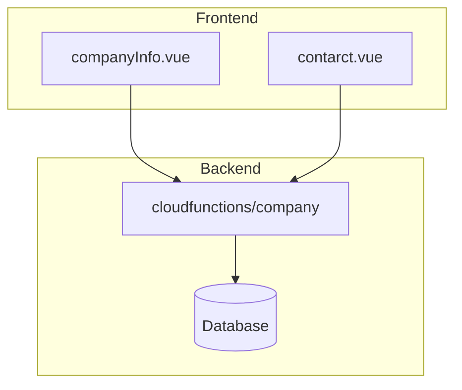
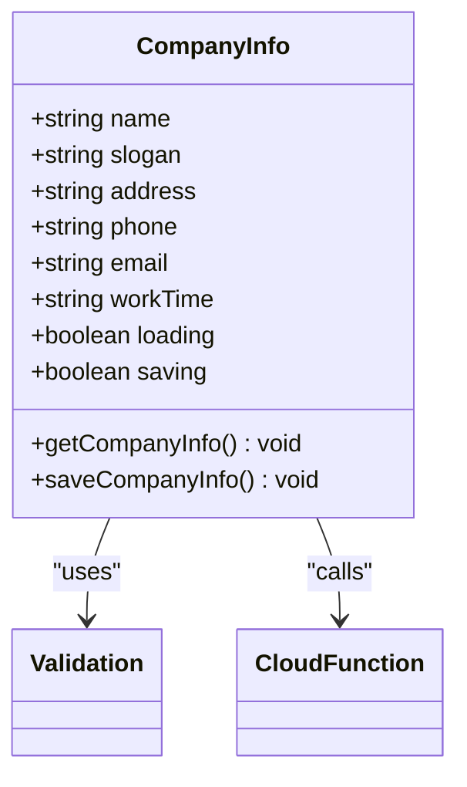
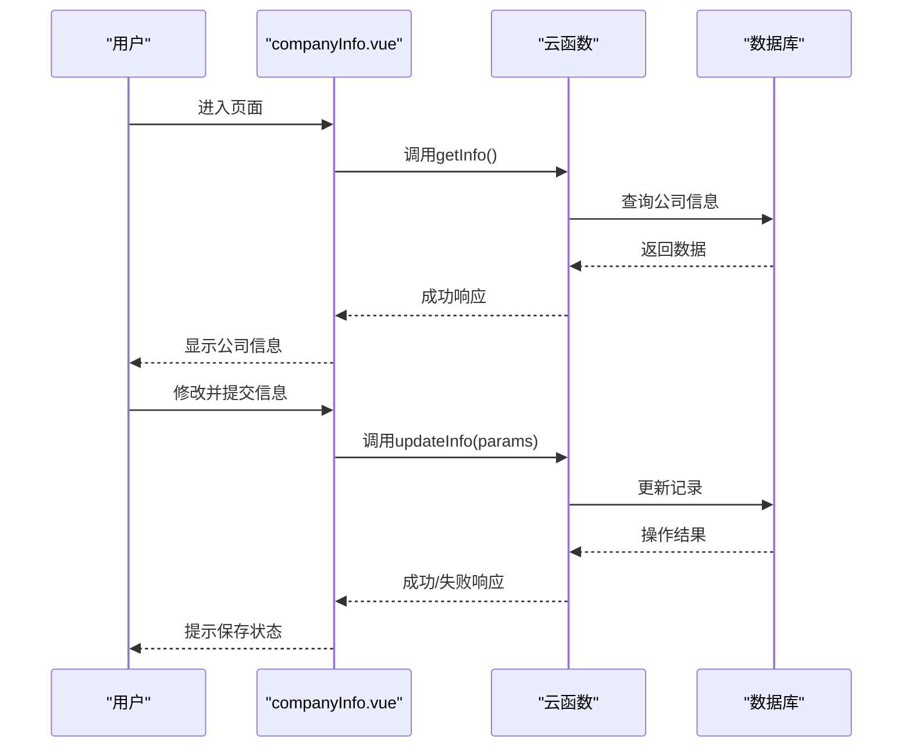
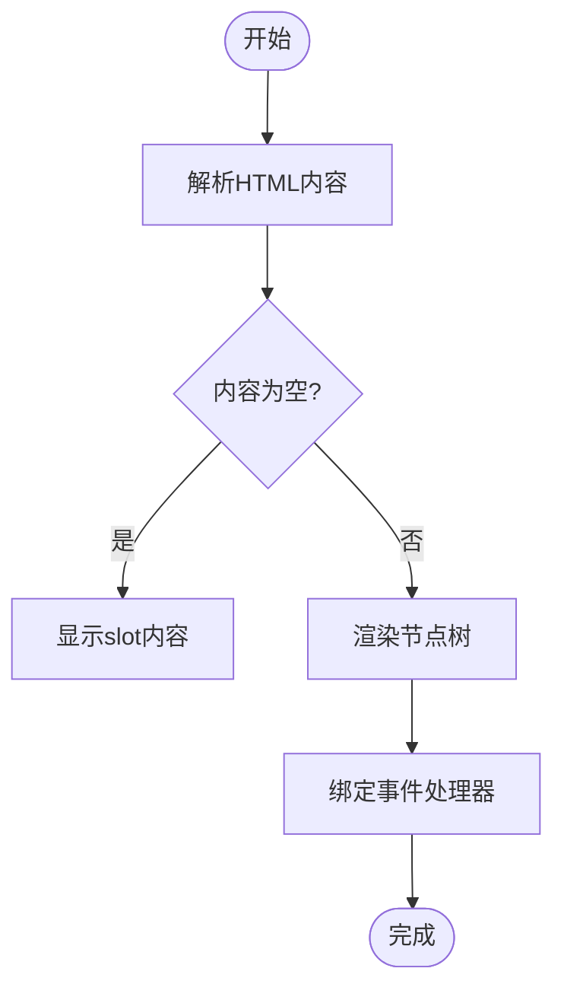
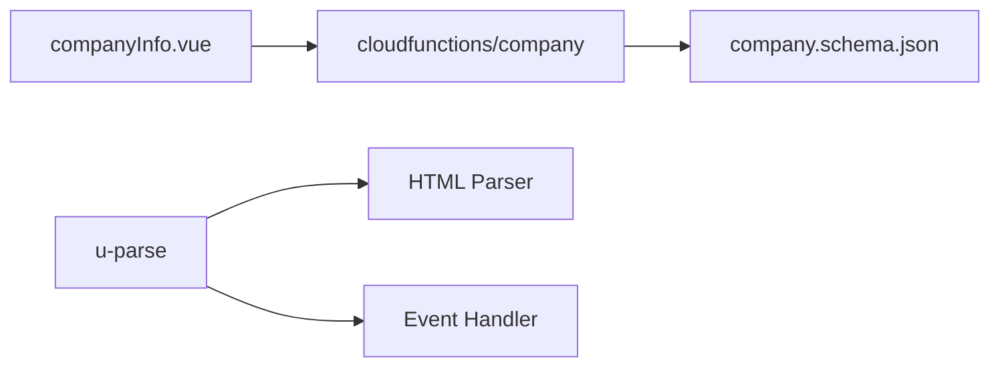

# 公司信息展示

<cite>
**Referenced Files in This Document**   
- [companyInfo.vue](file://subPages/companyInfo/companyInfo.vue)
- [contarct.vue](file://subPages/contarct/contarct.vue)
- [u-parse.vue](file://uni_modules/uview-plus/components/u-parse/u-parse.vue)
- [index.obj.js](file://uniCloud-aliyun/cloudfunctions/company/index.obj.js)
- [company.schema.json](file://uniCloud-aliyun/database/company.schema.json)
</cite>

## Table of Contents
1. [Introduction](#introduction)
2. [Core Components](#core-components)
3. [Architecture Overview](#architecture-overview)
4. [Detailed Component Analysis](#detailed-component-analysis)
5. [Dependency Analysis](#dependency-analysis)
6. [Performance Considerations](#performance-considerations)
7. [Troubleshooting Guide](#troubleshooting-guide)
8. [Conclusion](#conclusion)

## Introduction
本文档旨在说明`companyInfo.vue`作为静态信息展示页面的作用与设计原则。该页面主要用于展示公司基本信息，包括公司名称、口号、地址、联系电话、电子邮箱和工作时间等关键信息。通过分析其内容排版、图文混排样式及可能的外链跳转功能，本文档将阐述此类页面在增强平台可信度方面的价值，并建议采用富文本解析组件（如u-parse）支持动态内容更新，避免频繁发布新版本。

## Core Components
`companyInfo.vue`是项目中用于展示公司信息的核心组件，它位于`subPages/companyInfo/`目录下。该组件不仅负责显示公司的基本信息，还提供了编辑和保存这些信息的功能。通过与后端云函数的交互，实现了数据的持久化存储。此外，`contarct.vue`文件也涉及到了公司信息的展示，但主要侧重于联系信息的呈现方式。

**Section sources**
- [companyInfo.vue](file://subPages/companyInfo/companyInfo.vue#L0-L203)
- [contarct.vue](file://subPages/contarct/contarct.vue#L0-L185)

## Architecture Overview
整个系统架构围绕着前端展示层、业务逻辑层以及数据存储层构建。前端使用Vue框架结合uView Plus UI库来实现用户界面；业务逻辑由一系列云函数处理，它们负责与数据库进行通信以获取或更新数据；而数据则被安全地存储在UniCloud提供的数据库服务中。

**Diagram sources **
- [companyInfo.vue](file://subPages/companyInfo/companyInfo.vue#L0-L203)
- [contarct.vue](file://subPages/contarct/contarct.vue#L0-L185)
- [index.obj.js](file://uniCloud-aliyun/cloudfunctions/company/index.obj.js#L0-L75)

## Detailed Component Analysis

### companyInfo.vue Analysis
`companyInfo.vue`组件的设计遵循了清晰的信息层级结构，确保用户能够快速找到所需信息。页面布局采用了响应式设计，适应不同屏幕尺寸。表单元素如输入框均设置了适当的占位符文本，指导用户正确填写信息。同时，利用正则表达式对电话号码和电子邮件地址进行了格式验证，保证了数据的有效性。

#### For Object-Oriented Components:

**Diagram sources **
- [companyInfo.vue](file://subPages/companyInfo/companyInfo.vue#L0-L203)

#### For API/Service Components:

**Diagram sources **
- [companyInfo.vue](file://subPages/companyInfo/companyInfo.vue#L0-L203)
- [index.obj.js](file://uniCloud-aliyun/cloudfunctions/company/index.obj.js#L0-L75)

### u-parse Component Analysis
为了支持更丰富的文本内容展示，推荐使用`u-parse`组件。此组件可以解析HTML字符串并渲染成相应的UI元素，非常适合用来展示包含链接、图片等内容的富文本。通过配置属性，还可以控制是否允许外部链接自动复制、图片懒加载等功能，极大地提升了用户体验。

#### For Complex Logic Components:

**Diagram sources **
- [u-parse.vue](file://uni_modules/uview-plus/components/u-parse/u-parse.vue#L0-L500)

**Section sources**
- [u-parse.vue](file://uni_modules/uview-plus/components/u-parse/u-parse.vue#L0-L500)

## Dependency Analysis
通过对代码库的深入分析发现，`companyInfo.vue`直接依赖于`uniCloud.importObject('company')`来调用后端API，从而实现对公司信息的读取与更新操作。此外，`u-parse`组件作为一个独立的模块被集成进项目中，为其他需要展示复杂内容的页面提供支持。这种松耦合的设计使得各部分可以独立开发维护，提高了整体系统的可扩展性和灵活性。

**Diagram sources **
- [companyInfo.vue](file://subPages/companyInfo/companyInfo.vue#L0-L203)
- [index.obj.js](file://uniCloud-aliyun/cloudfunctions/company/index.obj.js#L0-L75)
- [company.schema.json](file://uniCloud-aliyun/database/company.schema.json#L0-L0)

**Section sources**
- [companyInfo.vue](file://subPages/companyInfo/companyInfo.vue#L0-L203)
- [index.obj.js](file://uniCloud-aliyun/cloudfunctions/company/index.obj.js#L0-L75)
- [company.schema.json](file://uniCloud-aliyun/database/company.schema.json#L0-L0)

## Performance Considerations
考虑到移动设备上网络条件的不确定性，在加载公司信息时应采取异步请求的方式，并通过loading指示器告知用户当前状态。对于较大的富文本内容，启用图片懒加载功能可以有效减少初始加载时间，提升首屏性能。另外，合理设置缓存策略也能进一步优化用户体验。

## Troubleshooting Guide
当遇到无法正常显示公司信息的问题时，请首先检查网络连接状况及云函数的日志输出。确认参数传递无误且符合预定义的数据模型要求。如果问题依旧存在，则需审查数据库权限设置，确保读写操作被正确授权。

**Section sources**
- [index.obj.js](file://uniCloud-aliyun/cloudfunctions/company/index.obj.js#L0-L75)
- [company.schema.json](file://uniCloud-aliyun/database/company.schema.json#L0-L0)

## Conclusion
综上所述，`companyInfo.vue`不仅是一个简单的信息展示页面，更是连接用户与企业的重要桥梁。通过精心设计的内容排版与交互体验，配合强大的后端服务能力，共同构建了一个既美观又实用的企业形象窗口。未来可通过引入更多动态内容管理机制，持续优化该页面的表现力与功能性。