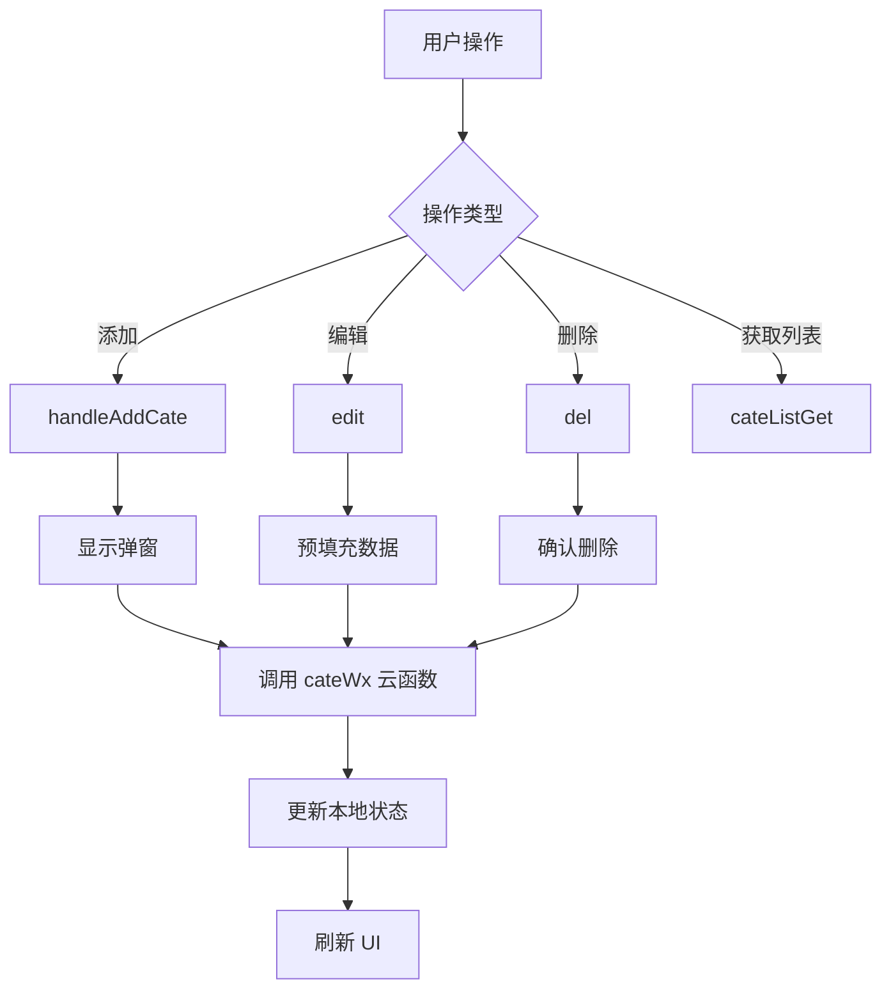
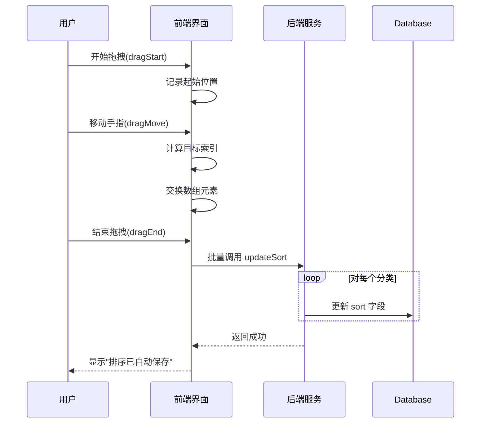
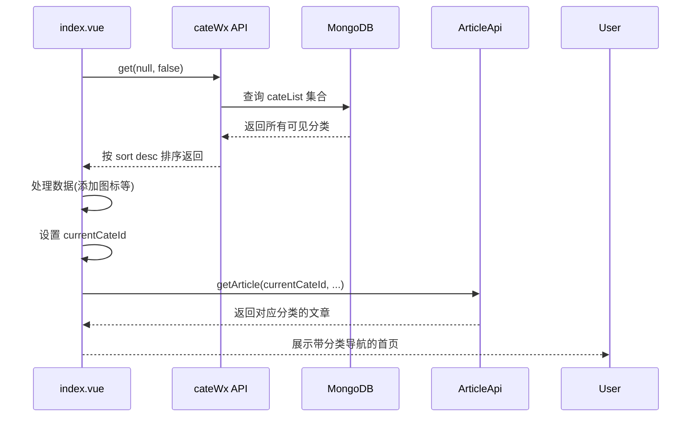

# 分类管理

<cite>
**Referenced Files in This Document **   
- [cateManage.vue](file://subPages/cateManage/cateManage.vue)
- [cateWx/index.obj.js](file://uniCloud-aliyun/cloudfunctions/cateWx/index.obj.js)
- [cateList.schema.json](file://uniCloud-aliyun/database/cateList.schema.json)
- [index.vue](file://pages/index/index.vue)
- [tuijian.vue](file://components/tuijian/tuijian.vue)
</cite>

## 目录
1. [简介](#简介)
2. [核心功能实现](#核心功能实现)
3. [前端表单验证与健壮性处理](#前端表单验证与健壮性处理)
4. [排序逻辑](#排序逻辑)
5. [云端交互流程](#云端交互流程)
6. [数据库设计与索引优化](#数据库设计与索引优化)
7. [分类层级结构支持](#分类层级结构支持)
8. [在首页推荐流中的应用](#在首页推荐流中的应用)
9. [结论](#结论)

## 简介

本文档全面介绍 `cateManage.vue` 组件中分类增删改查功能的实现细节。该组件是管理系统的核心部分，负责对文章分类进行全生命周期管理。系统通过调用 `cateWx` 云函数与后端进行交互，并结合 `cateList.schema.json` 定义的数据库模式来确保数据一致性。本文档将深入分析其前端验证、排序机制、云端通信以及与首页推荐流的关联性。

## 核心功能实现

`cateManage.vue` 实现了完整的分类管理功能，包括添加、编辑、删除和查看分类。这些操作通过 `uniCloud.importObject('cateWx', { customUI: true })` 调用云函数完成，实现了前后端分离架构。



**Section sources**
- [cateManage.vue](file://subPages/cateManage/cateManage.vue#L1-L1749)

## 前端表单验证与健壮性处理

### 防止空值提交

前端通过严格的条件判断防止空值提交。在 `handleConfirm` 方法中，系统会检查输入内容的有效性：

```javascript
// 在 handleConfirm 中检查空值
if (!data.cate_name) {
    return uni.showToast({
        title: '分类名称不可以为空',
        icon: 'none'
    });
}
```

此外，在调用云函数前还会进行二次校验，确保 `currentId.value` 存在且有效。

### 防止重复命名

系统采用双重防护机制防止重复命名：
1. **前端提示**：在用户尝试添加或修改时给出明确反馈。
2. **后端校验**：云函数 `add` 和 `update` 方法中均包含去重查询逻辑。

```mermaid
flowchart LR
A[用户提交] --> B{是否为编辑模式?}
B --> |是| C[排除当前ID查询]
B --> |否| D[直接查询名称]
C & D --> E[db.collection("cateList").where({cate_name})]
E --> F{存在相同名称?}
F --> |是| G[返回错误信息]
F --> |否| H[允许创建/更新]
```

**Section sources**
- [cateManage.vue](file://subPages/cateManage/cateManage.vue#L500-L600)
- [cateWx/index.obj.js](file://uniCloud-aliyun/cloudfunctions/cateWx/index.obj.js#L128-L186)

## 排序逻辑

系统提供了两种排序方式：拖拽排序和序号排序。

### 拖拽排序

拖拽排序提供直观的交互体验，用户可通过长按并移动项目来调整顺序。关键特性包括：
- 触摸事件监听 (`dragStart`, `dragMove`, `dragEnd`)
- 视觉反馈（轻微振动）
- 自动保存机制



### 序号排序

序号排序模式允许用户手动输入排序权重值，支持实时预览效果。

```javascript
// 计算排序后的列表
const sortedCateList = computed(() => {
    return [...cateList.value].sort((a, b) => {
        const aSort = a.sort_order !== undefined ? Number(a.sort_order) : 0
        const bSort = b.sort_order !== undefined ? Number(b.sort_order) : 0
        return bSort - aSort // 倒序，让大的排在前面
    })
})
```

**Section sources**
- [cateManage.vue](file://subPages/cateManage/cateManage.vue#L300-L500)

## 云端交互流程

前端通过 `uniCloud.importObject` 导入 `cateWx` 云函数对象，建立与后端的安全通信通道。

```mermaid
graph TB
subgraph "前端 (cateManage.vue)"
A[用户界面] --> B[cateApi.add]
A --> C[cateApi.update]
A --> D[cateApi.del]
A --> E[cateApi.get]
end
subgraph "云端 (cateWx)"
F[add] --> G[validateImagePath]
F --> H[check duplicate name]
F --> I[insert into database]
J[update] --> K[validate input]
J --> L[check duplicate name(except self)]
J --> M[update document]
N[del] --> O[get old record]
N --> P[delete cloud file if exists]
N --> Q[remove from database]
R[get] --> S[filter by visibility]
R --> T[orderBy sort desc]
end
B --> F
C --> J
D --> N
E --> R
```

**Diagram sources **
- [cateManage.vue](file://subPages/cateManage/cateManage.vue#L20-L30)
- [cateWx/index.obj.js](file://uniCloud-aliyun/cloudfunctions/cateWx/index.obj.js#L1-L418)

**Section sources**
- [cateManage.vue](file://subPages/cateManage/cateManage.vue#L20-L100)
- [cateWx/index.obj.js](file://uniCloud-aliyun/cloudfunctions/cateWx/index.obj.js#L1-L418)

## 数据库设计与索引优化

### 数据库字段设计

`cateList.schema.json` 定义了分类集合的数据结构，包含以下核心字段：

| 字段名 | 类型 | 描述 | 默认值 |
|-------|------|------|--------|
| `_id` | string | 文档唯一标识 | 系统生成 |
| `cate_name` | string | 分类名称 | 必填，1-20字符 |
| `cate_img` | string | 分类图片URL | 可选 |
| `sort` | int | 排序权重，越大越靠前 | 0 |
| `is_visible` | bool | 是否显示该分类 | true |
| `create_time` | timestamp | 创建时间 | 当前时间戳 |
| `update_time` | timestamp | 更新时间 | 当前时间戳 |

### 索引优化

为提升查询性能，系统建立了三个重要索引：

```json
"indexes": [
    {
        "IndexName": "sort_index",
        "MgoKeySchema": {
            "MgoIndexKeys": [
                { "Name": "sort", "Direction": -1 }
            ],
            "MgoIsUnique": false
        }
    },
    {
        "IndexName": "cate_name_index",
        "MgoKeySchema": {
            "MgoIndexKeys": [
                { "Name": "cate_name", "Direction": 1 }
            ],
            "MgoIsUnique": true
        }
    },
    {
        "IndexName": "location_district_index",
        "MgoKeySchema": {
            "MgoIndexKeys": [
                { "Name": "location_district", "Direction": 1 }
            ],
            "MgoIsUnique": false
        }
    }
]
```

- **sort_index**: 支持按排序字段快速检索，方向为降序（-1），符合“权重越大越靠前”的业务需求。
- **cate_name_index**: 唯一索引，从根本上杜绝了分类重名问题，同时加速名称查询。
- **location_district_index**: 支持基于地理位置的分类查询，用于区域化内容展示。

**Section sources**
- [cateList.schema.json](file://uniCloud-aliyun/database/cateList.schema.json#L1-L108)

## 分类层级结构支持

根据现有代码分析，当前系统**未实现多级分类的层级结构**。所有分类均为平级管理，主要体现在以下几个方面：

1. **数据模型缺失**：`cateList.schema.json` 中没有定义如 `parent_id` 或 `level` 这样的层级相关字段。
2. **前端界面扁平化**：`cateManage.vue` 的 UI 设计仅支持单一列表展示，无嵌套或树形结构。
3. **查询逻辑简单**：无论是获取还是排序，都基于单一维度进行，不涉及递归或路径查询。

虽然目前不支持层级，但系统具备良好的扩展性。未来可通过增加 `parent_id` 字段并修改前端组件即可实现树状分类。

## 在首页推荐流中的应用

分类管理直接影响首页的内容组织和推荐逻辑。`index.vue` 页面在加载时会获取分类列表，并据此构建顶部导航栏。

### 首页分类加载流程



### 推荐流关联性

`tuijian.vue` 组件作为文章详情页的“更多推荐”模块，也依赖于分类体系：

- 当存在 `cate_id` 时，显示“相关推荐”，优先推荐同分类下的其他文章。
- 利用分类图片作为文章缩略图的后备方案，增强视觉一致性。

```javascript
// 在 tuijian.vue 中使用分类图片作为默认图
if (!article.images || article.images.length === 0) {
    const categoryImage = await getCategoryImage(article.cate_id)
    article.category_image = fixImageUrl(categoryImage)
}
```

这种设计使得分类不仅是管理工具，更是内容分发和用户体验的重要组成部分。

**Section sources**
- [index.vue](file://pages/index/index.vue#L1-L1078)
- [tuijian.vue](file://components/tuijian/tuijian.vue#L1-L439)

## 结论

`cateManage.vue` 实现了一个功能完整、健壮性强的分类管理系统。系统通过前端验证与后端约束相结合的方式，有效防止了重复命名和空值提交等问题。排序逻辑灵活多样，支持拖拽和手动输入两种模式。数据库设计合理，通过唯一索引和排序索引显著提升了查询效率。

尽管当前版本尚未支持分类层级结构，但其清晰的架构为未来的功能扩展奠定了良好基础。更重要的是，分类体系深度融入了应用的内容生态，不仅服务于后台管理，更直接驱动着首页导航和推荐流的内容呈现，体现了从管理到应用的完整闭环。